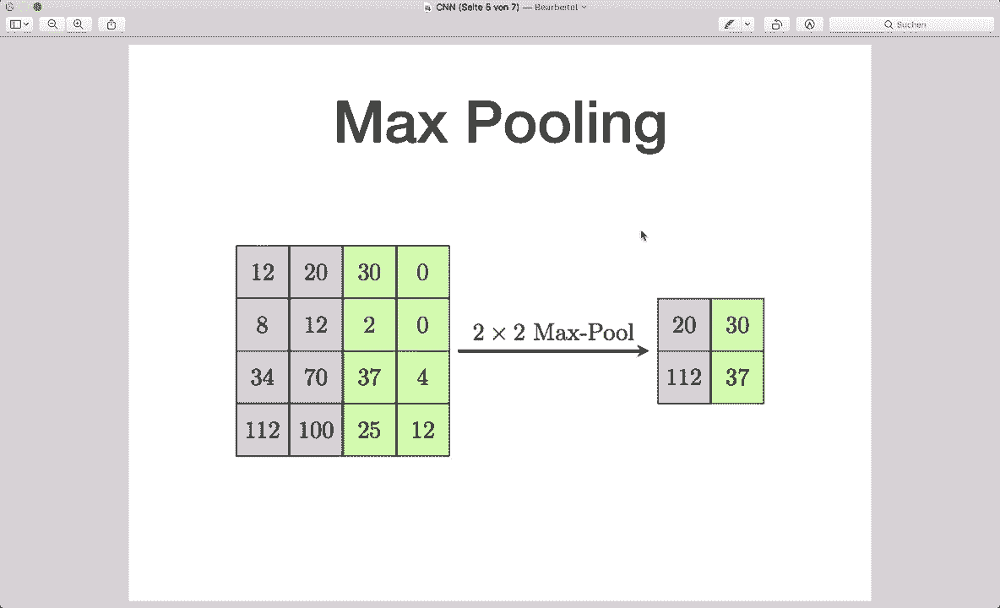
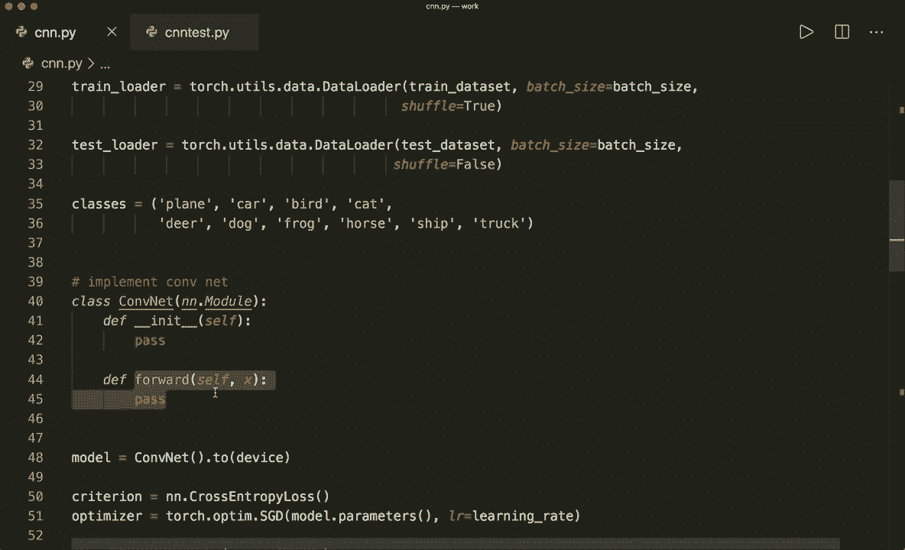
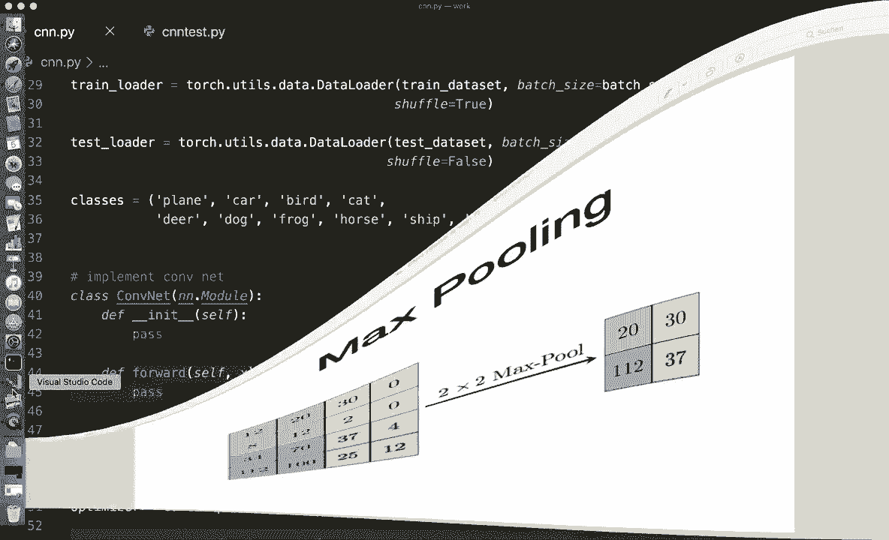
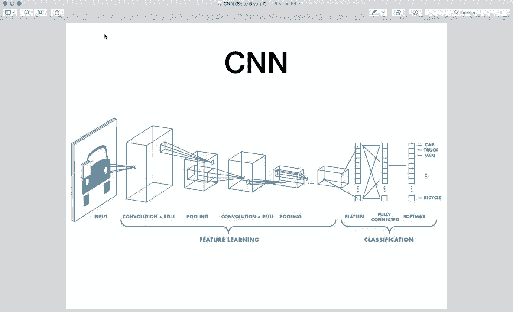
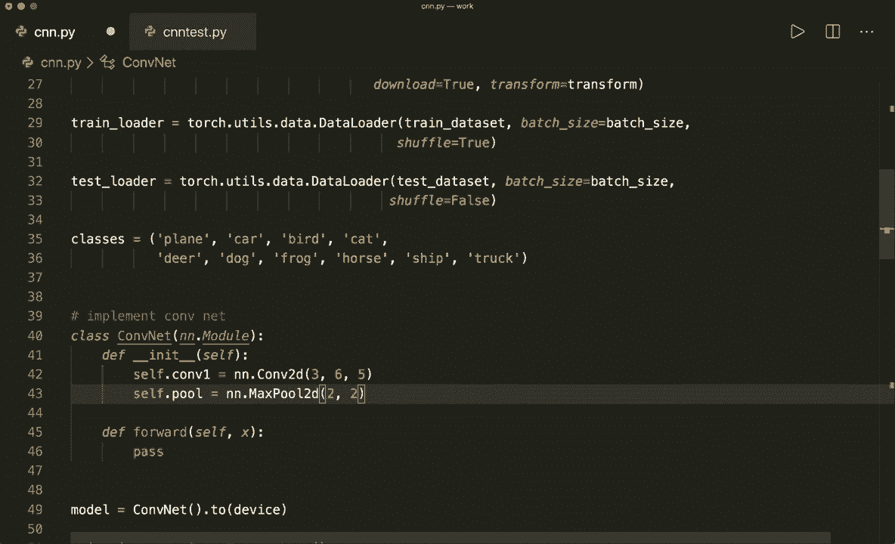
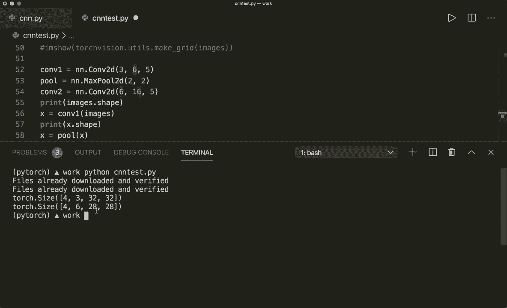
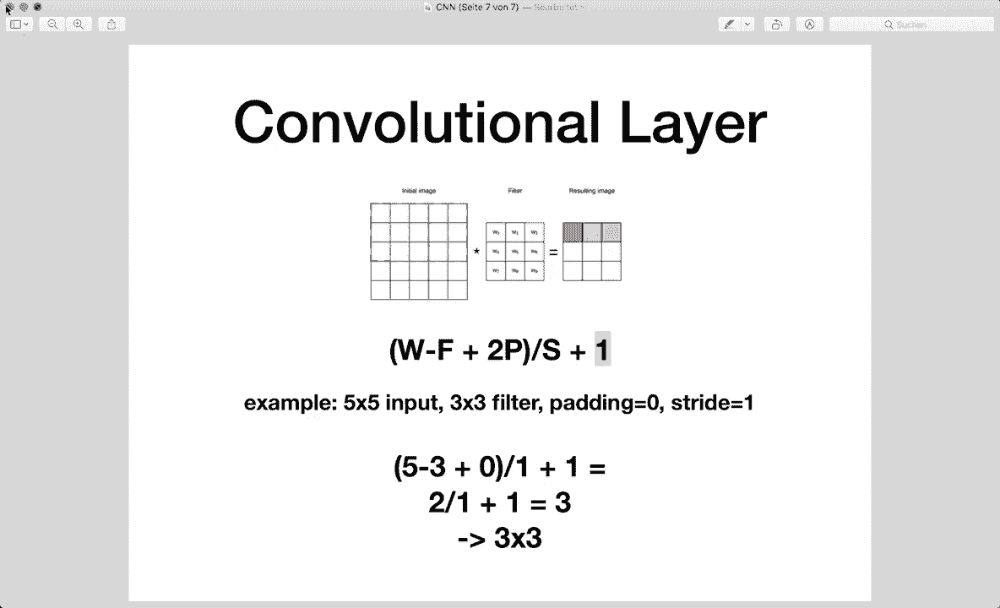
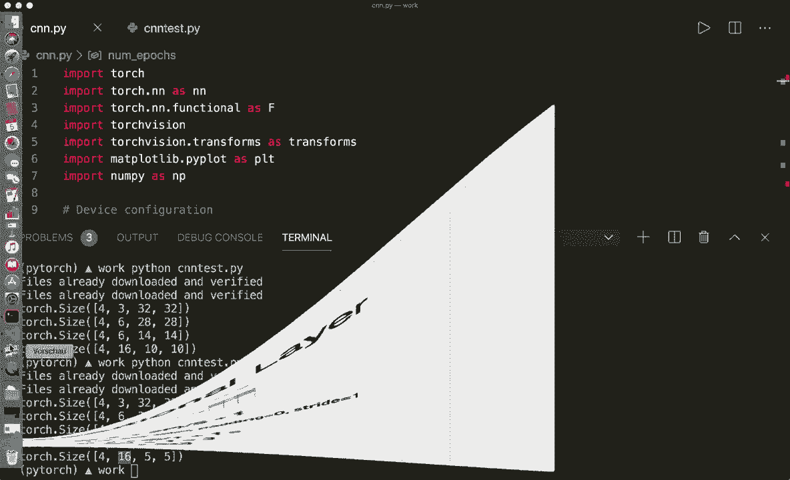
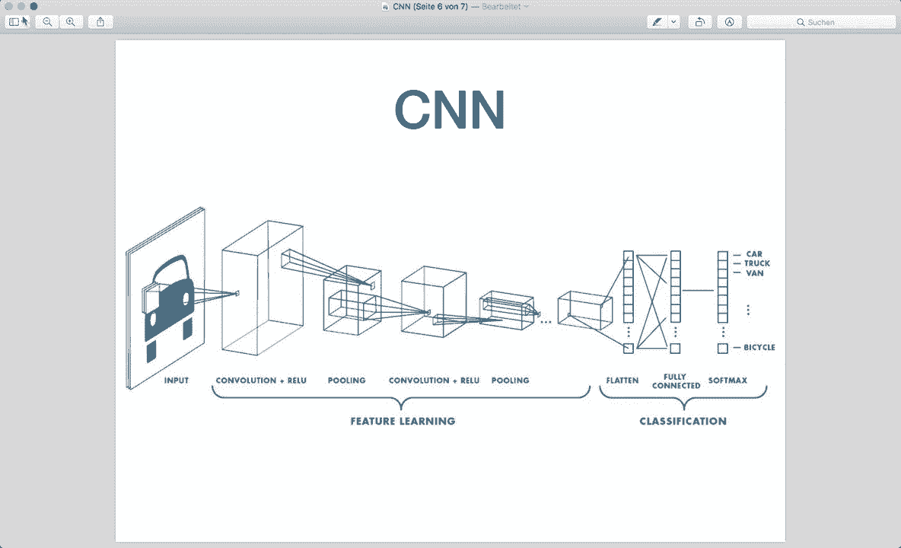

# PyTorch 极简实战教程！P14：L14- 卷积神经网络 (CNN) 🧠

在本节课中，我们将学习如何实现一个卷积神经网络，并使用 PyTorch 在 CIFAR-10 数据集上进行图像分类。我们将从加载数据集开始，逐步构建网络模型，并完成训练和评估过程。

---

## 概述

卷积神经网络是处理图像数据的主流深度学习模型。本节教程将引导你使用 PyTorch 框架，构建一个能够对 CIFAR-10 数据集中的图像进行分类的卷积神经网络。我们将涵盖数据加载、模型定义、训练循环和性能评估等关键步骤。

---

## 1. 卷积神经网络简介

上一节我们介绍了神经网络的基础，本节中我们来看看专门用于处理图像的卷积神经网络。

卷积神经网络与普通神经网络类似，都由具有可学习权重和偏置的神经元组成。主要区别在于，卷积网络专为图像数据设计，并应用了卷积滤波器。

典型的卷积神经网络架构包含以下部分：
*   输入图像。
*   卷积层和可选的激活函数。
*   池化层。
*   一个或多个用于分类的全连接层。



卷积层通过将**滤波器内核**应用于输入图像来工作。以下是其工作原理的简化描述：

1.  将滤波器放置在图像的起始位置。
2.  计算滤波器覆盖区域与对应图像像素的乘积之和，将结果写入输出图像的对应位置。
3.  将滤波器滑动到下一个位置（例如，向右移动一个像素），重复步骤2。
4.  在整个图像上重复此过程，生成输出特征图。

卷积操作可能导致输出图像尺寸变小，因为滤波器可能无法完全覆盖图像的边缘区域。输出尺寸的计算公式如下：

**公式：**
`输出尺寸 = (输入宽度 - 滤波器大小 + 2 * 填充) / 步幅 + 1`

池化层（如最大池化）用于对图像进行下采样，以降低计算成本并减少参数数量。例如，一个2x2的最大池化滤波器会取图像中每个2x2子区域的最大值作为输出。

---

## 2. 代码实现：准备与数据加载



理论部分就到此为止，我们来看看代码。以下是实现所需的准备工作。

首先，我们导入必要的库，并检查是否有可用的GPU支持。

```python
import torch
import torch.nn as nn
import torch.nn.functional as F
import torchvision
import torchvision.transforms as transforms
import matplotlib.pyplot as plt
import numpy as np





# 检查GPU
device = torch.device('cuda' if torch.cuda.is_available() else 'cpu')
```

接着，我们定义超参数并加载CIFAR-10数据集。该数据集在PyTorch中可直接获取。

```python
# 超参数
num_epochs = 4
batch_size = 4
learning_rate = 0.001




# 图像转换：转换为张量并标准化
transform = transforms.Compose(
    [transforms.ToTensor(),
     transforms.Normalize((0.5, 0.5, 0.5), (0.5, 0.5, 0.5))])

# 加载训练集和测试集
trainset = torchvision.datasets.CIFAR10(root='./data', train=True,
                                        download=True, transform=transform)
trainloader = torch.utils.data.DataLoader(trainset, batch_size=batch_size,
                                          shuffle=True)

testset = torchvision.datasets.CIFAR10(root='./data', train=False,
                                       download=True, transform=transform)
testloader = torch.utils.data.DataLoader(testset, batch_size=batch_size,
                                         shuffle=False)

# 类别名称
classes = ('plane', 'car', 'bird', 'cat',
           'deer', 'dog', 'frog', 'horse', 'ship', 'truck')
```

---

## 3. 构建卷积神经网络模型

现在，我们来构建卷积神经网络模型。我们将定义一个继承自 `nn.Module` 的类。

以下是模型架构的层定义：

```python
class ConvNet(nn.Module):
    def __init__(self):
        super(ConvNet, self).__init__()
        # 第一个卷积层：输入通道3（RGB），输出通道6，卷积核5x5
        self.conv1 = nn.Conv2d(3, 6, 5)
        # 池化层：核大小2x2，步幅2
        self.pool = nn.MaxPool2d(2, 2)
        # 第二个卷积层：输入通道6，输出通道16，卷积核5x5
        self.conv2 = nn.Conv2d(6, 16, 5)
        # 全连接层
        self.fc1 = nn.Linear(16 * 5 * 5, 120) # 输入尺寸需要计算
        self.fc2 = nn.Linear(120, 84)
        self.fc3 = nn.Linear(84, 10) # 输出10个类别

    def forward(self, x):
        # 应用第一个卷积 -> ReLU激活 -> 池化
        x = self.pool(F.relu(self.conv1(x)))
        # 应用第二个卷积 -> ReLU激活 -> 池化
        x = self.pool(F.relu(self.conv2(x)))
        # 将特征图展平为一维向量
        x = x.view(-1, 16 * 5 * 5)
        # 应用全连接层和激活函数
        x = F.relu(self.fc1(x))
        x = F.relu(self.fc2(x))
        # 最终输出层（无需激活，因损失函数包含Softmax）
        x = self.fc3(x)
        return x

# 实例化模型
model = ConvNet().to(device)
```



**关键点解释：**
*   `nn.Conv2d(3, 6, 5)` 定义了一个卷积层，其中 `3` 是输入通道数（RGB），`6` 是输出通道数（即滤波器数量），`5` 是卷积核大小。
*   `nn.MaxPool2d(2, 2)` 定义了一个最大池化层，核大小为2x2，步幅为2。
*   全连接层 `nn.Linear(16 * 5 * 5, 120)` 的输入尺寸 `16 * 5 * 5` 需要根据卷积和池化后的特征图尺寸计算得出。通过公式或运行示例代码可以确定此值。
*   在 `forward` 函数中，我们按顺序应用各层。注意在进入全连接层之前，需要使用 `.view()` 方法将三维特征图展平为一维向量。

---



## 4. 定义损失函数与优化器

模型构建完成后，我们需要定义损失函数和优化器来训练它。

```python
criterion = nn.CrossEntropyLoss()
optimizer = torch.optim.SGD(model.parameters(), lr=learning_rate)
```



*   `nn.CrossEntropyLoss()` 适用于多分类任务，它内部已经包含了Softmax函数。
*   `torch.optim.SGD` 是随机梯度下降优化器，用于更新模型参数。



---

## 5. 训练循环

以下是标准的训练循环，我们将遍历多个轮次（epoch）和批次（batch）来优化模型。

```python
n_total_steps = len(trainloader)
for epoch in range(num_epochs):
    for i, (images, labels) in enumerate(trainloader):
        # 将数据移动到设备（GPU/CPU）
        images = images.to(device)
        labels = labels.to(device)

        # 前向传播
        outputs = model(images)
        loss = criterion(outputs, labels)

        # 反向传播和优化
        optimizer.zero_grad() # 清空过往梯度
        loss.backward()       # 计算当前梯度
        optimizer.step()      # 更新参数

        # 打印训练信息
        if (i+1) % 2000 == 0:
            print (f'Epoch [{epoch+1}/{num_epochs}], Step [{i+1}/{n_total_steps}], Loss: {loss.item():.4f}')

print('训练完成')
```

---

## 6. 模型评估

训练完成后，我们需要在测试集上评估模型的性能。评估时不需要计算梯度。

```python
with torch.no_grad():
    n_correct = 0
    n_samples = 0
    n_class_correct = [0 for i in range(10)]
    n_class_samples = [0 for i in range(10)]
    for images, labels in testloader:
        images = images.to(device)
        labels = labels.to(device)
        outputs = model(images)
        # 获取预测结果（最大值的索引）
        _, predicted = torch.max(outputs, 1)
        n_samples += labels.size(0)
        n_correct += (predicted == labels).sum().item()

        # 计算每个类别的准确率
        for i in range(batch_size):
            label = labels[i]
            pred = predicted[i]
            if (label == pred):
                n_class_correct[label] += 1
            n_class_samples[label] += 1

    # 计算整体准确率
    acc = 100.0 * n_correct / n_samples
    print(f'网络整体准确率: {acc} %')

    # 打印每个类别的准确率
    for i in range(10):
        acc = 100.0 * n_class_correct[i] / n_class_samples[i]
        print(f'类别 {classes[i]} 的准确率: {acc} %')
```

---

## 总结

本节课中我们一起学习了如何使用 PyTorch 实现一个卷积神经网络。我们从卷积网络的基本概念讲起，逐步完成了数据加载、模型构建、训练和评估的全过程。你学会了如何定义 `Conv2d`、`MaxPool2d` 和 `Linear` 层，如何组织前向传播逻辑，以及如何训练一个图像分类模型。

通过调整网络结构、超参数（如轮次数、学习率）或使用更复杂的优化器，你可以进一步提升模型的准确率。现在，你已经掌握了构建卷积神经网络的基础，可以尝试将其应用于其他图像任务了。