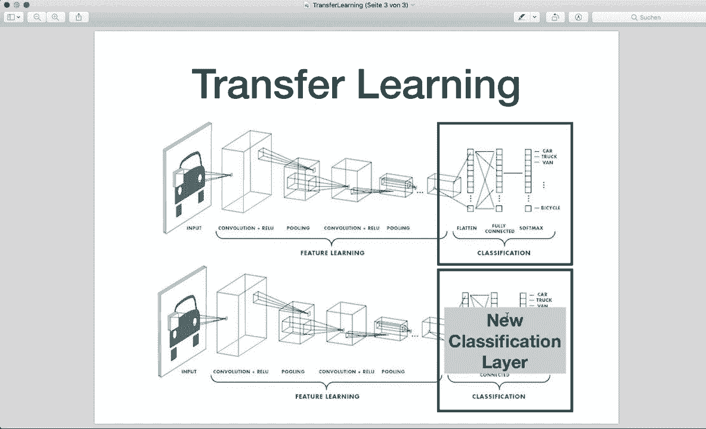
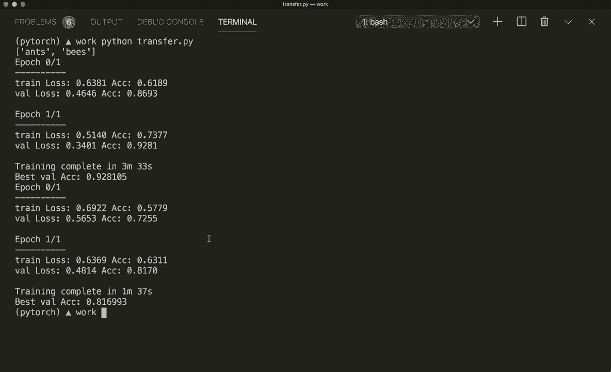

# PyTorch 极简实战教程！P15：L15- 迁移学习 🚀

在本节课中，我们将要学习迁移学习的概念，并了解如何在 PyTorch 中应用它。迁移学习是一种强大的技术，可以让我们利用为一项任务训练好的模型，快速地为另一项新任务构建模型。

## 概述

迁移学习是一种机器学习方法，它将为一个任务开发的模型重新用作解决第二个任务的起点。例如，我们可以训练一个模型来分类鸟类和猫，然后仅修改其最后一层，便可将该模型用于分类蜜蜂和狗。这种方法在深度学习中非常流行，因为它能显著缩短模型开发时间。训练一个全新的深度模型可能耗时数日甚至数周，而使用预训练模型并仅调整其最后一层，通常就能获得相当不错的性能。

## 迁移学习概念

上一节我们介绍了迁移学习的核心思想，本节中我们来看看其具体实现方式。



观察一个典型的卷积神经网络架构。假设一个模型已经在海量数据上完成了训练，并拥有了优化好的权重。我们的目标通常是保留除最后一层全连接层外的所有网络结构。我们只需修改并重新训练这最后一层，使其适应我们的新数据。这样，我们就得到了一个针对新任务调整好的模型。

## PyTorch 迁移学习实战

现在让我们在 PyTorch 中看一个具体的例子。我们将使用预训练的 ResNet-18 模型，该模型已在包含 1000 个类别的 ImageNet 数据集上训练完成。而我们的新任务只有两个类别：蜜蜂和蚂蚁。


### 数据准备

首先，我们需要准备数据。与之前使用内置数据集不同，这次我们将使用 `ImageFolder` 数据集类，它要求数据按特定结构组织。

以下是数据目录应有的结构：
```
data/
├── train/
│   ├── ants/
│   └── bees/
└── val/
    ├── ants/
    └── bees/
```

每个类别文件夹（如 `ants/`, `bees/`）内应存放对应的图像。准备好数据后，我们可以使用 `torchvision.datasets.ImageFolder` 来加载它，并通过 `dataset.classes` 获取类别名称。

### 构建与训练模型

接下来是模型构建与训练的核心部分。我们将导入预训练的 ResNet-18 模型，并替换其最后一层。

首先，导入预训练模型并冻结其参数（可选）：
```python
import torchvision.models as models
model = models.resnet18(pretrained=True)
```

然后，获取原模型最后一层全连接层的输入特征数，并创建新的全连接层以适应我们的两个类别：
```python
num_ftrs = model.fc.in_features
model.fc = nn.Linear(num_ftrs, 2)  # 2 个输出类别
```

将模型移至计算设备（如 GPU）后，定义损失函数和优化器：
```python
criterion = nn.CrossEntropyLoss()
optimizer = optim.SGD(model.parameters(), lr=0.001)
```

本节中，我们还将引入学习率调度器（Scheduler），它可以在训练过程中动态调整学习率。
```python
from torch.optim import lr_scheduler
scheduler = lr_scheduler.StepLR(optimizer, step_size=7, gamma=0.1)
```
此调度器每经过 7 个训练周期（epoch），就将学习率乘以 0.1。

在训练循环中，每个周期结束后需要调用 `scheduler.step()` 来更新学习率。

### 两种微调策略

在 PyTorch 中，我们通常采用两种迁移学习策略：

1.  **微调整个模型**：这是我们上面演示的方法，允许所有层的权重根据新数据进行小幅调整。
2.  **仅训练最后一层**：在替换最后一层之前，先冻结模型所有底层参数，使其在训练过程中保持不变。

以下是冻结参数的代码示例：
```python
for param in model.parameters():
    param.requires_grad = False
# 然后替换 model.fc，新层的 requires_grad 默认为 True
```

仅训练最后一层通常速度更快，但性能可能略低于微调整个模型。

## 结果与总结

运行示例代码后，我们观察到以下结果：
*   对**整个模型进行微调**，训练 2 个周期后，验证准确率达到了约 92%，耗时约 3.5 分钟。
*   **仅训练最后一层**，同样训练 2 个周期，验证准确率超过 80%，耗时仅约 1.5 分钟。




本节课中我们一起学习了迁移学习的核心概念及其在 PyTorch 中的两种应用方式。通过利用预训练模型，我们可以极大地加速新模型的开发流程，并在少量数据上快速获得良好的性能。关键在于根据具体任务和数据量，灵活选择是微调整个模型还是仅训练最后一层。