# PyTorch 极简实战教程！P16：L16- 如何使用 TensorBoard 📊

在本节课中，我们将学习如何使用 TensorBoard 这一强大的可视化工具来分析和监控 PyTorch 模型的训练过程。TensorBoard 由 TensorFlow 团队开发，但同样可以完美地与 PyTorch 集成，帮助我们跟踪指标、可视化模型结构、查看数据样本等。

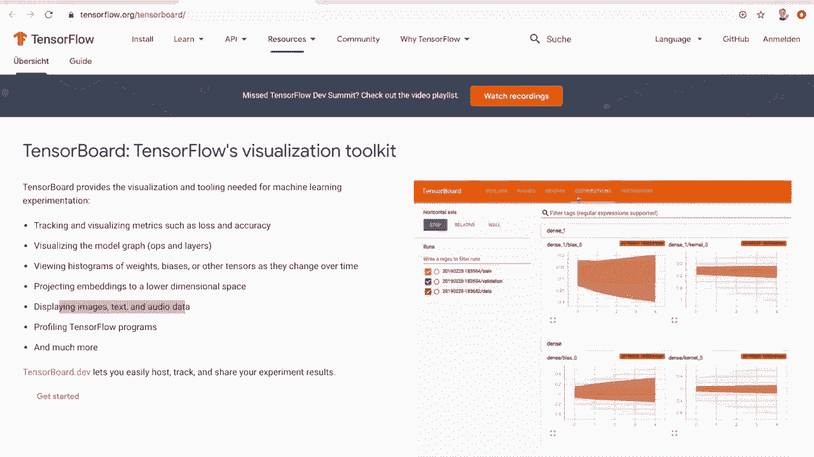

## 概述与准备工作

首先，我们需要安装 TensorBoard。这可以通过 pip 轻松完成，无需安装整个 TensorFlow 库。

```bash
pip install tensorboard
```

安装完成后，可以在终端通过 `tensorboard --logdir=runs` 命令启动服务，默认在 `localhost:6006` 提供 Web 界面。`--logdir` 参数指定了 TensorBoard 读取日志文件的目录。

上一节我们介绍了 TensorBoard 的基本概念和安装方法，本节中我们来看看如何在代码中集成 TensorBoard。

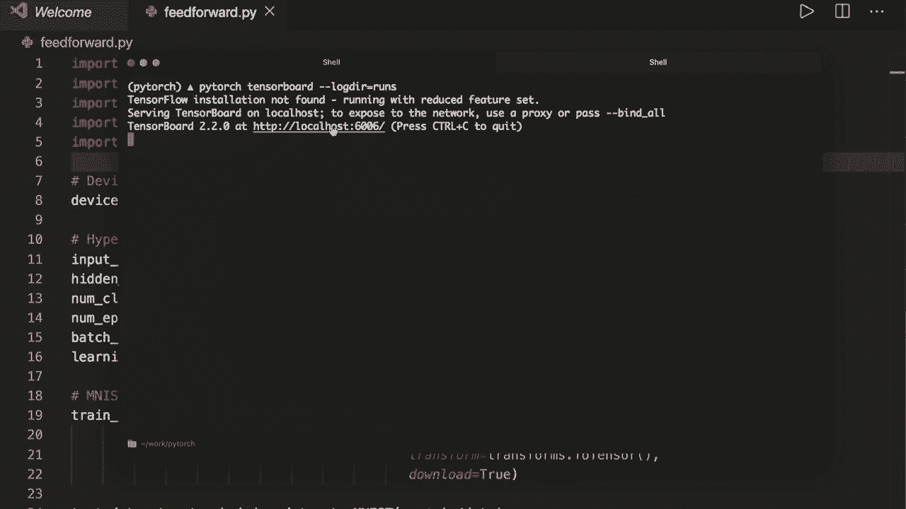

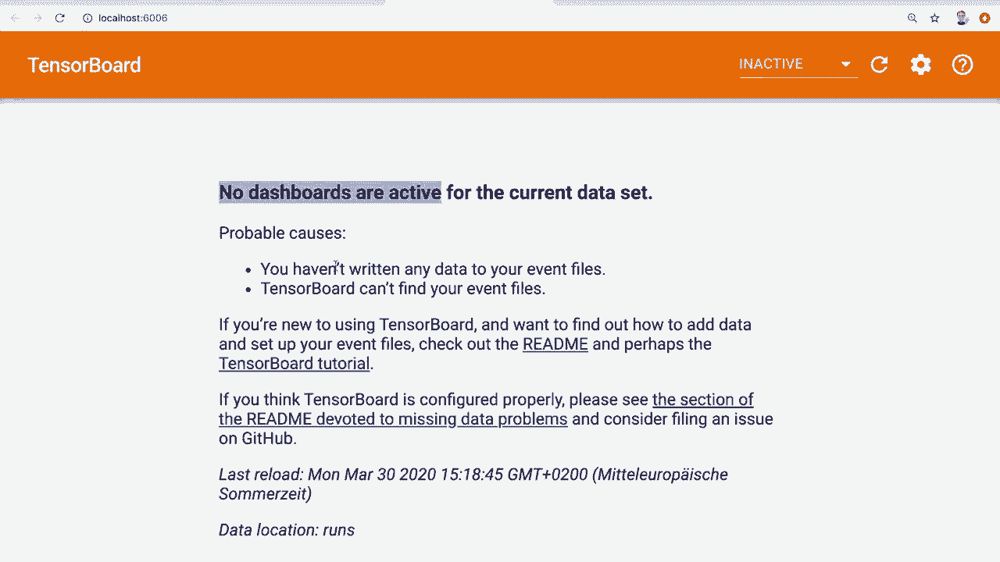

## 集成 TensorBoard 到 PyTorch 代码

我们将基于一个简单的 MNIST 手写数字分类模型进行演示。首先，需要从 `torch.utils` 导入 `SummaryWriter`，它是 PyTorch 与 TensorBoard 交互的核心类。

```python
from torch.utils.tensorboard import SummaryWriter

# 创建 SummaryWriter 实例，指定日志保存目录
writer = SummaryWriter('runs/mnist_experiment')
```

### 1. 记录数据样本

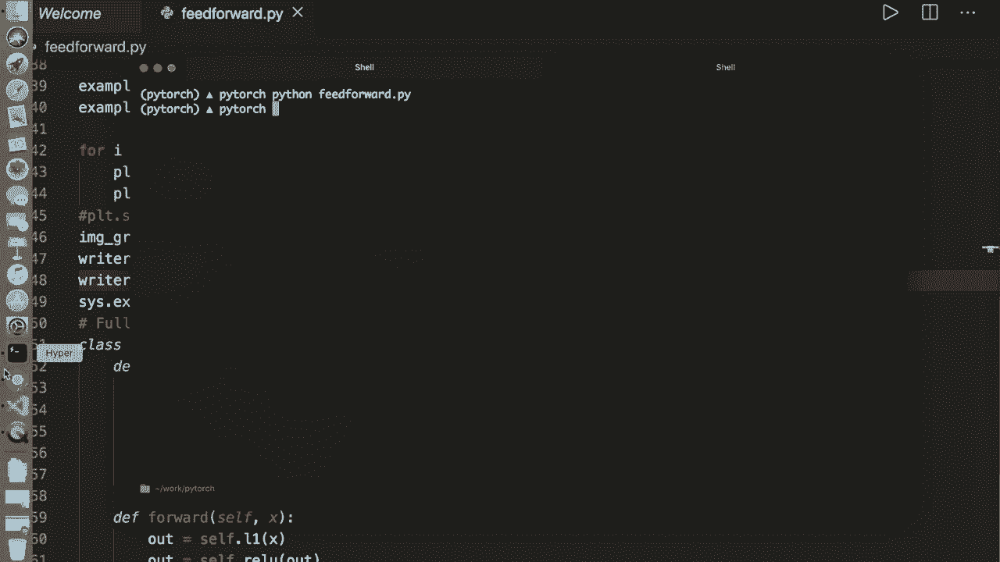

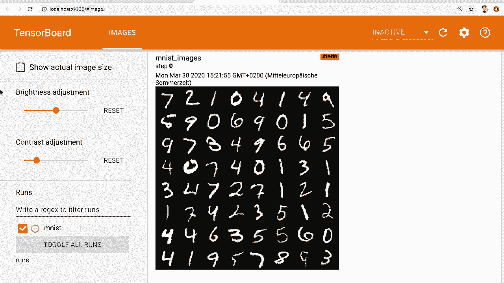

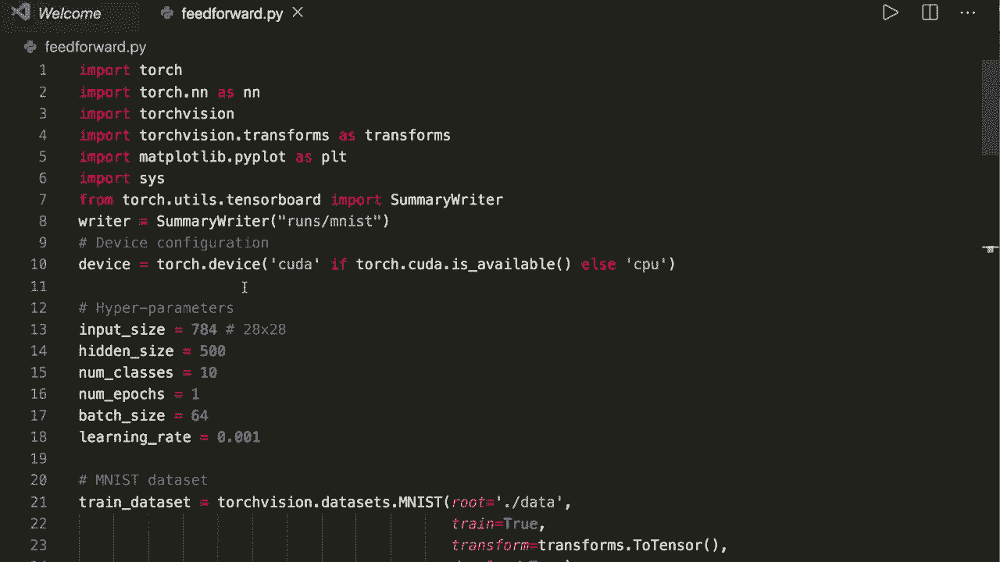

在训练前，我们通常希望查看输入数据。以下是将一批训练图像添加到 TensorBoard 的方法。

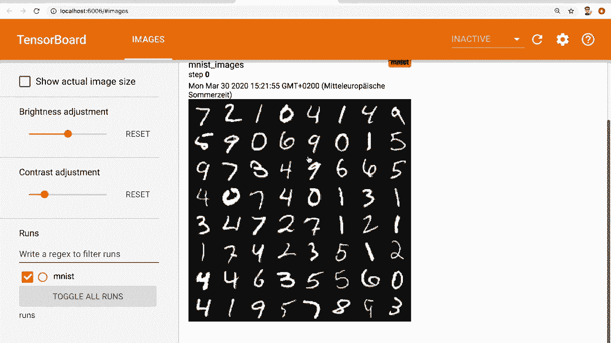

```python
import torchvision.utils as vutils

# 假设 `example_data` 是一个批量的图像数据
img_grid = vutils.make_grid(example_data)
writer.add_image('MNIST Images', img_grid)
```

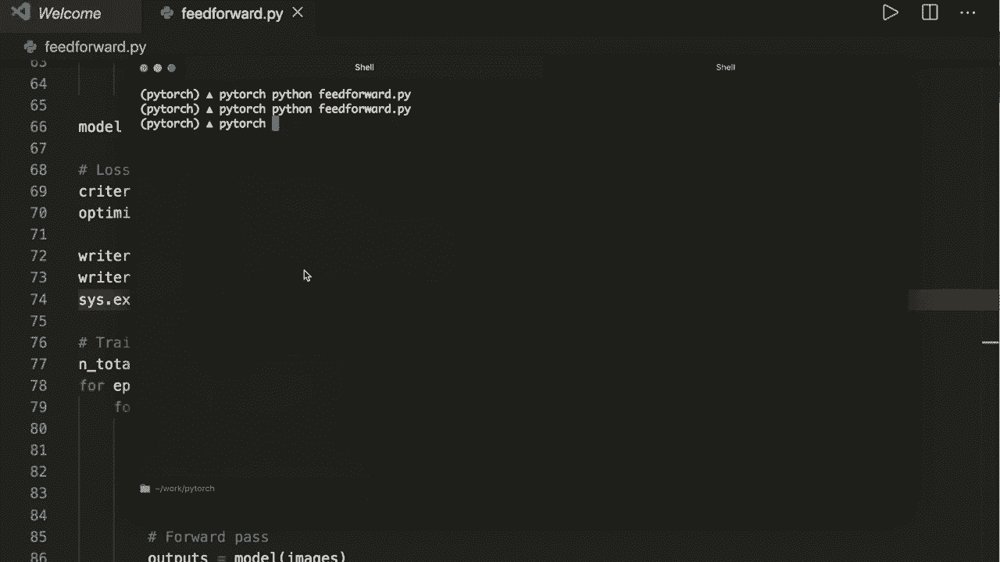

**代码解释**：
*   `vutils.make_grid`：将一批图像拼接成一个网格图像。
*   `writer.add_image`：将图像网格写入日志，并指定一个标签。

### 2. 可视化模型计算图

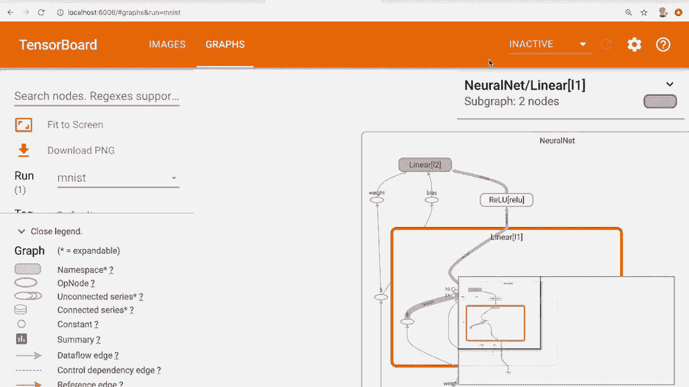

TensorBoard 可以绘制模型的计算图，帮助我们理解模型结构和数据流向。

```python
# 假设 `model` 是定义的神经网络，`example_data` 是输入样本
writer.add_graph(model, example_data.reshape(-1, 28*28))
```

**代码解释**：
*   `writer.add_graph`：记录模型的计算图。需要传入模型实例和对应的输入数据张量。

在记录了图像和模型图之后，我们可以运行脚本并刷新 TensorBoard 页面进行查看。接下来，我们将学习如何记录训练过程中的关键指标。

## 记录训练指标

在训练循环中，我们不仅打印损失和准确率，还可以将它们实时记录到 TensorBoard 中，以便进行可视化分析。

以下是记录训练损失和准确率的步骤：

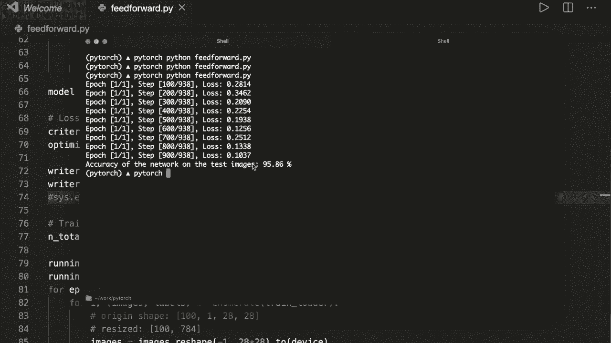

```python
running_loss = 0.0
running_correct = 0

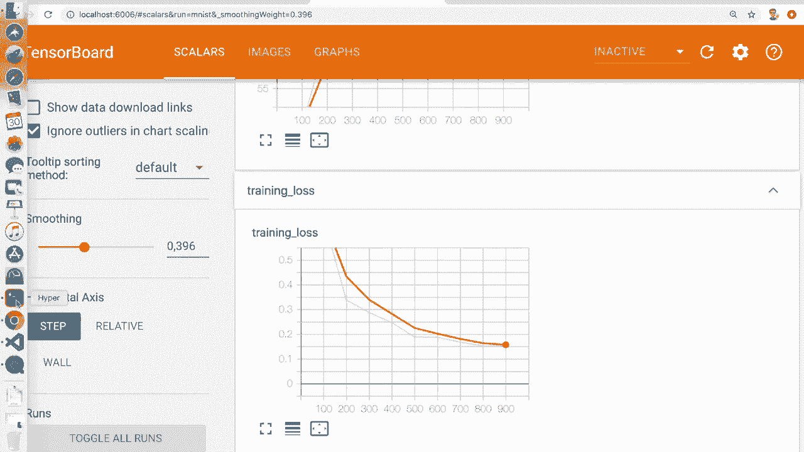

for epoch in range(num_epochs):
    for i, (images, labels) in enumerate(train_loader):
        # ... 前向传播、计算损失、反向传播、优化器步骤 ...

        # 累计损失和正确预测数
        running_loss += loss.item()
        _, predicted = torch.max(outputs.data, 1)
        running_correct += (predicted == labels).sum().item()

        # 每100个批次记录一次平均值
        if (i+1) % 100 == 0:
            # 计算当前全局步数
            global_step = epoch * len(train_loader) + i

            # 记录平均损失
            writer.add_scalar('Training Loss',
                              running_loss / 100,
                              global_step)
            # 记录平均准确率
            writer.add_scalar('Training Accuracy',
                              running_correct / 100,
                              global_step)

            # 重置累计值
            running_loss = 0.0
            running_correct = 0
```

**代码解释**：
*   `writer.add_scalar`：用于记录单个标量值（如损失、准确率）随时间（步数）的变化。
*   标签（如 `‘Training Loss’`）用于在 TensorBoard 中区分不同的曲线。
*   `global_step` 是关键参数，它定义了 x 轴，代表训练进行的步骤或周期。

记录这些指标后，我们可以在 TensorBoard 的 “SCALARS” 标签页下看到损失下降和准确率上升的曲线。这有助于我们判断模型是否在有效学习，以及是否需要调整超参数（如学习率）。

## 绘制精确率-召回率曲线

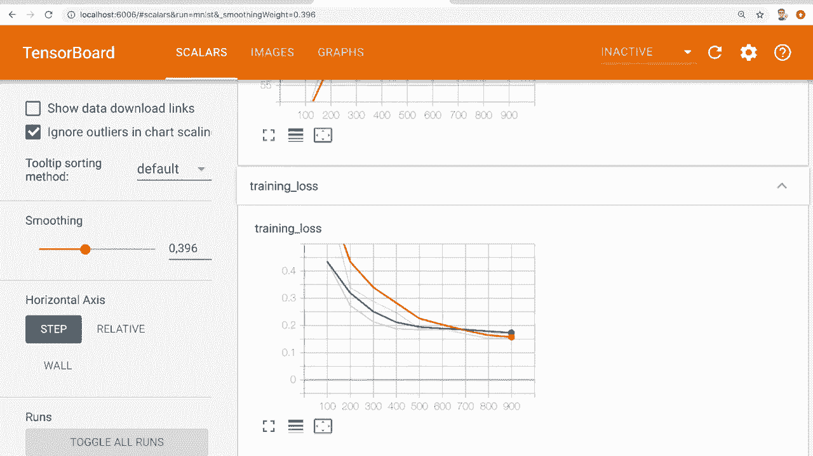

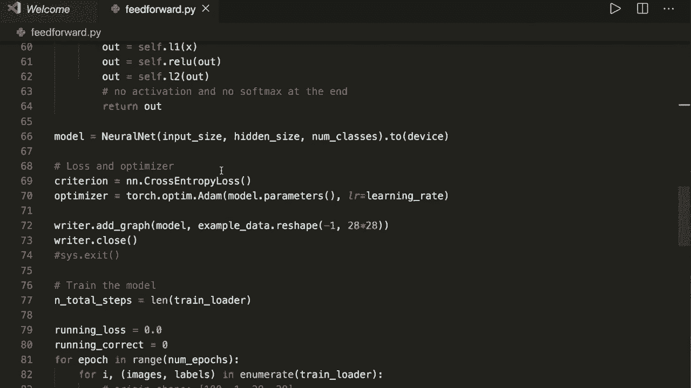

对于分类任务，精确率-召回率曲线是评估模型性能的重要工具，尤其适用于类别不平衡的数据集。它展示了在不同分类阈值下，精确率和召回率之间的权衡关系。

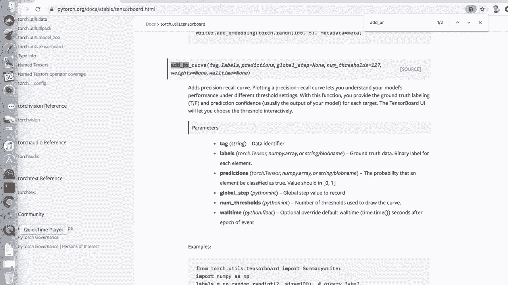

以下是绘制每个类别 PR 曲线的方法：

```python
import torch.nn.functional as F

# 在模型评估阶段收集所有预测和标签
all_labels = []
all_predictions = []

with torch.no_grad():
    for images, labels in test_loader:
        outputs = model(images)
        # 应用 softmax 获取各类别的概率
        probabilities = F.softmax(outputs, dim=1)

        all_labels.append(labels)
        all_predictions.append(probabilities)

# 合并所有批次的結果
all_labels = torch.cat(all_labels)
all_predictions = torch.cat(all_predictions)

# 为每个类别绘制 PR 曲线
num_classes = 10
for class_idx in range(num_classes):
    # 获取当前类别的二值标签（是否属于该类）
    class_labels = (all_labels == class_idx).int()
    # 获取模型预测为该类别的概率
    class_probs = all_predictions[:, class_idx]

    writer.add_pr_curve(f'Class {class_idx}',
                        class_labels,
                        class_probs,
                        global_step=0)
```

**代码解释**：
*   `F.softmax`：将模型的原始输出转换为概率，总和为1。
*   `writer.add_pr_curve`：绘制精确率-召回率曲线。需要传入：
    1.  标签名。
    2.  真实标签（二值，0或1）。
    3.  模型预测的**正类概率**（值在0到1之间）。

绘制完成后，在 TensorBoard 的 “PR CURVES” 标签页下，可以分析模型对每个数字类别的识别能力。曲线越靠近右上角，说明模型在该类别上的性能越好。

## 总结

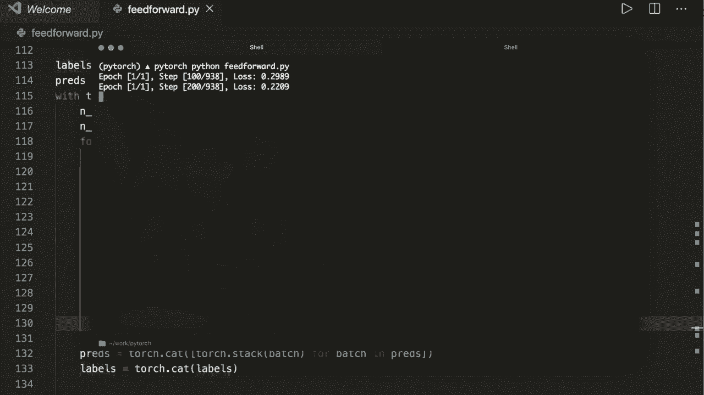

本节课中我们一起学习了如何将 TensorBoard 集成到 PyTorch 训练流程中。我们涵盖了以下核心操作：

1.  **安装与启动**：通过 pip 安装 TensorBoard，并通过命令行启动可视化服务器。
2.  **记录数据**：使用 `add_image` 方法可视化输入数据。
3.  **可视化模型**：使用 `add_graph` 方法绘制模型的计算图。
4.  **跟踪指标**：使用 `add_scalar` 方法记录训练损失、准确率等标量指标的变化。
5.  **分析性能**：使用 `add_pr_curve` 方法绘制精确率-召回率曲线，深入评估分类模型。

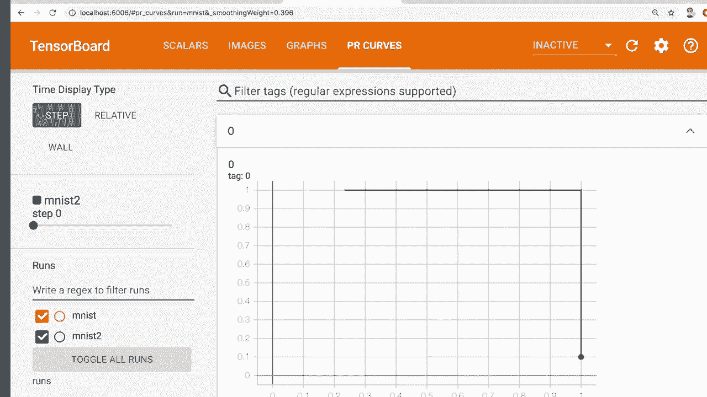

通过利用 TensorBoard 的这些功能，我们可以更直观、更高效地监控模型训练过程、调试网络结构以及分析最终模型性能，从而加速机器学习项目的开发与迭代。