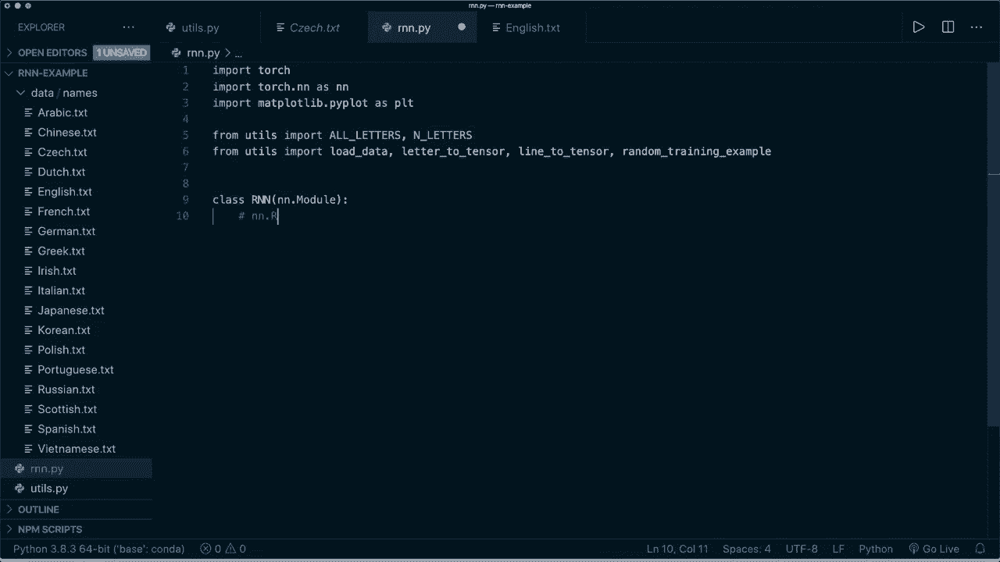
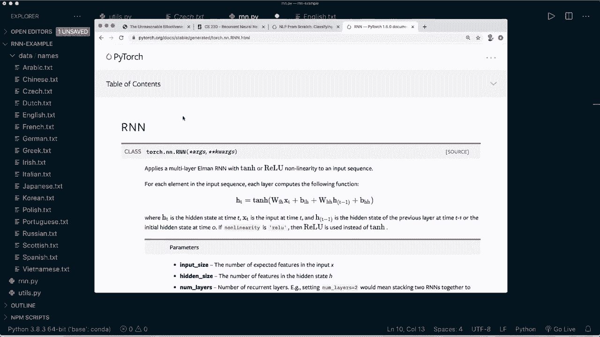
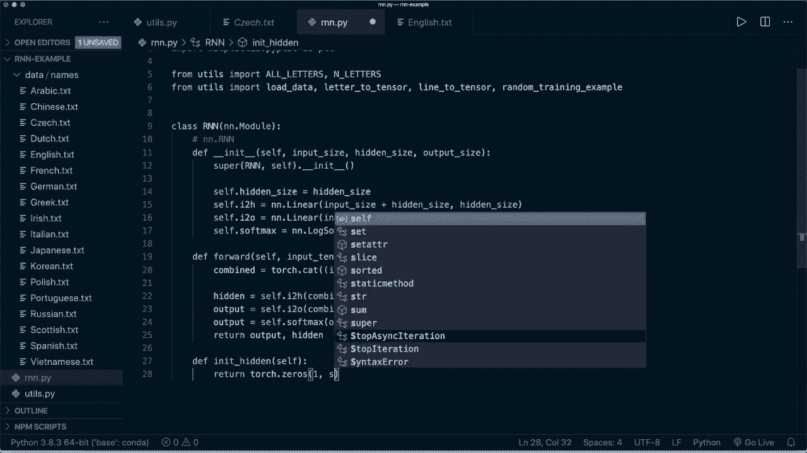
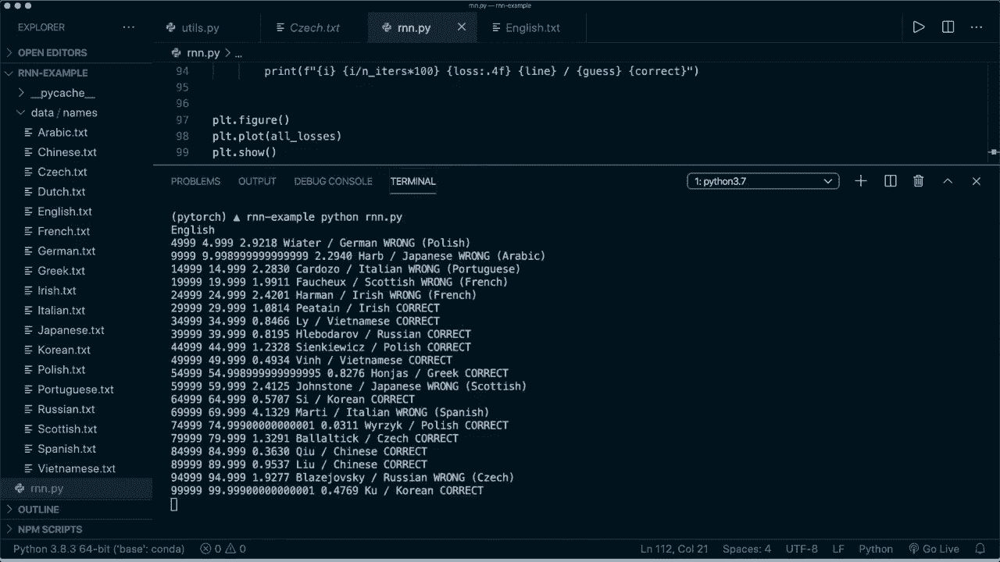
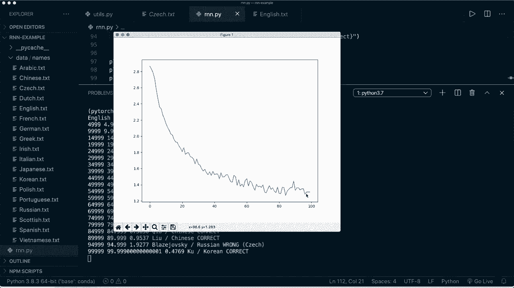
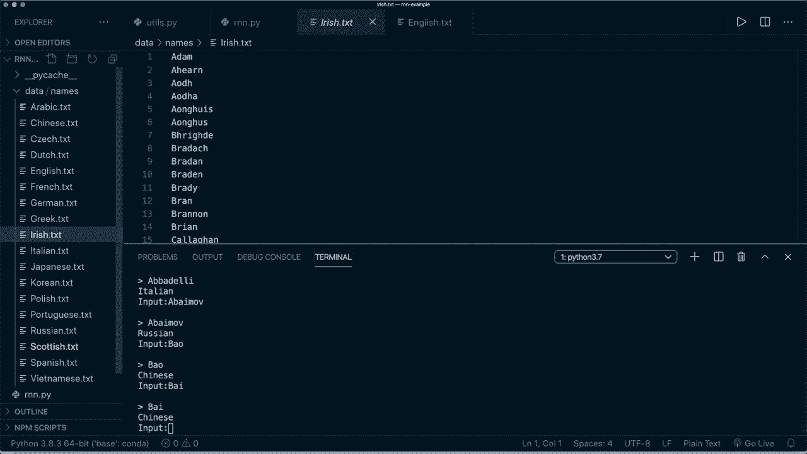

# PyTorch 极简实战教程！P19：L19- 使用循环神经网络进行名称分类 🧠

在本节课中，我们将要学习循环神经网络（RNN）的基本原理，并动手在 PyTorch 中从头实现一个 RNN 模型，用于根据姓氏判断其所属国家。


## 概述 📋

循环神经网络是一种能够处理序列数据的神经网络。它通过一个“隐藏状态”来记忆之前的信息，并将其用于当前的计算。这使得 RNN 非常适合处理像文本、语音、时间序列这类具有前后关联的数据。本节课，我们将使用姓氏字母序列作为输入，训练一个 RNN 模型来完成多国姓氏分类任务。

## RNN 理论基础 🧮

上一节我们概述了课程目标，本节中我们来看看 RNN 的核心思想。

RNN 允许将之前的输出作为输入，同时维护一个隐藏状态。其最简单的架构如下图所示：我们有一个输入，在内部进行计算后，得到输出和新的隐藏状态。这个新的隐藏状态会被传递到下一个时间步使用。


我们可以将 RNN 在时间上展开，以便更好地理解它如何处理序列。例如，对于一个句子，我们可以将每个单词作为一个输入。处理第一个单词时，我们结合初始隐藏状态进行计算，得到输出和新的隐藏状态。然后，在处理第二个单词时，我们使用这个新的隐藏状态和第二个单词作为输入，如此反复。

### RNN 的应用场景

以下是 RNN 几种典型的输入输出关系：

*   **一对一**：传统神经网络模式，如图像分类。输入和输出都是固定长度。
*   **一对多**：单个输入，序列输出。例如图像描述（输入一张图，输出一段文字）。
*   **多对一**：序列输入，单个输出。例如情感分析或本节课的姓名分类（输入整个名字，输出国家类别）。
*   **多对多（异步）**：序列输入，序列输出。例如机器翻译（输入一个英语句子，输出一个法语句子）。
*   **多对多（同步）**：序列输入，同步的序列输出。例如视频帧分类（对每一帧进行分类）。

RNN 主要应用于自然语言处理和语音识别，也可用于某些图像分类任务。

### RNN 的优缺点





**优点**：
*   可以处理任意长度的输入。
*   模型大小不随输入长度增加而增加。
*   计算时考虑了历史信息。
*   权重在时间步之间共享。

**缺点**：
*   计算可能比普通神经网络慢。
*   难以捕捉很早期的历史信息（长期依赖问题）。
*   无法考虑未来的输入来影响当前状态（单向 RNN 的局限）。

## 数据准备与预处理 📊

理解了 RNN 的基本概念后，我们需要为姓名分类任务准备数据。以下是数据处理的关键步骤：

首先，我们需要一些辅助函数来处理原始姓名数据。数据文件包含来自不同国家（如阿拉伯、中文、荷兰、英文等）的姓氏。

**1. 数据加载与清洗**：
使用 `load_data` 函数加载所有文件，并从文件名中提取国家名作为类别。同时，使用 `unicode_to_ascii` 函数将姓名中的特殊字符转换为 ASCII 字符，确保数据一致性。



**2. 数据向量化**：
为了能让模型处理文本，我们需要将字母转换为数字。这里采用**独热编码**。假设我们的字母表只有 `[A, B, C, D, E]`，那么字母 `B` 的独热向量表示为：
```
[0, 1, 0, 0, 0]
```
在我们的任务中，字母表包含 57 个字符（大小写字母及一些符号）。`letter_to_tensor` 函数将单个字母转换为形状为 `(1, 57)` 的独热编码张量。

**3. 构建序列张量**：
一个完整的姓名由多个字母组成。`line_to_tensor` 函数将整个姓名转换为一个形状为 `(name_length, 1, 57)` 的张量，其中 `name_length` 是姓名的字母数量。这符合 RNN 处理序列的输入格式。

## 从零实现 RNN 模型 ⚙️

数据准备就绪后，现在我们可以开始构建 RNN 模型。PyTorch 虽然提供了现成的 `RNN` 模块，但为了深入理解，我们将从头实现。

我们的 RNN 用于姓名分类的架构如下图所示：每个时间步，我们将当前输入和上一个隐藏状态结合，经过两个线性层（`i2h`, `i2o`）和非线性变换，产生新的隐藏状态和输出。对于分类任务，我们在最终输出上应用 Softmax 函数。


以下是模型的核心实现代码：

```python
import torch
import torch.nn as nn

class RNN(nn.Module):
    def __init__(self, input_size, hidden_size, output_size):
        super(RNN, self).__init__()
        self.hidden_size = hidden_size
        # 结合输入和隐藏状态的线性层
        self.i2h = nn.Linear(input_size + hidden_size, hidden_size)
        # 产生输出的线性层
        self.i2o = nn.Linear(input_size + hidden_size, output_size)
        # 用于分类的Softmax层
        self.softmax = nn.LogSoftmax(dim=1)

    def forward(self, input_tensor, hidden_tensor):
        # 1. 结合当前输入和上一个隐藏状态
        combined = torch.cat((input_tensor, hidden_tensor), dim=1)
        # 2. 计算新的隐藏状态
        hidden = self.i2h(combined)
        # 3. 计算输出
        output = self.i2o(combined)
        # 4. 应用Softmax得到分类概率（对数形式）
        output = self.softmax(output)
        return output, hidden

    def init_hidden(self):
        # 初始化隐藏状态为零向量
        return torch.zeros(1, self.hidden_size)
```
**关键点解释**：
*   `__init__`: 定义网络层。`i2h` 层生成新的隐藏状态，`i2o` 层生成输出。输入大小是 `input_size + hidden_size`，因为需要拼接当前输入和上一时刻的隐藏状态。
*   `forward`: 定义前向传播过程。首先拼接输入和隐藏状态，然后分别通过两个线性层，最后对输出应用 `LogSoftmax`（常与 `NLLLoss` 损失函数配对使用）。
*   `init_hidden`: 提供初始的零值隐藏状态。

## 模型训练与评估 🏋️‍♂️

模型构建完成后，下一步是训练它。以下是训练流程的关键环节：

**1. 初始化与设置**：
我们实例化模型，定义损失函数（负对数似然损失 `NLLLoss`）和优化器（随机梯度下降 `SGD`）。
```python
n_hidden = 128
rnn = RNN(n_letters, n_hidden, n_categories)
criterion = nn.NLLLoss()
learning_rate = 0.005
optimizer = torch.optim.SGD(rnn.parameters(), lr=learning_rate)
```

**2. 单次训练步骤**：
定义一个 `train` 函数处理一个训练样本。
*   初始化隐藏状态。
*   **循环处理序列**：将姓名的每个字母依次输入 RNN，并更新隐藏状态。
*   使用最后一个时间步的输出计算损失。
*   执行反向传播和优化器更新步骤。
```python
def train(category_tensor, line_tensor):
    hidden = rnn.init_hidden()
    # 循环处理姓名中的每个字母
    for i in range(line_tensor.size()[0]):
        output, hidden = rnn(line_tensor[i], hidden)
    # 用最后一个输出计算损失
    loss = criterion(output, category_tensor)
    optimizer.zero_grad()
    loss.backward()
    optimizer.step()
    return output, loss.item()
```

**3. 训练循环**：
进行多轮迭代，每次随机抽取一个姓名及其国家标签进行训练。定期打印训练进度和损失，并绘制损失下降曲线以监控训练过程。



## 模型使用与预测 🔮

训练好的模型可以用来预测新姓名的所属国家。

我们编写一个 `predict` 函数，其流程与训练中的前向传播类似，但不需要计算梯度：
1.  将输入姓名转换为张量。
2.  初始化隐藏状态。
3.  将姓名字母依次输入训练好的 RNN 模型。
4.  取最后一个输出，概率最高的类别即为预测结果。
```python
def predict(input_line):
    with torch.no_grad(): # 不计算梯度
        line_tensor = line_to_tensor(input_line)
        hidden = rnn.init_hidden()
        for i in range(line_tensor.size()[0]):
            output, hidden = rnn(line_tensor[i], hidden)
        # 获取预测类别
        _, topi = output.topk(1)
        predicted_idx = topi[0].item()
        return all_categories[predicted_idx]
```
例如，输入 `"Acker"` 可能预测为 `"German"`，输入 `"Bai"` 可能预测为 `"Chinese"`。





## 总结 🎯

本节课中我们一起学习了循环神经网络的核心概念及其在 PyTorch 中的实现。我们从零开始构建了一个 RNN 模型，用于完成多国姓氏分类任务。关键步骤包括：数据预处理与独热编码、RNN 模型的手动实现、处理变长序列的训练循环，以及使用训练好的模型进行预测。


通过本教程，你不仅应该理解了 RNN 如何处理序列数据，也掌握了在 PyTorch 框架下构建和训练一个简单 RNN 模型的完整流程。这为学习更复杂的循环神经网络变体（如 LSTM、GRU）以及使用 PyTorch 内置的 `nn.RNN` 模块打下了坚实的基础。