# PyTorch 极简实战教程 P20：L20- RNN & LSTM & GRU - 循环神经网络 🧠

在本节课中，我们将学习如何使用 PyTorch 内置的模块来实现循环神经网络。我们将从基础的 RNN 开始，然后轻松地切换到其两种流行变体：LSTM 和 GRU。本教程将使用 MNIST 手写数字分类作为示例任务，虽然这不是 RNN 的典型应用场景，但它能很好地演示如何处理序列输入。

## 概述

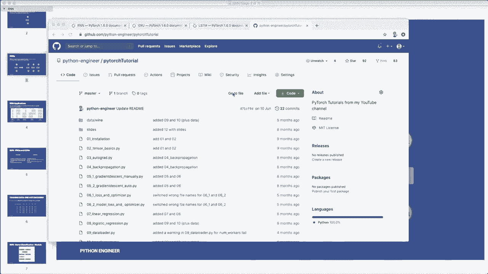

在上一个教程中，我们从头开始实现了 RNN。本节课，我们将专注于使用 PyTorch 提供的 `nn.RNN`、`nn.LSTM` 和 `nn.GRU` 模块来简化实现过程。我们将学习如何设置输入形状、初始化隐藏状态，并构建一个用于分类的多对一架构模型。

## 1. 准备工作和超参数设置

首先，我们需要定义模型的超参数。MNIST 数据集中的图像是 28x28 像素的。我们将把每一行像素（28个像素）视为一个时间步的输入，因此整个图像就是一个长度为 28 的序列。

以下是需要定义的超参数：

```python
input_size = 28      # 每个时间步输入的特征数（图像的一行）
sequence_length = 28 # 序列的长度（图像的行数）
hidden_size = 128    # RNN隐藏层的大小
num_layers = 2       # 堆叠的RNN层数
num_classes = 10     # 输出类别数（数字0-9）
batch_size = 64      # 批处理大小
num_epochs = 2       # 训练轮数
learning_rate = 0.001 # 学习率
```

## 2. 构建 RNN 模型类

现在，我们来构建 RNN 模型类。我们将继承 `nn.Module` 并初始化所需的层。

上一节我们介绍了超参数，本节中我们来看看如何用这些参数构建模型。

```python
import torch
import torch.nn as nn

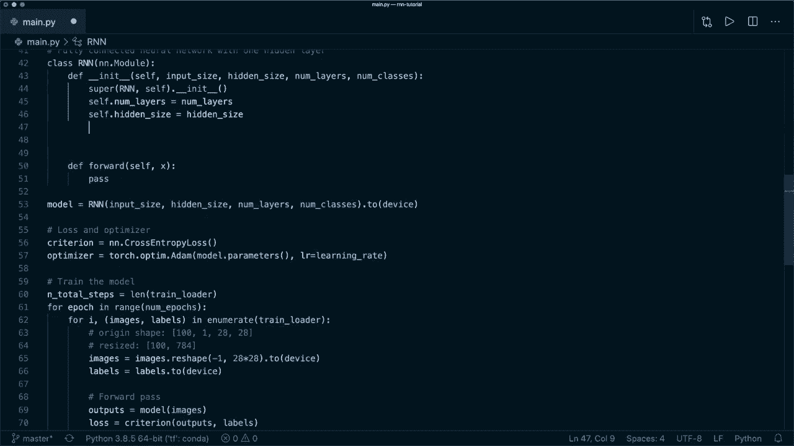

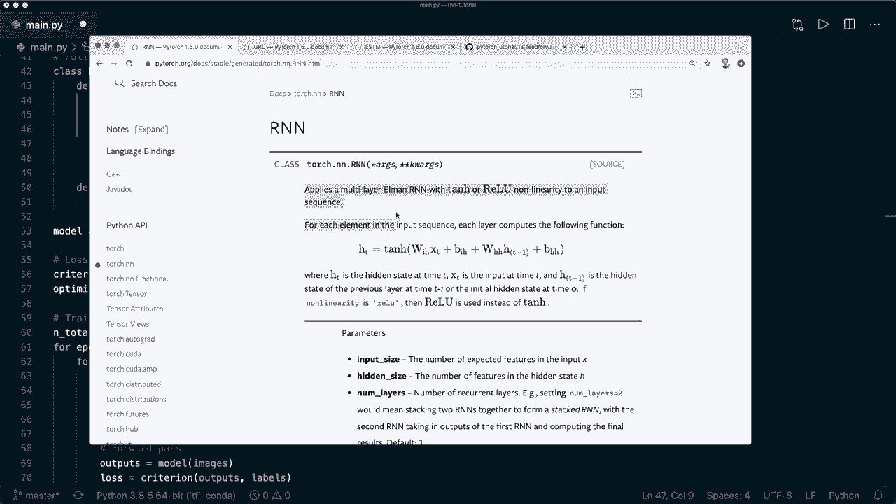

class RNN(nn.Module):
    def __init__(self, input_size, hidden_size, num_layers, num_classes):
        super(RNN, self).__init__()
        self.num_layers = num_layers
        self.hidden_size = hidden_size
        # 使用 PyTorch 内置的 RNN 模块
        self.rnn = nn.RNN(input_size, hidden_size, num_layers, batch_first=True)
        # 全连接层，用于最终的分类
        self.fc = nn.Linear(hidden_size, num_classes)

    def forward(self, x):
        # 初始化隐藏状态
        h0 = torch.zeros(self.num_layers, x.size(0), self.hidden_size).to(device)
        
        # 前向传播 RNN
        out, _ = self.rnn(x, h0)  # out 的形状: (batch_size, seq_length, hidden_size)
        
        # 解码最后一个时间步的隐藏状态
        out = out[:, -1, :]  # 形状: (batch_size, hidden_size)
        
        # 通过全连接层
        out = self.fc(out)
        return out
```

**核心概念解释**:
*   `batch_first=True`: 这要求输入张量 `x` 的形状为 `(batch_size, sequence_length, input_size)`。
*   隐藏状态 `h0`: 其形状为 `(num_layers, batch_size, hidden_size)`。
*   `out[:, -1, :]`: 我们只取每个样本在最后一个时间步 (`-1`) 的输出，用于最终分类。

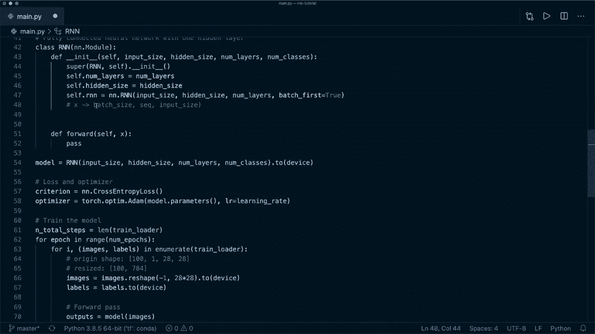

## 3. 调整输入数据形状

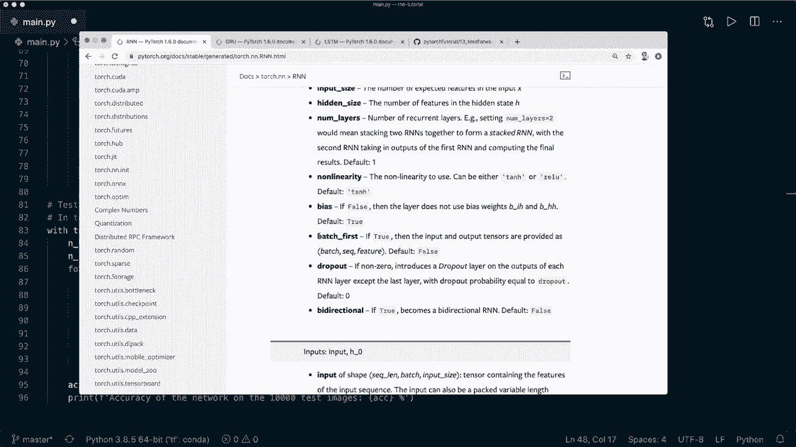

在使用模型之前，我们必须将输入数据调整为正确的形状。原始的 MNIST 图像形状是 `(batch_size, 1, 28, 28)`。

我们需要将其调整为 `(batch_size, sequence_length, input_size)`，即 `(batch_size, 28, 28)`。

在训练和评估循环中，都需要进行此操作：

```python
# 假设 images 是原始的批处理图像
images = images.reshape(-1, sequence_length, input_size).to(device)
```

## 4. 训练与评估模型

构建好模型并准备好数据后，训练和评估循环与标准的 PyTorch 训练流程一致。我们使用交叉熵损失和 Adam 优化器。

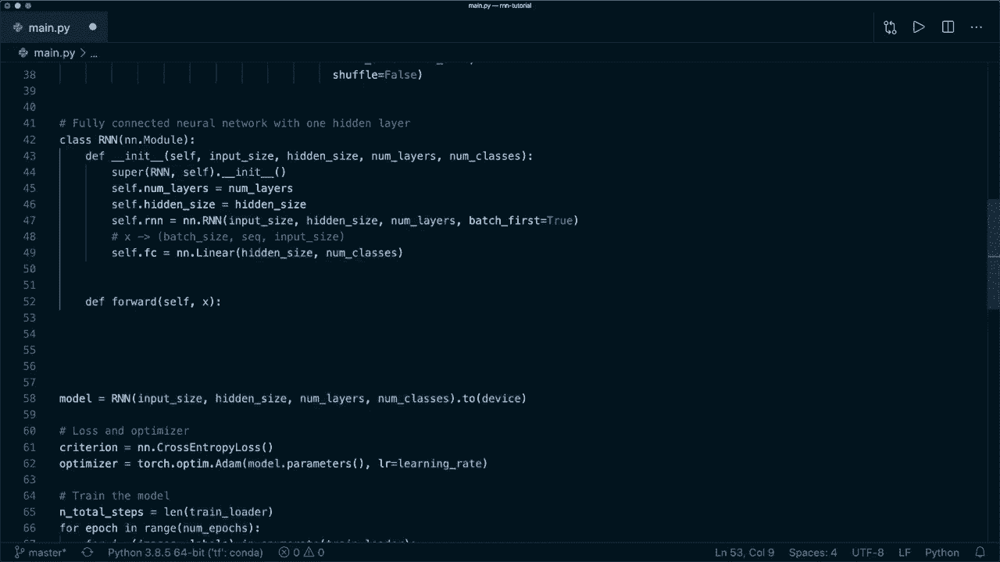

以下是训练循环的关键步骤：

```python
model = RNN(input_size, hidden_size, num_layers, num_classes).to(device)
criterion = nn.CrossEntropyLoss()
optimizer = torch.optim.Adam(model.parameters(), lr=learning_rate)

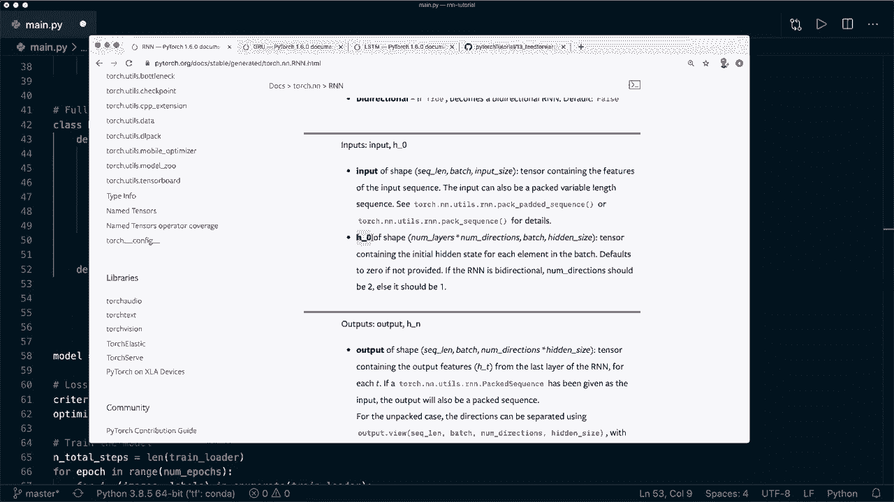

for epoch in range(num_epochs):
    for batch_idx, (images, labels) in enumerate(train_loader):
        # 调整输入形状
        images = images.reshape(-1, sequence_length, input_size).to(device)
        labels = labels.to(device)
        
        # 前向传播
        outputs = model(images)
        loss = criterion(outputs, labels)
        
        # 反向传播和优化
        optimizer.zero_grad()
        loss.backward()
        optimizer.step()
```

运行此代码，我们的基础 RNN 模型在 MNIST 上可以达到约 **93%** 的准确率。

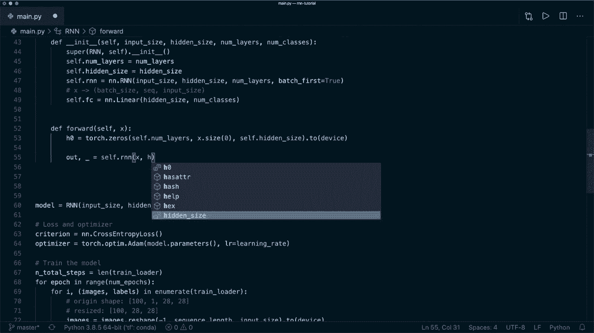

## 5. 切换到 GRU 模型

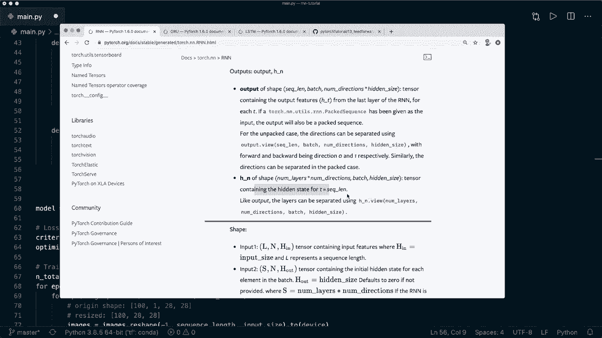

门控循环单元是 RNN 的一种变体，能更好地捕捉长期依赖关系。在 PyTorch 中切换非常容易。

我们只需将模型定义中的 `nn.RNN` 替换为 `nn.GRU`：

```python
class GRUModel(nn.Module):
    def __init__(self, input_size, hidden_size, num_layers, num_classes):
        super(GRUModel, self).__init__()
        self.num_layers = num_layers
        self.hidden_size = hidden_size
        # 使用 GRU 模块
        self.gru = nn.GRU(input_size, hidden_size, num_layers, batch_first=True)
        self.fc = nn.Linear(hidden_size, num_classes)

    def forward(self, x):
        h0 = torch.zeros(self.num_layers, x.size(0), self.hidden_size).to(device)
        out, _ = self.gru(x, h0)
        out = out[:, -1, :]
        out = self.fc(out)
        return out
```

使用 GRU 模型，准确率通常会有所提升，在本例中可能达到 **95%** 以上。

## 6. 切换到 LSTM 模型

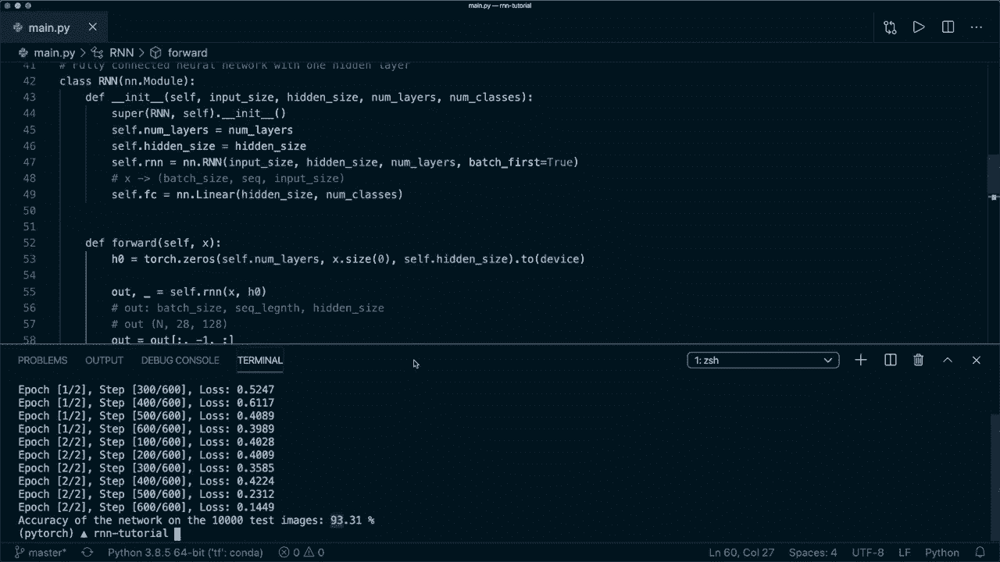

长短期记忆网络是另一种强大的 RNN 变体。LSTM 引入了细胞状态，需要同时初始化隐藏状态和细胞状态。

以下是 LSTM 模型的实现：

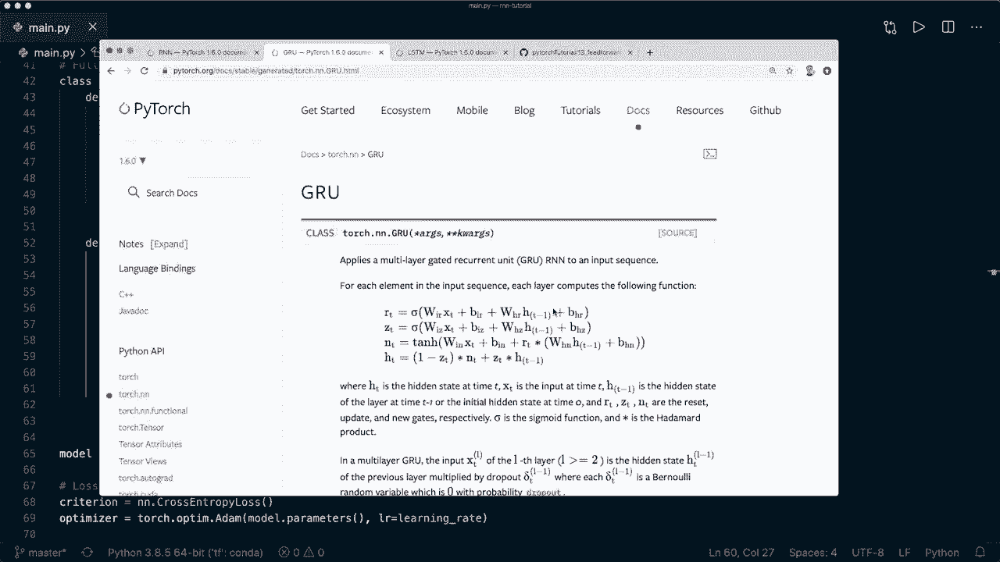

```python
class LSTMModel(nn.Module):
    def __init__(self, input_size, hidden_size, num_layers, num_classes):
        super(LSTMModel, self).__init__()
        self.num_layers = num_layers
        self.hidden_size = hidden_size
        # 使用 LSTM 模块
        self.lstm = nn.LSTM(input_size, hidden_size, num_layers, batch_first=True)
        self.fc = nn.Linear(hidden_size, num_classes)

    def forward(self, x):
        # 初始化隐藏状态和细胞状态
        h0 = torch.zeros(self.num_layers, x.size(0), self.hidden_size).to(device)
        c0 = torch.zeros(self.num_layers, x.size(0), self.hidden_size).to(device)
        
        # LSTM 前向传播，输入需要 (h0, c0) 元组
        out, _ = self.lstm(x, (h0, c0))
        out = out[:, -1, :]
        out = self.fc(out)
        return out
```

LSTM 模型在此任务上的表现通常最好，准确率可能达到 **97%** 左右。

## 总结

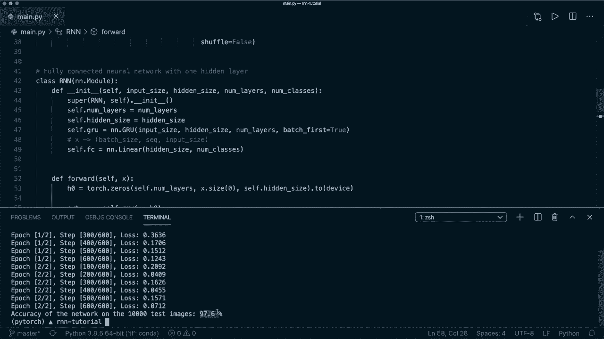

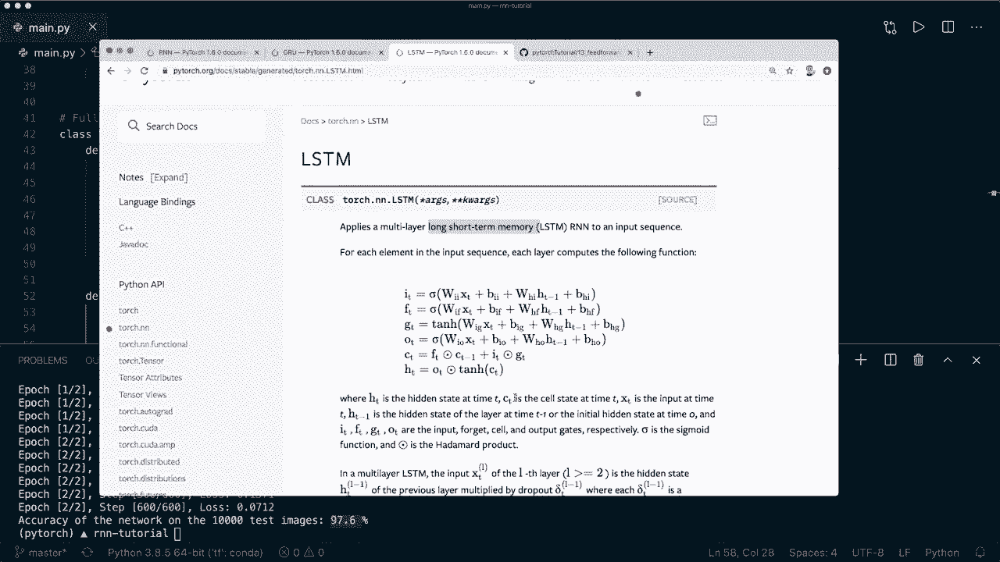

本节课中我们一起学习了如何使用 PyTorch 内置模块实现循环神经网络。我们掌握了以下核心技能：

1.  **理解序列输入**：将图像等数据重塑为 `(batch_size, sequence_length, input_size)` 的形状。
2.  **构建基础 RNN**：使用 `nn.RNN` 模块，并正确初始化隐藏状态。
3.  **实现多对一架构**：通过获取最后一个时间步的输出来完成分类任务。
4.  **轻松切换高级模型**：通过简单地将 `nn.RNN` 替换为 `nn.GRU` 或 `nn.LSTM`，并相应调整初始状态（LSTM需要细胞状态），即可使用更强大的循环网络变体。

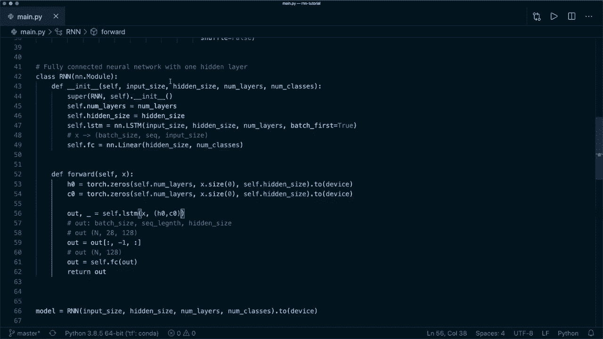

通过本教程，你现在应该能够自信地在 PyTorch 中使用 RNN、LSTM 和 GRU 来处理序列数据了。