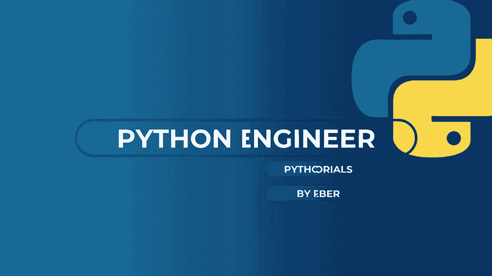
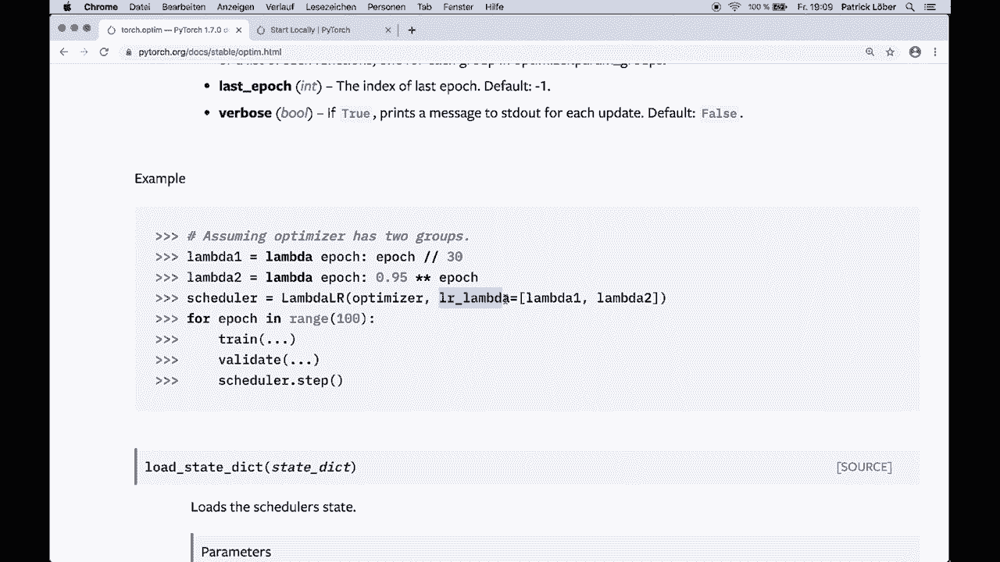
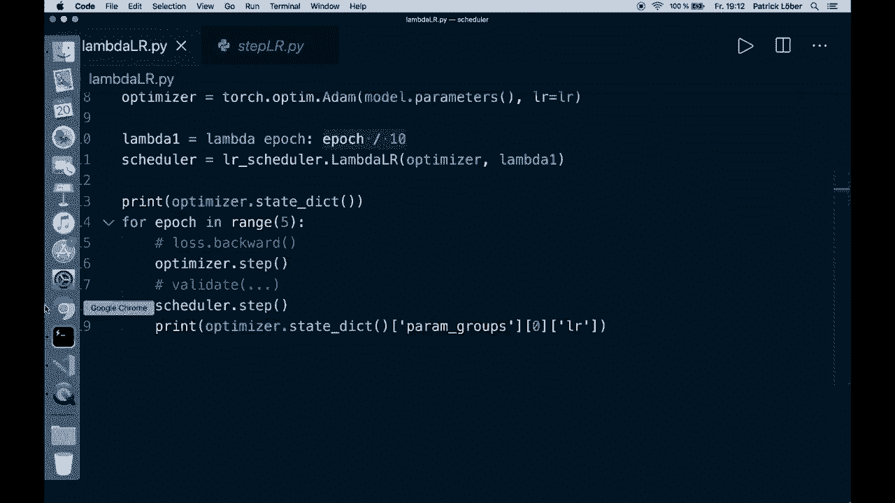
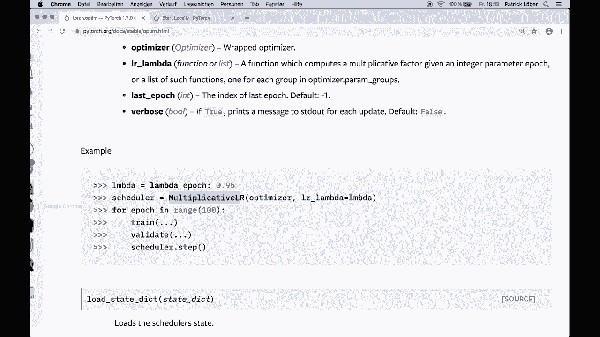
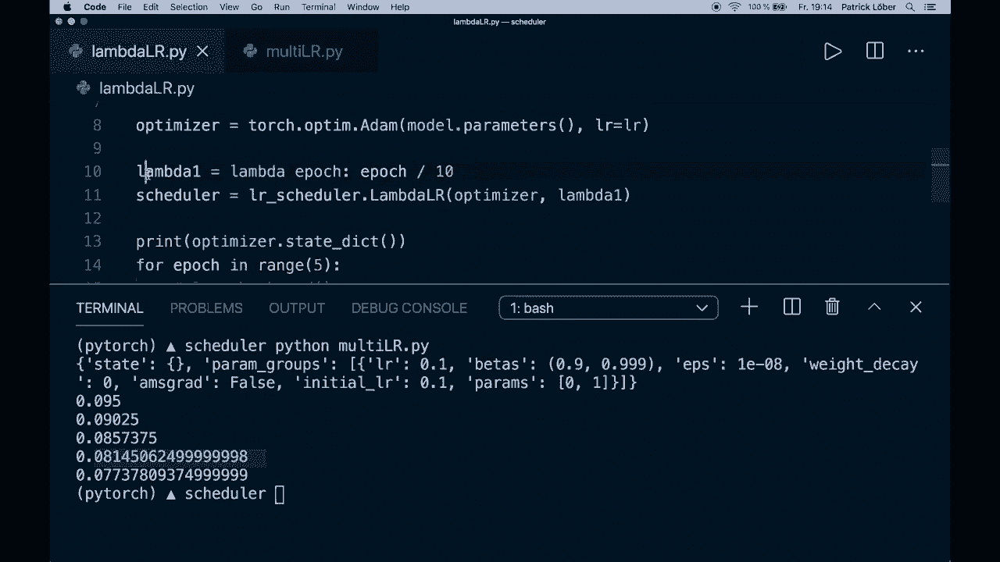
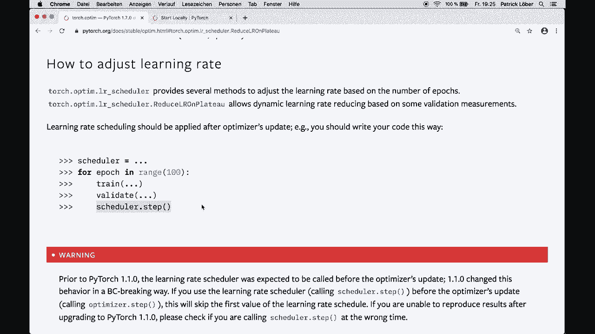

# PyTorch 极简实战教程！P21：L21- 调整学习率以获得更好的结果 📈

在本节课中，我们将要学习如何在PyTorch训练过程中使用学习率调度器来动态调整学习率，这是提升模型训练效果的一项关键技术。



学习率是训练神经网络时最重要的超参数之一。在训练过程中动态调整学习率，而非保持其不变，通常能带来更好的模型性能。PyTorch在其`torch.optim.lr_scheduler`模块中提供了多种实现学习率调度的工具。

上一节我们介绍了优化器的基本概念，本节中我们来看看如何让优化过程更“聪明”。

## 🎼 学习率调度器简介

PyTorch的优化器模块提供了几种基于训练轮数或验证指标来调整学习率的方法。一个关键原则是：**学习率调度应该在优化器更新之后应用**。

典型的代码结构如下：
1.  创建优化器。
2.  创建学习率调度器，并将其与优化器关联。
3.  在训练循环中，完成前向传播、损失计算、反向传播和优化器更新（`optimizer.step()`）后，调用调度器的`step()`方法。

以下是PyTorch官方文档中提供的一个基本代码框架：
```python
# 创建调度器
scheduler = ...
# 训练循环
for epoch in range(100):
    # 训练步骤...
    train(...)
    # 验证步骤...
    val(...)
    # 在优化器更新后调用调度器
    scheduler.step()
```

接下来，我们将逐一介绍几种常用的学习率调度器。



## 📉 LambdaLR：自定义函数调整

`LambdaLR`调度器允许我们使用一个自定义的Lambda函数来设置每个参数组的学习率，新学习率为初始学习率乘以该函数返回的值。该函数可以依赖于当前训练轮数（epoch）。

以下是其工作原理的代码示例：
```python
import torch.optim.lr_scheduler as lr_scheduler

# 假设初始学习率为0.1
initial_lr = 0.1
model = ... # 你的模型
optimizer = torch.optim.SGD(model.parameters(), lr=initial_lr)

# 定义一个lambda函数，学习率随epoch线性增加 (epoch/10)
lambda_func = lambda epoch: epoch / 10
scheduler = lr_scheduler.LambdaLR(optimizer, lambda_func)

for epoch in range(5):
    # ... 训练和验证步骤
    optimizer.step()
    scheduler.step()
    # 打印当前学习率
    current_lr = optimizer.param_groups[0]['lr']
    print(f'Epoch {epoch}: Learning Rate = {current_lr}')
```
运行上述代码，学习率将从0.01（0.1 * 1/10）开始，在每个epoch后递增。



## ✖️ MultiplicativeLR：因子乘法衰减

`MultiplicativeLR`与`LambdaLR`类似，但它是将上一个epoch的学习率乘以一个给定的因子，而不是基于初始学习率计算。



以下是使用固定衰减因子的例子：
```python
# 使用相同的优化器设置
lambda_func = lambda epoch: 0.95 # 每个epoch乘以0.95
scheduler = lr_scheduler.MultiplicativeLR(optimizer, lambda_func)

for epoch in range(5):
    # ... 训练步骤
    optimizer.step()
    scheduler.step()
    print(f'Epoch {epoch}: LR = {optimizer.param_groups[0]["lr"]}')
```
学习率将按0.1 -> 0.095 -> 0.09025 -> ... 的序列衰减。

## 🪜 StepLR：固定步长衰减



`StepLR`是最简单易懂的调度器之一。它每隔固定的步数（step_size个epoch），就将学习率乘以一个衰减因子（gamma）。

其公式可以表示为：
**`lr = initial_lr * gamma ^ (floor(epoch / step_size))`**

以下是具体用法：
```python
# 每30个epoch，学习率乘以0.1
scheduler = lr_scheduler.StepLR(optimizer, step_size=30, gamma=0.1)
```
这意味着在前30个epoch，学习率保持为初始值（例如0.05）；在第31-60个epoch，学习率变为0.005；以此类推。

## 🎯 MultiStepLR：多里程碑衰减

`MultiStepLR`是`StepLR`的灵活变体。它允许我们在指定的多个“里程碑”epoch处衰减学习率，而不是固定的间隔。

以下是其用法：
```python
# 在第30个和第80个epoch时衰减学习率
milestones = [30, 80]
scheduler = lr_scheduler.MultiStepLR(optimizer, milestones=milestones, gamma=0.1)
```

## 📊 ReduceLROnPlateau：基于性能指标调整

与上述基于epoch计数的调度器不同，`ReduceLROnPlateau`是根据验证集上的性能指标（如损失或准确率）是否停止改善来动态调整学习率。当模型性能陷入“平台期”时，降低学习率有助于模型跳出局部最优。

其核心参数包括：
*   `mode`：`‘min’`（监控指标越小越好，如损失）或`‘max’`（监控指标越大越好，如准确率）。
*   `factor`：学习率衰减的乘数因子（例如0.1）。
*   `patience`：容忍性能没有改善的epoch数。只有连续`patience`个epoch指标都未改善，才会触发学习率衰减。

以下是典型用法：
```python
scheduler = lr_scheduler.ReduceLROnPlateau(optimizer, mode='min', factor=0.1, patience=10)

for epoch in range(100):
    # 训练...
    train_loss = ...
    # 验证...
    val_loss = ...
    # 注意：step()方法需要传入被监控的指标值
    scheduler.step(val_loss)
```

## 📝 总结

本节课中我们一起学习了PyTorch中多种学习率调度策略：
1.  **LambdaLR/MultiplicativeLR**：通过自定义函数灵活调整。
2.  **StepLR/MultiStepLR**：在固定的训练阶段进行衰减。
3.  **ReduceLROnPlateau**：根据模型在验证集上的表现动态调整。




在训练神经网络时，选择合适的调度器并调整其参数（如衰减步长、因子、耐心值等）是调优过程中的重要环节。建议从`StepLR`或`ReduceLROnPlateau`开始尝试，它们通常能带来显著的性能提升。记住，只需在优化器更新后调用`scheduler.step()`即可轻松集成到现有训练代码中。