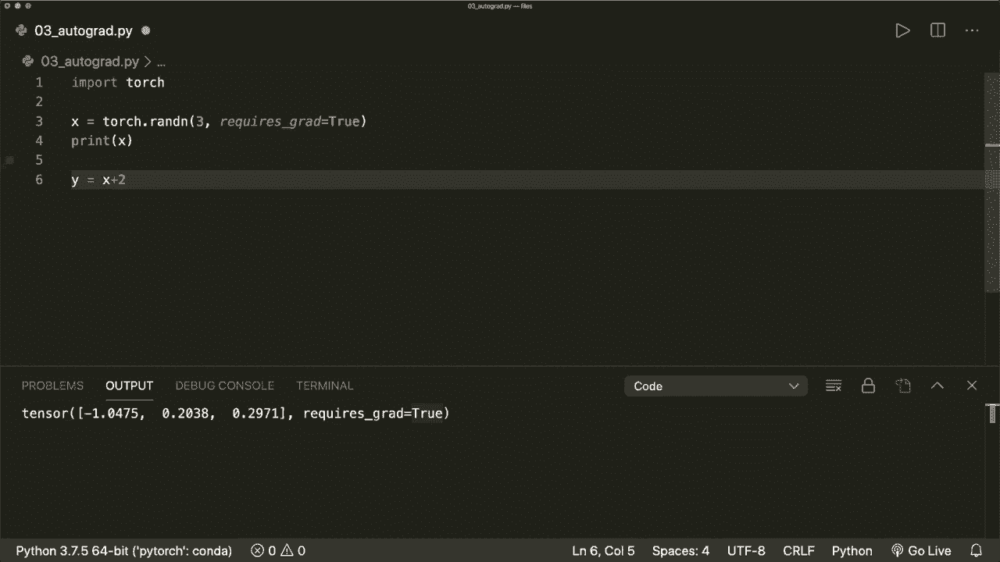
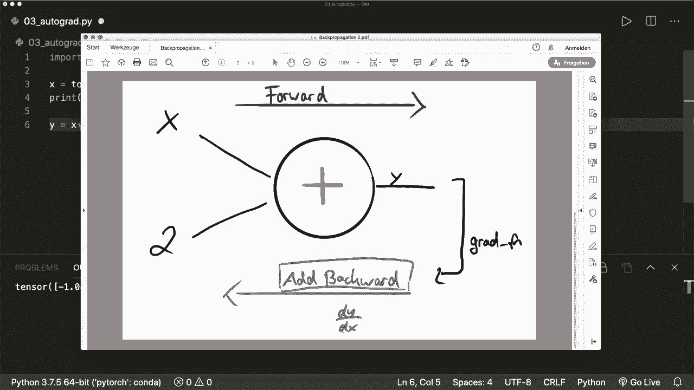
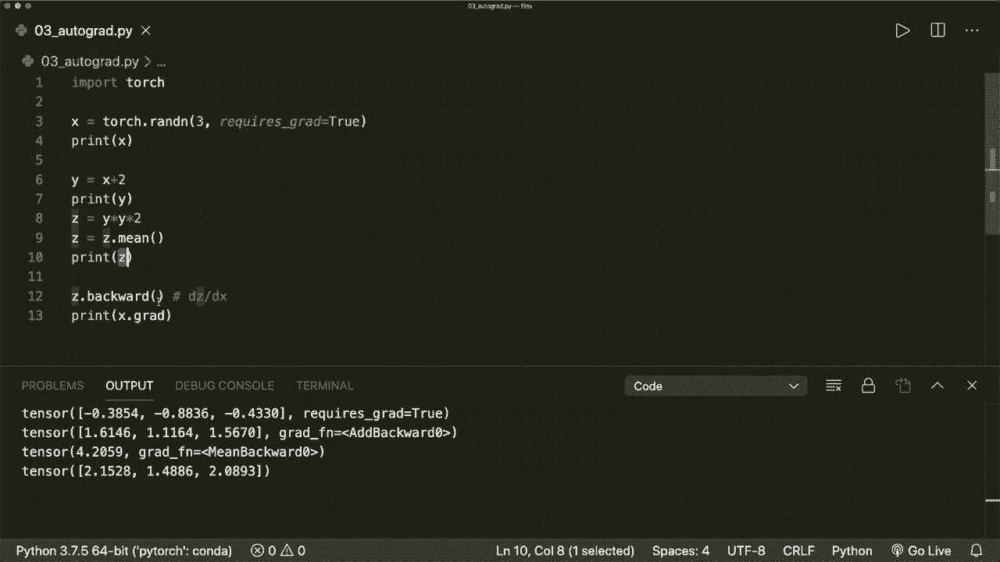
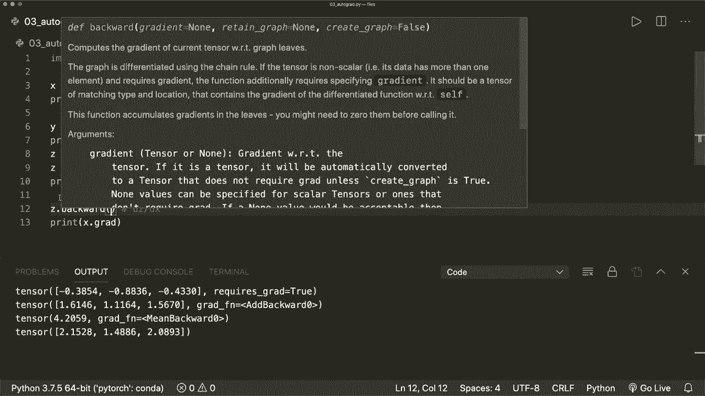
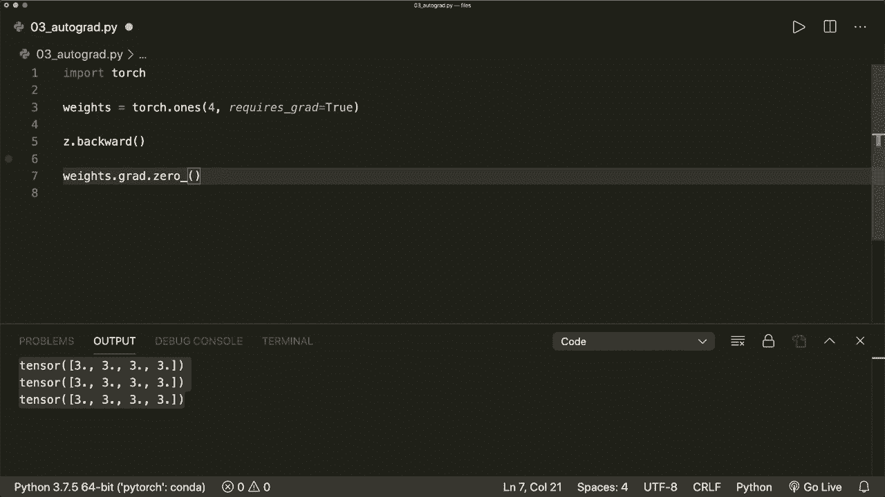

# PyTorch 极简实战教程！P3：L3- 使用 Autograd 计算梯度 🧮

在本节课中，我们将要学习 PyTorch 中的 `autograd` 包，以及如何利用它来自动计算梯度。梯度对于模型的优化至关重要，而 `autograd` 包能够自动执行所有相关的计算，我们只需要掌握其使用方法即可。

## 1. 启用梯度跟踪

首先，我们需要导入 PyTorch 库。然后，创建一个张量并启用梯度跟踪功能。

```python
import torch



# 创建一个张量，并设置 requires_grad=True 以启用梯度跟踪
x = torch.randn(3, requires_grad=True)
print(x)
```

运行上述代码后，你会看到张量 `x` 的属性中包含了 `requires_grad=True`。这意味着 PyTorch 将开始跟踪所有施加在该张量上的操作，并构建一个**计算图**。

## 2. 理解计算图与反向传播

当我们对启用了梯度的张量进行操作时，PyTorch 会自动构建一个计算图。这个图记录了数据（张量）和所有执行的操作（函数）。

```python
# 对张量 x 执行一个操作
y = x + 2
print(y)
```



在这个例子中，操作是加法。计算图会记录：输入是 `x` 和常数 `2`，操作是 `add`，输出是 `y`。输出张量 `y` 会有一个 `.grad_fn` 属性，它指向用于反向传播的梯度函数（例如 `AddBackward`）。

通过这个图和**反向传播**技术，我们可以计算梯度。反向传播的过程会沿着计算图反向进行，应用链式法则来计算每个输入变量的梯度。

## 3. 计算梯度

要计算最终输出相对于初始输入（如 `x`）的梯度，我们只需在最终的标量输出上调用 `.backward()` 方法。

```python
# 进行更多操作
z = y * y * 2
# 通常，为了得到标量输出以方便计算梯度，我们会取均值
z = z.mean()

# 计算梯度
z.backward()

# 梯度现在存储在输入张量 x 的 .grad 属性中
print(x.grad)
```

调用 `z.backward()` 会执行反向传播，计算 `z` 关于 `x` 的梯度，并将结果累加到 `x.grad` 中。

## 4. 非标量输出的梯度计算





上一节我们介绍了标量输出的梯度计算。如果最终输出不是标量（例如一个向量），直接调用 `.backward()` 会报错。此时，我们需要提供一个**梯度参数**。

```python
# 假设 z 是一个向量，而不是标量
z = y * y * 2  # z 的形状是 (3,)

# 创建一个与 z 形状相同的“权重”向量，用于加权求和
v = torch.tensor([0.1, 1.0, 0.001], dtype=torch.float32)

# 计算加权后的梯度
z.backward(v)
print(x.grad)
```

这里的 `v` 可以理解为最终损失对 `z` 中每个元素的梯度。`z.backward(v)` 实际上计算的是向量-雅可比积，这是链式法则在多维情况下的应用。

## 5. 阻止梯度跟踪

在某些情况下（例如模型评估或更新参数时），我们不需要 PyTorch 跟踪操作历史以节省内存和计算资源。以下是三种阻止梯度跟踪的方法：

以下是三种常用方法：

1.  **使用 `.requires_grad_(False)`**：原地修改张量的 `requires_grad` 属性。
    ```python
    x.requires_grad_(False)
    print(x.requires_grad)  # 输出: False
    ```

2.  **使用 `.detach()`**：创建一个与原始张量数据相同但不需要梯度的新张量。
    ```python
    y = x.detach()
    print(y.requires_grad)  # 输出: False
    ```

3.  **使用 `torch.no_grad()` 上下文管理器**：在该代码块中的所有操作都不会被跟踪。
    ```python
    with torch.no_grad():
        y = x + 2
        print(y.grad_fn)  # 输出: None
    ```

## 6. 梯度累加与清零

一个至关重要的细节是：**每次调用 `.backward()`，梯度都会累加到 `.grad` 属性中**，而不是被替换。

```python
weights = torch.ones(4, requires_grad=True)

for epoch in range(3):
    # 模拟模型输出
    model_output = (weights * 3).sum()
    model_output.backward()
    print(f'Epoch {epoch}:', weights.grad)

# 输出显示梯度从 3 累加到 9
```

在训练循环中，每次参数更新前，**必须将梯度清零**，否则梯度会不断累加，导致错误的更新。

```python
# 在每次迭代后清零梯度
weights.grad.zero_()
```

当使用 PyTorch 内置的优化器（如 `torch.optim.SGD`）时，优化器会通过调用 `.zero_grad()` 方法自动完成梯度清零。

```python
optimizer = torch.optim.SGD([weights], lr=0.01)
# ... 计算损失和梯度 ...
optimizer.step()      # 更新参数
optimizer.zero_grad() # 清零梯度，为下一次迭代准备
```

## 总结

本节课中我们一起学习了 PyTorch `autograd` 包的核心机制：

1.  通过设置 `requires_grad=True` 来启用张量的自动梯度计算。
2.  PyTorch 会构建**计算图**来跟踪操作，并通过**反向传播**自动计算梯度。
3.  在标量输出上调用 `.backward()` 来计算梯度。
4.  对于非标量输出，需要提供梯度参数来计算向量-雅可比积。
5.  掌握了三种阻止梯度跟踪的方法：`.requires_grad_(False)`、`.detach()` 和 `torch.no_grad()`。
6.  理解了梯度会**累加**的特性，并学会了在训练中必须使用 `.zero_()` 或优化器的 `.zero_grad()` 来**清零梯度**，这是正确训练模型的关键步骤。



掌握 `autograd` 是有效使用 PyTorch 进行深度学习的基础。在接下来的课程中，我们将把这些知识应用到实际的模型训练中。