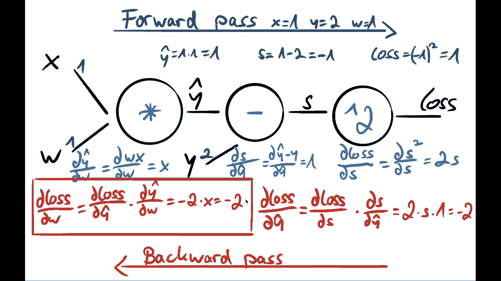
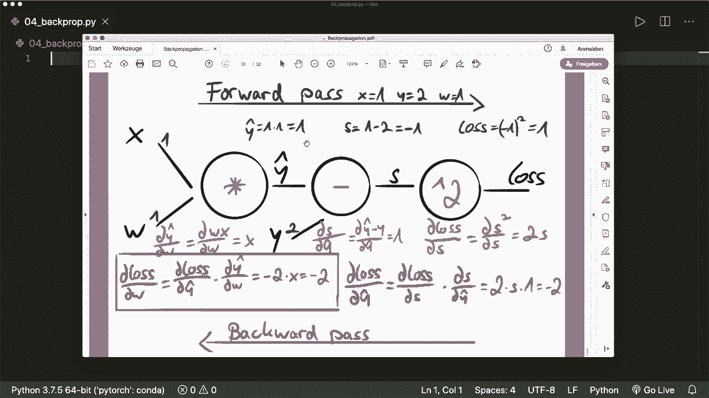
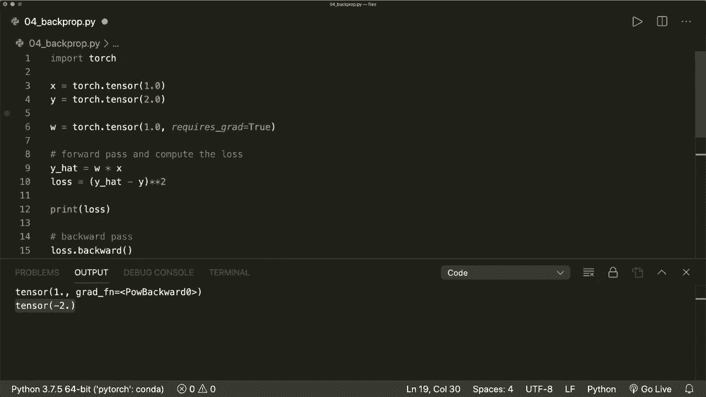

# PyTorch 极简实战教程！P4：L4- 反向传播 - 理论与实例 🔄

在本节课中，我们将要学习神经网络训练的核心算法——反向传播。我们将从链式法则和计算图这两个基础概念讲起，然后通过一个具体的线性回归例子，一步步演示反向传播如何计算梯度。最后，我们将在 PyTorch 中验证这些计算，并展示其简洁的实现方式。

## 1. 核心概念：链式法则与计算图

为了理解反向传播，首先需要掌握链式法则和计算图的概念。

### 链式法则

假设我们有两个连续的函数操作。首先，输入 `X` 经过函数 `A` 得到输出 `Y`。然后，`Y` 作为输入经过函数 `B` 得到最终输出 `C`。

如果我们想要求 `C` 关于初始输入 `X` 的导数，可以使用链式法则。公式如下：

\[
\frac{dC}{dX} = \frac{dC}{dY} \cdot \frac{dY}{dX}
\]

我们首先计算 `C` 关于中间变量 `Y` 的导数，再乘以 `Y` 关于 `X` 的导数，从而得到最终的梯度。

### 计算图

在 PyTorch 中，每一个运算都会被记录并构建成一个计算图。图中的每个节点代表一个运算（函数），节点之间通过边连接数据流。

例如，一个乘法运算 `C = x * y` 会形成一个计算图节点。在这个节点上，我们可以计算所谓的**局部梯度**，即输出关于每个输入的导数。

对于 `C = x * y`：
*   `C` 关于 `x` 的局部梯度是 `y`。
*   `C` 关于 `y` 的局部梯度是 `x`。

局部梯度之所以重要，是因为在复杂的计算图中，我们可以利用链式法则，从最终损失函数开始，反向组合这些局部梯度，从而计算出损失关于网络中任意参数（如权重 `w`）的梯度。

上一节我们介绍了反向传播的理论基础，本节中我们来看看如何将其应用于一个具体实例。

## 2. 实例演练：线性回归中的反向传播

我们以一个简单的线性回归模型为例，演示反向传播的三个步骤：前向传播、计算局部梯度、反向传播。

我们的模型是：`y_hat = w * x`
损失函数（平方误差）为：`loss = (y_hat - y)^2`

**目标**：计算损失 `loss` 关于权重 `w` 的梯度 `d(loss)/d(w)`。

假设我们有一个训练样本：`x = 1`, `y = 2`。
初始化权重：`w = 1`。

以下是反向传播的详细步骤：

### 步骤一：前向传播

我们按顺序计算图中每个节点的值。
1.  计算预测值：`y_hat = w * x = 1 * 1 = 1`
2.  计算误差：`s = y_hat - y = 1 - 2 = -1`
3.  计算损失：`loss = s^2 = (-1)^2 = 1`

### 步骤二：计算局部梯度

我们在每个计算节点计算输出关于输入的导数。
1.  对于 `loss = s^2` 节点：`d(loss)/d(s) = 2 * s = 2 * (-1) = -2`
2.  对于 `s = y_hat - y` 节点：`d(s)/d(y_hat) = 1` （因为 `y` 是常数）
3.  对于 `y_hat = w * x` 节点：`d(y_hat)/d(w) = x = 1`

### 步骤三：反向传播（应用链式法则）

我们从损失函数开始，反向组合局部梯度，计算目标梯度。
1.  计算 `d(loss)/d(y_hat)`：
    \[
    \frac{d(loss)}{d(y\_hat)} = \frac{d(loss)}{d(s)} \cdot \frac{d(s)}{d(y\_hat)} = (-2) \cdot 1 = -2
    \]
2.  计算最终目标 `d(loss)/d(w)`：
    \[
    \frac{d(loss)}{d(w)} = \frac{d(loss)}{d(y\_hat)} \cdot \frac{d(y\_hat)}{d(w)} = (-2) \cdot 1 = -2
    \]

至此，我们通过手动计算得出，损失关于权重 `w` 的梯度为 `-2`。

理解了手动计算过程后，让我们看看在 PyTorch 中实现这一切是多么简单。

## 3. PyTorch 实现

在 PyTorch 中，计算图、局部梯度和反向传播都是自动完成的。我们只需要关注前向传播的定义，然后调用 `.backward()` 方法即可。

以下是完整的代码示例：



```python
import torch



# 1. 定义数据与参数
x = torch.tensor([1.0])
y = torch.tensor([2.0])
w = torch.tensor([1.0], requires_grad=True) # 告诉PyTorch需要追踪w的梯度

# 2. 前向传播
y_hat = w * x
s = y_hat - y
loss = s ** 2

print(f"初始损失: {loss.item()}")

# 3. 反向传播
loss.backward() # PyTorch自动计算所有梯度

# 4. 查看梯度
print(f"损失关于权重w的梯度: {w.grad.item()}") # 输出应为 -2.0
```

运行这段代码，你会看到打印出的梯度值为 `-2.0`，这与我们手动计算的结果完全一致。

在得到梯度之后，通常的下一步是使用优化器（如 `torch.optim.SGD`）来更新权重 `w`，然后重复前向和反向传播过程进行多次迭代，使损失不断减小。

## 总结

本节课中我们一起学习了反向传播算法。
*   我们首先了解了其理论基础：**链式法则**和**计算图**。
*   然后，我们通过一个**线性回归**的实例，一步步演练了反向传播的三大步骤：**前向传播**、**计算局部梯度**和**反向传播**，并手动计算出了梯度值。
*   最后，我们在 **PyTorch** 中验证了该计算，发现仅需定义前向计算并调用 `loss.backward()`，PyTorch 便能自动、高效地完成所有梯度计算。



反向传播是训练神经网络的关键，理解其原理有助于更深入地掌握模型训练过程，而 PyTorch 的自动微分机制则让我们的实现工作变得异常简洁。