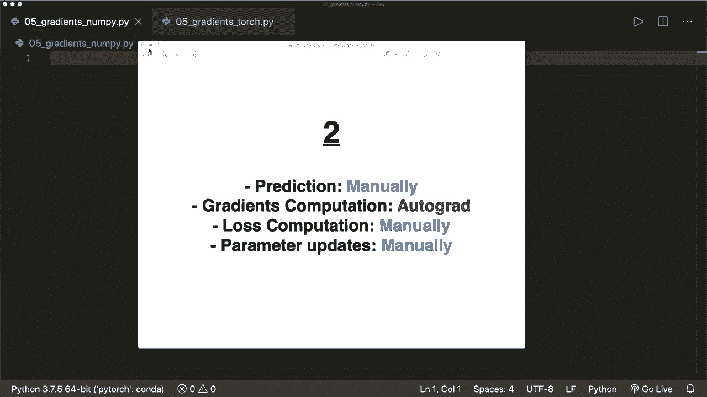
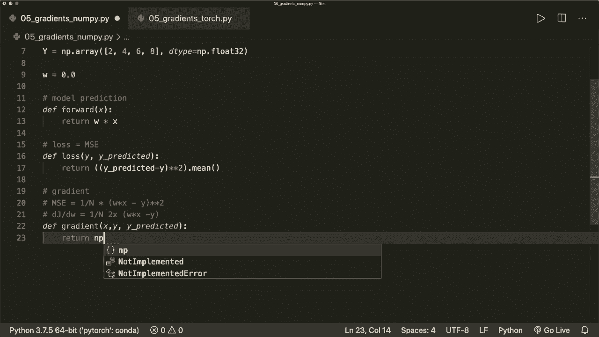
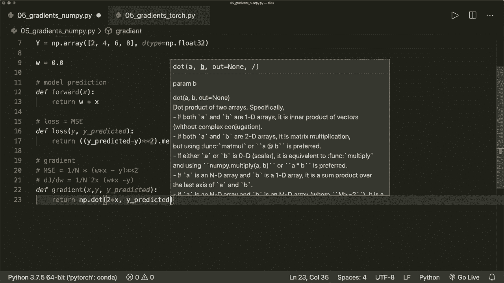
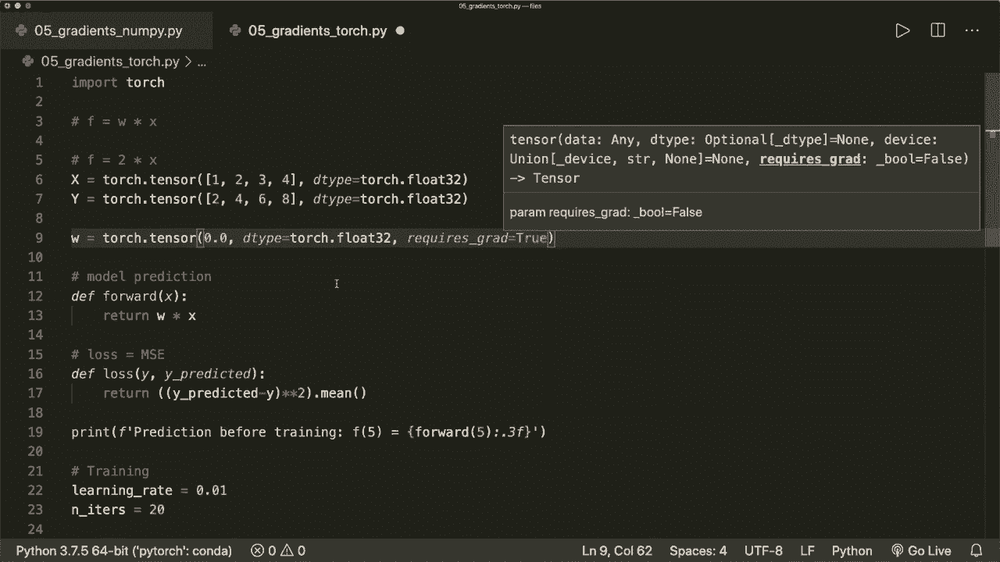

# PyTorch 极简实战教程！P5：L5- 带有 Autograd 和反向传播的梯度下降 🚀

在本节课中，我们将学习如何使用 PyTorch 的 Autograd 包来自动计算梯度，并以此优化模型。我们将通过一个线性回归的例子，从零开始手动实现每个步骤，然后逐步用 PyTorch 的功能替换手动计算的部分，从而理解其底层工作原理。

## 概述 📋

本节课将分为两个主要部分。首先，我们将完全手动实现线性回归模型的前向传播、损失计算、梯度计算以及梯度下降更新。其次，我们将学习如何使用 PyTorch 的 Autograd 机制来自动计算梯度，从而简化我们的代码。通过对比，你将清晰地看到 PyTorch 如何帮助我们自动化繁琐的数学计算。

## 第一步：手动实现线性回归

上一节我们介绍了课程目标，本节中我们来看看如何从零开始手动实现线性回归的各个步骤。我们将使用 NumPy 来完成所有计算。



首先，我们定义问题。假设真实的函数关系是 `y = 2 * x`。我们的目标是让模型学习出权重 `w = 2`。

```python
import numpy as np

# 定义训练数据
x = np.array([1, 2, 3, 4], dtype=np.float32)
y = 2 * x  # 真实关系：y = 2*x

# 初始化模型参数（权重）
w = 0.0
```

接下来，我们定义模型的前向传播函数，它根据输入 `x` 和当前权重 `w` 计算预测值。

```python
def forward(x):
    """前向传播：计算预测值 y_pred = w * x"""
    return w * x
```

然后，我们定义损失函数。对于线性回归，我们使用均方误差（MSE）作为损失。

```python
def loss(y_pred, y):
    """计算均方误差损失"""
    return ((y_pred - y) ** 2).mean()
```

现在，我们需要手动计算损失函数关于权重 `w` 的梯度。均方误差的梯度公式为：
`dL/dw = (2/n) * Σ x * (w*x - y)`

以下是该公式的实现：



```python
def gradient(x, y, y_pred):
    """手动计算损失关于权重 w 的梯度"""
    return (2 * np.dot(x, (y_pred - y))) / x.size
```



有了梯度，我们就可以使用梯度下降算法来更新权重。更新公式为：
`w = w - learning_rate * dL/dw`

以下是完整的训练循环：

```python
# 设置训练参数
learning_rate = 0.01
n_iters = 100

print(f'训练前预测 f(5) = {forward(5):.3f}')

for epoch in range(n_iters):
    # 1. 前向传播
    y_pred = forward(x)
    
    # 2. 计算损失
    l = loss(y_pred, y)
    
    # 3. 手动计算梯度
    dw = gradient(x, y, y_pred)
    
    # 4. 更新权重（梯度下降）
    w -= learning_rate * dw
    
    # 每隔10个epoch打印一次进度
    if epoch % 10 == 0:
        print(f'epoch {epoch+1}: w = {w:.3f}, loss = {l:.8f}')

print(f'训练后预测 f(5) = {forward(5):.3f}')
```

运行上述代码，你会看到权重 `w` 逐渐接近 2，损失逐渐减小，对输入 5 的预测也逐渐接近 10。这验证了我们手动实现是正确的。

## 第二步：使用 PyTorch Autograd 自动计算梯度

在上一节，我们手动实现了梯度计算。本节中我们来看看如何利用 PyTorch 的 Autograd 功能来自动完成这一过程，从而避免手动推导和实现梯度公式。

首先，我们将数据从 NumPy 数组转换为 PyTorch 张量（Tensor），并指定权重 `w` 需要梯度计算。

```python
import torch

# 定义训练数据（转换为 PyTorch 张量）
x = torch.tensor([1, 2, 3, 4], dtype=torch.float32)
y = 2 * x  # 真实关系：y = 2*x

# 初始化模型参数（权重），并设置 requires_grad=True 以跟踪梯度
w = torch.tensor(0.0, dtype=torch.float32, requires_grad=True)
```

前向传播和损失函数的定义与手动实现时几乎相同，因为 PyTorch 张量支持类似 NumPy 的运算。

```python
def forward(x):
    """前向传播：计算预测值 y_pred = w * x"""
    return w * x

def loss(y_pred, y):
    """计算均方误差损失"""
    return ((y_pred - y) ** 2).mean()
```

训练循环的核心变化在于梯度计算和权重更新部分。我们不再需要手动计算 `gradient` 函数。

以下是使用 Autograd 的训练循环：



```python
# 设置训练参数
learning_rate = 0.01
n_iters = 100

print(f'训练前预测 f(5) = {forward(5).item():.3f}')

for epoch in range(n_iters):
    # 1. 前向传播
    y_pred = forward(x)
    
    # 2. 计算损失
    l = loss(y_pred, y)
    
    # 3. 反向传播，自动计算梯度
    l.backward()  # dl/dw 会自动计算并存储在 w.grad 中
    
    # 4. 更新权重（梯度下降）
    # 注意：为防止此操作被记录在计算图中，需使用 torch.no_grad()
    # 同时，在更新前需要将梯度清零，否则梯度会累积
    with torch.no_grad():
        w -= learning_rate * w.grad
        w.grad.zero_()  # 手动将梯度重置为零
    
    # 每隔10个epoch打印一次进度
    if epoch % 10 == 0:
        print(f'epoch {epoch+1}: w = {w.item():.3f}, loss = {l.item():.8f}')

print(f'训练后预测 f(5) = {forward(5).item():.3f}')
```

关键点说明：
*   `l.backward()`：自动计算损失 `l` 对所有具有 `requires_grad=True` 的张量（此处是 `w`）的梯度，结果存储在 `w.grad` 中。
*   `with torch.no_grad():`：在这个上下文管理器中的操作不会被 Autograd 引擎跟踪，这对于参数更新等操作是必要的。
*   `w.grad.zero_()`：在每次反向传播后，必须将梯度显式清零。因为 PyTorch 会累积梯度，如果不清零，下一次 `.backward()` 计算的梯度会与当前的相加。

运行这段代码，你会得到与手动计算相似的结果，但代码更加简洁和安全，因为我们无需关心具体的梯度公式。

## 总结 🎯

本节课中我们一起学习了梯度下降在 PyTorch 中的两种实现方式。

首先，我们从零开始手动实现了线性回归的**前向传播**、**损失计算**、**梯度推导与计算**以及**参数更新**。这一步帮助我们牢固理解了梯度下降算法的每一个数学细节。

接着，我们引入了 PyTorch 的核心特性——**Autograd（自动求导）**。通过将数据转换为张量并设置 `requires_grad=True`，我们利用 `backward()` 方法自动完成了梯度计算。这极大地简化了代码，并减少了因手动推导公式而出错的风险。我们还学习了在更新参数时需要使用 `torch.no_grad()` 上下文管理器以及必须**手动清零梯度**（`zero_()`）的重要实践。

通过本课，你掌握了从手动实现到利用框架自动化的关键过渡，为后续使用 PyTorch 更高级的模块（如 `nn.Module` 和 `torch.optim`）打下了坚实基础。在下一课中，我们将继续用 PyTorch 内置的损失函数和优化器来进一步简化我们的训练流程。