# PyTorch 极简实战教程！P6：L6- 训练管道：模型、损失和优化器 🚂

在本节课中，我们将学习如何使用 PyTorch 构建一个完整的训练管道。我们将重点介绍如何利用 PyTorch 内置的模块来替换之前手动实现的模型、损失函数和优化器，从而简化代码并提高效率。

---

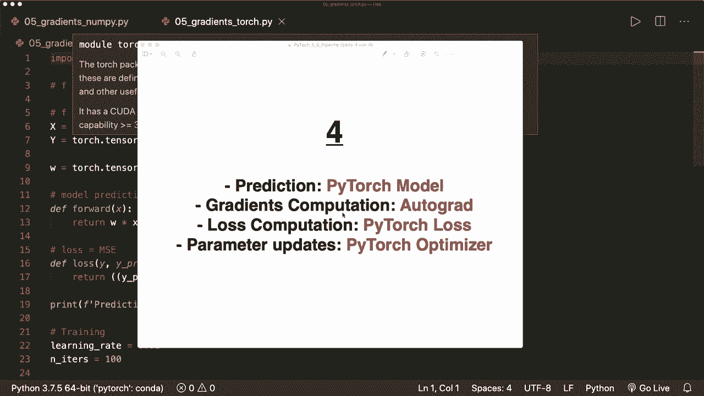

## 概述 📋

在之前的教程中，我们手动实现了逻辑回归模型、损失计算和梯度更新。本节课，我们将把这三个核心组件替换为 PyTorch 提供的标准类：`nn.Module`（模型）、`nn.MSELoss`（损失）和 `torch.optim.SGD`（优化器）。这将帮助我们理解 PyTorch 训练管道的一般结构。

---

## 1. PyTorch 训练管道的一般结构

上一节我们介绍了手动计算梯度的过程，本节中我们来看看 PyTorch 如何将整个训练流程标准化。通常，PyTorch 的训练管道包含三个主要步骤：

1.  **设计模型**：定义模型的输入/输出尺寸以及前向传播过程。
2.  **构建损失函数和优化器**：选择合适的损失函数和优化算法。
3.  **执行训练循环**：迭代数据，进行前向传播、计算损失、反向传播和参数更新。

以下是训练循环的基本伪代码结构：
```python
for epoch in range(num_epochs):
    # 前向传播：计算预测值
    y_pred = model(X)
    # 计算损失
    loss = loss_fn(y_pred, y)
    # 反向传播：计算梯度
    loss.backward()
    # 更新参数
    optimizer.step()
    # 清空梯度
    optimizer.zero_grad()
```
接下来，我们将具体实现这些步骤。

---

## 2. 步骤三：使用 PyTorch 的损失和优化器

首先，我们需要导入必要的模块。

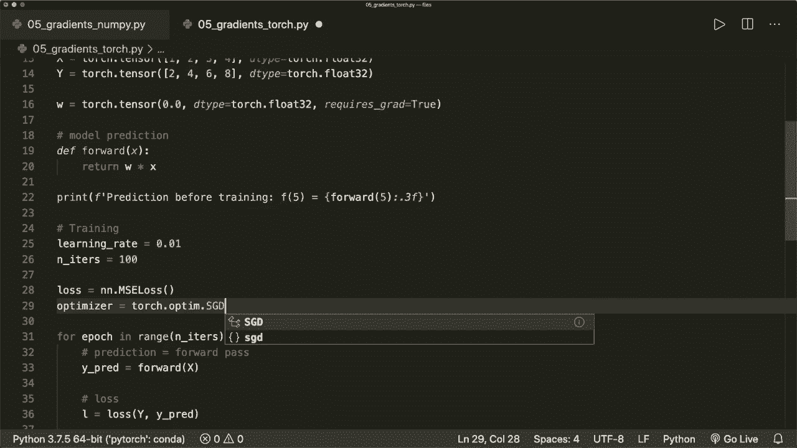

```python
import torch
import torch.nn as nn
```

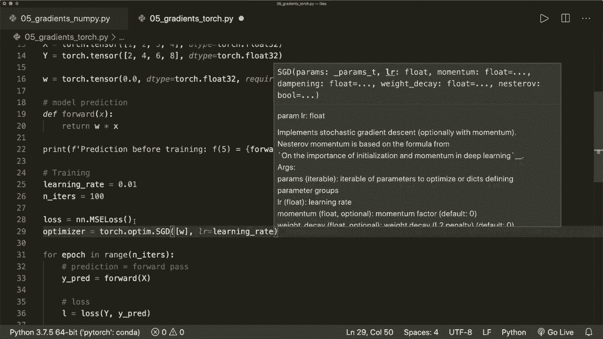

我们将不再手动定义损失函数，而是使用 PyTorch 提供的 `MSELoss`（均方误差损失）。同时，我们使用 `SGD`（随机梯度下降）作为优化器。

以下是定义损失和优化器的代码：

```python
# 定义损失函数
loss_fn = nn.MSELoss()

# 定义优化器，需要传入待优化的参数（如权重W）和学习率
optimizer = torch.optim.SGD([W], lr=learning_rate)
```

在训练循环中，计算损失和更新权重的步骤变得非常简单：

```python
# 计算损失
loss = loss_fn(y_pred, y)

# 反向传播，计算梯度
loss.backward()

# 使用优化器更新参数
optimizer.step()

# 清空梯度，为下一次迭代做准备
optimizer.zero_grad()
```

通过以上代码，我们完成了用 PyTorch 内置类替换手动计算损失和参数更新的过程。

---

## 3. 步骤四：使用 PyTorch 模型

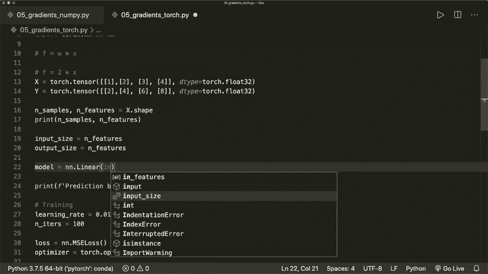

上一节我们替换了损失和优化器，本节中我们来看看如何用 PyTorch 模型替换手动实现的前向传播。

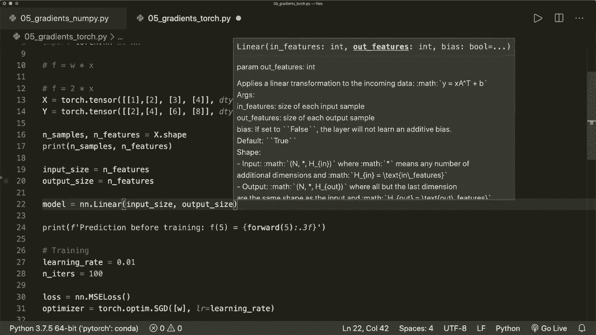

首先，我们需要调整数据的形状以适应 PyTorch 的线性层。线性层期望输入是二维张量，形状为 `[样本数量, 特征数量]`。

```python
# 假设原始数据
X = torch.tensor([1, 2, 3, 4], dtype=torch.float32).view(-1, 1)
y = torch.tensor([2, 4, 6, 8], dtype=torch.float32).view(-1, 1)

# 获取形状
n_samples, n_features = X.shape
print(f"样本数量: {n_samples}, 特征数量: {n_features}")
```

现在，我们可以使用 PyTorch 的 `nn.Linear` 来定义模型：

```python
# 定义模型
model = nn.Linear(in_features=n_features, out_features=1)
```

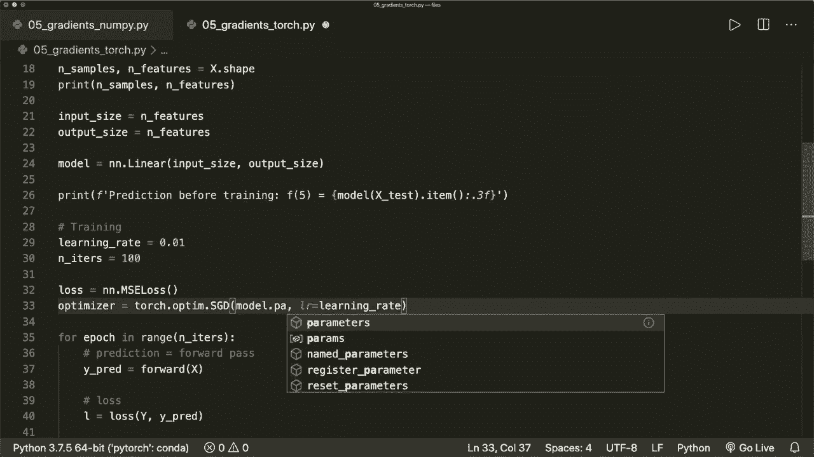

在训练循环中，获取预测值的方式也发生了变化：

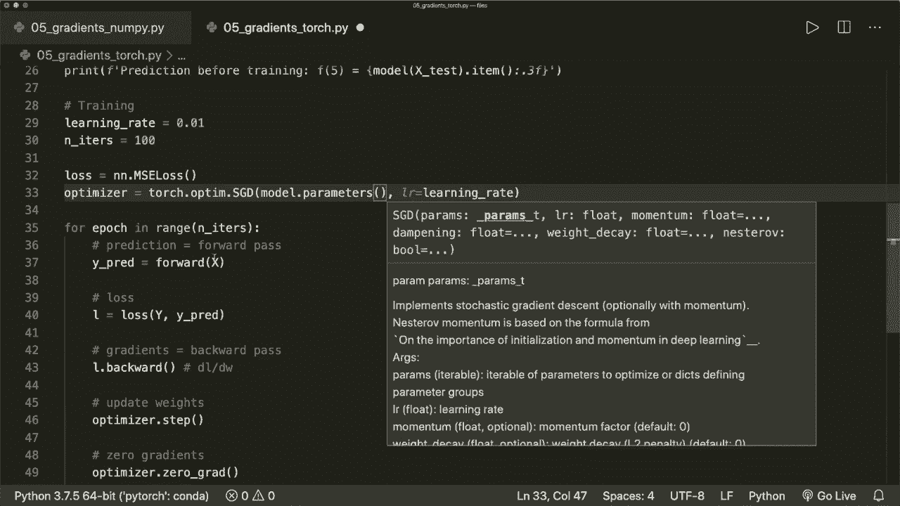

```python
# 前向传播，获取预测
y_pred = model(X)
```

同时，优化器需要接收模型的参数：

```python
# 优化器现在优化模型的所有参数
optimizer = torch.optim.SGD(model.parameters(), lr=learning_rate)
```

训练完成后，我们可以进行预测并查看学习到的参数：

```python
# 测试预测
X_test = torch.tensor([5], dtype=torch.float32)
y_test_pred = model(X_test).item()
print(f"输入为5时的预测值: {y_test_pred}")

# 查看学习到的权重和偏置
for name, param in model.named_parameters():
    print(f"{name}: {param.data}")
```

---

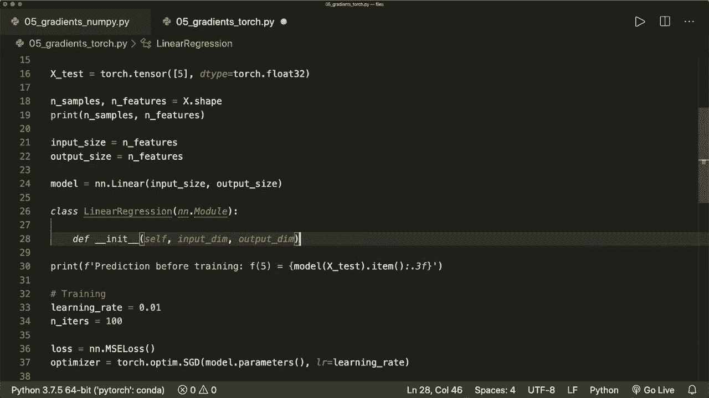

## 4. 构建自定义模型

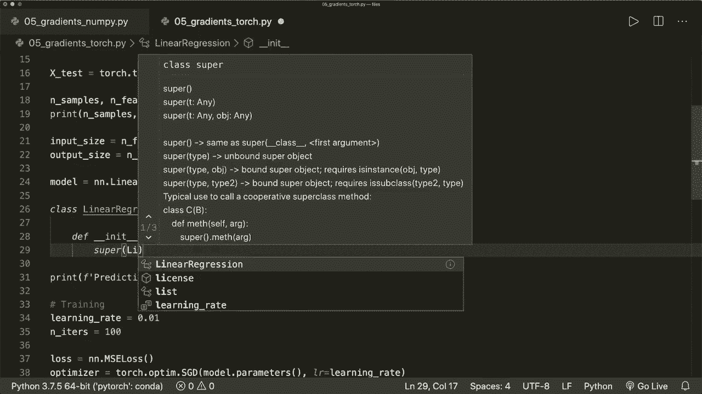

虽然 `nn.Linear` 适用于简单线性回归，但理解如何构建自定义模型至关重要。自定义模型需要继承 `nn.Module` 类并实现 `__init__` 和 `forward` 方法。

以下是自定义线性回归模型的示例：

```python
class LinearRegression(nn.Module):
    def __init__(self, input_dim, output_dim):
        super(LinearRegression, self).__init__()
        # 定义层
        self.linear = nn.Linear(input_dim, output_dim)

    def forward(self, x):
        # 定义前向传播
        return self.linear(x)

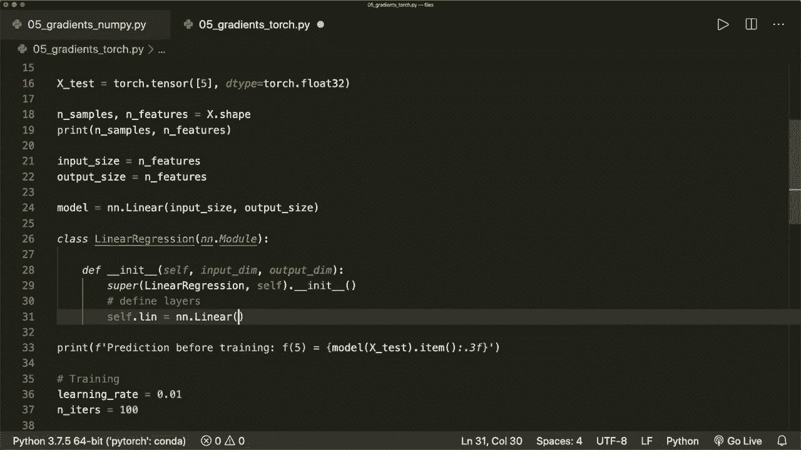

# 实例化模型
model = LinearRegression(input_dim=n_features, output_dim=1)
```

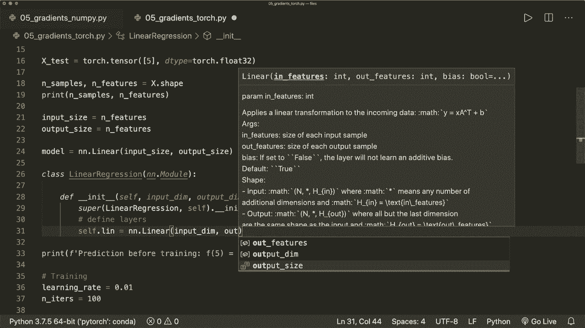

这个自定义类的作用与直接使用 `nn.Linear` 完全相同，但它展示了构建更复杂模型的基本框架。

---

## 总结 🎯

本节课中我们一起学习了如何构建一个完整的 PyTorch 训练管道。我们主要完成了以下工作：

1.  理解了 PyTorch 训练管道的三个标准步骤：设计模型、构建损失与优化器、执行训练循环。
2.  使用 `nn.MSELoss` 和 `torch.optim.SGD` 替换了手动的损失计算和参数更新。
3.  使用 `nn.Linear` 模块替换了手动实现的前向传播，并调整了数据形状以匹配模型输入。
4.  学习了如何通过继承 `nn.Module` 类来构建自定义模型。

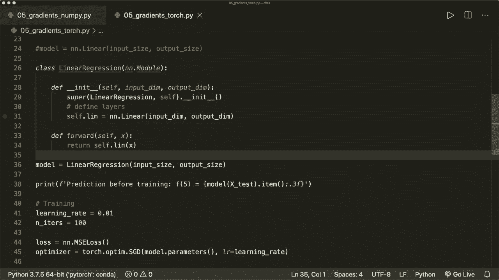

现在，PyTorch 可以为我们处理大部分底层计算。我们只需要专注于模型结构的设计以及损失函数和优化器的选择。在后续课程中，我们将把这些概念应用到更复杂的模型和数据集上。