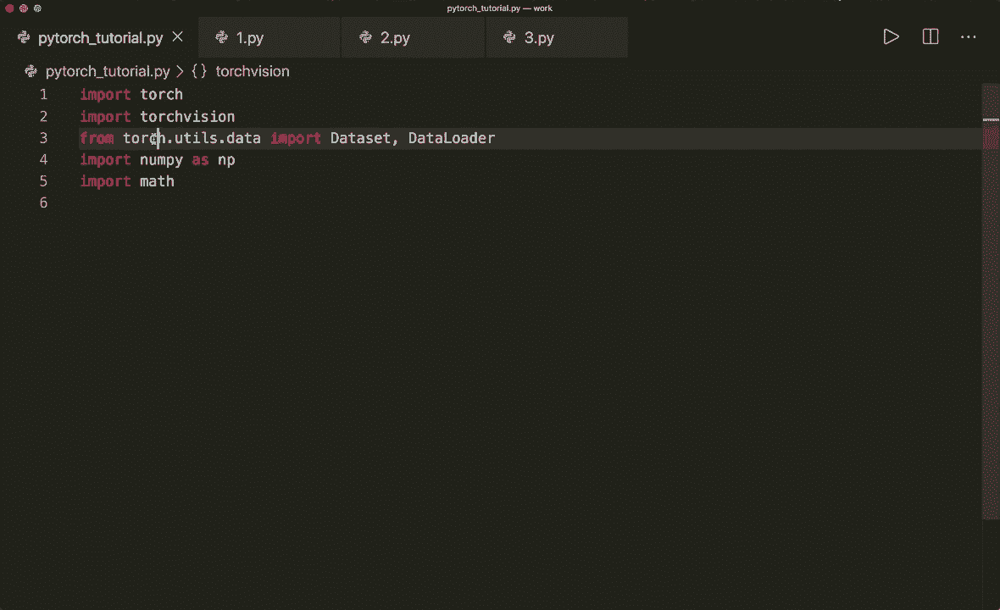
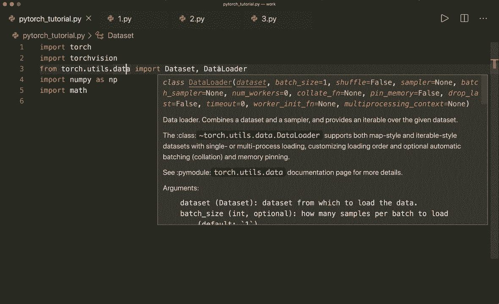
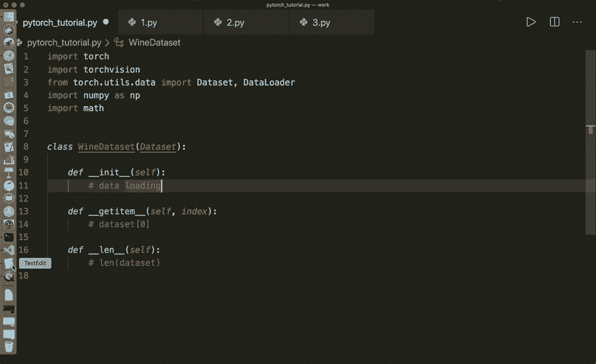
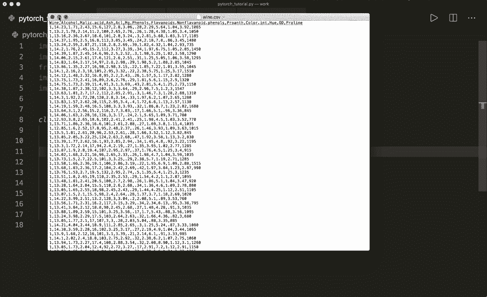
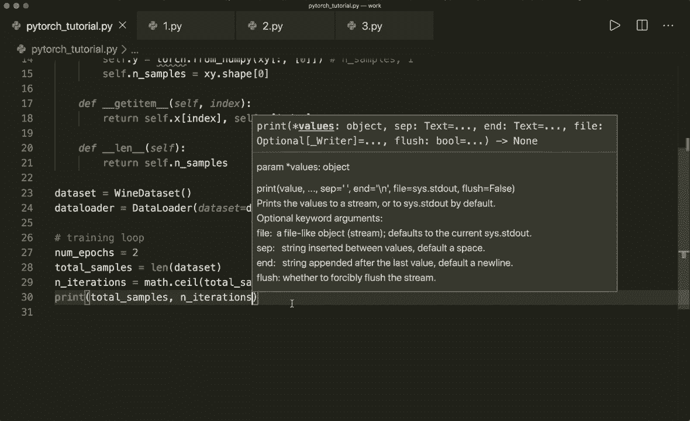
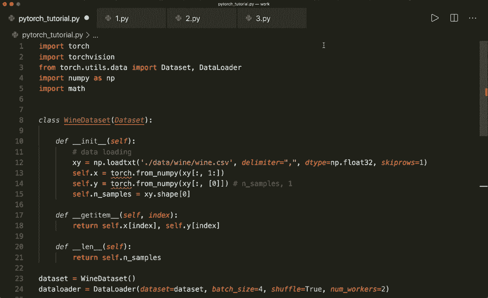

# PyTorch 极简实战教程！P9：L9- 数据集和数据加载器 - 批量训练 📚

在本节课中，我们将要学习 PyTorch 中两个非常重要的类：`Dataset` 和 `DataLoader`。它们能帮助我们高效地组织数据并进行批量训练，这对于处理大型数据集至关重要。

---

## 为什么需要批量训练？🤔

到目前为止，我们的训练代码通常是这样的：加载整个数据集，然后在每个训练周期（epoch）中，基于所有数据计算梯度并优化模型。

然而，如果数据集非常大，每次都在全部数据上计算梯度会非常耗时。一个更好的方法是将数据样本划分为多个小批量（mini-batch）。这样，训练循环会先遍历所有周期，然后在每个周期内再遍历所有的小批量。我们仅基于当前的小批量数据来计算梯度和优化模型。

使用 PyTorch 内置的 `Dataset` 和 `DataLoader` 类，PyTorch 可以自动为我们处理批量的划分和迭代，使得批量训练变得非常简单。

---

## 核心概念与术语 📖





在深入代码之前，让我们明确几个关于批量训练的核心术语。

*   **周期（Epoch）**：对整个训练数据集进行一次完整的前向传播和反向传播。
*   **批量大小（Batch Size）**：单次前向/反向传播中使用的训练样本数量。
*   **迭代次数（Iterations）**：完成一个周期所需的传递次数，即使用批量大小样本的次数。

我们可以用一个公式来描述它们的关系：
**迭代次数 = 总样本数 / 批量大小**

例如，如果我们有 100 个样本，批量大小设为 20，那么一个周期内就有 5 次迭代（100 / 20 = 5）。



---

## 实现自定义数据集 🛠️



上一节我们介绍了批量训练的概念，本节中我们来看看如何创建自己的数据集。PyTorch 通过 `torch.utils.data.Dataset` 类提供了构建数据集的框架。

要创建自定义数据集，我们需要继承 `Dataset` 类并实现三个核心方法：
1.  `__init__`: 初始化方法，用于加载数据等准备工作。
2.  `__getitem__`: 根据索引获取单个数据样本。
3.  `__len__`: 返回数据集的总样本数。

以下是一个加载葡萄酒数据集的示例。该数据集是一个 CSV 文件，第一列是类别标签（1, 2, 3），其余列是特征。

```python
import torch
from torch.utils.data import Dataset, DataLoader
import numpy as np

class WineDataset(Dataset):
    def __init__(self):
        # 加载数据
        xy = np.loadtxt('./data/wine/wine.csv', delimiter=',', dtype=np.float32, skiprows=1)
        # 分割特征和标签
        self.x = torch.from_numpy(xy[:, 1:])  # 所有行，第1列到最后
        self.y = torch.from_numpy(xy[:, [0]]) # 所有行，第0列，保持二维
        self.n_samples = xy.shape[0]

    def __getitem__(self, index):
        # 支持 dataset[index] 的索引操作
        return self.x[index], self.y[index]

    def __len__(self):
        # 返回数据集大小
        return self.n_samples
```

创建数据集实例并检查第一个样本：

```python
dataset = WineDataset()
first_data = dataset[0]
features, label = first_data
print(features, label) # 输出特征张量和标签
```

---

## 使用 DataLoader 进行批量加载 🔄

我们已经创建了数据集，接下来看看如何使用 `DataLoader` 来方便地生成批量数据。`DataLoader` 接收一个 `Dataset` 对象，并可以指定批量大小、是否打乱数据等参数。

以下是创建 `DataLoader` 的方法：

```python
# 创建 DataLoader
data_loader = DataLoader(dataset=dataset,
                          batch_size=4,
                          shuffle=True,
                          num_workers=2)
```

参数说明：
*   `batch_size=4`: 每个批次包含4个样本。
*   `shuffle=True`: 每个周期开始时打乱数据顺序，这对训练很重要。
*   `num_workers=2`: 使用2个子进程来加速数据加载（可选）。

现在，我们可以将 `DataLoader` 转换为迭代器，并获取一个批次的数据：

```python
# 获取一个批次
data_iter = iter(data_loader)
data = data_iter.next()
features, labels = data
print(features.shape, labels.shape) # 应输出 torch.Size([4, 13]) torch.Size([4, 1])
```

---

## 在训练循环中使用 DataLoader 🏃‍♂️

最常用的方式是在训练循环中直接遍历 `DataLoader`。它会自动在每个周期内为我们生成指定大小的批量数据。

以下是一个结合了 `DataLoader` 的虚拟训练循环示例：

```python
import math

# 超参数
num_epochs = 2
batch_size = 4
total_samples = len(dataset)
n_iterations = math.ceil(total_samples / batch_size)

print(f'总样本数: {total_samples}, 迭代次数/周期: {n_iterations}')



for epoch in range(num_epochs):
    for i, (inputs, labels) in enumerate(data_loader):
        # 这里应进行：前向传播、计算损失、反向传播、更新参数
        # 本例中仅打印信息
        if (i+1) % 5 == 0:
            print(f'Epoch [{epoch+1}/{num_epochs}], Step [{i+1}/{n_iterations}], Inputs Shape {inputs.shape}')
```

运行这段代码，你会看到程序按批次处理数据，并定期打印出进度和当前批次的形状。

---

## PyTorch 内置数据集 📦

除了创建自定义数据集，PyTorch（特别是 `torchvision` 库）还提供了许多常用的内置数据集，例如 MNIST、Fashion-MNIST、CIFAR-10/100 等。这可以极大方便我们的学习和实验。

```python
# 示例：加载 MNIST 数据集
from torchvision import datasets
train_dataset = datasets.MNIST(root='./data', train=True, download=True)
```

---

## 总结 📝

本节课中我们一起学习了 PyTorch 数据处理的核心组件：
1.  **`Dataset` 类**：提供了构建数据集的蓝图，我们需要实现 `__init__`, `__getitem__`, `__len__` 三个方法。
2.  **`DataLoader` 类**：接收一个 `Dataset` 对象，能够自动进行批量划分、数据打乱和多进程加载，极大简化了训练循环中的数据供给。
3.  **批量训练流程**：我们了解了周期、批量大小和迭代次数的概念，并掌握了如何在训练循环中集成 `DataLoader` 来实现高效的批量训练。



掌握 `Dataset` 和 `DataLoader` 是使用 PyTorch 进行任何机器学习项目的基础。在接下来的教程中，我们将使用这些工具来训练真正的模型。