# Python 3全系列基础教程，P1：Python介绍与设置 🐍

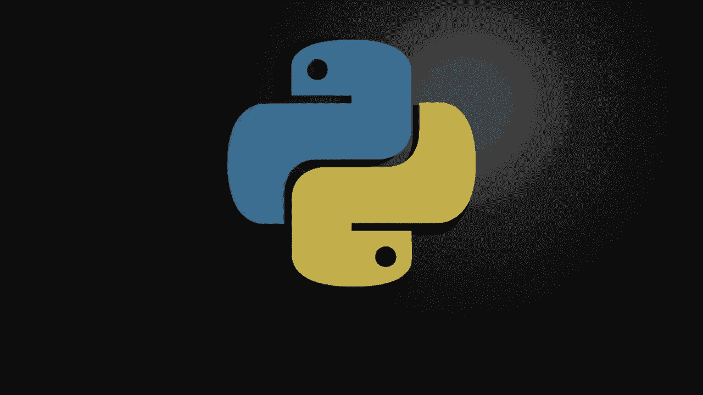

在本节课中，我们将要学习Python 3的基础入门知识，包括如何检查Python是否已安装、如何安装Python 3、如何测试安装是否成功，以及如何设置一个简单的集成开发环境来编写和运行你的第一个Python程序。

---

## 检查Python是否已安装

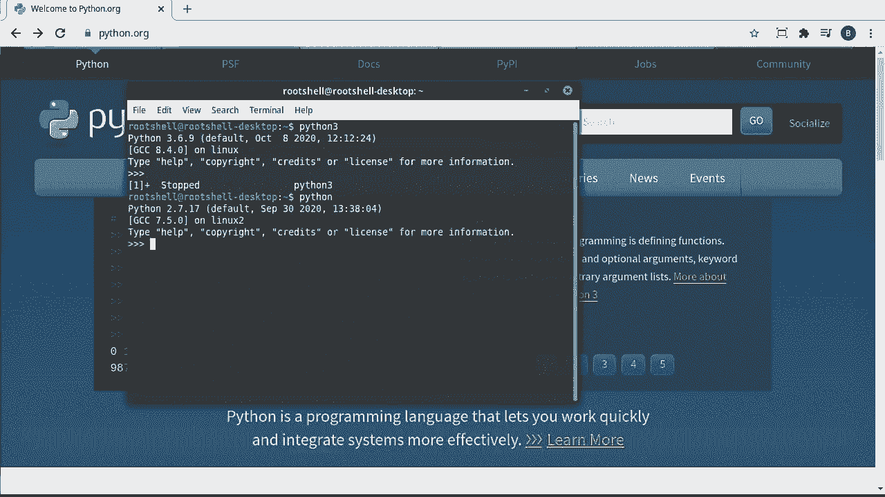

第一步是检查你的计算机上是否已经安装了Python。你可以使用操作系统的官方文档来确认，但一个更快捷的方法是使用命令行工具。

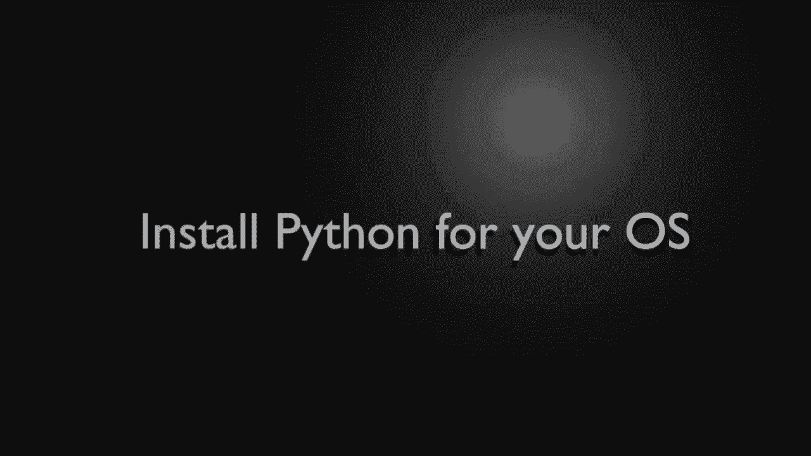

以下是检查步骤：
1.  打开命令行工具。
2.  输入命令 `python3` 并按下回车键。

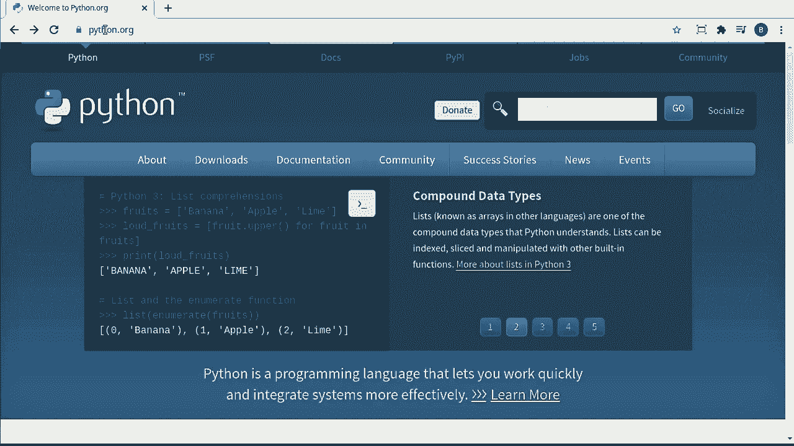

如果你看到类似 `Python 3.x.x` 的版本信息，说明Python 3已经安装成功，可以跳过安装步骤。如果看到“命令未找到”或“未知命令”的提示，则需要进行安装。

**注意**：许多教程会建议输入 `python` 命令，但这通常指向Python 2版本。本系列教程将使用Python 3。

---

## 安装Python 3

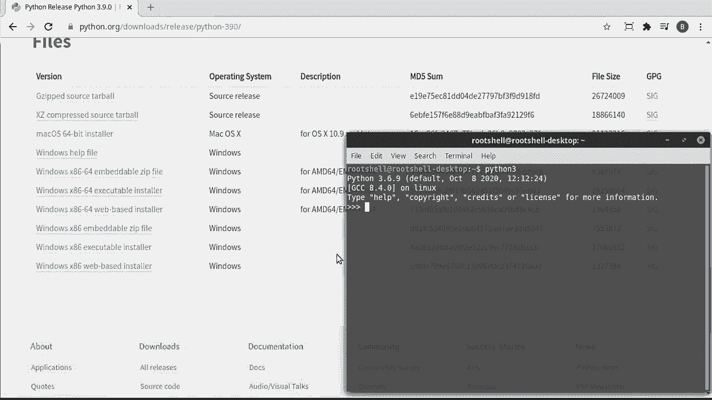

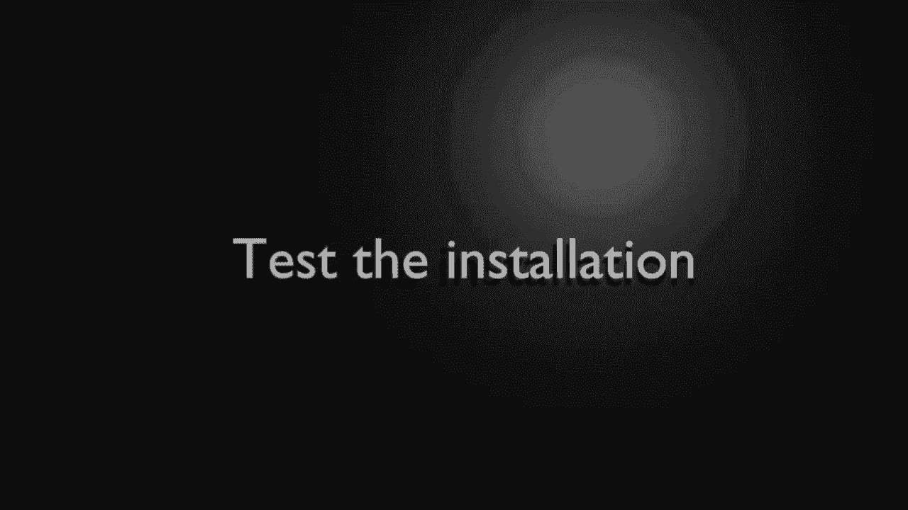

如果你在命令行中输入 `python3` 后提示命令未找到，则需要安装Python 3。

安装步骤如下：
1.  访问Python官方网站 [python.org](https://www.python.org)。
2.  进入“Downloads”下载页面。
3.  网站通常会尝试自动检测你的操作系统。你也可以手动选择你的操作系统（例如Windows、macOS）。
4.  选择最新的Python 3版本进行下载（注意区分Python 3和Python 2）。
5.  对于Windows用户，建议下载“Windows x86-64 executable installer”这个离线安装程序。
6.  运行下载的安装程序，按照提示完成安装。安装过程中可能需要管理员权限，安装完成后可能需要重启计算机。
7.  安装完成后，请重新打开命令行，再次输入 `python3` 命令以验证安装是否成功。

如果在此过程中遇到问题，建议根据具体的错误信息搜索解决方案。

---

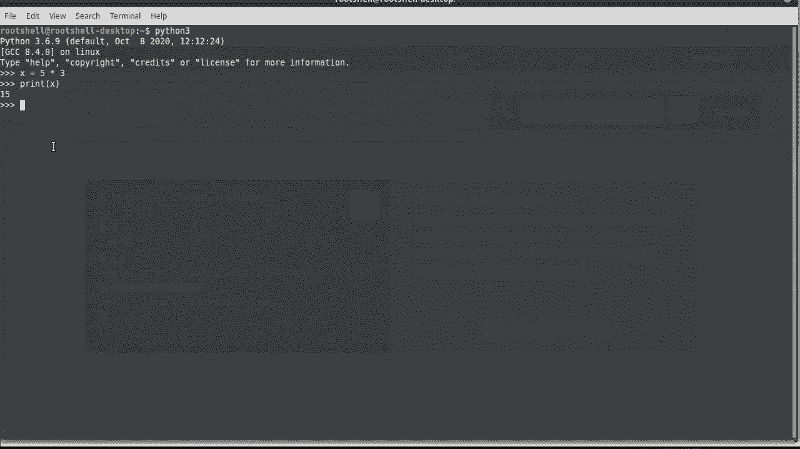

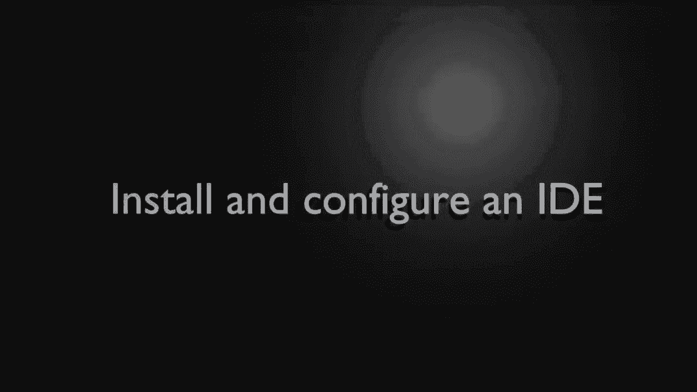

## 测试Python安装

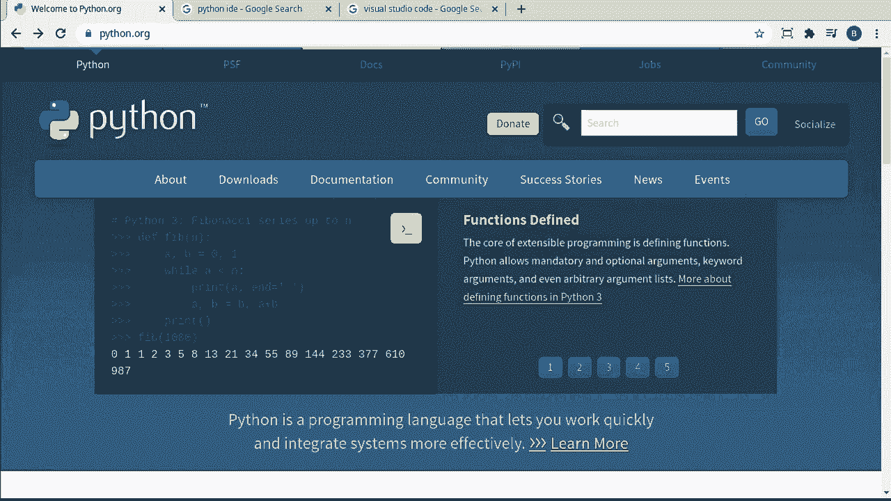

Python安装和配置完成后，我们需要测试它是否能正常工作。

首先，在命令行中输入 `python3` 进入Python的交互式Shell（或称为交互模式）。在这个环境中，我们可以直接输入Python代码并立即看到结果。

例如，我们可以输入以下代码进行测试：
```python
x = 5 * 3
print(x)
```
执行后，屏幕上应该会显示数字 `15`。

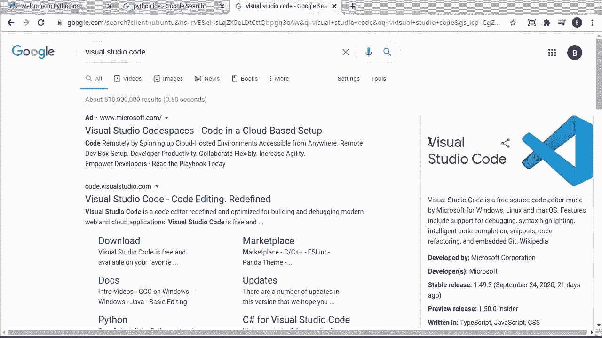

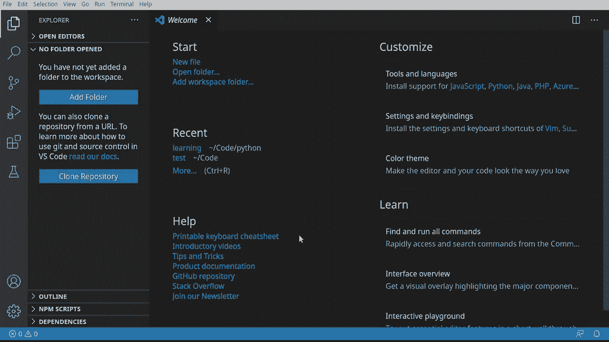

**说明**：虽然输入 `python3` 查看版本信息是有效的测试，但运行简单代码可以更直观地确认功能。不过，交互式模式不适合编写复杂的程序，因为难以修改已输入的代码。因此，我们将主要使用集成开发环境。

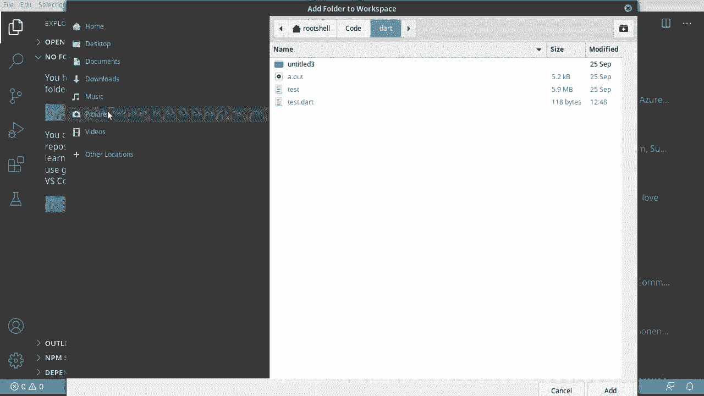

---

## 设置集成开发环境

集成开发环境是一个功能强大的文本编辑器，它提供了代码高亮、自动补全、调试等便利功能，能极大地提升编程效率。

市面上有很多Python IDE可供选择，例如：
*   **IDLE**：曾经随Python一同发布，现在需要单独安装。
*   **PyCharm**：一个功能全面的专业IDE。
*   **Visual Studio Code**：一款轻量级且高度可扩展的编辑器。

本教程将使用Visual Studio Code进行演示，因为它简单易用且支持丰富的扩展。当然，你可以选择任何你喜欢的编辑器或IDE。

在Visual Studio Code中设置Python环境的步骤如下：
1.  打开Visual Studio Code。
2.  打开或创建一个用于存放Python项目的文件夹。
3.  新建一个文件，并将其命名为 `test.py`（Python文件通常以 `.py` 结尾）。
4.  Visual Studio Code通常会检测到 `.py` 文件并推荐安装Python扩展。接受推荐，安装“Python”扩展（由Microsoft发布）。
5.  扩展安装完成后，你就可以开始编写和运行Python代码了。

---

## 编写第一个程序：Hello World

在编程领域，“Hello World”通常是学习任何新语言时创建的第一个程序，它是一个简单的入门仪式。

现在，让我们在IDE中编写这个程序：
1.  确保你已按照上述步骤设置好IDE，并有一个名为 `test.py` 的空白文件。
2.  在文件中输入以下代码：
    ```python
    print("Hello World")
    ```
    **代码说明**：`print()` 是一个函数，用于将括号内的内容输出到屏幕。在Python中，文本（字符串）可以用双引号 `"` 或单引号 `'` 包裹。
3.  保存文件。
4.  运行代码。在Visual Studio Code中，你可以点击右上角的“运行”按钮（通常显示为“在终端中运行Python文件”），或者使用“运行”菜单下的“运行而不调试”选项。
5.  运行后，你应该能在终端或输出窗口中看到 `Hello World`。

为了进行更有意义的测试，我们可以替换之前的简单计算：
```python
x = 5 * 3
print(x)
```
保存并再次运行程序，终端将输出计算结果 `15`。

---

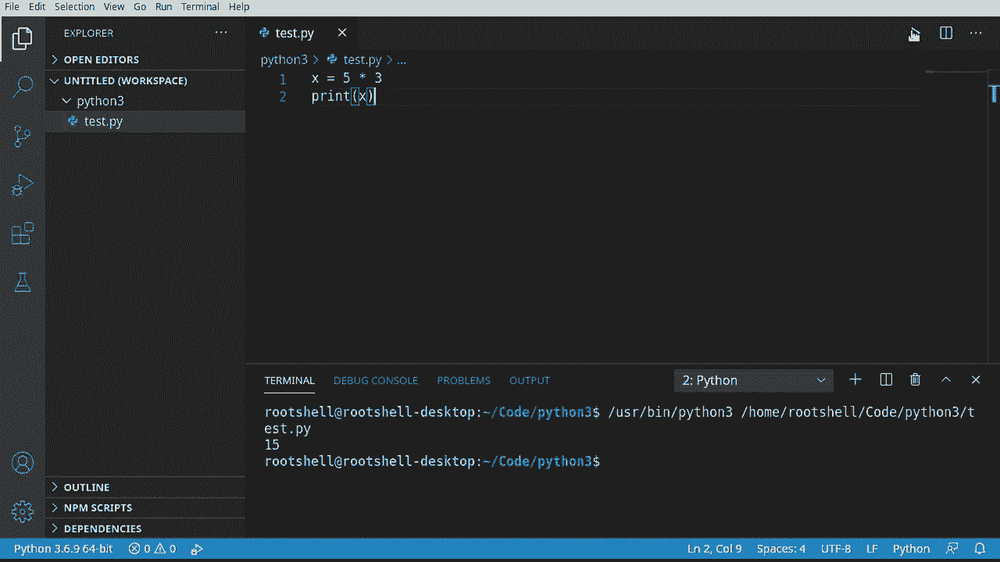

本节课中我们一起学习了Python 3的入门设置。我们了解了如何检查并安装Python 3，测试了安装结果，并设置了一个集成开发环境来编写和运行我们的第一个Python程序。在下一节课中，我们将开始深入Python的基础语法和概念。