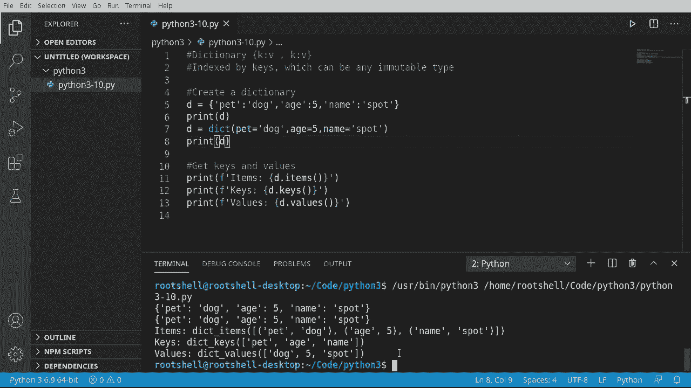
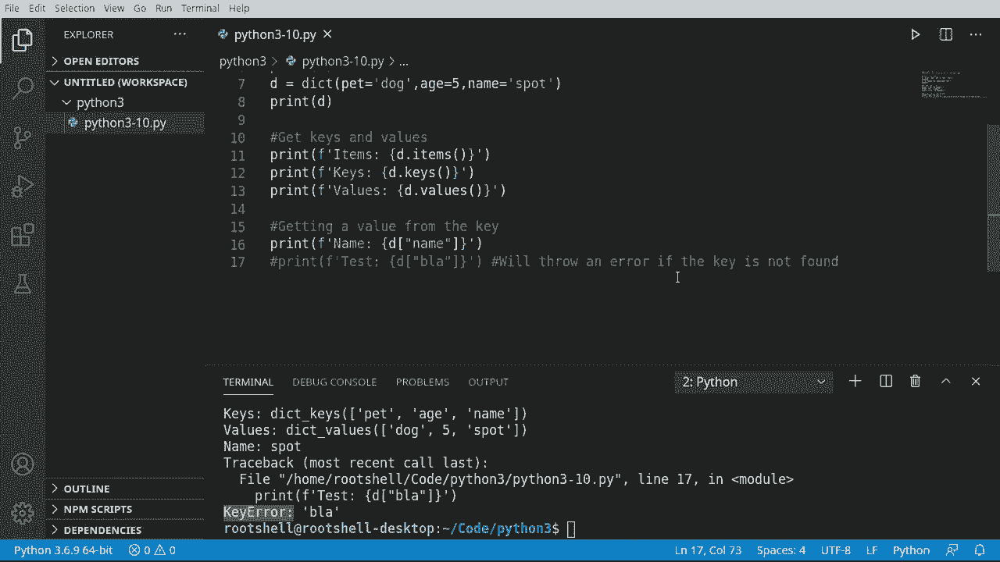
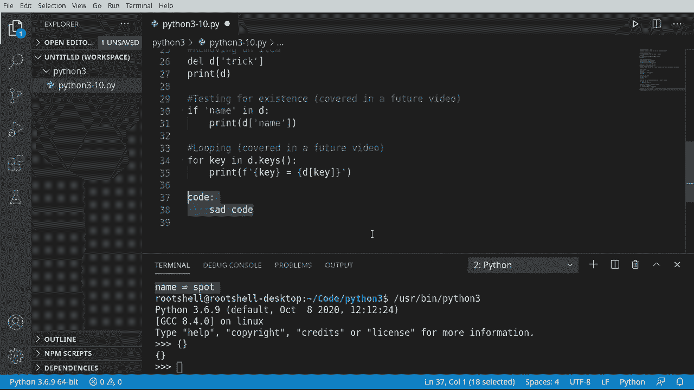

# Python 3全系列基础教程，P10：Python字典：键值对与索引 📚


在本节课中，我们将要学习Python中一个非常重要的数据结构——字典。字典是一种存储“键值对”的集合，它允许我们通过一个唯一的“键”来快速查找、添加或修改对应的“值”。理解字典是掌握Python高效数据处理的关键一步。

## 什么是字典？🔑

字典是一个由键值对组成的集合。更具体地说，它是一个通过“键”来索引的列表。字典使用花括号 `{}` 来创建。

键可以是任何不可变的数据类型，例如字符串、数字或元组。这意味着一旦键被创建，它本身就不能被更改。

## 创建字典 🛠️

创建字典主要有两种方法：直接使用花括号的“困难”方法和使用 `dict()` 函数的“简单”方法。

上一节我们介绍了字典的基本概念，本节中我们来看看如何实际创建一个字典。

**方法一：使用花括号（“困难”方法）**
在这种方法中，我们手动在花括号内写出每一个键值对。

```python
D = {
    "pet": "dog",
    "age": 5,
    "name": "spot"
}
print(D)
```
运行上述代码，输出结果为：`{'pet': 'dog', 'age': 5, 'name': 'spot'}`。

**方法二：使用 dict() 函数（“简单”方法）**
`dict()` 函数可以接受关键字参数，并将其自动转换为字典的键值对。




```python
D = dict(pet="dog", age=5, name="spot")
print(D)
```
运行结果与第一种方法完全相同：`{'pet': 'dog', 'age': 5, 'name': 'spot'}`。

无论使用哪种方法，核心都是创建一系列的键值对，例如 `"pet": "dog"`。

## 获取键、值和键值对 📋

创建字典后，我们经常需要查看其中包含哪些键、哪些值，或者完整的键值对。字典提供了三个方法来获取这些信息。

以下是获取字典内容的方法：
*   **`D.items()`**: 返回一个包含所有（键，值）元组的视图对象。
*   **`D.keys()`**: 返回一个包含所有键的视图对象。
*   **`D.values()`**: 返回一个包含所有值的视图对象。

让我们通过代码来查看：
```python
D = {"pet": "dog", "age": 5, "name": "spot"}
print(D.items())  # 输出：dict_items([('pet', 'dog'), ('age', 5), ('name', 'spot')])
print(D.keys())   # 输出：dict_keys(['pet', 'age', 'name'])
print(D.values()) # 输出：dict_values(['dog', 5, 'spot'])
```
`items()` 方法将信息打包成元组列表，清晰地展示了键值对。`keys()` 告诉我们有哪些可用的键，因为查找数据必须通过键。`values()` 则列出了所有的值，但脱离了键，这些值的意义就不明确了。




## 通过键访问值 🔍

既然字典是通过键来组织的，那么我们如何通过键来获取对应的值呢？方法很简单：使用方括号 `[]` 并在其中放入键名。

上一节我们学会了如何查看字典的整体内容，本节中我们来看看如何获取特定的值。

```python
D = {"pet": "dog", "age": 5, "name": "spot"}
print(D["name"])  # 输出：spot
```
**重要提示**：你必须使用字典中实际存在的键。如果使用一个不存在的键，Python会抛出 `KeyError` 错误。
```python
print(D[0])  # KeyError: 0， 因为字典中没有名为 0 的键
```

## 添加与修改字典条目 ➕

向字典中添加新条目或修改现有条目的值都非常简单。

以下是操作字典条目的方法：
*   **添加新条目**：为字典分配一个**新的键**并赋予其值。语法为 `D[new_key] = value`。
*   **修改现有条目**：为字典中一个**已存在的键**分配新的值。语法同样为 `D[existing_key] = new_value`。

让我们看一个例子：
```python
D = {"pet": "dog", "age": 5, "name": "spot"}
D["trick"] = "roll over"  # 添加新键值对
print(D)  # 输出包含 ‘trick’ 的字典

D["age"] = 6  # 修改已存在的键 ‘age’ 的值
print(D)  # 输出：{...， ‘age’: 6}
```
请注意，键本身是不可变的。我们无法直接修改一个键，但可以更新该键对应的值，或者删除整个键值对后重新添加。

## 删除字典条目 🗑️

使用 `del` 语句可以删除字典中的键值对。

```python
D = {"pet": "dog", "age": 5, "name": "spot", "trick": "roll over"}
del D["trick"]  # 删除键为 ‘trick’ 的条目
print(D)  # ‘trick’ 键及其值已从字典中消失
```
**核心概念**：删除操作是针对**键**的。当你删除一个键时，与该键关联的值也会被一并移除。

## 进阶预览：检查键存在性与遍历字典 🔄

为了满足有经验学习者的需求，这里提前预览两个重要概念：检查键是否存在和遍历字典。

**1. 检查键是否存在 (`in` 关键字)**
在尝试访问一个键的值之前，最好先检查它是否存在，以避免 `KeyError`。
```python
D = {"pet": "dog", "age": 5, "name": "spot"}
if “name” in D:  # 如果键 ‘name’ 在字典 D 中
    print(“Name exists!”)  # 则执行这里的代码（注意缩进）
```
**2. 遍历字典 (`for` 循环)**
循环可以让我们依次处理字典中的每一个条目。
```python
D = {"pet": "dog", “age”: 5, “name”: “spot”}
for key in D:  # 对于字典 D 中的每一个键
    print(key, “:”, D[key])  # 打印该键及其对应的值（注意缩进）
```
这段代码会输出：
```
pet : dog
age : 5
name : spot
```
**关于缩进**：在Python中，冒号 `:` 之后的缩进（空格或制表符）定义了代码块的范围，就像其他语言中的花括号 `{}` 一样。这是Python语法的一个重要特点。



## 总结 📝


本节课中我们一起学习了Python字典的核心知识。我们了解到字典是一种通过**键**来存储和访问**值**的强大数据结构。我们掌握了创建字典的两种方法，学会了如何获取键、值和键值对，以及如何通过键来访问、添加、修改和删除数据。最后，我们还预览了如何使用 `in` 关键字检查成员资格以及如何使用 `for` 循环遍历字典。字典是Python编程中不可或缺的工具，务必熟练掌握。