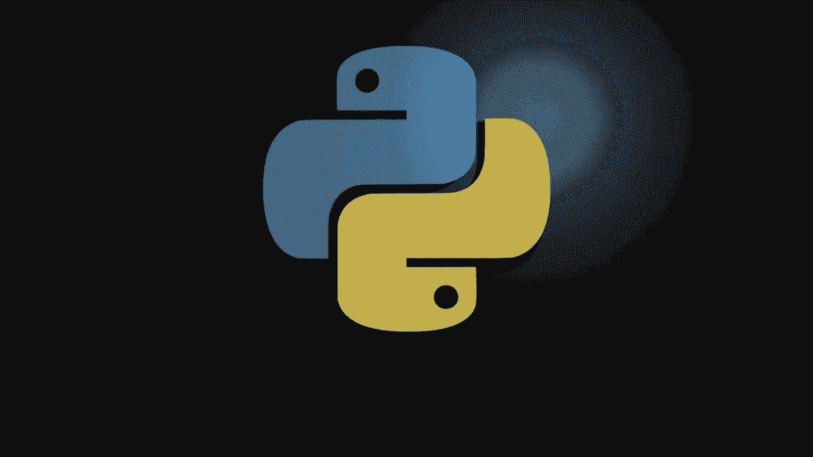
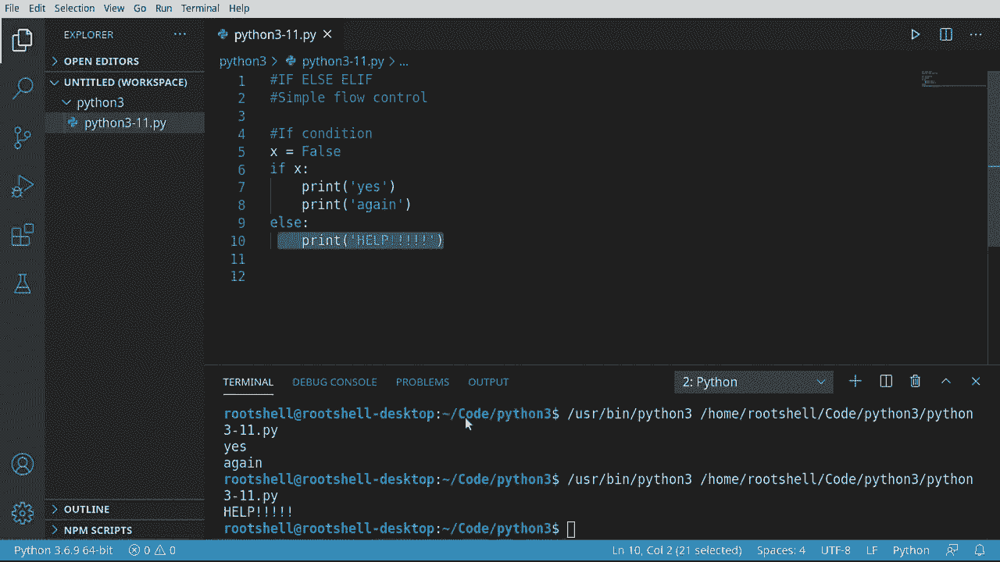
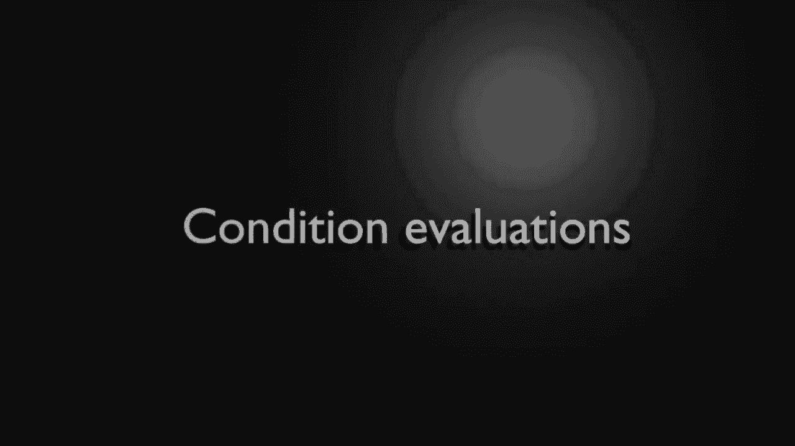
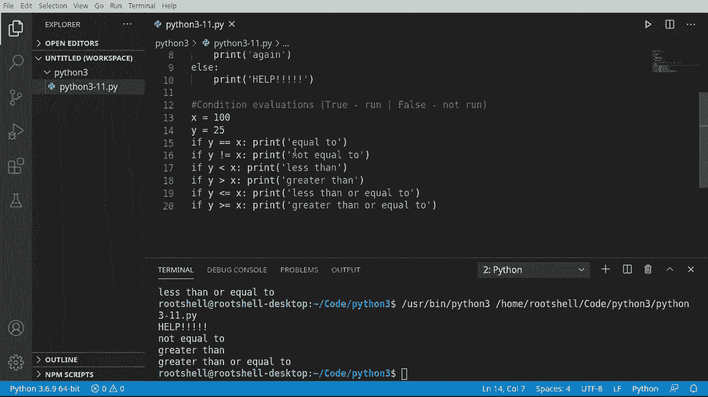
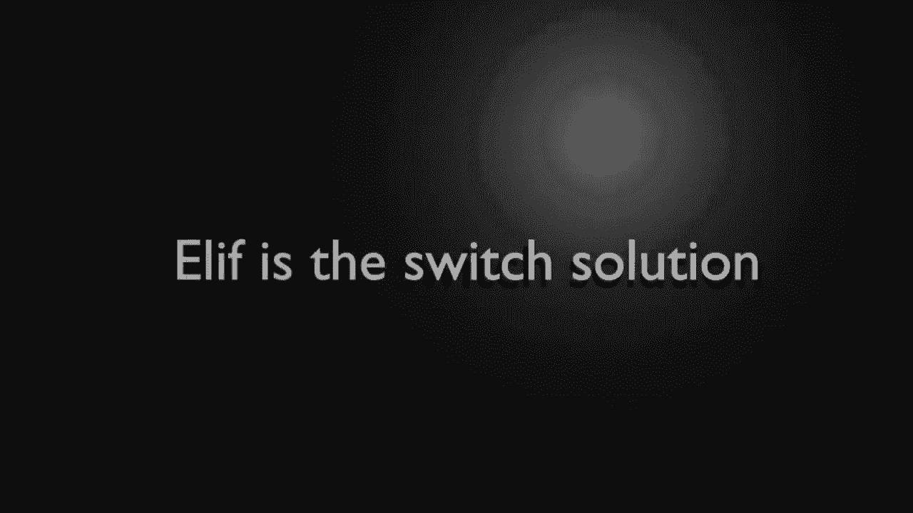
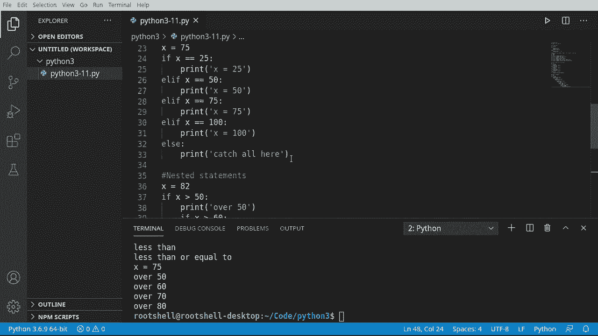

# Python 3全系列基础教程，P11：11）Python流程控制：If - Else - Elif 🔀



在本节课中，我们将要学习Python中流程控制的核心概念，即如何使用`if`、`else`和`elif`语句来控制程序的执行路径。这些语句是构建程序逻辑的基础，它们允许程序根据条件做出决策。

## 概述 📋

流程控制指的是控制应用程序的执行流程。`if`、`else`和`elif`语句是流程控制的基本构建块，它们的工作原理类似于日常生活中的决策：如果满足某个条件，就执行一些操作；否则，就执行其他操作。

## 基础理论：布尔值与条件

在深入代码之前，我们需要理解一个基本概念：布尔值（`True`或`False`）。条件语句会评估一个表达式，其结果通常是布尔值。程序根据这个结果是真还是假来决定执行哪一段代码。

## If 语句

`if`语句用于在条件为真时执行特定的代码块。其基本语法如下：

```python
if condition:
    # 如果条件为真，则执行这里的代码
```

让我们通过一个例子来理解。首先，我们创建一个布尔变量。

```python
x = True
if x:
    print("yes")
```

运行这段代码，它会输出“yes”，因为条件`x`评估为`True`。

在Python中，代码块通过缩进来定义，而不是像其他语言那样使用花括号`{}`。冒号`:`表示一个代码块的开始，其后的所有缩进行都属于该代码块。

```python
if x:
    print("yes")
    print("again")
```



## Else 语句



`else`语句与`if`配对使用，它定义了当`if`条件为假时要执行的代码块。

```python
x = True
if x:
    print("yes")
else:
    print("no")
```

在这个例子中，因为`x`为真，所以会执行`if`块，打印“yes”，而不会执行`else`块。

如果我们把`x`改为`False`：

```python
x = False
if x:
    print("yes")
else:
    print("no")
```

此时，`if`条件为假，程序会跳过`if`块，转而执行`else`块，打印“no”。

## 条件评估

条件不仅仅是简单的布尔变量，它们可以是更复杂的比较表达式。以下是常用的比较运算符：

*   `==`：等于
*   `!=`：不等于
*   `<`：小于
*   `>`：大于
*   `<=`：小于或等于
*   `>=`：大于或等于



让我们看一个使用这些运算符的例子：



```python
x = 100
y = 25

if y == x:
    print("equal")
if y != x:
    print("not equal")
if y < x:
    print("less than")
if y > x:
    print("greater than")
if y <= x:
    print("less than or equal")
if y >= x:
    print("greater than or equal")
```

运行这段代码，它会输出“not equal”、“less than”和“less than or equal”，因为只有这些条件评估为`True`。

## Elif 语句

当你有多个互斥的条件需要检查时，使用一连串的`if`语句会显得冗长且低效。`elif`（是“else if”的缩写）语句可以解决这个问题。它允许你将多个条件检查链接在一起。

```python
x = 75

if x == 25:
    print("x is 25")
elif x == 50:
    print("x is 50")
elif x == 75:
    print("x is 75")
elif x == 100:
    print("x is 100")
else:
    print("catch-all for any other value")
```

程序会从上到下依次检查每个条件。一旦某个条件为真，就会执行对应的代码块，然后跳出整个`if-elif-else`结构。如果所有`if`和`elif`条件都为假，则执行`else`块。

## 嵌套的 If 语句

你可以在一个`if`或`else`代码块内部再放置另一个`if`语句，这被称为嵌套。它用于检查更复杂、分层级的条件。

```python
x = 82

if x > 50:
    print("Over 50")
    if x > 60:
        print("Also over 60")
        if x > 70:
            print("Also over 70")
            if x > 90:
                print("Also over 90")
```

在这个例子中，外层的`if`检查`x > 50`。如果为真，它进入代码块打印信息，然后遇到内层的`if`语句`x > 60`，并继续这个过程。缩进清晰地表明了每个条件语句的层级关系。

## 总结 🎯

本节课我们一起学习了Python流程控制的核心语句。

*   **`if`语句**：在条件为真时执行代码。
*   **`else`语句**：与`if`配对，在条件为假时执行代码。
*   **`elif`语句**：用于检查多个互斥条件，是`else if`的简写。
*   **条件评估**：使用比较运算符（如`==`， `!=`， `<`， `>`）来构建条件表达式。
*   **代码块与缩进**：Python使用缩进来定义代码块，这是语法的一部分，必须严格遵守。
*   **嵌套语句**：可以将`if`语句放在另一个`if`或`else`块内，以创建更复杂的逻辑。



`if-else-elif`结构是编程逻辑的基石，它们让程序能够根据不同的情况做出智能的决策。掌握它们对于编写任何有意义的程序都至关重要。