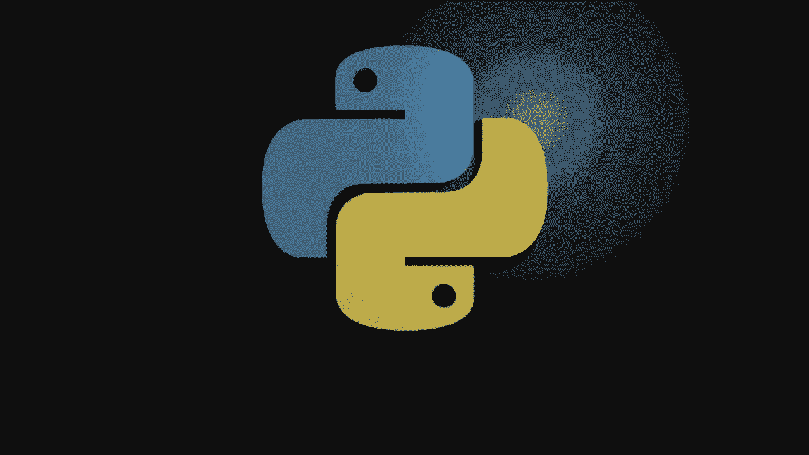
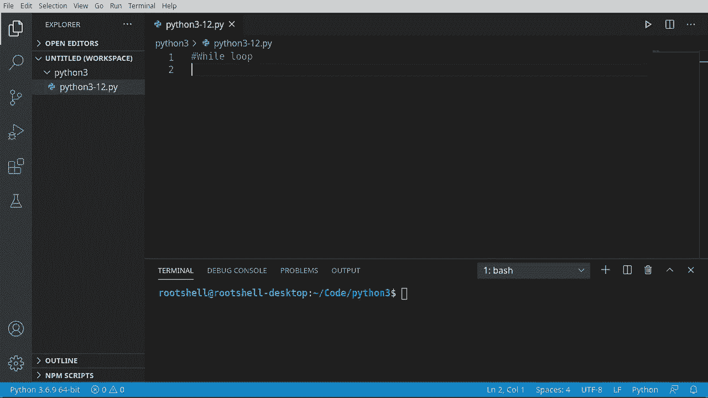
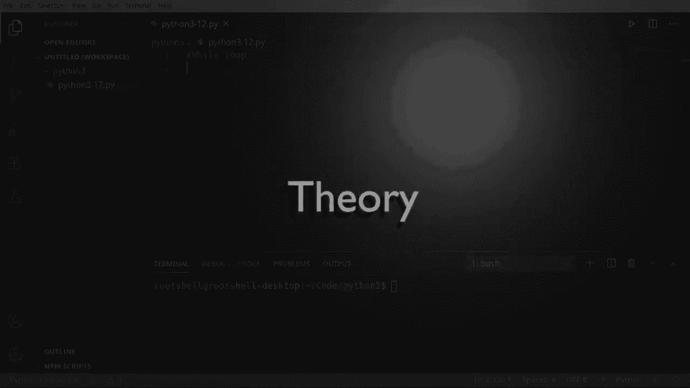
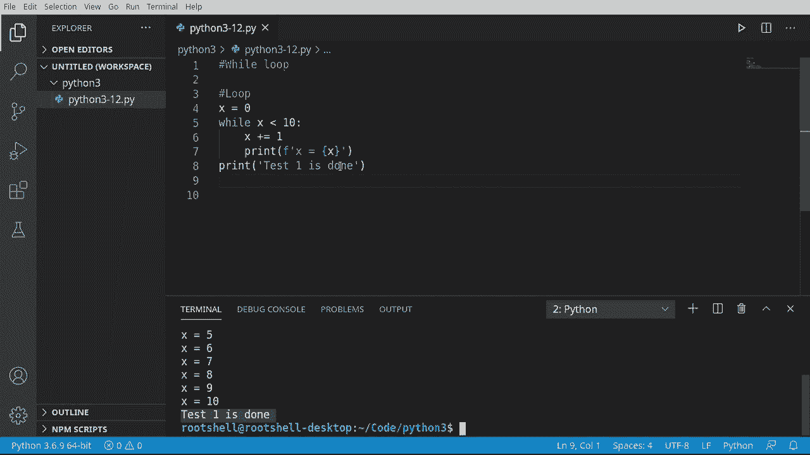
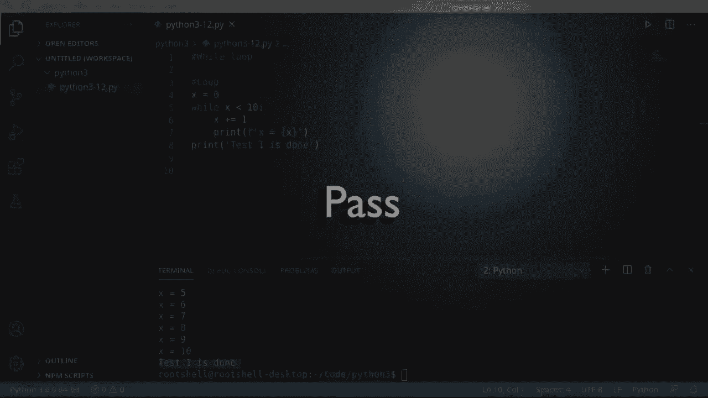
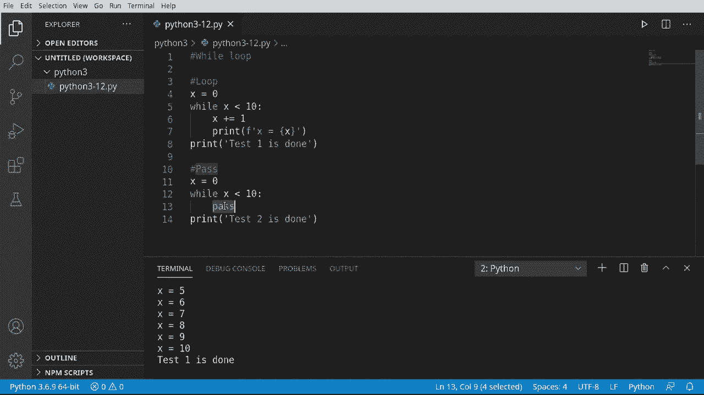
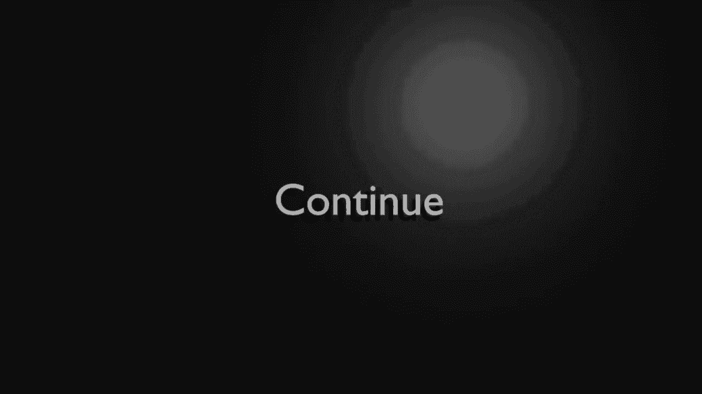
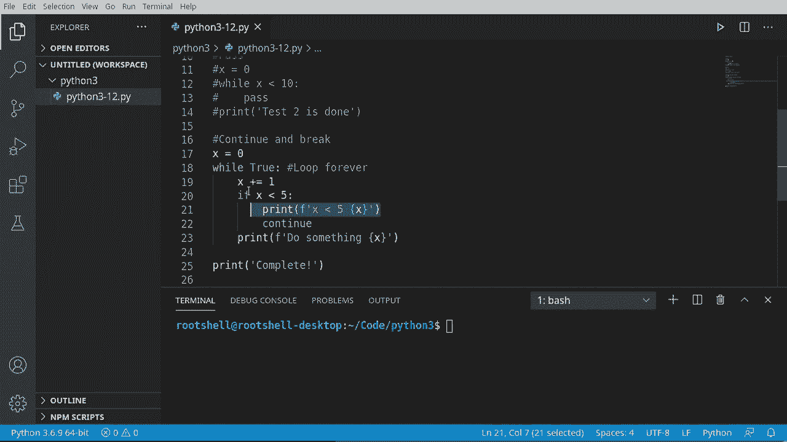
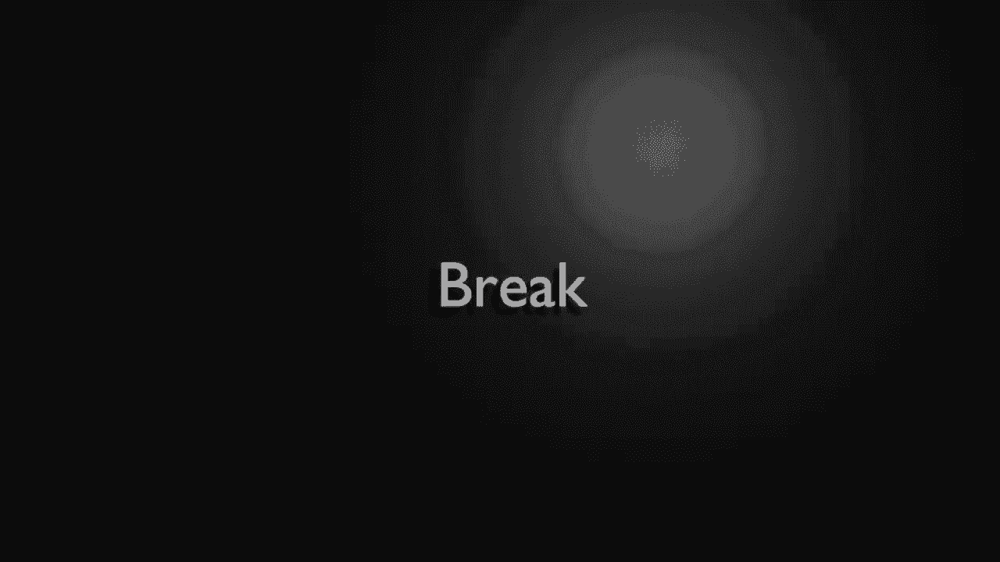
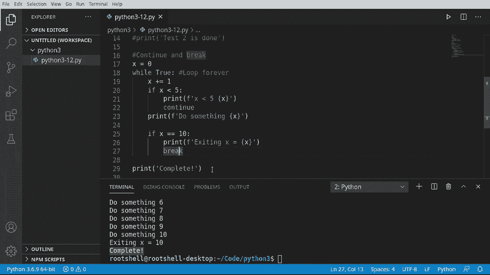

# Python 3全系列基础教程，P12：12）Python流控制：While 循环 🔄






在本节课中，我们将要学习Python中的`while`循环。这是一种基本的流程控制结构，它能让计算机重复执行一段代码，直到我们设定的条件不再满足。我们将通过简单的例子来理解循环的工作原理、如何避免无限循环，以及如何使用`continue`和`break`来控制循环流程。



## 什么是循环？🤔

上一节我们介绍了条件判断，本节中我们来看看循环。循环的核心是重复执行代码块，直到被告知停止。计算机本身并不知道何时应该停止，因此需要程序员明确地设定退出条件。

循环的基本流程可以概括为：程序进入循环，评估一个条件。如果条件为真，则执行循环体内的代码。执行完毕后，程序会再次回到循环开始处，重新评估条件。这个过程会不断重复，直到条件变为假，程序才会跳出循环，继续执行后续的代码。

以下是循环的简单逻辑流程：
```python
# 伪代码表示循环结构
while 条件为真:
    执行代码块
```

## 为什么需要循环？💡


你可能会问，为什么需要循环？设想一个场景：你需要打印数字1到100。如果没有循环，你需要写100行`print`语句。而使用循环，你只需要几行代码就能完成这个任务。循环极大地提高了代码的效率和简洁性。

有些循环被设计为无限运行，例如图形用户界面程序中的事件循环。这种循环会持续运行，等待用户的输入（如点击鼠标），直到程序被关闭。

## While循环基础 🛠️

现在，让我们看看`while`循环的实际语法。它的结构与`if`语句类似，都是基于一个条件表达式。

以下是`while`循环的基本格式：
```python
while 条件表达式:
    # 循环体代码块
```

让我们看一个简单的例子。我们将创建一个计数器，从0开始，当它小于10时，就打印它的值并增加1。

```python
x = 0
while x < 10:
    print(x)
    x = x + 1  # 或简写为 x += 1
print("循环完成")
```





在这个例子中，只要`x < 10`这个条件为真，循环就会继续执行。每次循环，我们打印`x`的值，然后将`x`增加1。当`x`增加到10时，条件`x < 10`变为假，循环终止，程序执行最后的`print(“循环完成”)`语句。

**重要提示**：在循环体内，必须有改变循环条件的语句（例如增加计数器`x`）。否则，如果条件永远为真，就会创建一个“无限循环”，导致程序无法停止。

## 危险的陷阱：无限循环与pass关键字 ⚠️

无限循环是指没有退出条件的循环，它会一直运行下去。一个常见的错误是忘记在循环体内更新条件变量。

例如，下面的代码创建了一个无限循环，因为`x`始终为0，条件`x < 10`永远为真：
```python
x = 0
while x < 10:
    print(x)
    # 忘记增加 x
```





另一个需要警惕的关键字是`pass`。`pass`是Python中的一个空语句，它什么都不做，只是占位符。但在循环中使用`pass`而不提供退出逻辑，同样会导致无限循环。

```python
x = 0
while x < 10:
    pass  # 循环体为空，x永远不会增加，条件永远为真
print("这行代码永远不会被执行")
```

因此，在循环中使用`pass`时要格外小心。

## 控制循环流程：continue与break 🎛️

为了更灵活地控制循环，Python提供了`continue`和`break`语句。

*   **`continue`语句**：跳过当前循环迭代中剩余的代码，直接进入下一次循环的条件判断。
*   **`break`语句**：立即终止整个循环，跳出循环体，继续执行循环之后的代码。

以下是使用`continue`和`break`的例子：

```python
x = 0
while True:  # 这是一个故意设计的无限循环条件
    x += 1
    if x < 5:
        continue  # 如果x小于5，跳过本次循环的后续代码，直接开始下一次循环
    print(f"x的值为：{x}")
    if x == 10:
        print("达到10，准备退出循环")
        break  # 如果x等于10，立即跳出整个while循环
print("循环结束")
```



在这个例子中：
1.  我们使用`while True`创建了一个条件永远为真的循环框架。
2.  当`x`小于5时，`continue`语句会让程序直接回到`while`开头，不执行后面的`print`语句。
3.  当`x`等于10时，`break`语句会强制终止循环，程序跳出`while`循环块，执行最后的`print(“循环结束”)`。



通过组合使用条件判断、`continue`和`break`，你可以构建出非常强大和灵活的循环逻辑。

## 总结 📝

本节课中我们一起学习了Python的`while`循环。

我们了解到，循环是用于重复执行代码块的结构，其核心在于一个不断被评估的条件。我们学习了`while`循环的基本语法，并通过计数器例子理解了其工作流程。

我们重点探讨了**无限循环**的风险，它通常是由于忘记更新循环条件或误用`pass`语句导致的。最后，我们介绍了`continue`和`break`这两个强大的流程控制语句，它们能帮助我们在循环内部进行更精细的控制，跳过某些迭代或提前退出循环。



记住，循环是编程中不可或缺的工具，但务必确保你的循环有明确的退出条件，以避免程序陷入无尽的执行中。