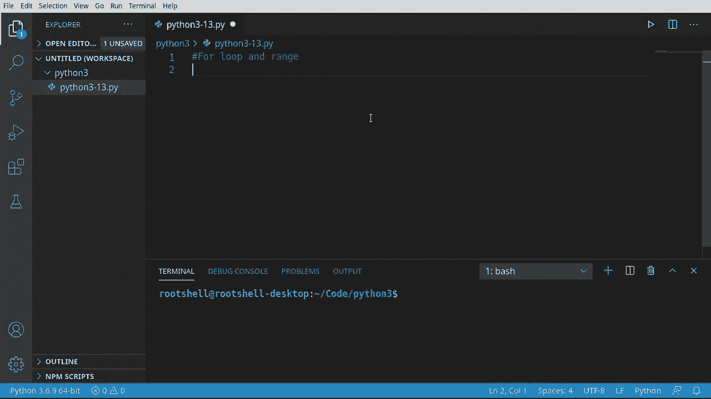
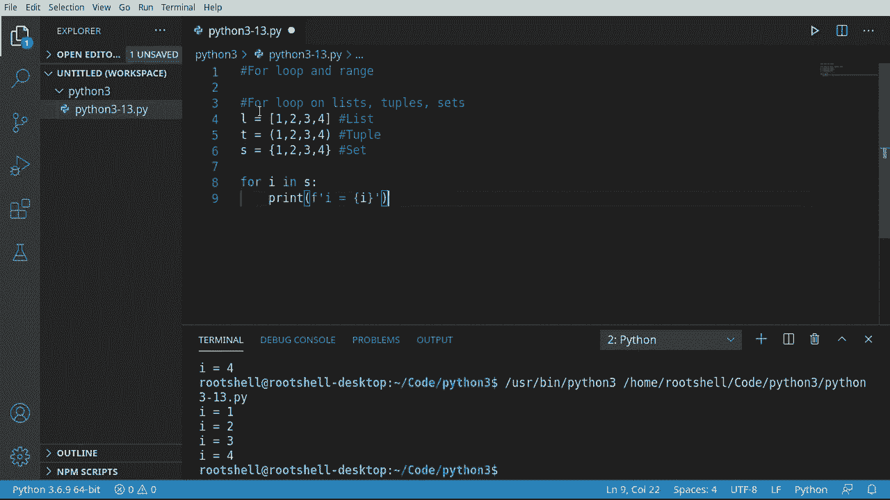
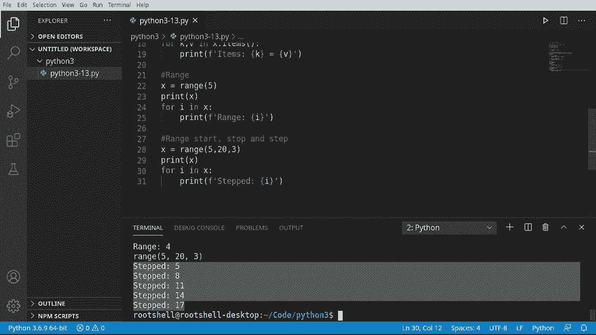

# Python 3全系列基础教程，P13：Python流控制：For 循环 🔄





在本节课中，我们将要学习Python中的`for`循环和`range()`函数。与之前讨论的`while`循环不同，`for`循环通常用于遍历一个已知的序列或集合，它有明确的开始和结束。`range()`函数则能帮助我们方便地生成这样的数字序列，从而避免陷入无限循环的麻烦。

## 遍历列表、元组和集合 📦

上一节我们介绍了循环的基本概念，本节中我们来看看如何使用`for`循环遍历列表、元组和集合这三种常见的数据结构。其语法非常直观。

以下是遍历的基本语法：
```python
for 变量 in 容器:
    # 执行操作
```



例如，我们创建一个列表并遍历它：
```python
x = [1, 2, 3, 4]
for i in x:
    print(i)
```
运行这段代码，会依次输出1, 2, 3, 4。循环会自动处理列表的长度，我们无需手动管理计数器。变量`i`在每次迭代中代表列表中的一个元素。


这种方法同样适用于元组和集合：
```python
# 元组
t = (1, 2, 3)
for i in t:
    print(i)

# 集合
s = {1, 2, 3}
for i in s:
    print(i)
```
遍历这些容器的方式是完全一致的，这使得操作变得极其简单。

## 遍历字典 📖

了解了简单容器的遍历后，我们来看看如何遍历字典。字典是键值对的集合，因此遍历方式略有不同。

首先，我们创建一个字典：
```python
my_dict = {
    "Brian": 46,
    "Tammy": 48,
    "Heather": 28,
    "Chris": 30
}
```

遍历字典主要有两种方法。

第一种是遍历字典的键（`keys`）：
```python
for key in my_dict.keys():
    print(key, my_dict[key])
```
这里，`my_dict.keys()`返回一个包含所有键的可迭代对象。在循环中，我们通过键`key`来访问对应的值`my_dict[key]`。

第二种方法是直接遍历字典的项（`items`），它可以同时获取键和值：
```python
for key, value in my_dict.items():
    print(key, value)
```
`my_dict.items()`返回一个包含（键，值）元组的可迭代对象。循环中的`key, value`会分别被赋值为每个元组中的两个元素。这种方式更为简洁，无需在循环体内再次通过键查找值。

两种方法都是有效的，选择哪一种取决于你的具体需求。

## 使用range()函数生成序列 🔢

之前我们遍历了已有的数据容器，但有时我们需要循环执行特定次数。这时`range()`函数就派上用场了。它用于生成一个整数序列。

`range()`函数的基本用法是`range(stop)`，它会生成从0开始到`stop-1`的整数序列。
```python
for i in range(5):
    print(i)
```
这段代码会打印出0, 1, 2, 3, 4。注意，数字5本身不会被包含。

`range()`函数更完整的格式是`range(start, stop, step)`：
*   `start`: 序列的起始值（包含）。
*   `stop`: 序列的结束值（不包含）。
*   `step`: 步长，即序列中数字的间隔。

让我们看一个例子：
```python
for i in range(5, 20, 3):
    print(i)
```
这段代码会打印从5开始，每次增加3，直到小于20的数字：5, 8, 11, 14, 17。它不会打印20，因为`stop`值是不包含的。

理解`range()`函数的工作原理，能让循环控制变得更加灵活和强大。

## 总结 ✨



本节课中我们一起学习了Python中`for`循环的核心用法。我们首先学会了如何用它来遍历列表、元组和集合。接着，我们探讨了遍历字典的两种不同方法。最后，我们深入了解了`range()`函数，它可以帮助我们生成数字序列，用于执行特定次数的循环操作。掌握这些知识，你就能在程序中更有效地处理集合数据和执行重复任务了。