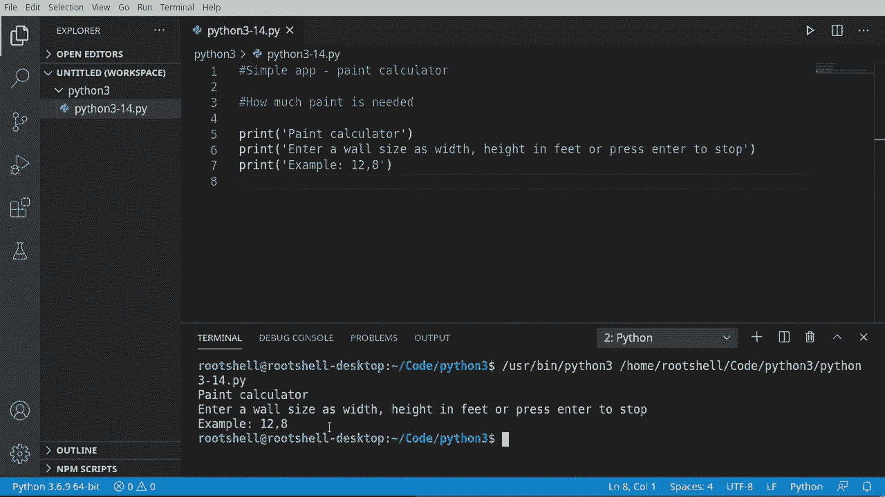
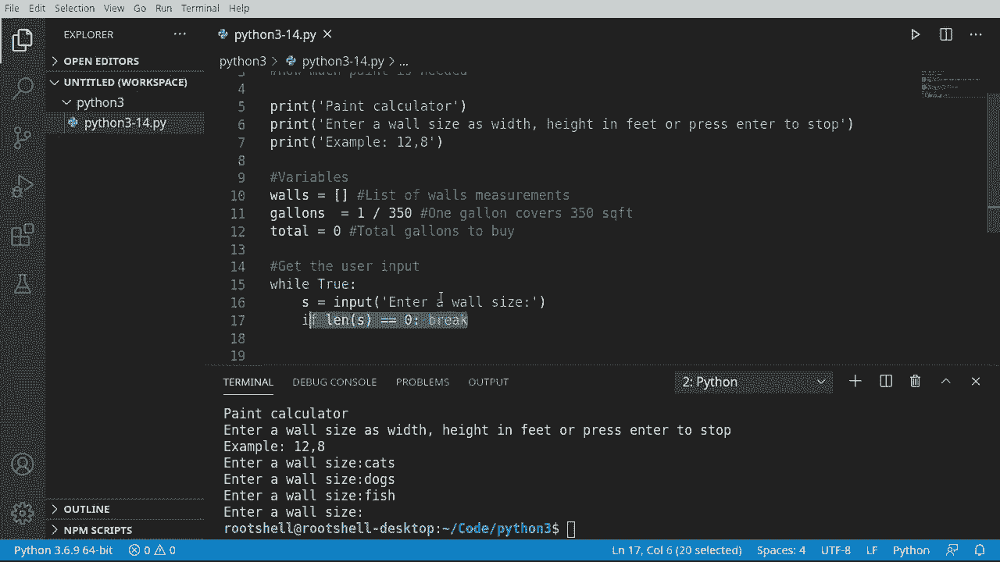
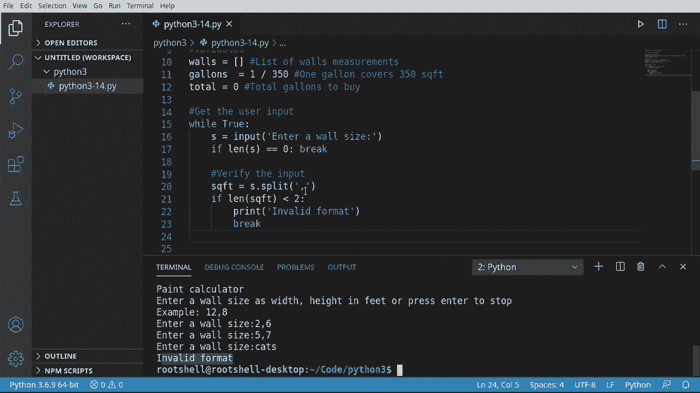
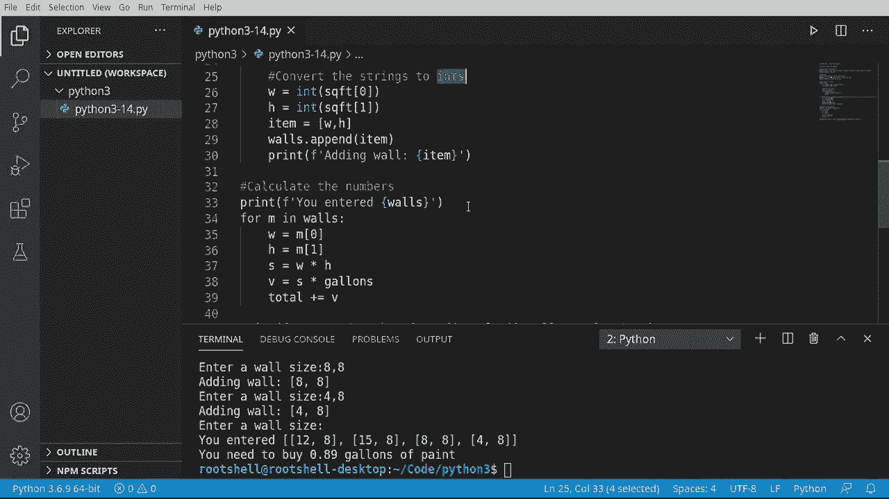
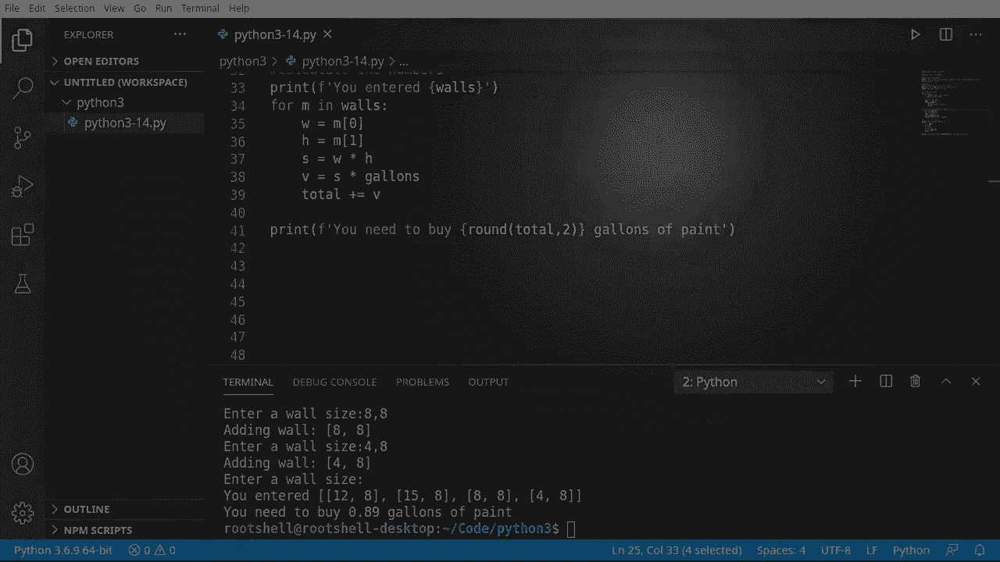

# Python 3全系列基础教程，P14：构建简单的应用程序：油漆计算器 🎨


在本节课中，我们将综合运用之前学到的知识，创建一个实用的“油漆计算器”应用程序。这个程序将帮助用户计算粉刷一个房间所需购买的油漆量。



## 概述


我们将编写一个程序，允许用户输入多面墙的尺寸（宽度和高度），程序会自动计算所有墙面的总面积，并根据每加仑油漆的覆盖面积，得出需要购买的油漆总量。过程中会涉及用户输入、数据验证、类型转换和基础数学运算。

## 项目初始化与变量设置

首先，我们需要设置程序所需的基础变量。我们将创建一个列表来存储所有墙面的尺寸，并定义一些常量用于计算。

```python
# 存储所有墙面尺寸的列表
walls = []

# 每加仑油漆可覆盖的面积（平方英尺）
gallons_per_sqft = 1 / 350




# 需要购买的油漆总加仑数
total_gallons = 0
```

在上面的代码中，`walls` 列表将用于保存用户输入的每一面墙的尺寸。`gallons_per_sqft` 是根据查询（1加仑油漆覆盖350平方英尺）计算出的常数。`total_gallons` 变量将用于累加最终所需的总油漆量。

## 获取用户输入

接下来，我们需要获取用户的输入。我们将使用一个 `while` 循环来持续询问用户，直到他们选择停止输入。

```python
while True:
    # 获取用户输入的墙面尺寸
    user_input = input("输入墙的尺寸，格式为‘宽度,高度’（以英尺为单位），或按回车停止: ")
    
    # 如果用户直接按回车（输入为空），则退出循环
    if len(user_input) == 0:
        break
```




这段代码创建了一个无限循环。`input` 函数会提示用户输入，并将结果存储在 `user_input` 变量中。如果用户直接按下回车键（输入长度为0），则执行 `break` 语句跳出循环，结束输入阶段。

## 验证与处理用户输入

获取输入后，我们不能直接使用它。必须先验证其格式是否正确，然后将其从字符串转换为我们可以计算的数字。

以下是处理用户输入的步骤：

1.  **分割字符串**：使用 `split` 方法按逗号分隔输入，得到宽度和高度。
2.  **验证格式**：检查分割后的列表是否恰好包含两个元素。
3.  **类型转换**：将字符串形式的宽度和高度转换为整数（`int`）。
4.  **存储数据**：将转换后的尺寸作为一个列表，添加到 `walls` 列表中。

```python
    # 尝试按逗号分割输入
    dimensions = user_input.split(',')
    
    # 验证是否恰好得到两个值（宽度和高度）
    if len(dimensions) != 2:
        print("格式无效，请使用‘宽度,高度’的格式。")
        continue  # 跳过本次循环，重新询问输入
    
    try:
        # 将字符串转换为整数
        width = int(dimensions[0])
        height = int(dimensions[1])
        
        # 将尺寸作为列表添加到 walls 中
        walls.append([width, height])
        print(f"已添加墙面：{width}英尺 x {height}英尺")
        
    except ValueError:
        # 如果转换失败（例如输入了非数字字符），提示错误
        print("输入包含非数字字符，请输入有效的数字。")
        continue  # 跳过本次循环，重新询问输入
```

在这段代码中，`split(',')` 将输入字符串在逗号处分割。`if` 语句确保我们得到了两个部分。`try...except` 块用于安全地进行类型转换；如果转换失败（例如用户输入了“12a,8”），程序会捕获 `ValueError` 异常并提示用户，而不是崩溃。

## 计算所需油漆量

当用户完成所有墙面尺寸的输入后，程序将退出循环。接下来，我们需要遍历 `walls` 列表中的每一面墙，计算总面积，进而得出所需油漆总量。

上一节我们介绍了如何收集和验证用户输入，本节中我们来看看如何利用这些数据进行计算。

```python
# 遍历所有已记录的墙面
for wall in walls:
    width = wall[0]
    height = wall[1]
    
    # 计算单面墙的面积
    wall_area = width * height
    
    # 计算粉刷这面墙所需的油漆加仑数，并累加到总量中
    paint_needed_for_wall = wall_area * gallons_per_sqft
    total_gallons += paint_needed_for_wall

# 输出最终结果，将总加仑数四舍五入到两位小数
print(f"\n你需要购买 {round(total_gallons, 2)} 加仑的油漆。")
```

代码通过 `for` 循环遍历 `walls` 列表。对于每一面墙，取出其宽度和高度，计算面积（`width * height`）。然后用这个面积乘以常数 `gallons_per_sqft`，得到粉刷这面墙所需的油漆量，并将其累加到 `total_gallons` 中。最后，使用 `round` 函数将结果四舍五入到两位小数后输出。

## 总结

本节课中我们一起学习了如何构建一个完整的简单应用程序——油漆计算器。我们回顾并实践了多个核心概念：
*   使用 **`while` 循环**和 **`input()` 函数**获取持续的用户输入。
*   使用 **`split()` 方法**和条件判断进行**输入验证**。
*   使用 **`int()` 函数**进行**类型转换**，并用 **`try...except`** 处理可能的错误。
*   使用**列表**存储结构化数据，并用 **`for` 循环**进行遍历和计算。
*   进行基础的**数学运算**（`*`, `+=`）并格式化输出结果。





通过这个项目，你将看到如何将分散的知识点组合起来，解决一个实际的问题。尽管这只是一个开始，但它展示了Python编程的基本流程和逻辑。你可以尝试在此基础上增加功能，例如询问房间数量、计算不同油漆品牌的价格等。