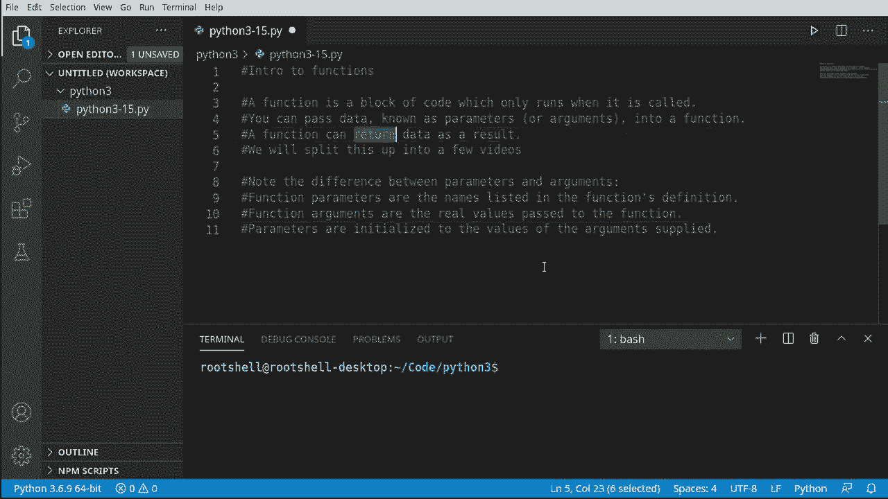
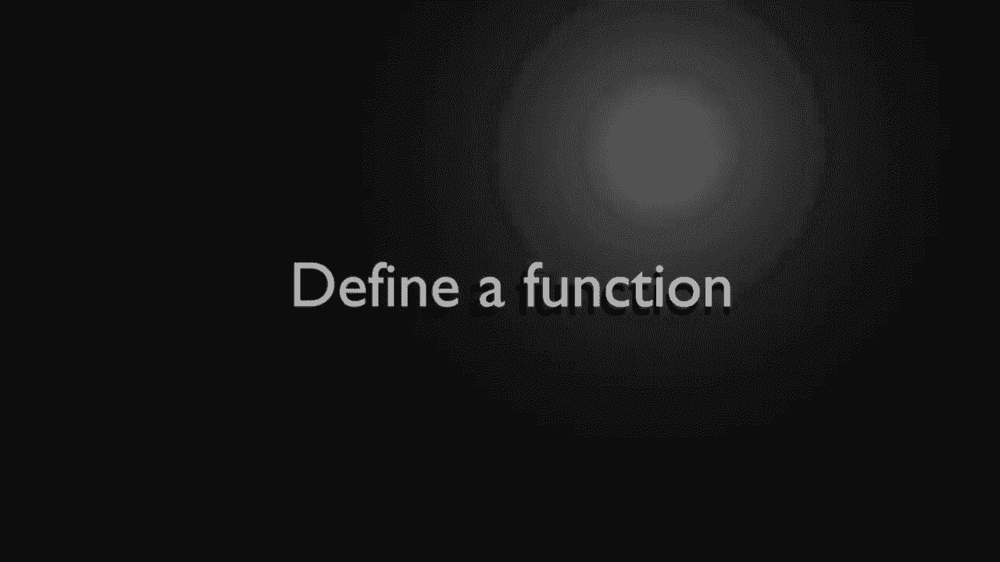
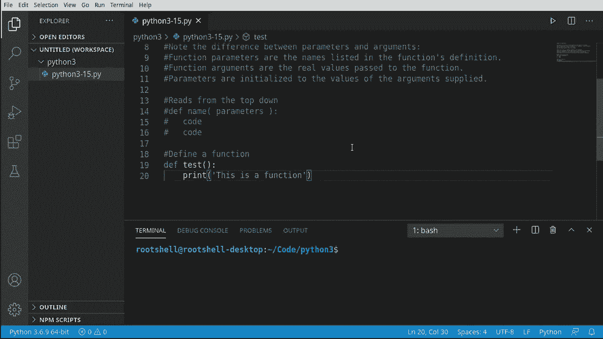
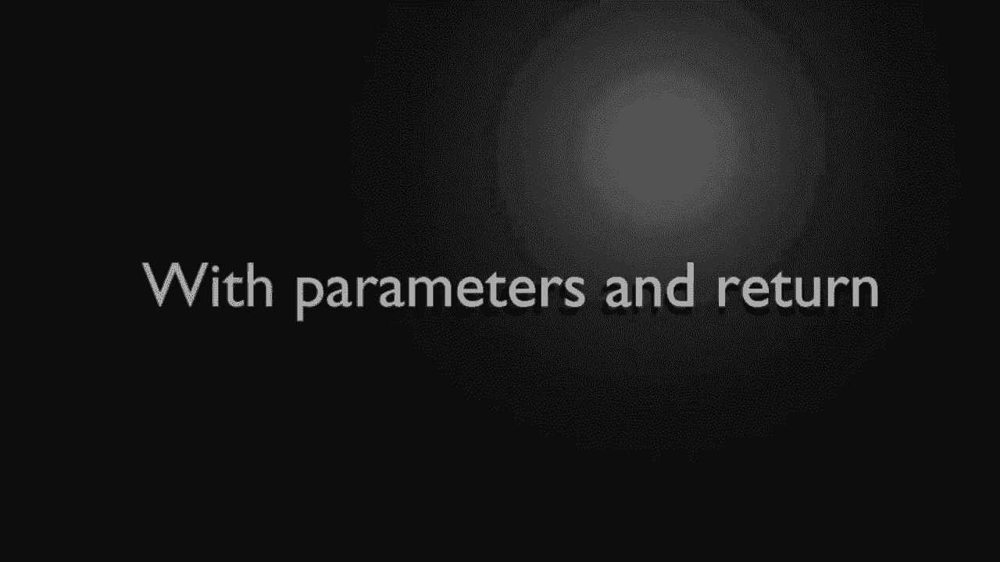
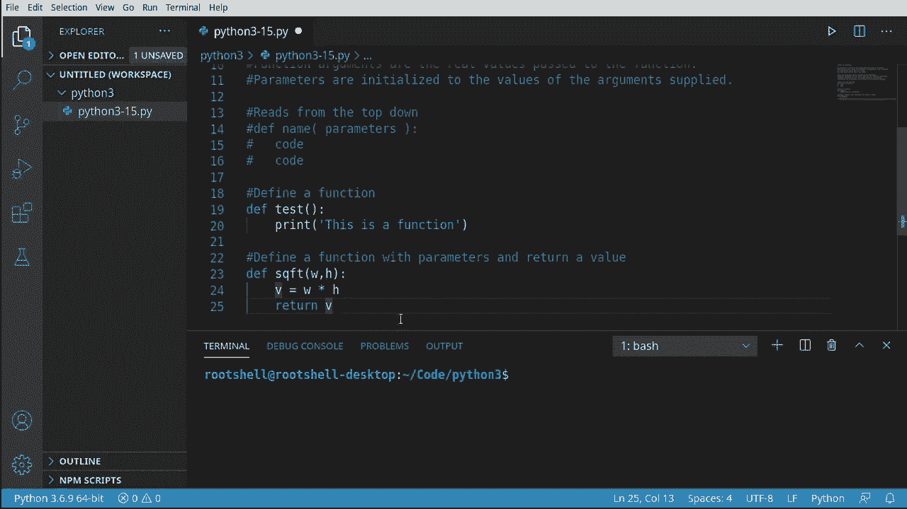
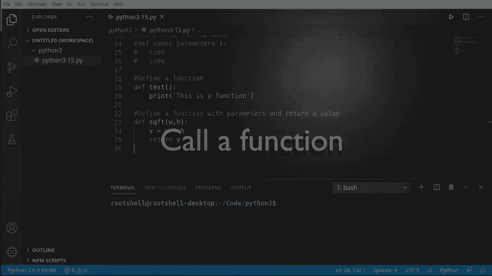
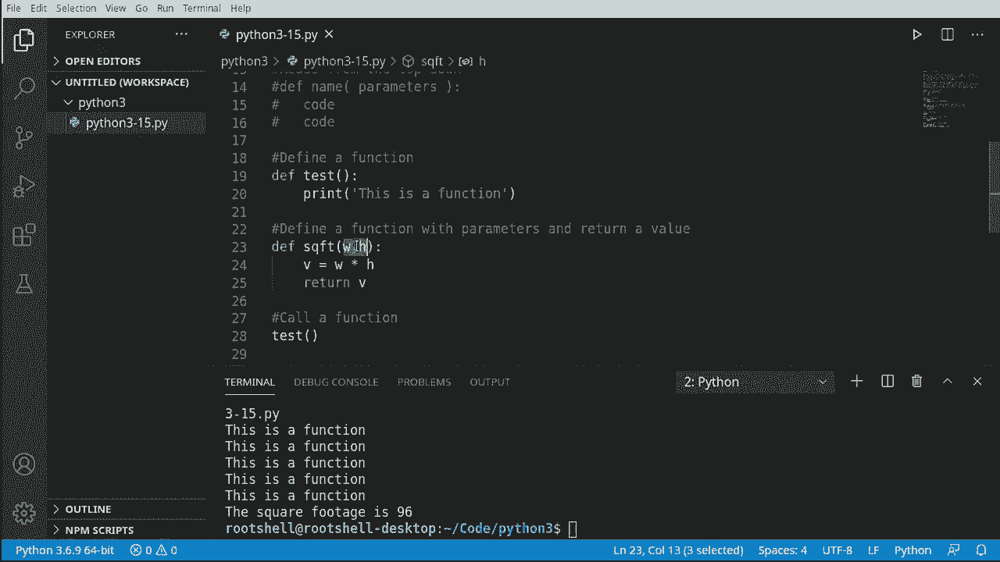

# Python 3全系列基础教程，P15：Python函数介绍 🧩


在本节课中，我们将要学习Python编程中的一个核心概念：函数。函数是组织代码、实现代码复用的基本构建块。我们将了解什么是函数、如何定义和调用函数，以及参数和返回值的基本用法。

## 什么是函数？📦

上一节我们介绍了函数是编程的基本构建块。本节中我们来看看函数的具体定义。



函数是一个代码块，它仅在程序明确调用时才会运行。这与我们之前编写的、在Python读取时立即执行的代码不同。使用函数，我们可以决定特定代码在何时运行。

以下是函数的一个关键特性：
*   **接收数据**：你可以向函数传入数据，这些数据被称为参数或实参。
*   **返回数据**：函数可以通过 `return` 关键字将处理结果返回给调用者。

## 从语句到函数 🔄

到目前为止，我们编写的程序主要由一系列语句构成。Python从上到下顺序执行这些语句，例如打印、循环或条件判断。

现在，我们引入函数。函数是一个独立的代码块，除非被调用，否则不会执行。通过函数，我们可以更好地组织程序逻辑，决定代码的执行流程。



另一个随之引入的重要概念是**作用域**。目前我们编写的代码都处于全局作用域。而每个函数都拥有自己的局部作用域，这会影响变量的可见性，我们将在后续课程中深入探讨。

## 如何定义函数 ✍️

让我们开始实践，学习如何定义一个函数。





定义一个函数需要使用 `def` 关键字，后跟函数名和一对圆括号 `()`，括号内可以定义参数，最后以冒号 `:` 结束。函数体内的代码需要缩进。

以下是定义一个简单函数的语法：
```python
def 函数名():
    # 函数体代码
```

例如，我们定义一个打印消息的函数：
```python
def test():
    print("这是一个函数")
```

注意，仅仅定义函数，其中的代码并不会执行。

## 调用函数 📞



定义函数后，我们需要调用它来执行其中的代码。



调用函数非常简单，只需使用函数名后加圆括号 `()` 即可。如果函数定义了参数，则需要在括号内传入相应的值。

以下是调用上述 `test` 函数的方法：
```python
test()  # 输出：这是一个函数
```

函数的力量在于可以多次调用。例如，使用循环调用函数四次：
```python
for i in range(4):
    test()
```
这样避免了重复编写相同的代码。

## 使用参数和返回值 🎯

现在我们来定义一个更实用的函数，它接收参数并返回计算结果。

我们将创建一个计算矩形面积的函数，它接收宽度和高度作为参数，并返回面积值。

以下是带参数和返回值的函数定义：
```python
def sqft(width, height):
    return width * height
```

在这个定义中，`width` 和 `height` 是**形参**，它们是函数定义时列出的变量名。

调用这个函数时，需要传入具体的值，这些值被称为**实参**：
```python
area = sqft(12, 8)
print(area)  # 输出：96
```

这里，数字 `12` 和 `8` 就是传入函数的**实参**。函数执行计算后，通过 `return` 语句将结果 `96` 返回，并赋值给变量 `area`。

## 核心要点总结 📝

本节课中我们一起学习了Python函数的基础知识。

快速回顾核心要点：
1.  函数使用 `def` 关键字定义。
2.  函数体代码只在函数被调用时执行。
3.  函数可以接收零个或多个**形参**。
4.  调用函数时传入的具体值是**实参**。
5.  函数使用 `return` 语句返回值。
6.  函数提高了代码的复用性和组织性。



函数是构建复杂程序的基石，理解其基本用法是后续学习的重要基础。