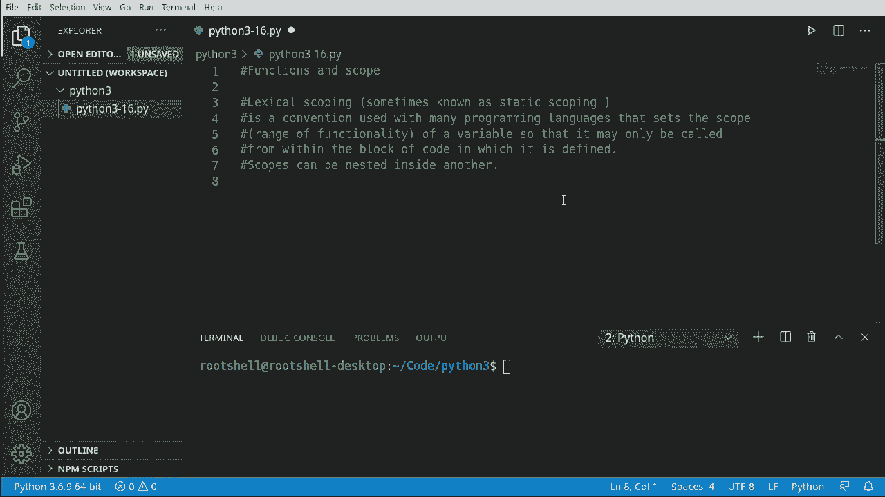
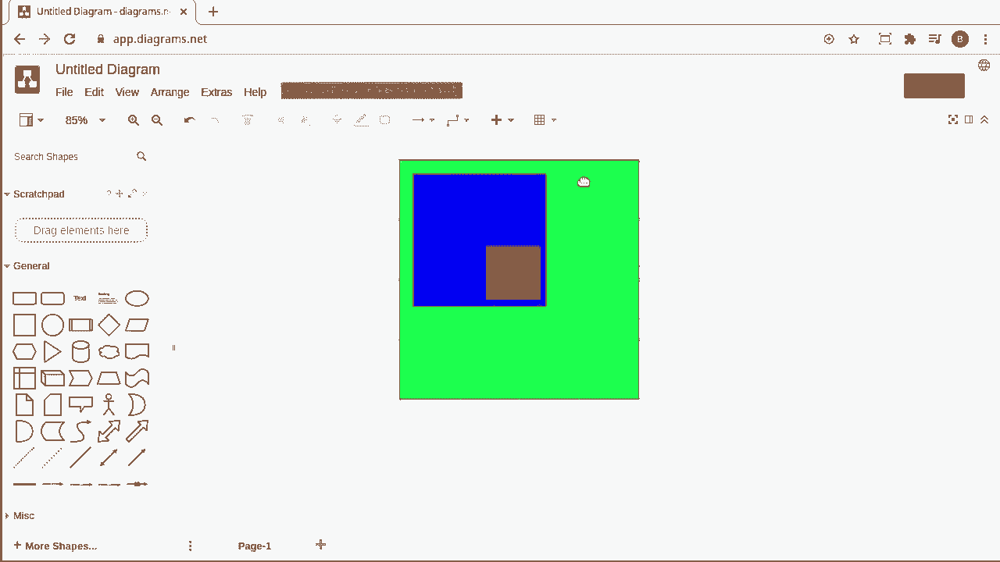
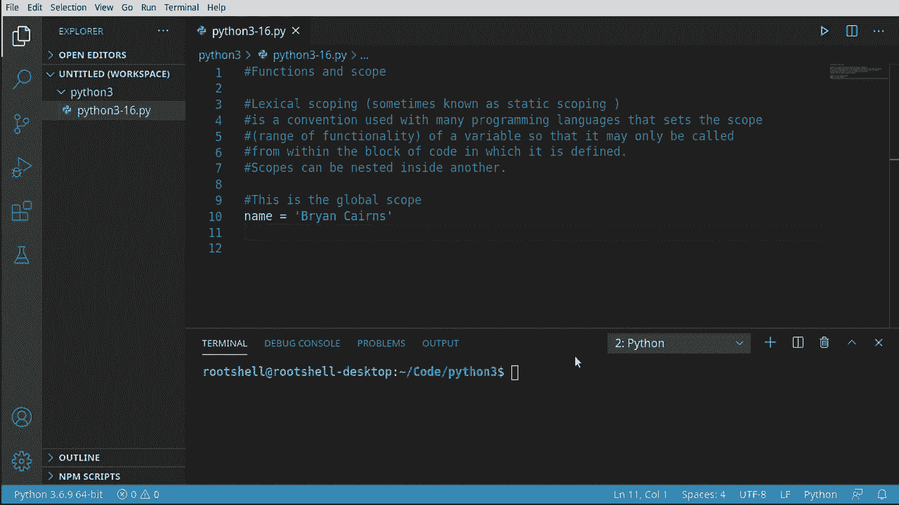
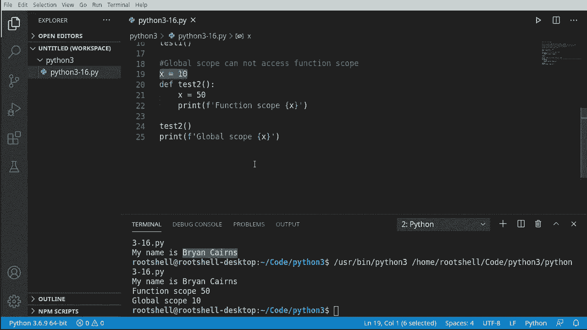
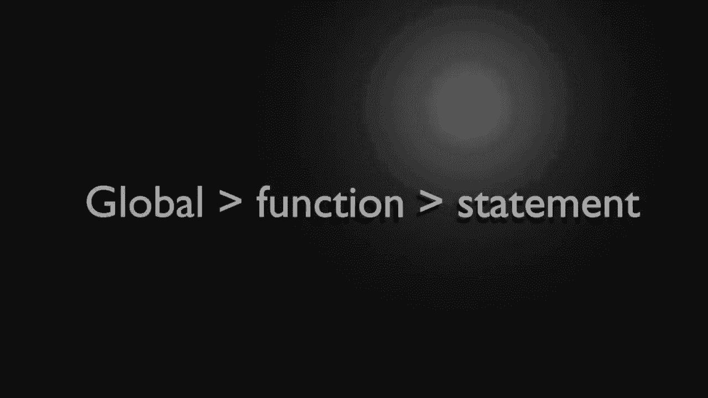
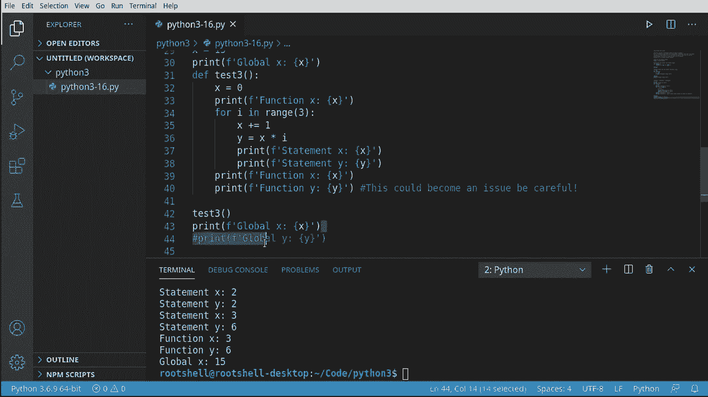
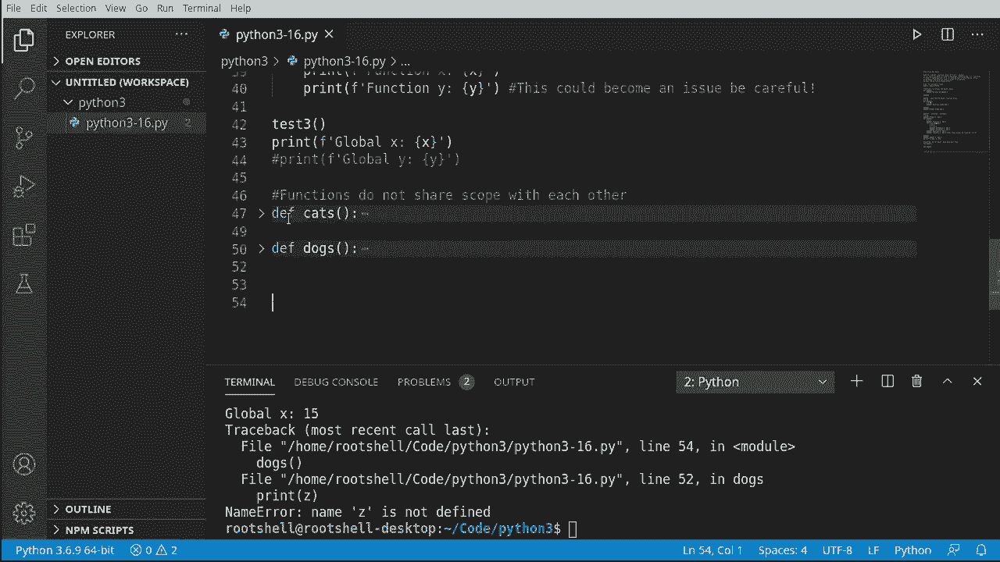
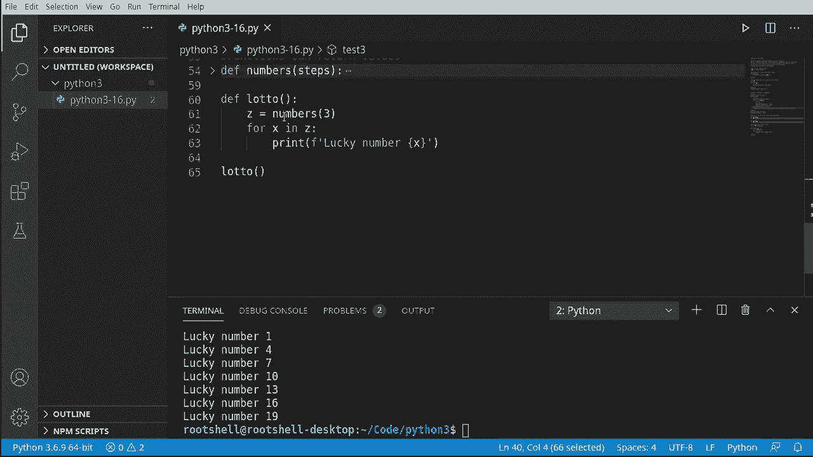

# Python 3全系列基础教程，P16：函数与作用域 🧭


在本节课中，我们将要学习Python中一个核心但有时令人困惑的概念：**作用域**。我们将探讨变量在代码的不同部分中如何被访问，以及函数如何影响变量的可见性。理解作用域是编写清晰、可维护且无错误代码的关键。

## 概述：什么是词法作用域？




上一节我们介绍了函数的基本概念，本节中我们来看看函数如何与变量作用域交互。许多编程语言，包括Python，都使用**词法作用域**（也称为静态作用域）。这个概念设定了变量的“可见范围”，即变量只能在定义它的代码块内部被访问。

然而，作用域可以像盒子一样嵌套。你可以有一个大盒子（全局作用域），里面装着一个小盒子（函数作用域），小盒子里可能还装着另一个更小的盒子（如循环或条件语句的作用域）。这种嵌套关系是理解作用域的关键，但也可能带来困惑。

## 全局作用域 🌍

让我们从最简单的概念开始：**全局作用域**。到目前为止，我们编写的所有代码基本上都运行在一个巨大的全局作用域中。

在全局作用域中创建的变量，可以被程序中的任何部分访问。以下是一个例子：



```python
name = "你的名字"
print(name)  # 可以访问
```

这非常直接。现在，让我们看看函数如何与全局作用域交互。

## 函数作用域与全局作用域 🔄

函数可以访问全局作用域中的变量。这意味着在函数内部，你可以读取在函数外部定义的变量。

以下是函数访问全局变量的示例：




```python
name = "布莱恩"  # 全局变量

def test1():
    print("我的名字是", name)  # 函数内部访问全局变量

test1()
```

运行上述代码，函数 `test1` 能够成功打印出全局变量 `name` 的值。

然而，便利性也带来了复杂性。作用域规则是单向的。

## 作用域的单向性：名称冲突 ⚠️

**全局作用域无法访问函数作用域**中定义的变量。这听起来可能有些违反直觉，但这是为了防止错误。

考虑以下代码，它展示了**名称冲突**：



```python
x = 10  # 全局变量 x



def test2():
    x = 50  # 函数作用域内的新变量 x，与全局变量同名但不同
    print("函数作用域 x:", x)

test2()
print("全局作用域 x:", x)
```

运行代码，你会看到输出两个不同的值。虽然它们都叫 `x`，但它们是两个完全独立的变量。函数内的 `x=50` 并没有修改全局的 `x=10`。这种设计保护了全局变量不被函数内的局部操作意外覆盖，例如，当全局变量是重要的配置或常量时。

## 嵌套作用域 📦

作用域可以多层嵌套。例如，一个函数内部可以有一个循环，它们各自形成自己的作用域。

以下代码演示了三层嵌套作用域（全局 -> 函数 -> 循环）：

```python
x = 15  # 全局作用域

def my_function():
    x = 0  # 函数作用域
    print("函数内 x:", x)

    for i in range(3):  # 循环语句作用域开始
        y = x + 1  # 这里的 x 是函数作用域中的 x (值为0)
        print("循环内 y:", y)
    # 循环语句作用域结束
    # 在函数内可以访问 y 吗？不可以，y 只在循环内定义。

my_function()
print("全局 x:", x)
# print(y)  # 如果取消注释，会报错：NameError，y 未定义
```

关键点在于：内层作用域可以访问外层作用域的变量（如循环可以访问函数内的 `x`），但外层作用域不能访问内层作用域定义的变量（如函数不能访问循环内定义的 `y`，全局更不能）。

试图从外层访问内层的变量会导致 `NameError`。

## 函数之间的作用域是独立的 🏝️

不同的函数拥有各自独立的作用域。它们彼此不共享局部变量。

以下示例说明两个函数中的同名变量互不影响：



```python
def cat():
    z = 3  # 只在 cat 函数中存在
    print("猫的 z:", z)


def dog():
    # print(z)  # 如果取消注释，会报错！无法访问 cat 函数中的 z
    z = 5  # dog 函数自己的 z
    print("狗的 z:", z)

cat()
dog()
```

每个函数都是一个独立的“岛屿”。如果你需要在函数间共享信息，不能依赖共享作用域变量。

## 函数间如何通信：返回值 📤

既然函数作用域是独立的，那么函数之间如何传递数据呢？答案是通过**返回值**。

一个函数可以计算结果，并通过 `return` 语句将其传递给调用者。




以下是函数协作的示例：

```python
def generate_numbers(step):
    """生成一个数字列表"""
    numbers_list = list(range(1, 21, step))
    for num in numbers_list:
        print(f"生成: {num}")
    return numbers_list  # 将结果返回给调用者

def lottery():
    """使用另一个函数的结果"""
    my_lucky_numbers = generate_numbers(step=3)  # 调用函数并接收其返回值
    print("我的幸运数字是:", my_lucky_numbers)

# 调用 lottery 函数，它会内部调用 generate_numbers
lottery()
```

在这个例子中：
1.  `lottery` 函数在全局作用域中被调用。
2.  `lottery` 函数调用了同样在全局作用域中定义的 `generate_numbers` 函数。
3.  `generate_numbers` 函数执行后，将结果（一个列表）返回。
4.  `lottery` 函数接收到这个返回值，并可以在自己的作用域内使用它。

这是函数间通信的标准且安全的方式。

## 总结 🎯

本节课中我们一起学习了Python的**作用域**规则：

*   **作用域**决定了变量的可访问范围。
*   **词法作用域**规则是：内层作用域可以访问外层变量，反之则不行。
*   **全局作用域**是最外层，其中定义的变量全局可读。
*   **函数作用域**是独立的，函数内定义的变量是局部的，外部无法访问。
*   不同函数的作用域彼此**隔离**，不共享局部变量。
*   当内外层有**同名变量**时，它们互不影响，这避免了意外的覆盖（名称冲突）。
*   函数之间通过**参数传递**和**返回值**进行通信，而不是通过共享作用域变量。



记住作用域的“单向渗透”原则（由内向外可访问，由外向内不可访问），并善用函数返回值来传递数据，将帮助你构建结构清晰、错误更少的程序。