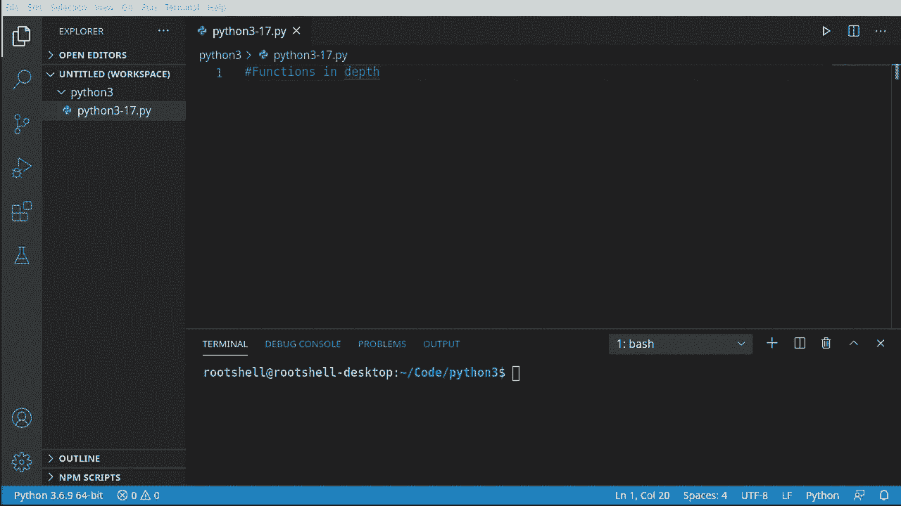
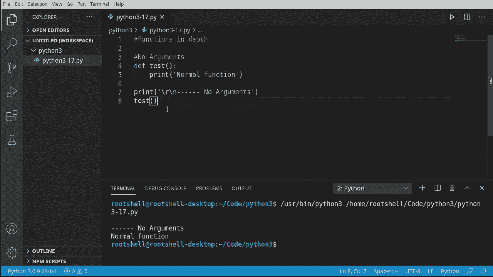
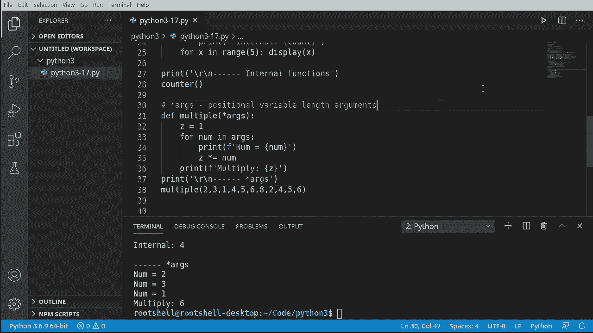
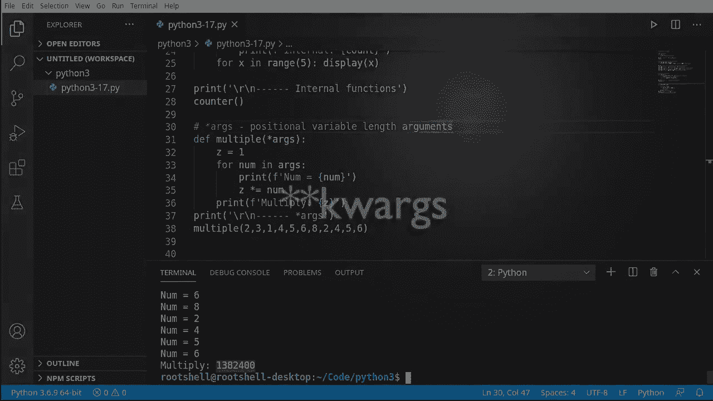
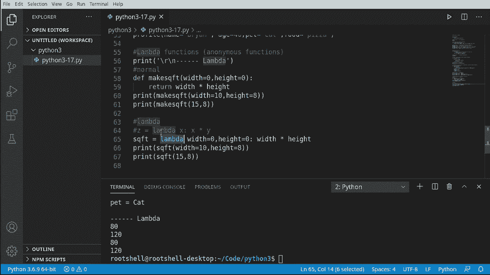

# Python 3全系列基础教程，P17：17）函数进阶 🚀





在本节课中，我们将深入探讨Python函数的进阶概念，包括不同类型的参数传递、内部函数以及匿名函数。掌握这些知识将帮助你编写更灵活、更强大的代码。

***

## 从基础开始

上一节我们介绍了函数的基本概念。本节中，我们来看看如何为函数传递参数。首先，我们从一个最简单的无参数函数开始，作为我们进阶学习的起点。




```python
def normal_function():
    print("这是一个正常的函数。")
```

调用这个函数，它会按预期工作。如果此时你对函数基础感到不清晰，建议先回顾前面的课程。

***

## 位置参数与关键字参数

上一节我们介绍了无参数函数，本节中我们来看看如何向函数传递信息。我们将探讨两种主要的参数传递方式：位置参数和关键字参数。

我们定义一个接收参数的函数：

```python
def message(name, msg, age):
    print(f"你好，{name}。{msg} 你{age}岁了。")
```

以下是调用此函数的两种主要方式：

**1. 位置参数**
调用函数时，根据参数定义的位置顺序传递值。

```python
message("布莱恩", "早上好", 22)
# 输出：你好，布莱恩。早上好 你22岁了。
```

如果顺序错误，输出将变得混乱：

```python
message(22, "早上好", "布莱恩")
# 输出：你好，22。早上好 你布莱恩岁了。
```

**2. 关键字参数**
调用函数时，直接指定参数名和对应的值，顺序不再重要。

```python
message(msg="早上好", age=46, name="布莱恩")
# 输出：你好，布莱恩。早上好 你46岁了。
```

**3. 混合使用**
你也可以混合使用位置参数和关键字参数，但位置参数必须在关键字参数之前。

```python
message("布莱恩", age=46, msg="早上好")
# 输出：你好，布莱恩。早上好 你46岁了。
```

***

## 内部函数

上一节我们讨论了如何向函数传递参数，本节中我们来看看函数内部的结构。Python允许在一个函数内部定义另一个函数，这被称为内部函数或嵌套函数。

```python
def counter():
    count = 0
    def show(x):
        print(f"内部函数被调用，计数：{x}")
    for x in range(5):
        show(x)

counter()
# 输出：
# 内部函数被调用，计数：0
# 内部函数被调用，计数：1
# ...
```

内部函数 `show` 只在 `counter` 函数的作用域内有效。在外部尝试调用 `show()` 会导致 `NameError`。



***



## 可变长度参数

上一节我们介绍了内部函数，本节中我们来看看如何让函数接收不确定数量的参数。这在处理未知输入时非常有用。

**1. 可变长度位置参数 (`*args`)**
使用一个星号 `*` 前缀的参数可以接收任意数量的位置参数，它们会被打包成一个元组。

```python
def multiply(*numbers):
    result = 1
    for num in numbers:
        result *= num
    print(f"位置参数元组：{numbers}")
    print(f"乘积结果：{result}")

multiply(1, 2, 3)  # 输出：位置参数元组：(1, 2, 3)， 乘积结果：6
multiply(2, 3, 1)  # 输出：位置参数元组：(2, 3, 1)， 乘积结果：6
```

**2. 可变长度关键字参数 (`**kwargs`)**
使用两个星号 `**` 前缀的参数可以接收任意数量的关键字参数，它们会被打包成一个字典。

```python
def profile(**person):
    print(f"人员信息字典：{person}")
    def show(key):
        if key in person:
            print(f"{key}: {person[key]}")
    show('name')
    show('age')

profile(name="布莱恩", age=46)
# 输出：
# 人员信息字典：{'name': '布莱恩', 'age': 46}
# name: 布莱恩
# age: 46

profile(name="布莱恩", age=46, pet="凯")
# 输出：
# 人员信息字典：{'name': '布莱恩', 'age': 46, 'pet': '凯'}
# name: 布莱恩
# age: 46
```

***

## Lambda匿名函数

上一节我们处理了可变参数，本节中我们来看看一种简洁的函数定义方式：Lambda表达式，也称为匿名函数。

Lambda函数用于创建小巧、一次性的函数对象，其语法为：`lambda 参数: 表达式`。

首先，我们看一个普通的函数：

```python
def sqft(width, height):
    return width * height

print(sqft(10, 8))  # 输出：80
print(sqft(15, 8))  # 输出：120
```

现在，使用Lambda表达式实现相同的功能：

```python
sqft_lambda = lambda width, height: width * height

print(sqft_lambda(10, 8))  # 输出：80
print(sqft_lambda(15, 8))  # 输出：120
```

Lambda函数通常用于需要函数对象作为参数的场景，例如排序或映射操作，能使代码更简洁。

***

## 总结



本节课中我们一起学习了Python函数的进阶知识。
我们探讨了**位置参数**和**关键字参数**的区别与混合使用方法。
我们了解了如何在函数内部定义**内部函数**，并理解了其作用域限制。
我们掌握了使用 `*args` 和 `**kwargs` 来处理**可变长度参数**的技巧。
最后，我们学习了使用 `lambda` 关键字创建简洁的**匿名函数**。
这些概念是构建复杂、灵活程序的重要基石，请务必多加练习以熟练掌握。