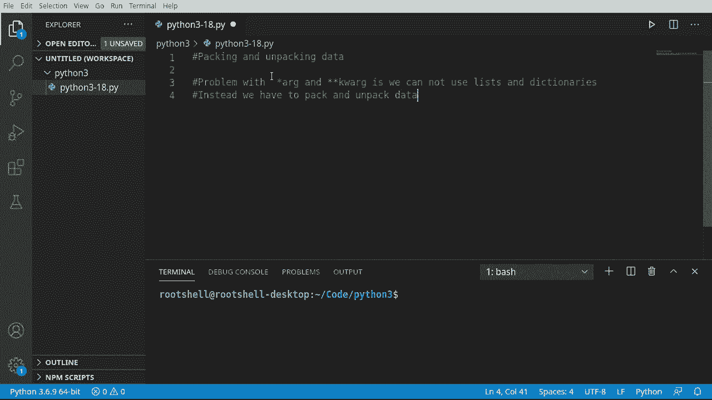
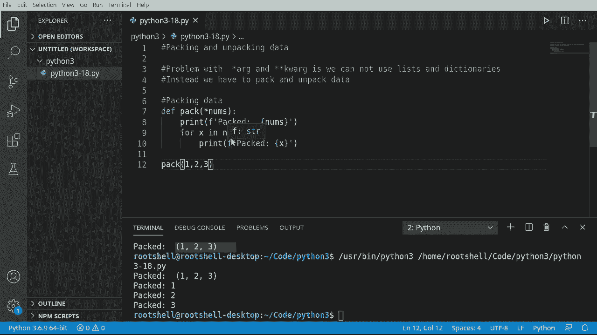
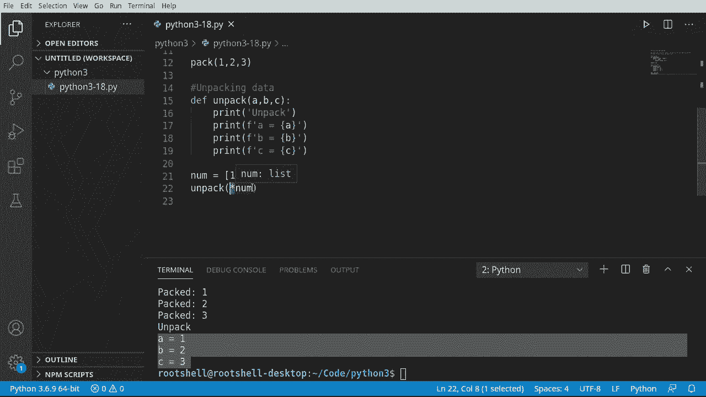
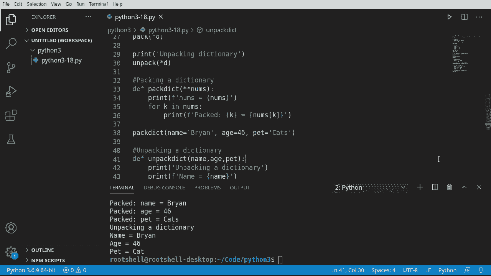

# Python 3全系列基础教程，P18：18）打包和解包数据 📦➡️📤


在本节课中，我们将要学习Python中一个非常实用的概念：数据的打包与解包。我们将了解如何使用星号（`*`）和双星号（`**`）来高效地处理函数参数，特别是当参数来自列表、元组或字典时。




## 概述

在之前的课程中，我们学习了函数的位置参数和关键字参数。然而，当我们想将列表、元组或字典中的元素直接传递给函数时，会遇到一些困难。打包和解包操作就是为了解决这个问题而设计的。它们允许我们将多个值“打包”成一个集合传递给函数，或者将一个集合“解包”成多个独立的参数。

---

## 打包数据

上一节我们介绍了课程目标，本节中我们来看看如何“打包”数据。打包听起来复杂，但在Python中非常简单。它的核心思想是使用一个星号（`*`）来接收任意数量的位置参数，并将它们组合成一个元组。



以下是打包数据的基本语法：


```python
def pack(*args):
    print(args)
```

让我们通过一个例子来理解它：

```python
def pack(*nums):
    print(nums)
    for x in nums:
        print(x)

pack(1, 2, 3)
```

运行这段代码，你会看到 `nums` 变成了一个包含 `(1, 2, 3)` 的元组。函数内部的循环可以轻松地访问其中的每一个元素。这个过程就是“打包”：将多个独立的参数 `1, 2, 3` 打包成了一个元组 `nums`。

---

## 解包数据

学会了如何打包数据后，本节中我们来看看相反的操作：“解包”。解包是指将一个序列（如列表、元组）中的元素，拆分成独立的参数传递给函数。

以下是解包数据的基本语法，在调用函数时使用星号（`*`）：



```python
def unpack(a, b, c):
    print(a, b, c)


numbers = [1, 2, 3]
unpack(*numbers)  # 等价于 unpack(1, 2, 3)
```

如果我们直接传递列表 `numbers` 给 `unpack` 函数，Python会报错，因为它期望三个独立的参数，而不是一个列表。通过在列表前加上 `*`，我们告诉Python：“请把这个列表解包，将其中的元素作为单独的参数传递进去。”

---

## 处理字典的打包与解包

与列表和元组类似，字典也有其特殊的打包和解包方式，但需要使用双星号（`**`）。这是因为字典包含的是键值对，对应函数的关键字参数。

### 打包字典（接收关键字参数）

当我们在函数定义中使用双星号（`**kwargs`）时，它可以接收任意数量的关键字参数，并将它们打包成一个字典。

以下是打包字典的示例：

```python
def pack_dict(**kwargs):
    print(kwargs)
    for key, value in kwargs.items():
        print(f"{key}: {value}")

pack_dict(name="Brian", age=46, pet="cat")
```

运行代码，`kwargs` 会变成一个字典 `{'name': 'Brian', 'age': 46, 'pet': 'cat'}`。双星号（`**`）将所有传入的关键字参数打包成了这个字典。

### 解包字典（传递关键字参数）

反过来，如果我们有一个字典，想把它里面的键值对作为关键字参数传递给函数，也需要使用双星号（`**`）。

以下是解包字典的示例：

```python
def unpack_dict(name, age, pet):
    print(f"Name: {name}, Age: {age}, Pet: {pet}")

my_dict = {"name": "Brian", "age": 46, "pet": "cat"}
unpack_dict(**my_dict)  # 等价于 unpack_dict(name="Brian", age=46, pet="cat")
```

通过在字典前使用 `**`，我们告诉Python将字典中的每个键值对解包成一个独立的关键字参数。

> **注意**：直接对字典使用单星号（`*`）只会解包出字典的键（key），而不是键值对。因此处理字典时必须使用双星号（`**`）。

---

## 总结

本节课中我们一起学习了Python中数据的打包与解包操作。

*   **打包**：使用 `*args` 将多个位置参数收集为元组，使用 `**kwargs` 将多个关键字参数收集为字典。
*   **解包**：在函数调用时，使用 `*` 将序列解包为多个位置参数，使用 `**` 将字典解包为多个关键字参数。

这些技巧极大地增加了函数调用的灵活性，使我们能够轻松地在函数和数据结构（列表、元组、字典）之间传递数据。记住，单星号（`*`）用于处理序列和位置参数，双星号（`**`）用于处理字典和关键字参数。



