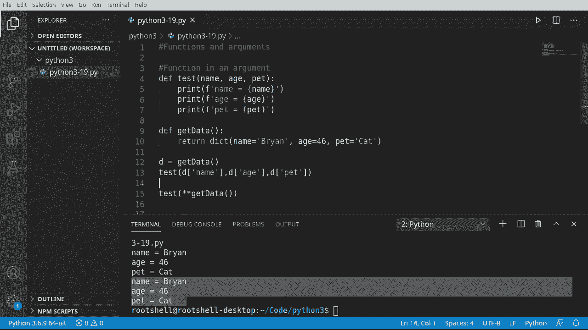
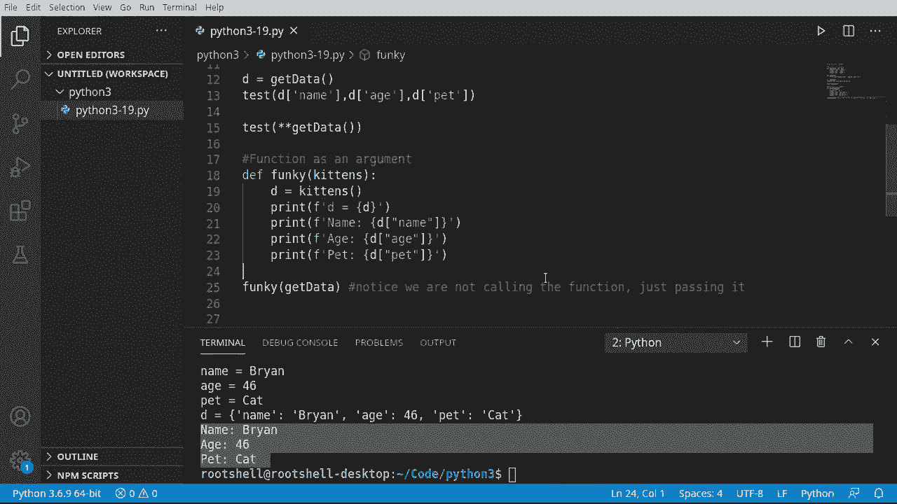

# Python 3全系列基础教程，P19：19）函数和参数 🧩


在本节课中，我们将要学习一个高级但非常实用的概念：将函数作为参数传递给另一个函数。这能极大地提升代码的灵活性和复用性。

## 函数作为参数的基本概念

上一节我们介绍了函数的定义和调用，本节中我们来看看如何将函数本身作为参数进行传递。

假设我们有一个打印个人信息的函数 `test`。

```python
def test(name, age, pet):
    print(name)
    print(age)
    print(pet)
```

同时，我们还有一个返回字典数据的函数 `get_data`。

```python
def get_data():
    name = input("输入你的名字：")
    age = input("输入你的年龄：")
    pet = input("输入你的宠物：")
    return {'name': name, 'age': age, 'pet': pet}
```

现在面临一个基本问题：如何将 `get_data` 函数返回的数据传递给 `test` 函数？

## 结合使用函数与数据

以下是两种结合使用函数与数据的方法。

第一种是标准方式，即分别调用函数并手动传递参数。

```python
data = get_data()
test(data['name'], data['age'], data['pet'])
```

这种方式有效，但代码较长，且如果数据结构改变，需要修改多处。

第二种是更简洁的方式，利用参数解包。



```python
test(**get_data())
```


在这行代码中，`**` 运算符将 `get_data()` 返回的字典解包为 `name=value, age=value, pet=value` 的形式，然后传递给 `test` 函数。这种方式简单高效。


## 将函数作为参数传递

接下来，我们将讨论一个更核心的概念：将一个函数作为参数传递给另一个函数。

我们创建一个新函数 `funky`，它接受一个参数 `data`。

```python
def funky(data):
    d = data()
    print(d)
```

请注意，在 `funky` 函数内部，我们将参数 `data` 当作一个函数来调用：`data()`。这意味着，当我们调用 `funky` 时，需要传递一个函数给它。

现在，我们可以将之前定义的 `get_data` 函数传递给 `funky`。

```python
funky(get_data)
```

运行这段代码，`funky` 函数会调用 `get_data()`，获取返回的字典，并将其打印出来。这里的关键在于，`get_data` 这个函数名被作为参数传递，并在 `funky` 内部被调用。

我们还可以在 `funky` 函数中进一步处理返回的数据。

```python
def funky(data):
    d = data()
    print(f"名字是：{d['name']}")
    print(f"年龄是：{d['age']}")
    print(f"宠物是：{d['pet']}")

funky(get_data)
```

这种方式非常灵活，允许我们动态决定在 `funky` 中执行哪个函数。



## 课程总结

本节课中我们一起学习了函数的高级用法：将函数作为参数传递。

我们首先回顾了如何定义和使用函数，然后探讨了如何将函数返回的数据通过解包方式传递给另一个函数。最后，我们深入学习了核心概念——将函数本身作为参数传递，这允许我们编写出更通用、更灵活的代码。


掌握这一概念是理解回调函数、高阶函数等更高级编程模式的重要基础。