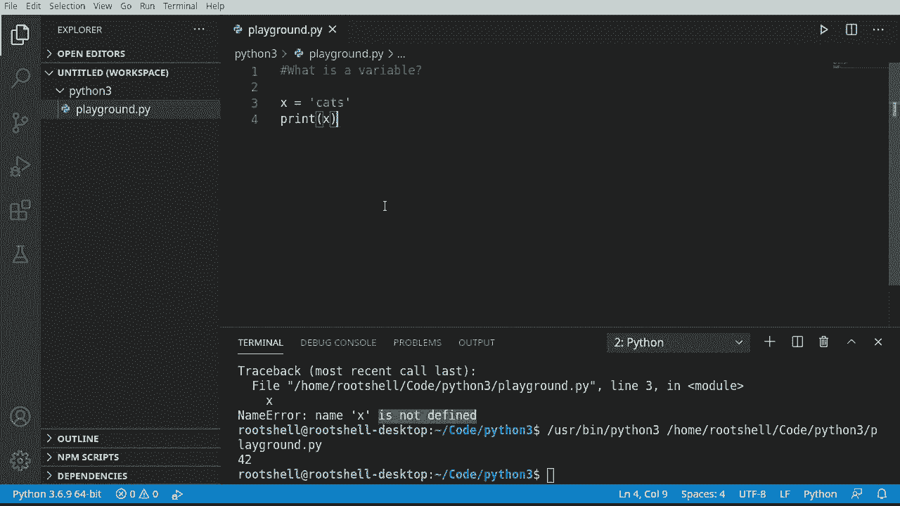
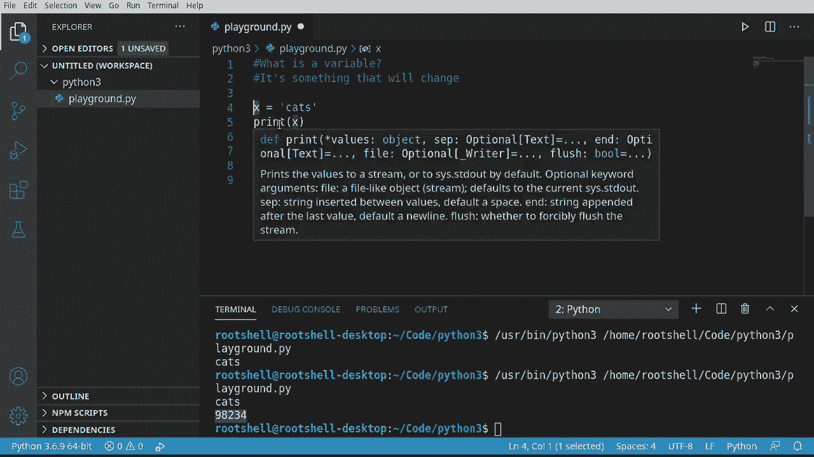

# Python 3全系列基础教程，P2：Python变量 🧩


在本节课中，我们将要学习Python编程中一个最基础也最重要的概念：**变量**。我们将了解什么是变量，如何在Python中创建和使用它们，以及Python处理变量类型的一些独特特性。

---

## 什么是变量？

变量是编程中用于存储信息的容器。你可以把它想象成一个贴有标签的盒子，标签是变量的名字，而盒子里装的东西就是变量的值。这个值可以是数字、文本或其他类型的数据。

上一节我们介绍了如何运行Python代码，本节中我们来看看如何存储和操作数据。

在Python中，创建一个变量并为其赋值非常简单，只需使用等号 `=`。等号左边是变量名，右边是你想存储的值。

```python
x = 42
```

在这行代码中，我们创建了一个名为 `x` 的变量，并将整数值 `42` 赋给了它。

---

## 使用变量



创建变量后，你就可以在代码中使用它。例如，我们可以使用 `print()` 函数来显示变量的值。


```python
x = 42
print(x)
```

运行这段代码，控制台会输出 `42`。

**重要提示**：在Python中，你必须先给变量赋值，然后才能使用它。尝试打印一个未赋值的变量会导致错误。

```python
print(y)  # 这会导致 NameError: name 'y' is not defined
```

错误信息 `NameError` 意味着Python不认识这个变量名，因为它还没有被定义和赋值。

---

## 变量可以改变

“变量”之所以叫变量，是因为它的值是可以变化的。你可以在程序运行过程中随时为同一个变量赋予新的值。

```python
x = 42
print(x)  # 输出：42

x = "cats"
print(x)  # 输出：cats
```

在这段代码中，变量 `x` 首先存储了数字 `42`，然后又被更改为存储字符串 `"cats"`。Python允许这种操作。

---

## Python的数据类型

变量中存储的值有不同的类型，这被称为**数据类型**。Python会自动识别你赋给变量的值是什么类型。

以下是几种基本的数据类型：
*   **整数**：没有小数点的数字，如 `42`, `-10`, `0`。
*   **字符串**：由一系列字符组成的文本，需要用单引号 `' '` 或双引号 `" "` 包围，如 `"Hello"`, `'cats'`。
*   **浮点数**：带有小数点的数字，如 `3.14`, `-0.5`。

在后台，Python会聪明地跟踪每个变量的数据类型。这意味着作为程序员，你通常不需要明确告诉Python“这是一个整数”或“这是一个字符串”。

---

## 动态类型与强类型

Python在变量类型处理上有两个重要特点：**动态类型**和**强类型**。这对初学者来说可能有些抽象，但理解它们有助于避免未来的一些困惑。

*   **动态类型**：指的是你不需要在创建变量时声明其类型（例如，不需要写 `int x = 42`），并且一个变量可以在生命周期中被重新赋值为不同的类型（就像前面 `x` 从整数变成字符串的例子）。Python是动态类型的语言。

*   **强类型**：指的是Python解释器会严格区分不同的数据类型。例如，你不能直接将一个字符串和一个数字相加，除非你明确地进行类型转换。

    ```python
    number = 10
    text = "20"
    # print(number + text)  # 这会导致 TypeError: unsupported operand type(s) for +: 'int' and 'str'
    ```

    在其他一些语言中，可能会自动将字符串 `"20"` 转换为数字 `20` 然后相加，得到 `30`。但Python不会这样做，它会报错，要求你明确自己的意图。这就是“强类型”的含义——类型规则很严格。



简单来说，**动态类型**让你写代码更灵活，**强类型**则保证了代码行为的明确性和安全性。

---

## 总结

本节课中我们一起学习了Python变量的核心知识：
1.  **变量**是存储数据的命名容器，使用等号 `=` 进行赋值。
2.  变量必须**先赋值后使用**，否则会引发 `NameError`。
3.  变量的值可以**改变**，甚至可以改变为不同的数据类型。
4.  Python是**动态类型**语言，无需声明变量类型。
5.  Python也是**强类型**语言，它会严格检查数据类型操作，避免意外行为。

记住，变量是编程的基石。在接下来的课程中，我们将深入学习各种**数据类型**及其强大的操作方法。