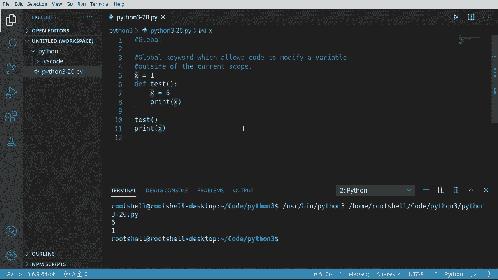
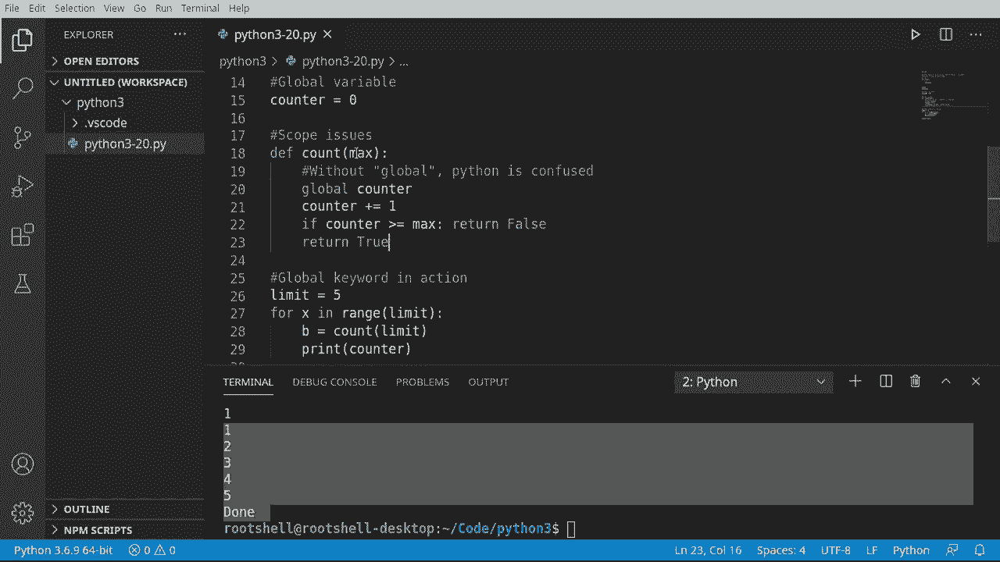

# Python 3全系列基础教程，P20：20）全局关键字 🔑


在本节课中，我们将要学习Python中的`global`关键字。这个关键字用于在函数内部访问和修改全局作用域中的变量。理解`global`关键字对于处理变量作用域至关重要，它能解决因作用域混淆而导致的常见错误。

## 作用域回顾

上一节我们介绍了函数和作用域的基本概念。本节中我们来看看当函数内外存在同名变量时会发生什么。



在Python中，每当你定义一个函数，就创建了一个新的局部作用域。函数内部定义的变量通常只在该函数内部有效。例如，观察以下代码：


```python
x = 1

def my_func():
    x = 6
    print(x)

my_func()
print(x)
```

运行这段代码，输出结果是`6`和`1`。这表明函数内部的`x`和外部的`x`是两个完全独立的变量，它们分别属于不同的作用域。

## 访问全局变量

有时，我们希望在函数内部读取全局作用域中的变量。如果函数内部没有定义同名变量，Python会自动向外层作用域查找。

```python
x = 1

def my_func():
    # 函数内部没有定义x，因此访问全局的x
    print(x)

my_func()  # 输出: 1
```

## 修改全局变量的挑战

然而，如果我们尝试在函数内部修改一个全局变量，就会遇到问题。Python会认为我们想在函数内部创建一个新的局部变量。

```python
counter = 0

def increment():
    # 这行代码试图修改全局的counter，但会导致错误
    counter += 1

increment()
```

运行上述代码会引发`UnboundLocalError`错误，提示“局部变量‘counter’在赋值前被引用”。这是因为Python在函数内部看到对`counter`的赋值操作（`+=`），就将其视为一个新的局部变量，但在执行`counter += 1`时，这个局部变量尚未被定义。

## 使用`global`关键字

这正是`global`关键字发挥作用的地方。它明确告诉Python解释器，函数内使用的某个变量是全局作用域中已定义的变量，而不是创建一个新的局部变量。

以下是使用`global`关键字的语法和示例：

```python
counter = 0

def increment():
    global counter  # 声明counter是全局变量
    counter += 1    # 现在可以安全地修改全局的counter

print(counter)  # 输出: 0
increment()
print(counter)  # 输出: 1
```

通过添加`global counter`这一行，我们明确指示函数使用并修改全局变量`counter`，从而避免了作用域冲突。

## 实践示例

让我们看一个更完整的例子，它使用`global`关键字来实现一个简单的计数器功能：

```python
limit = 5
counter = 0

def can_increment():
    global counter
    if counter >= limit:
        return False
    else:
        counter += 1
        return True

# 尝试递增计数器直到达到限制
for i in range(10):
    if can_increment():
        print(f"计数成功，当前值: {counter}")
    else:
        print("已达到计数上限")
        break
```

在这个例子中，`can_increment`函数使用`global counter`来检查和修改全局计数器，确保其行为符合预期。

## 关于最佳实践

虽然`global`关键字功能强大，但在标准编程实践中，应尽量避免在函数内部修改全局变量。过度依赖全局变量会使代码难以理解和维护，因为数据的流动和修改变得不清晰。

更好的做法是：
*   **传递参数**：将所需的值作为参数传递给函数。
*   **返回值**：让函数通过返回值来传递结果。
*   **使用类**：将相关的数据和函数封装在类中。

这些方法能提供更好的封装性和代码组织。`global`关键字应被视为在特定情况下解决作用域问题的工具，而非常规手段。

## 总结



本节课中我们一起学习了Python的`global`关键字。我们回顾了变量作用域的概念，看到了在函数内部修改全局变量时可能遇到的问题，并学习了如何使用`global`关键字来明确声明和修改全局变量。最后，我们讨论了在编程中谨慎使用全局变量和`global`关键字的重要性，以编写出更清晰、更易维护的代码。记住，良好的封装和明确的数据流是高质量代码的关键。