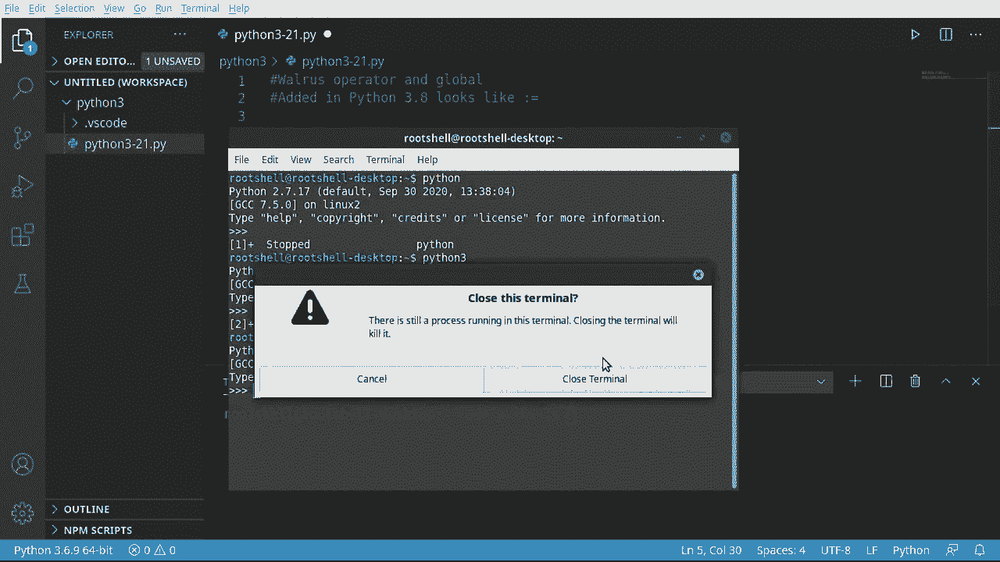

# Python 3全系列基础教程，P21：21）海象运算符 🦭


在本节课中，我们将要学习Python 3.8版本引入的一个新特性——**海象运算符**。这个运算符因其独特的语法`:=`形似海象的脸而得名。我们将了解它的作用、语法规则以及在实际编程中的使用方法。

## 概述与版本要求



海象运算符允许我们在表达式中为变量赋值，从而简化代码。但需要注意的是，此功能仅在Python 3.8或更高版本中可用。

如果你不确定当前使用的Python版本，可以在终端中输入`python --version`或`python3 --version`进行查看。如果你的版本低于3.8，需要前往Python官网下载并安装新版本。

## 基本语法与常见问题

海象运算符的基本形式是`变量名 := 表达式`。它的作用是在计算表达式的同时，将结果赋值给变量。

上一节我们介绍了它的基本概念，本节中我们来看看使用时的关键注意事项。初学者最容易遇到的问题就是忘记使用括号。

请看以下示例：
```python
# 错误示例：缺少括号会导致语法错误
# why = walrus := len(“hello”)
# print(why)

# 正确示例：使用括号包裹整个海象运算符表达式
why = (walrus := len(“hello”))
print(why)  # 输出：5
```
在编程和数学中，括号内的内容拥有最高优先级。使用括号可以明确告诉Python先计算`:=`表达式，再用其结果替换括号整体。忘记添加括号是导致错误的最常见原因。

## 实际应用示例

理解了基本语法后，我们通过一个更贴近实际的例子来加深理解。

以下是使用海象运算符简化条件判断的示例：
```python
people = [“我”, “我的妻子安”, “家庭狗”]

# 错误示例：漏掉括号，结果可能出乎意料
# if n := len(people) <= 3:
#     print(n)  # 这会输出 True 或 False，而不是长度

# 正确示例：用括号明确范围
if (n := len(people)) <= 3:
    print(n)  # 输出列表长度：3
```
在这个例子中，我们同时完成了获取列表长度和进行条件判断两件事，代码更加紧凑。

## 综合案例

为了全面展示海象运算符的用途，我们来看一个稍复杂的例子，它在一个循环中结合了多个操作。

以下是综合使用海象运算符的代码结构：
```python
lines = []
max_lines = 5

def can_add_more():
    # 使用海象运算符在表达式中创建变量
    allowed = (count := len(lines)) < max_lines
    print(f”还可以输入 {max_lines - count} 条”)
    return allowed

# 在while循环条件中使用海象运算符获取用户输入
while (user_input := input(“请输入内容（直接回车退出）: “)) != “” and can_add_more():
    lines.append(user_input)
    print(f”当前列表：{lines}”)

print(“输入完成。”)
```
在这个案例中，我们多次使用了海象运算符：
1.  在函数`can_add_more`内部，同时计算列表长度并赋值给`count`，然后进行判断。
2.  在`while`循环条件中，同时获取用户输入并赋值给`user_input`，然后检查其是否为空。

它的核心优势在于**减少代码行数**，将赋值和表达式求值合并为一步。但同时也可能降低代码的可读性，因此需要谨慎使用。

## 核心要点总结

本节课中我们一起学习了海象运算符（`:=`）的使用。

最后，我们来总结一下海象运算符的核心要点：
*   **语法**：`变量名 := 表达式`
*   **作用**：在计算表达式的同时将结果赋值给变量。
*   **关键点**：使用时**必须用括号**`()`将整个`:=`表达式括起来。
*   **版本**：仅适用于 **Python 3.8+**。
*   **优点**：可以简化代码，减少重复语句。
*   **缺点**：过度使用可能使代码难以阅读。

记住，每当你看到海象运算符`:=`，就想象它需要“张嘴”的括号，而括号内的“食物”（表达式）将被“吃下”并赋值给左边的变量。合理运用这个工具，可以让你的代码更加简洁高效。