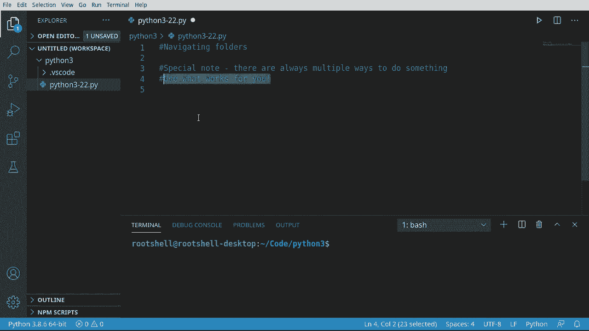
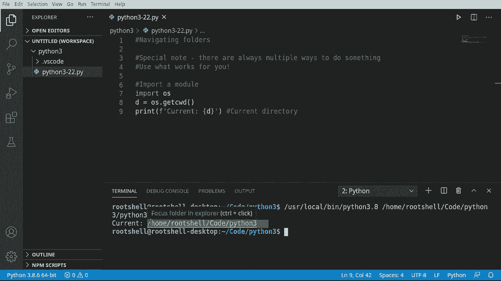
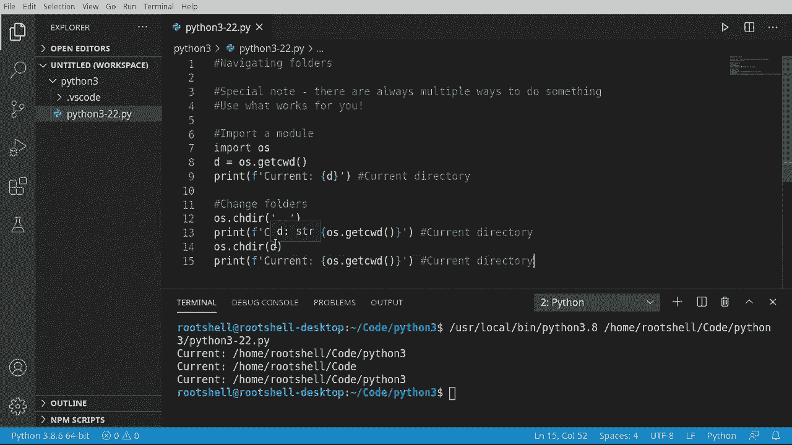
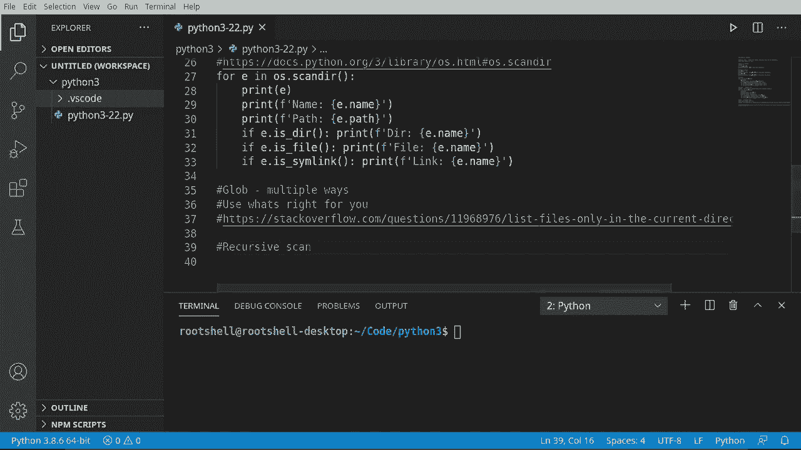
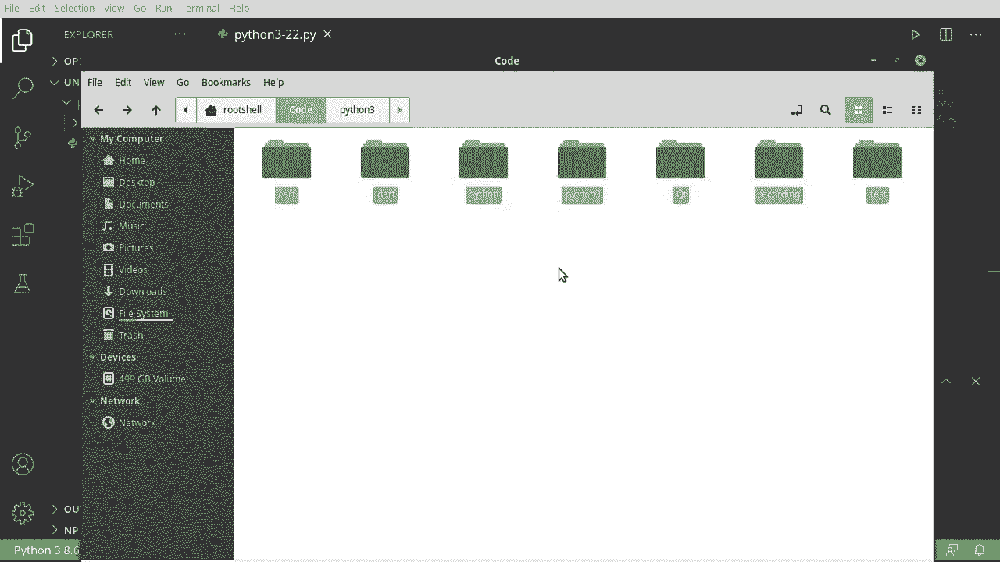

# Python 3全系列基础教程，P22：文件夹操作 📁


在本节课中，我们将要学习如何在Python中操作文件夹。我们将了解如何获取当前工作目录、更改目录、列出目录内容，并探索几种不同的方法来实现这些功能。每种方法都有其特点，我们将逐一介绍，帮助你理解如何选择适合自己需求的方式。

## 概述



文件夹操作是文件系统管理的基础。Python通过`os`和`glob`等模块提供了丰富的功能来处理文件夹。本节将介绍如何导入模块、获取和更改当前工作目录，以及使用`os.listdir`、`os.scandir`、`glob.glob`和`os.walk`等方法来遍历文件夹内容。


---

## 导入模块

首先，我们需要导入`os`模块。模块是一组预先编写好的代码，我们可以直接使用它们的功能。

```python
import os
```

导入模块后，我们就可以使用其中定义的函数和变量了。

---

## 获取当前工作目录

每个程序都在操作系统的某个目录下运行。这个目录称为“当前工作目录”。我们可以使用`os.getcwd()`函数来获取它。




```python
d = os.getcwd()
print(f"当前工作目录是: {d}")
```

运行上述代码，你将看到程序当前所在的完整路径。例如，输出可能类似于`/home/user/code/python3`。

---

## 更改当前工作目录

如果我们想切换到另一个文件夹，可以使用`os.chdir()`函数。这个函数接受一个表示目标路径的字符串作为参数。

例如，使用`..`可以切换到父目录：

```python
# 切换到父目录
os.chdir('..')
print(f"切换后目录是: {os.getcwd()}")

# 切换回原来的目录
os.chdir(d)
print(f"切换回目录: {os.getcwd()}")
```



**注意**：`os.chdir()`要求目标路径必须存在，否则程序会出错。


---

## 列出目录内容

有多种方法可以列出文件夹中的文件和子文件夹。以下是几种常见的方法。

### 使用 `os.listdir()`

`os.listdir()`是最简单的方法之一，它返回指定目录中所有条目名称的列表。

```python
# 列出当前目录的所有条目
entries = os.listdir('.')
print("当前目录内容:")
for entry in entries:
    print(entry)
```

这段代码会打印出当前文件夹下所有文件和文件夹的名字。

---

### 获取条目的完整路径

有时我们需要条目的完整路径，而不仅仅是名字。可以使用`os.path.abspath()`来获取绝对路径。

```python
for entry in entries:
    full_path = os.path.abspath(entry)
    print(f"条目: {entry}, 绝对路径: {full_path}")
```

---

### 区分文件和文件夹

我们可以使用`os.path.isdir()`和`os.path.isfile()`来判断一个条目是文件夹还是文件。

```python
for entry in entries:
    full_path = os.path.abspath(entry)
    if os.path.isdir(full_path):
        print(f"{full_path} 是一个目录")
    elif os.path.isfile(full_path):
        print(f"{full_path} 是一个文件")
    # 某些系统还支持符号链接，可以用 os.path.islink() 检查
```

---

## 使用 `os.scandir()`

从Python 3.5开始，引入了`os.scandir()`。它比`os.listdir()`速度更快，并且返回的是`DirEntry`对象，这些对象包含了条目的更多信息。

```python
with os.scandir('.') as it:
    for entry in it:
        print(f"名称: {entry.name}, 路径: {entry.path}")
        if entry.is_file():
            print(f"  -> 这是一个文件")
        elif entry.is_dir():
            print(f"  -> 这是一个目录")
```

**重要提示**：调用`entry.is_file()`等方法时，**不要忘记括号**，例如`entry.is_file()`是正确的，`entry.is_file`（没有括号）会导致错误的结果。

---

## 使用 `glob` 进行模式匹配

`glob`模块支持使用通配符（如`*`和`?`）来查找文件，并且可以轻松地进行递归搜索。

首先需要导入`glob`模块：

```python
import glob
```

---

### 递归列出所有文件





使用`**`通配符并设置`recursive=True`参数，可以递归地搜索所有子文件夹。

```python
# 切换到父目录以便有更多内容可搜索
os.chdir('..')
current_dir = os.getcwd()

# 递归查找当前目录及其所有子目录下的所有文件
all_files = glob.glob(current_dir + '/**', recursive=True)
print("递归找到的所有文件:")
for file in all_files:
    print(file)
```

`**`模式会匹配零个或多个目录层级。

---

## 使用 `os.walk()` 遍历目录树

`os.walk()`是另一个强大的工具，用于生成目录树中的文件名。它返回一个三元组`(dirpath, dirnames, filenames)`。

```python
# 遍历当前目录
for dirpath, dirnames, filenames in os.walk('.'):
    print(f"正在访问目录: {dirpath}")
    for filename in filenames:
        # 使用 os.path.join 拼接完整路径
        full_path = os.path.join(dirpath, filename)
        print(f"  文件: {full_path}")
```

`os.walk()`默认进行深度优先遍历，非常适合处理嵌套的文件夹结构。

---

## 总结

本节课中我们一起学习了Python中进行文件夹操作的核心方法：

1.  **获取和更改目录**：使用`os.getcwd()`和`os.chdir()`。
2.  **列出目录内容**：
    *   `os.listdir()`：简单列出名称。
    *   `os.scandir()`：更高效，返回包含元数据的对象。
3.  **模式匹配与递归搜索**：使用`glob.glob()`配合通配符进行灵活的文件查找。
4.  **遍历目录树**：使用`os.walk()`递归访问所有子文件夹和文件。

正如开头提到的，完成同一任务常有多种方法。`os.listdir`简单直接，`os.scandir`性能更佳，`glob`擅长模式匹配，`os.walk`专为递归遍历设计。关键在于理解它们的特点，并根据你的具体场景选择最合适的一种。在初学阶段，可以都尝试一下，找到自己用起来最顺手的方式。