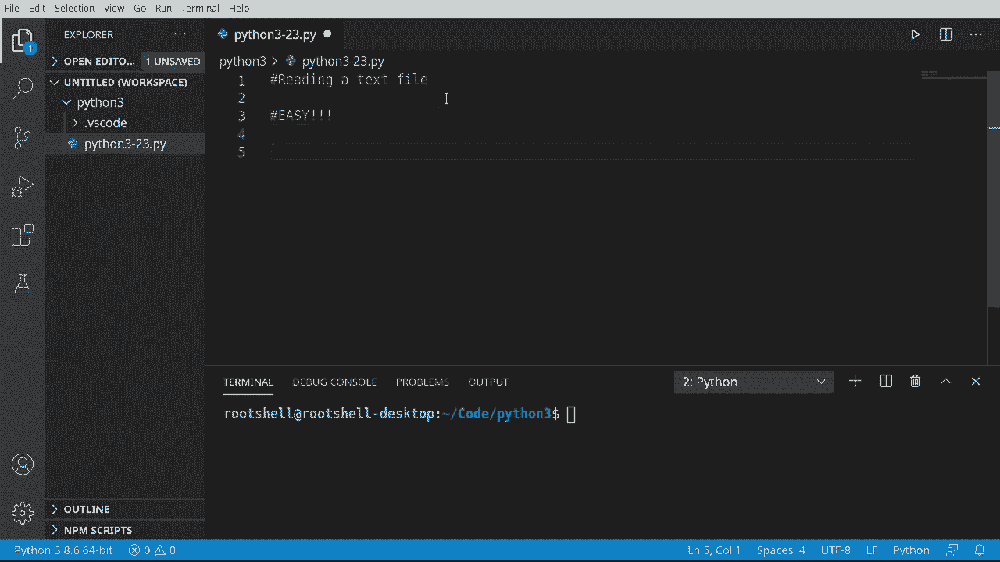
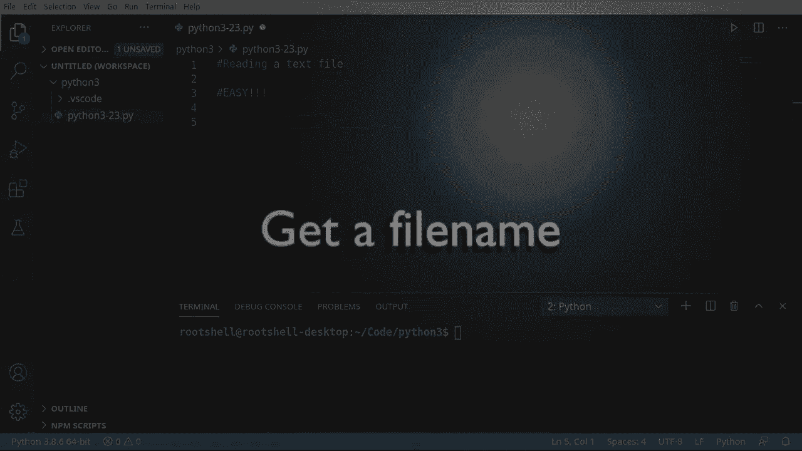
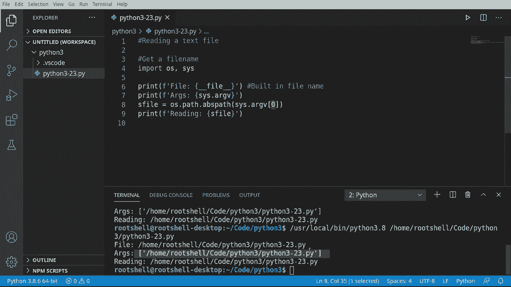
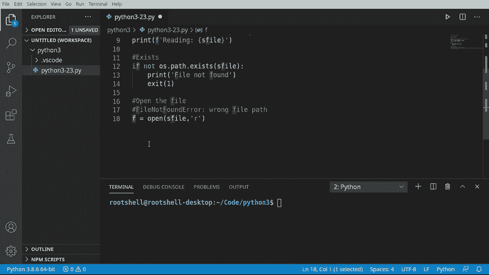
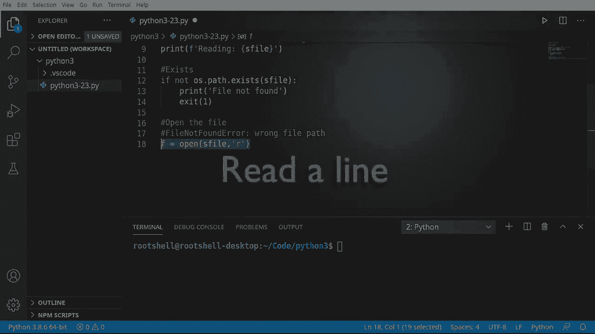
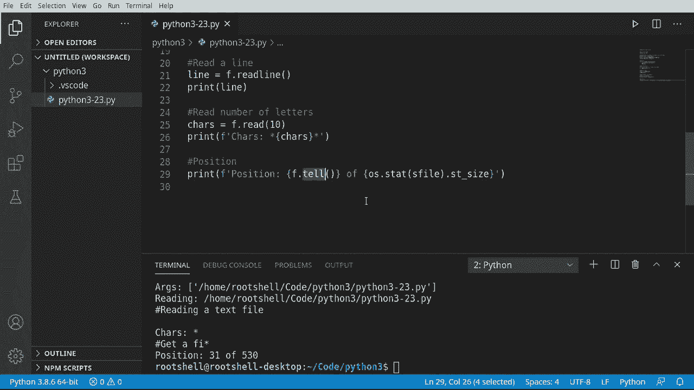
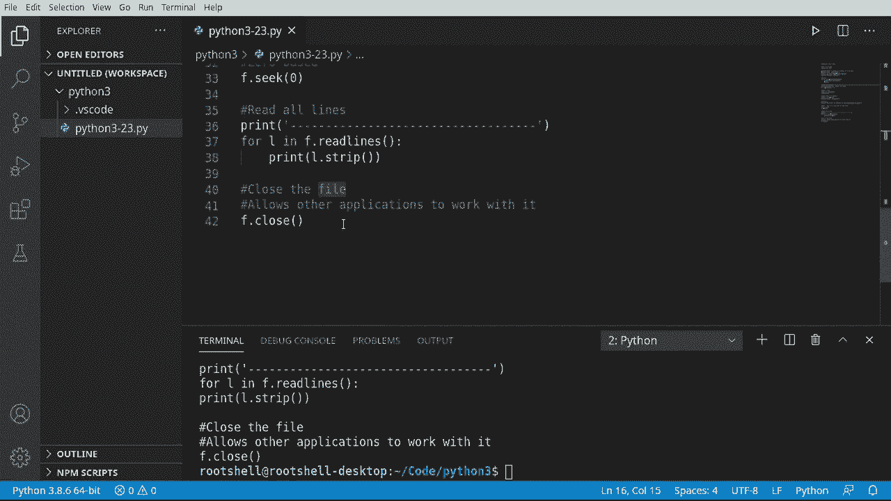

# Python 3全系列基础教程，P23：读取文本文件 📖




在本节课中，我们将学习如何在Python中读取文本文件。你将了解如何定位文件、检查文件是否存在、打开文件、读取文件内容以及如何安全地关闭文件。这是处理文件数据的基础。



## 概述

读取文本文件是Python编程中的一项基本操作。本节将引导你完成从获取文件路径到读取文件内容的完整流程，并解释其中的关键概念。

## 获取当前脚本的文件名

首先，我们需要获取要读取的文件名。为了不干扰其他应用程序，我们将读取当前正在运行的脚本文件本身。

以下是获取文件名的几种方法。

```python
import os, sys

# 方法一：使用 __file__ 内置变量
print("方法一:", __file__)

# 方法二：使用 sys.argv 参数列表
print("方法二:", sys.argv[0])

# 获取文件的绝对路径
full_path = os.path.abspath(sys.argv[0])
print("文件的绝对路径是:", full_path)
```




**`sys.argv[0]`** 是Python在运行脚本时传递的参数列表中的第一个参数，它代表当前脚本的名称。

## 检查文件是否存在

在尝试打开文件之前，最好先确认文件是否存在，以避免程序运行错误。

如果文件不存在，程序应该给出提示并退出。

```python
import os
import sys

# 假设我们要检查的文件名是当前脚本
filename = os.path.abspath(sys.argv[0])

if not os.path.exists(filename):
    print(f"文件 {filename} 不存在。")
    sys.exit(1)  # 非零退出码通常表示错误
else:
    print("文件存在，可以继续。")
```

**`os.path.exists()`** 函数用于检查指定路径的文件或目录是否存在。

## 打开并读取文件

确认文件存在后，我们就可以打开它进行读取操作了。打开文件时，需要指定模式。





对于只读文本文件，我们使用模式 **`'r'`**。

```python
# 打开文件
file_object = open(filename, 'r')
print("文件已打开。")
```

打开文件后，会返回一个文件对象，并且一个“不可见的光标”会定位在文件的起始位置（索引0）。

## 读取文件内容

有多种方法可以从文件中读取内容。

### 读取单行

使用 **`.readline()`** 方法可以读取文件的一行。

```python
# 读取第一行
first_line = file_object.readline()
print("文件的第一行是:", first_line)
```

### 读取指定数量的字符

使用 **`.read(size)`** 方法可以读取指定数量的字符。

```python
# 读取10个字符
first_10_chars = file_object.read(10)
print("前10个字符是:", first_10_chars)
```

### 文件位置（光标）

随着读取操作的进行，文件内部的光标会向前移动。我们可以使用 **`.tell()`** 方法获取当前光标的位置，使用 **`.seek()`** 方法移动光标。

```python
# 获取当前光标位置
current_position = file_object.tell()
print(f"当前光标位置: {current_position}")



# 获取文件总大小（字节）
file_size = os.stat(filename).st_size
print(f"文件总大小: {file_size} 字节")


# 将光标移回文件开头
file_object.seek(0)
print("光标已移回文件开头。")
```

**`.seek(0)`** 将光标重置到文件的起始位置。

### 读取所有行

使用 **`.readlines()`** 方法可以一次性读取文件的所有行，返回一个字符串列表。

```python
# 读取所有行
all_lines = file_object.readlines()

# 打印每一行（使用strip移除每行末尾的换行符）
for line in all_lines:
    print(line.strip())
```

在处理行时，使用 **`.strip()`** 方法可以移除字符串首尾的空白字符（包括换行符 `\n`），使输出更整洁。

## 关闭文件

非常重要的一点是，打开文件后必须关闭它，以释放系统资源并允许其他程序访问该文件。

```python
# 关闭文件
file_object.close()
print("文件已关闭。")
```

养成 **`open()`** 之后必定 **`close()`** 的习惯，可以避免“资源泄漏”问题。

## 总结

本节课中我们一起学习了如何读取文本文件。我们涵盖了以下关键步骤：
1.  使用 **`sys.argv[0]`** 或 **`__file__`** 获取当前文件名。
2.  使用 **`os.path.exists()`** 检查文件是否存在。
3.  使用 **`open(filename, 'r')`** 以只读模式打开文本文件。
4.  使用 **`.readline()`**、**`.read(size)`** 和 **`.readlines()`** 方法读取内容。
5.  理解了文件内部的光标概念，并使用 **`.tell()`** 和 **`.seek()`** 进行控制。
6.  最后，使用 **`.close()`** 方法关闭文件，释放资源。



掌握这些基础操作，是你未来处理更复杂文件和数据任务的第一步。