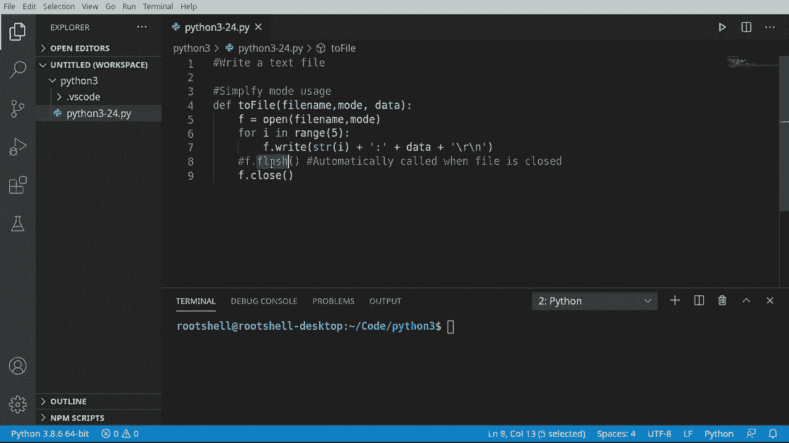
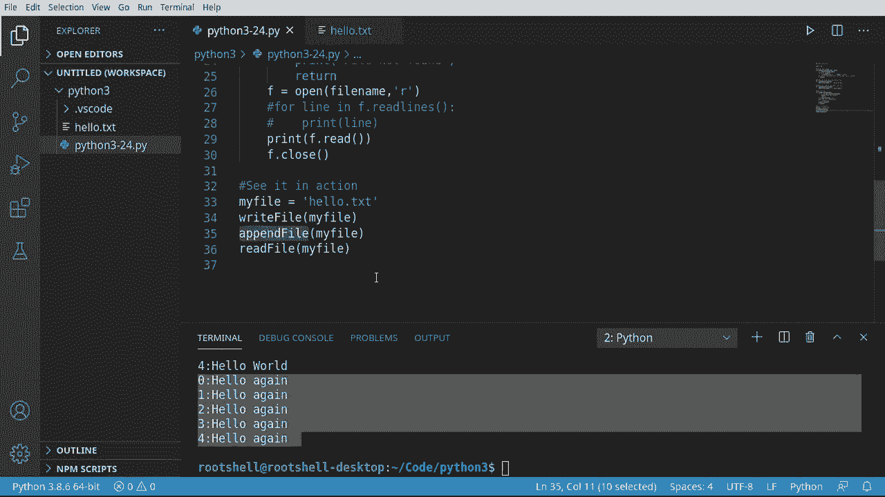
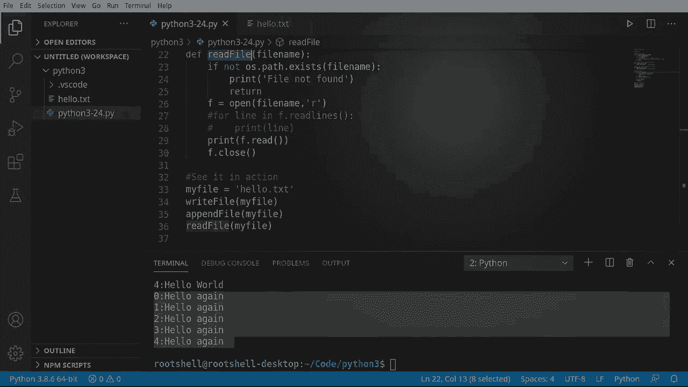

# Python 3全系列基础教程，P24：二进制文件操作 📁➡️💾


在本节课中，我们将要学习如何使用Python进行二进制文件操作。我们将重点讨论两种核心模式：写入（`w`）和追加（`a`），并理解它们之间的关键区别。同时，我们会编写一个通用的函数来简化文件操作，并学习如何安全地读取文件内容。

## 概述与目标

上一节我们介绍了文本文件的基本读取操作。本节中，我们来看看如何向文件写入内容，并深入理解写入和追加模式的不同行为。我们的首要目标是简化文件操作模式的使用，通过编写一个通用函数来避免重复代码。

## 核心概念：写入与追加模式

在Python中，使用 `open()` 函数打开文件时，需要指定一个模式参数。对于写入操作，主要使用两种模式：

*   **写入模式 (`‘w’`)**：此模式会**覆盖**现有文件。如果文件已存在，其原有内容将被完全清除，然后从头开始写入新数据。
*   **追加模式 (`‘a’`)**：此模式会**添加**内容到现有文件。它会将文件指针移动到文件末尾，然后开始写入新数据，原有内容得以保留。

**公式/代码表示核心操作：**
```python
# 以写入模式打开文件（覆盖）
with open(‘filename.txt‘, ‘w‘) as file:
    file.write(‘新内容‘)

# 以追加模式打开文件（添加）
with open(‘filename.txt‘, ‘a‘) as file:
    file.write(‘追加的内容‘)
```

## 构建通用写入函数




为了简化代码并实现重用，我们将创建一个通用的文件写入函数。这个函数可以处理不同的模式（写入或追加）。

以下是该函数的关键步骤：

1.  使用 `open(filename, mode)` 打开文件。
2.  循环写入数据。注意，写入前需将非字符串数据（如整数）转换为字符串。
3.  可选择性地使用 `flush()` 方法立即将缓冲区数据写入磁盘（通常关闭文件时会自动处理）。
4.  使用 `close()` 方法关闭文件，确保所有操作完成并释放资源。

**代码示例：通用写入函数**
```python
def write_to_file(filename, mode, data):
    """将数据写入指定文件"""
    f = open(filename, mode)
    for i in range(5):
        # 将数字转换为字符串后与数据一起写入
        f.write(str(i) + ‘: ‘ + data + ‘\n‘)
    # f.flush() # 可选：立即写入磁盘
    f.close()
```

**关于 `flush()` 的说明**：`flush()` 方法用于强制将缓冲区中的数据立即写入物理磁盘。在大多数情况下，当文件被关闭（`close()`）时，Python会自动执行此操作。但在需要确保数据实时写入（例如在日志记录或嵌入式系统中）的场景下，可以手动调用 `flush()`。

## 安全读取文件

在写入文件后，我们通常需要读取它以验证内容。为了安全地读取文件，尤其是在处理可能不存在的文件时，良好的做法是先检查文件是否存在。

以下是读取文件内容的步骤：

1.  使用 `os.path.exists(filename)` 检查目标文件是否存在。
2.  如果文件存在，则以读取模式（`‘r‘`）打开文件。
3.  使用 `readlines()` 方法逐行读取内容（适用于大文件，避免内存不足），或使用 `read()` 一次性读取全部内容（仅适用于小文件）。
4.  处理完毕后关闭文件。

**代码示例：安全读取函数**
```python
import os

def read_file_safely(filename):
    """安全地读取文件内容"""
    if not os.path.exists(filename):
        print(f“文件 {filename} 不存在。”)
        return

    f = open(filename, ‘r‘)
    # 方法1：一次性读取（仅用于小文件）
    # content = f.read()
    # print(content)

    # 方法2：逐行读取（推荐，尤其对于大文件）
    for line in f.readlines():
        print(line.strip()) # 使用strip()移除末尾的换行符

    f.close()
```

## 操作演示与对比

现在，让我们使用上面定义的函数来演示写入和追加模式的区别。

首先，我们调用写入函数创建一个新文件或覆盖已有文件。
```python
filename = ‘hello.txt‘
write_to_file(filename, ‘w‘, ‘Hello World‘)
```
执行后，`hello.txt` 文件的内容将被清空，并写入新的5行“Hello World”。

接着，我们调用追加函数向同一文件添加内容。
```python
write_to_file(filename, ‘a‘, ‘Hello Again‘)
```
执行后，新的5行“Hello Again”会被添加到 `hello.txt` 文件的末尾，而之前“Hello World”的内容保持不变。

最后，我们读取文件以查看最终结果。
```python
read_file_safely(filename)
```
输出将显示文件包含10行文本：前5行是“Hello World”，后5行是“Hello Again”。





## 总结


本节课中我们一起学习了Python的二进制文件操作核心知识。我们明确了**写入模式(`‘w’`)**会覆盖文件而**追加模式(`‘a’`)**会添加内容的根本区别。通过构建一个通用的 `write_to_file` 函数，我们实践了代码重用的理念。此外，我们还介绍了安全读取文件的模式，包括检查文件是否存在和推荐使用逐行读取的方式来处理大文件。记住，在进行文件写入操作，尤其是使用写入模式时，务必谨慎，因为这会永久删除文件的现有内容。