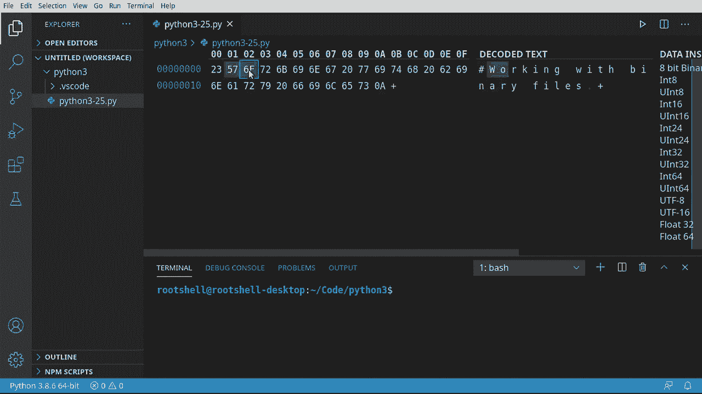
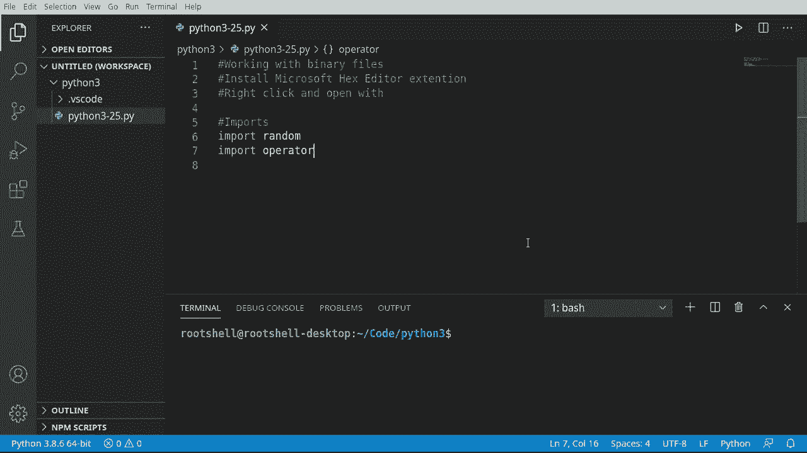
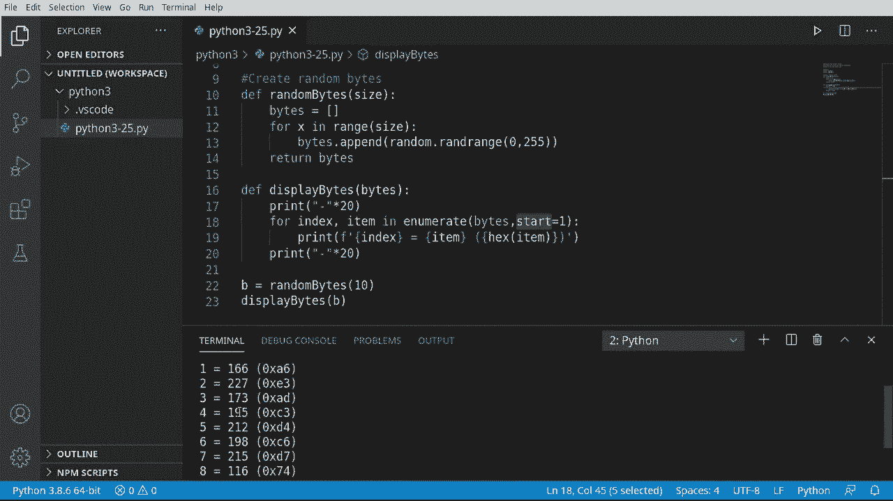
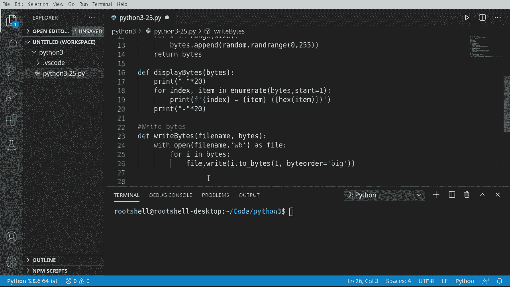
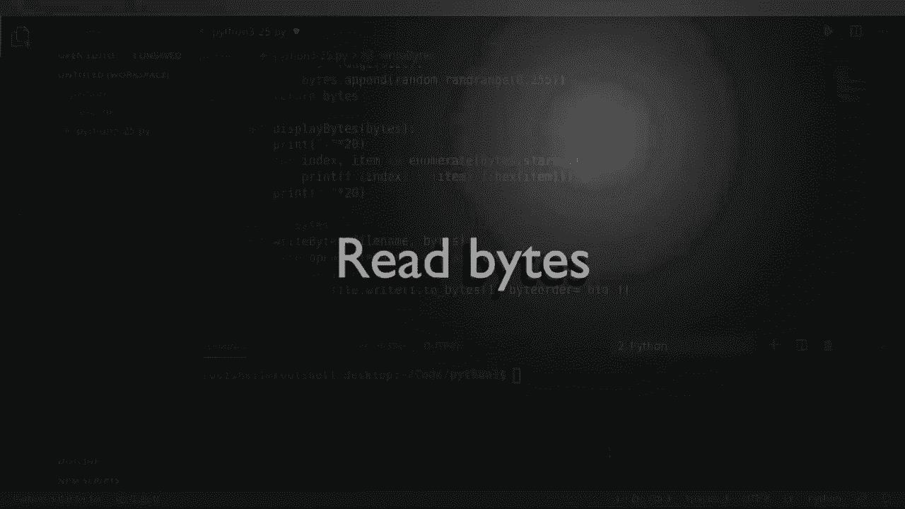
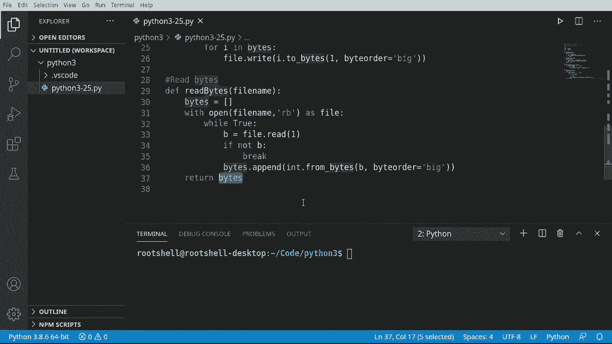
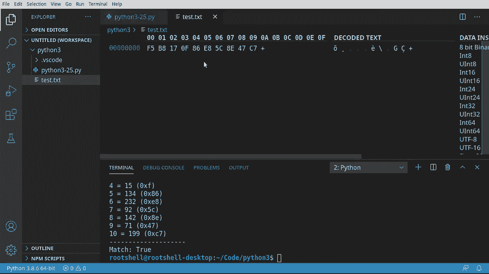
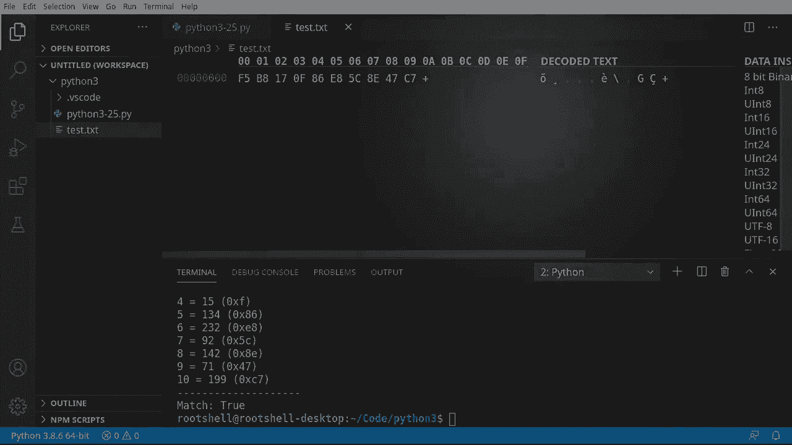

# Python 3全系列基础教程，P25：25）处理二进制文件 📂


在本节课中，我们将学习如何处理二进制文件。我们将了解什么是二进制数据，它与纯文本的区别，并学习如何在Python中读取和写入二进制数据。

---

## 什么是二进制数据？🔍

上一节我们介绍了文本文件的处理，本节中我们来看看二进制文件。首先，什么是二进制数据？我们之前处理的是纯文本文件，但计算机在底层存储和处理数据时，使用的是二进制格式。



二进制数据是计算机直接处理的原始数据，由0和1组成。我们通常不直接处理这些原始的0和1，而是处理它们的表示形式，例如十六进制或十进制数字。


为了直观地查看二进制数据，我们可以使用十六进制编辑器。它可以将文件内容以十六进制数值和对应的文本字符形式显示出来。

例如，字符 `#` 在十六进制中表示为 `23`，字符 `W` 表示为 `57`。直接以二进制或十六进制方式读写数据非常繁琐，因此我们让Python来处理这些底层细节，我们只需操作数据的表示形式。

---




## 准备工作：导入模块与生成随机数据 🛠️

在开始读写二进制文件之前，我们需要做一些准备工作，包括导入必要的模块和生成一些用于演示的随机数据。

以下是本教程将用到的核心模块和函数：

```python
import random
import operator
```

我们将使用 `random` 模块来生成随机数，使用 `operator` 模块中的 `eq` 函数来比较两个列表是否相等。

接下来，我们创建一个函数来生成指定数量的随机字节（实际上是0到255之间的随机整数列表）。

```python
def random_bytes(size):
    byte_list = []
    for _ in range(size):
        byte_list.append(random.randrange(0, 256))
    return byte_list
```

这个函数接受一个参数 `size`，并返回一个包含 `size` 个随机整数的列表。

为了查看生成的数据，我们可以编写一个辅助函数来同时显示每个字节的十进制和十六进制表示。

```python
def display_bytes(byte_list):
    output_string = ""
    for index, item in enumerate(byte_list, start=1):
        output_string += f"{index} = {item} (0x{item:02X})\n"
    print(output_string)
```



使用 `enumerate(byte_list, start=1)` 可以让索引从1开始，更符合人类的阅读习惯。`0x{item:02X}` 会将整数格式化为两位的十六进制数。


---

## 写入二进制文件 💾

现在我们已经有了数据，接下来看看如何将这些数据写入一个二进制文件。这与写入文本文件不同，我们需要明确告诉Python我们正在处理二进制模式。

我们使用 `open()` 函数，并在模式参数后加上 `'b'` 来表示二进制模式。例如，`'wb'` 表示以二进制模式写入。

以下是写入二进制文件的函数：

```python
def write_bytes(filename, byte_list):
    with open(filename, 'wb') as file:
        for b in byte_list:
            file.write(b.to_bytes(1, byteorder='big'))
```

代码解析：
1.  `with open(filename, 'wb') as file:` 使用 `with` 语句打开文件。`'wb'` 模式表示写入二进制文件。`with` 语句会在代码块执行完毕后自动关闭文件，无需手动调用 `file.close()`。
2.  `b.to_bytes(1, byteorder='big')`：将整数 `b` 转换为1个字节的数据。`byteorder='big'` 指定了字节序，对于单个字节来说，字节序的影响不大，此处仅作演示。

`with` 语句是处理文件等资源的推荐方式，它能确保资源被正确清理。





---

## 读取二进制文件 📖

写入文件后，我们自然需要能够将其读回。读取二进制文件是写入过程的逆操作。

以下是读取二进制文件的函数：

```python
def read_bytes(filename):
    byte_list = []
    with open(filename, 'rb') as file:
        while True:
            b = file.read(1)
            if not b:
                break
            byte_list.append(int.from_bytes(b, byteorder='big'))
    return byte_list
```

代码解析：
1.  `with open(filename, 'rb') as file:` 以二进制读取模式 `'rb'` 打开文件。
2.  `while True:` 开始一个循环，持续读取文件。
3.  `b = file.read(1)`：每次从文件中读取1个字节。
4.  `if not b:`：如果 `b` 是空字节（意味着已经到达文件末尾），则使用 `break` 语句跳出循环。
5.  `int.from_bytes(b, byteorder='big')`：将读取到的一个字节数据转换回整数，并添加到列表中。

这个函数虽然看起来步骤较多，但逻辑清晰：打开文件，循环读取每个字节，将其转换为整数，直到文件结束。




---

## 整合测试：完整的读写流程 🧪

现在，让我们把以上所有部分组合起来，完成一个完整的二进制文件读写测试流程。

以下是完整的测试步骤：

```python
# 1. 生成随机字节数据
output_bytes = random_bytes(10)
print("生成的原始数据：")
display_bytes(output_bytes)

# 2. 将数据写入二进制文件
file_path = 'test.bin'
write_bytes(file_path, output_bytes)
print(f"数据已写入文件: {file_path}")

# 3. 从文件读回数据
input_bytes = read_bytes(file_path)
print("从文件读取的数据：")
display_bytes(input_bytes)

# 4. 验证写入和读取的数据是否一致
if operator.eq(output_bytes, input_bytes):
    print("✅ 匹配成功：写入和读取的数据完全一致。")
else:
    print("❌ 匹配失败：数据不一致。")
```

运行这段代码，你会看到生成的随机数据列表，以及确认从文件读回的数据与最初写入的数据完全一致。这证明了我们的二进制文件读写流程是正确无误的。

**注意**：由于我们使用基于时间的随机数生成器，每次运行程序得到的数据都会不同，这是正常现象。关键在于每次运行时，写入和读回的数据本身是匹配的。

如果你想修改这些数据，只需在调用 `write_bytes` 函数之前，对 `output_bytes` 列表进行处理即可。所有更改都会被忠实地保存到二进制文件中。

---

## 总结 📝

本节课中我们一起学习了Python处理二进制文件的核心知识：

1.  **二进制数据本质**：理解了二进制数据是计算机的原始语言，我们通常通过十六进制或十进制来操作其表示形式。
2.  **文件打开模式**：学习了在 `open()` 函数中使用 `'b'` 模式（如 `'rb'`, `'wb'`）来读写二进制文件。
3.  **关键方法**：
    *   `int.to_bytes()`：将整数转换为字节数据以便写入。
    *   `int.from_bytes()`：将字节数据转换回整数以便读取。
    *   `file.read(1)`：从二进制文件中读取指定数量的字节。
4.  **资源管理**：掌握了使用 `with` 语句自动管理文件资源的最佳实践。
5.  **完整流程**：实践了生成随机数据、写入二进制文件、读取文件并验证数据完整性的完整操作流程。





处理二进制文件是编程中的一项重要技能，常用于处理图像、音频、视频、压缩包或任何自定义格式的文件。现在你已经掌握了基础，可以尝试用这些知识去探索更复杂的数据格式了。