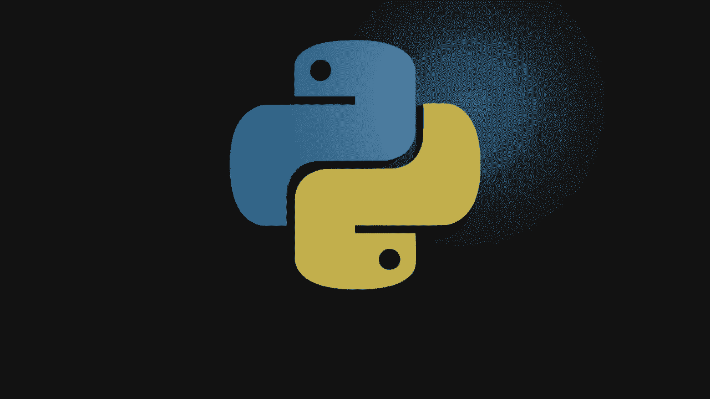
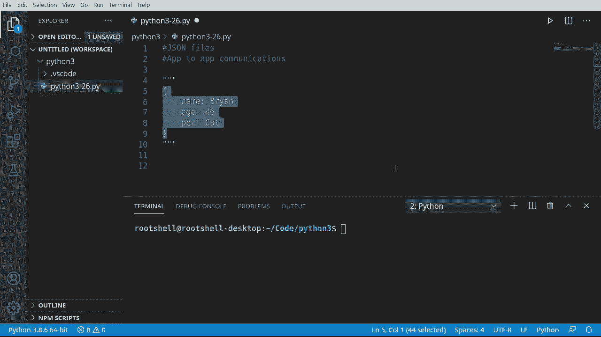
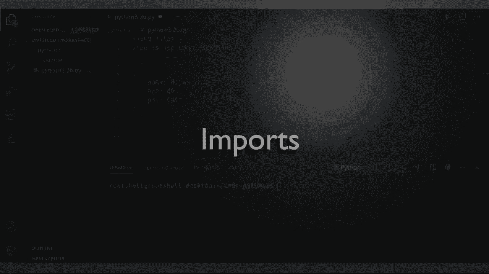
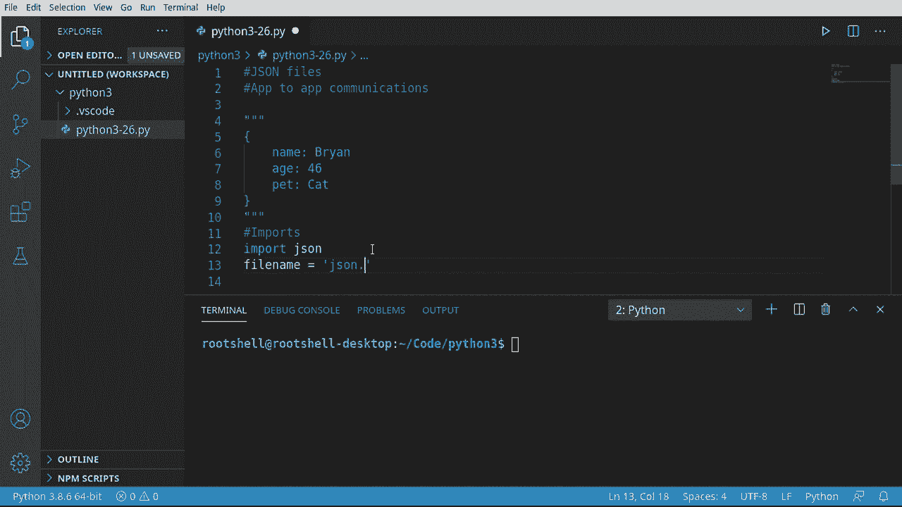
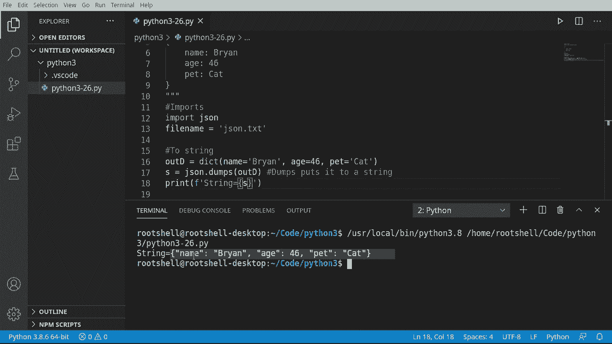
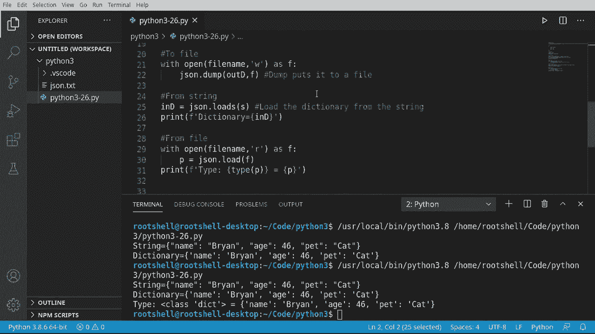

# Python 3全系列基础教程，P26：26）使用 JSON 📄



在本节课中，我们将要学习如何在Python中处理JSON数据。JSON是一种轻量级的数据交换格式，广泛用于网络通信和文件存储。我们将学习如何将Python字典转换为JSON字符串、写入文件，以及如何从字符串和文件中读取并解析JSON数据。

---

上一节我们介绍了Python中常用的数据结构，本节中我们来看看如何将数据转换为一种通用的交换格式——JSON。

## 什么是JSON？

JSON（JavaScript Object Notation）是一种用于应用程序之间通信的数据格式。它旨在作为一种“达成一致的格式”，使得不同程序、不同语言编写的应用能够轻松地交换数据。这种通信可以发生在网络传输、远程过程调用，或者简单的文件读写中。

JSON的结构看起来与Python的字典非常相似，它由键值对组成，但本质上它是一个字符串。





## 导入JSON模块

在深入使用之前，我们需要导入Python内置的`json`模块。这个模块提供了处理JSON数据所需的所有功能，我们无需自己编写复杂的解析代码。

```python
import json
```

---




上一节我们导入了必要的模块，本节中我们来看看如何将Python字典转换为JSON字符串。

## 将字典转换为JSON字符串

我们可以使用`json.dumps()`函数将一个Python对象（通常是字典）序列化为一个JSON格式的字符串。

以下是具体步骤：
1.  创建一个Python字典。
2.  使用`json.dumps()`函数将其转换为JSON字符串。

```python
# 创建一个字典
out_dict = {"name": "布莱恩", "age": 46, "cat": "那只猫"}

# 将字典转换为JSON字符串
json_string = json.dumps(out_dict)
print(json_string)  # 输出：{"name": "\u5e03\u83b1\u6069", "age": 46, "cat": "\u90a3\u53ea\u732b"}
```

**注意**：`json.dumps()`中的`s`代表“字符串”（string），表示结果是字符串。

---

上一节我们学会了如何生成JSON字符串，本节中我们来看看如何将这个字符串写入文件。




## 将JSON数据写入文件

我们可以使用`json.dump()`函数（注意没有`s`）直接将Python对象写入一个文件。这通常与`with open()`语句结合使用，以确保文件被正确关闭。

以下是具体步骤：
1.  使用`with open()`以写入模式（`'w'`）打开一个文件。
2.  使用`json.dump()`函数将字典写入该文件。

```python
filename = "data.json"

# 将字典直接写入JSON文件
with open(filename, 'w', encoding='utf-8') as f:
    json.dump(out_dict, f)
```

**注意**：`json.dump()`用于写入文件，而`json.dumps()`用于生成字符串。

---

上一节我们将数据写入了文件，本节中我们来看看如何从JSON字符串中读取数据。

## 从JSON字符串加载数据

与`dumps`操作相反，我们可以使用`json.loads()`函数将一个JSON格式的字符串反序列化为一个Python对象（通常是字典）。

以下是具体步骤：
1.  准备一个JSON格式的字符串。
2.  使用`json.loads()`函数将其转换为Python字典。

```python
# 假设这是我们从某处得到的JSON字符串
json_str = '{"name": "布莱恩", "age": 46, "cat": "那只猫"}'

# 将JSON字符串转换为字典
in_dict = json.loads(json_str)
print(in_dict)  # 输出：{'name': '布莱恩', 'age': 46, 'cat': '那只猫'}
print(type(in_dict))  # 输出：<class 'dict'>
```

**注意**：`json.loads()`中的`s`同样代表“字符串”。

---

上一节我们从字符串加载了数据，本节中我们来看看如何从JSON文件中读取数据。

## 从JSON文件加载数据

我们可以使用`json.load()`函数（注意没有`s`）直接从文件中读取并解析JSON数据。

以下是具体步骤：
1.  使用`with open()`以读取模式（`'r'`）打开一个JSON文件。
2.  使用`json.load()`函数从文件对象中加载数据。

```python
# 从JSON文件加载数据
with open(filename, 'r', encoding='utf-8') as f:
    file_data = json.load(f)

print(f"数据类型：{type(file_data)}")  # 输出：数据类型：<class 'dict'>
print(f"文件内容：{file_data}")       # 输出：文件内容：{'name': '布莱恩', 'age': 46, 'cat': '那只猫'}
```

现在，`file_data`就是一个标准的Python字典，你可以像使用任何其他字典一样使用它。

---

## 总结

本节课中我们一起学习了JSON在Python中的基本用法。我们了解到：
*   JSON是一种通用的数据交换格式。
*   使用`json.dumps()`可以将Python对象转换为JSON字符串。
*   使用`json.dump()`可以将Python对象直接写入JSON文件。
*   使用`json.loads()`可以将JSON字符串转换回Python对象。
*   使用`json.load()`可以直接从JSON文件中读取数据并转换为Python对象。



整个过程非常简单直接，这使得Python成为处理JSON数据的绝佳选择。记住核心函数`dump`/`dumps`用于输出，`load`/`loads`用于输入，并根据是否操作文件来选择带`s`或不带`s`的版本即可。