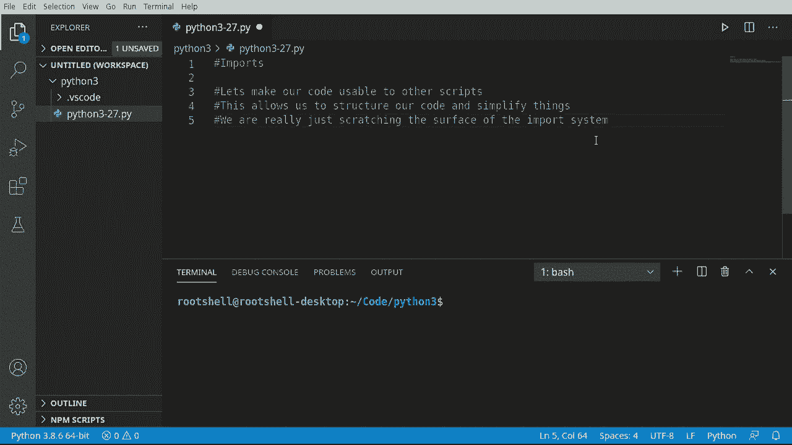
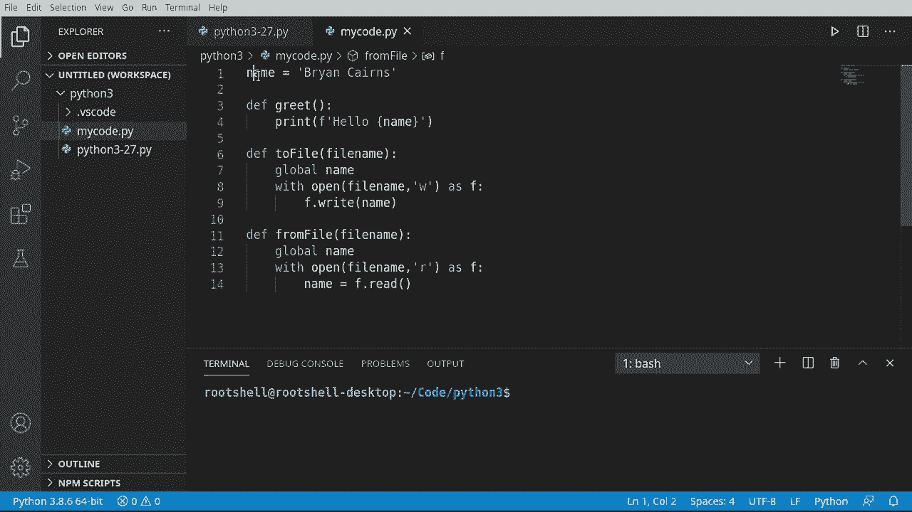
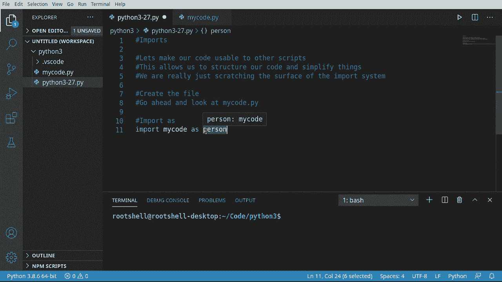
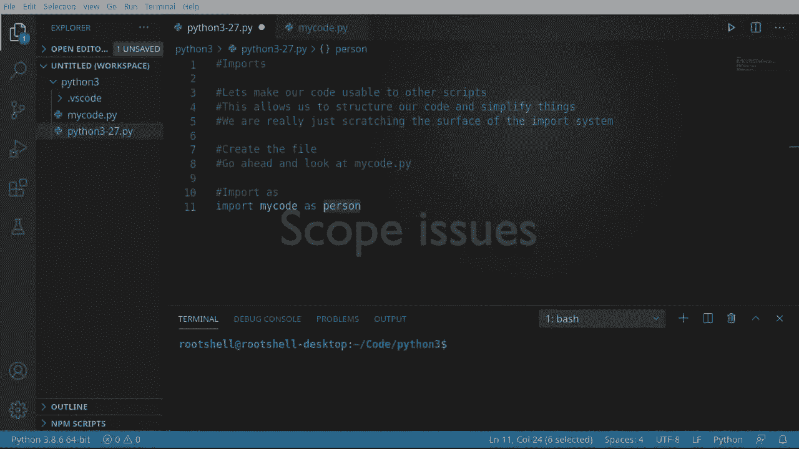
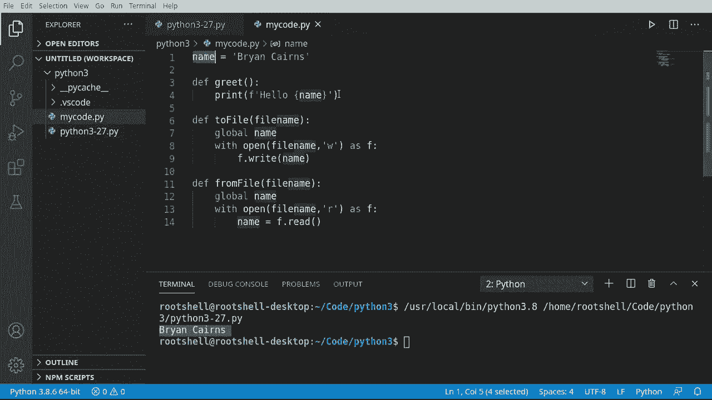
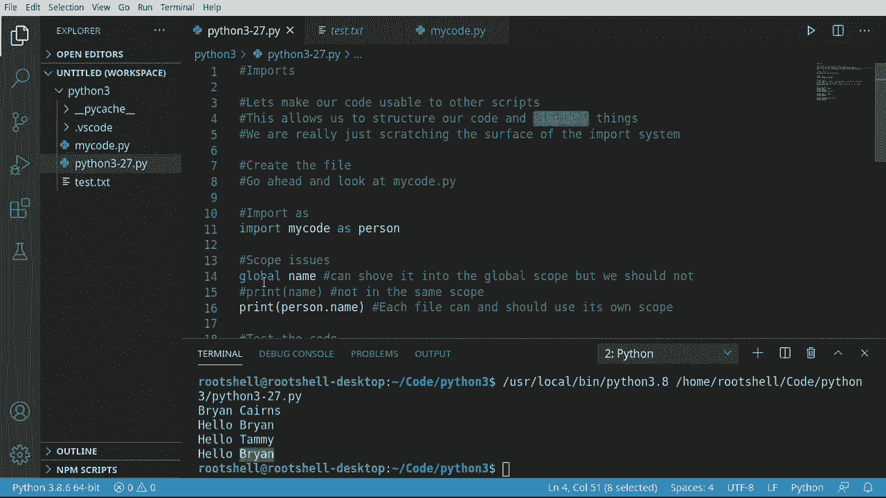

# Python 3全系列基础教程，P27：27）导入工具库 📦


在本节课中，我们将要学习Python中一个非常核心的概念：**导入（Import）**。导入功能允许我们将代码组织到不同的文件中，并让这些文件之间能够相互调用。这不仅能让我们复用自己编写的代码，还能让我们使用他人编写的强大工具库。本节课将重点介绍如何创建和使用自己的模块文件。

## 概述




导入系统是Python模块化编程的基础。通过导入，我们可以将大型项目拆分成多个小文件，使代码结构更清晰、更易于维护。本节我们将创建一个简单的模块文件，并在主程序中导入和使用它，同时理解模块作用域的基本概念。

## 创建模块文件

首先，我们需要创建一个独立的Python文件作为我们的模块。这个文件将包含一些变量和函数。

我们将创建一个名为 `mycode.py` 的新文件。在这个文件中，我们定义一个全局变量和一个函数。

```python
# mycode.py
# 此代码是配套教程的一部分，更多信息请查看主教程文件。

name = "Brian Karen"

def greet():
    """打印问候语"""
    print(f"Hello {name}")

def write_to_file(filename):
    """将name变量的内容写入指定文件"""
    global name
    with open(filename, 'w') as f:
        f.write(name)

def read_from_file(filename):
    """从指定文件读取内容并更新name变量"""
    global name
    with open(filename, 'r') as f:
        name = f.read()
```

以上代码创建了一个模块，其中包含：
1.  一个名为 `name` 的全局字符串变量。
2.  一个用于打印问候的 `greet` 函数。
3.  一个用于将 `name` 写入文件的 `write_to_file` 函数。
4.  一个用于从文件读取内容到 `name` 的 `read_from_file` 函数。



请注意，在函数内部我们使用 `global name` 来声明我们要修改的是模块级的全局变量 `name`。


## 导入并使用模块

创建好模块文件后，我们可以在另一个Python脚本（例如主程序）中导入并使用它。

上一节我们创建了模块文件，本节中我们来看看如何在主程序中使用 `import` 语句来加载这个模块。

回到我们的主Python文件（例如 `main.py`），我们可以使用以下语法导入 `mycode` 模块：

```python
# main.py
import mycode as person
```

这行代码的意思是：导入名为 `mycode.py` 的文件，并在当前脚本中将其作为一个对象引用，这个对象的别名是 `person`。你可以将 `person` 理解为整个 `mycode.py` 文件的“代表”。

此时，`mycode.py` 文件中定义的所有内容（变量、函数）都成为了 `person` 这个对象的属性。

## 理解模块作用域



一个关键概念是：**每个.py文件都有自己的全局作用域**。模块内的全局变量并不自动成为导入它的脚本的全局变量。



为了说明这一点，请观察以下错误操作：

```python
# 错误示例：直接访问 `name` 会导致错误
print(name)  # NameError: name ‘name‘ is not defined
```

即使 `name` 在 `mycode.py` 中是全局变量，在主程序中它也并不存在。要访问模块中的变量，必须通过模块对象（这里是 `person`）来访问。

以下是正确的访问方式：

```python
# 正确示例：通过模块对象访问其属性
print(person.name)  # 输出：Brian Karen
```

通过 `person.name`，我们成功访问到了模块 `mycode` 中定义的 `name` 变量。这清晰地展示了模块作用域的隔离性。

## 调用模块中的功能

理解了如何访问模块属性后，调用其中的函数就很简单了。所有函数也同样是模块对象的属性。

以下是调用模块中函数的示例：

```python
# 1. 调用问候函数
person.greet()  # 输出：Hello Brian Karen

# 2. 修改模块中的name变量
person.name = “Brian“
person.greet()  # 输出：Hello Brian



# 3. 调用函数将当前name写入文件
person.write_to_file(“test.txt“)


# 4. 再次修改name变量
person.name = “Tammy“
person.greet()  # 输出：Hello Tammy

# 5. 调用函数从文件读取name
person.read_from_file(“test.txt“)
person.greet()  # 输出：Hello Brian (从文件读回了之前存储的值)
```

运行上述代码，你可以看到模块的功能被成功调用，并且通过文件操作，变量的状态得以保存和恢复。

## 核心概念与语法总结

以下是本节课涉及的核心操作和概念：

*   **导入模块**：`import module_name`
*   **导入并起别名**：`import module_name as alias`
*   **访问模块属性**：`module_name.attribute_name` 或 `alias.attribute_name`
*   **模块作用域**：每个.py文件是一个独立的命名空间，其全局变量需要通过模块对象访问。

## 总结

本节课中我们一起学习了Python导入系统的基础知识。我们创建了一个自定义模块文件，并在主程序中导入它，实践了如何访问模块中的变量和调用函数。最关键的是，我们理解了**模块拥有独立的作用域**，这需要通过 `模块名.属性名` 的语法来跨越。



导入是构建复杂、结构化Python项目的基石。虽然本节课只触及了表面，但已经为我们后续学习更高级的主题（如包管理、标准库和第三方库）打下了坚实的基础。在接下来的课程中，我们将继续深入探索Python的模块和包系统。