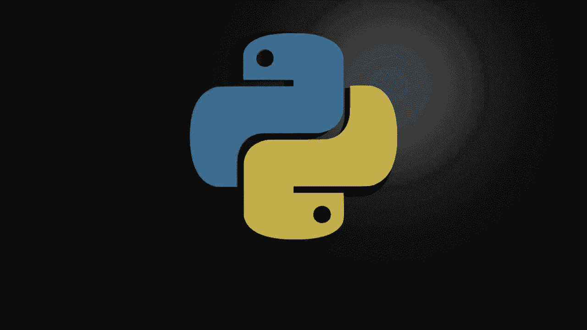
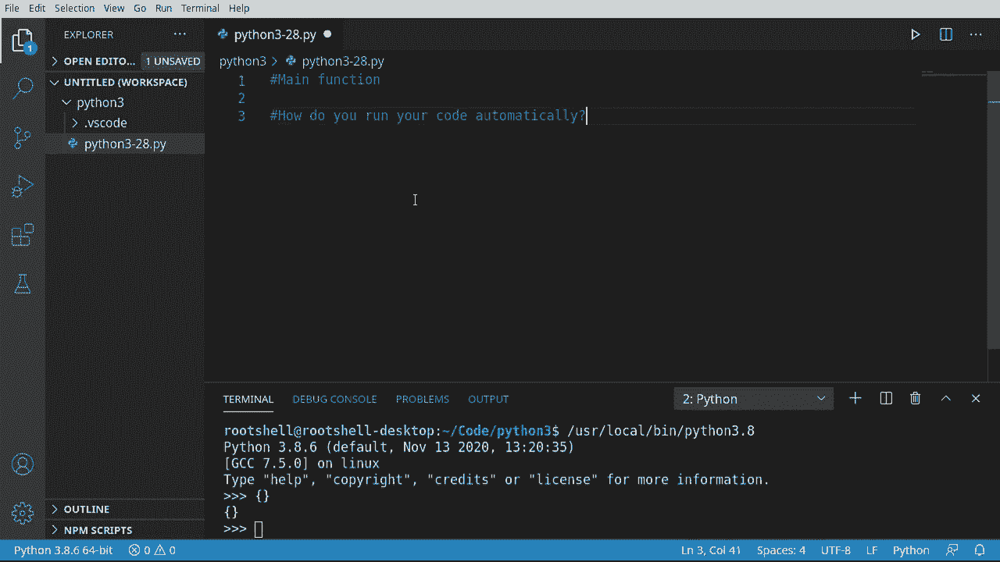
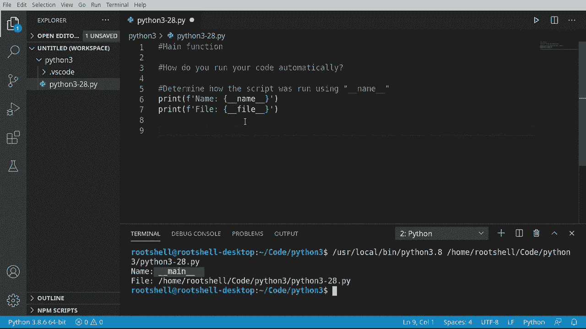
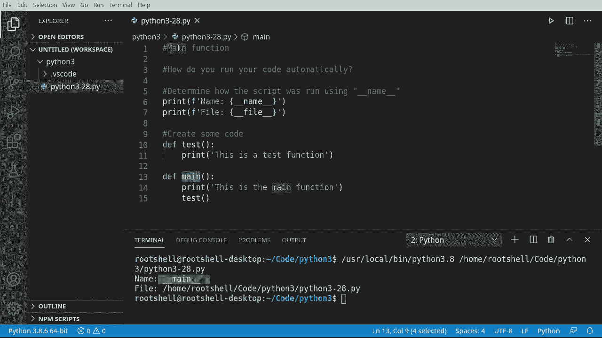
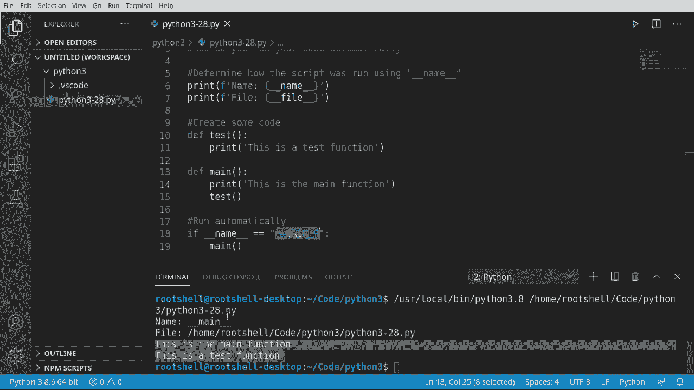
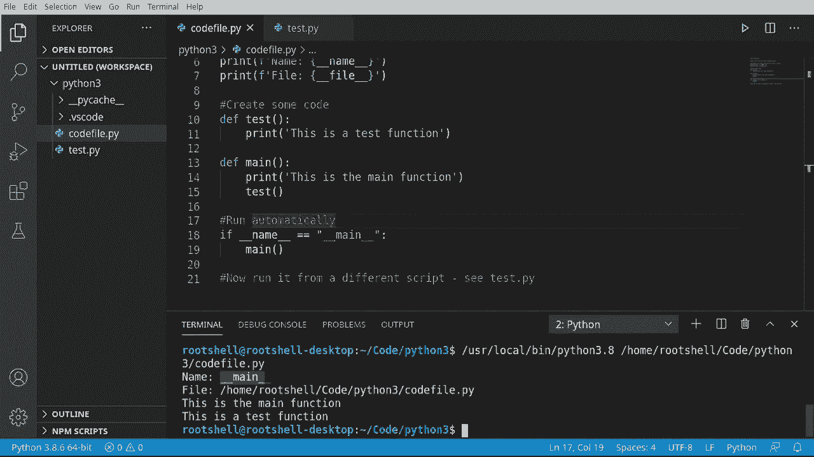

# Python 3全系列基础教程，P28：28）主函数 🚀






在本节课中，我们将要学习Python中的主函数概念。主函数在许多编程语言中是程序的入口点，但在Python中，它的使用方式有所不同。我们将探讨如何确定脚本的运行方式，以及如何编写只在脚本被直接运行时才执行的代码。


## 理解脚本的运行方式

上一节我们介绍了主函数的基本概念，本节中我们来看看如何确定一个Python脚本是如何被运行的。这关系到代码是否会被自动执行。

在Python中，每个模块（文件）都有一个内置属性 `__name__`。这个属性的值取决于模块是如何被使用的。

以下是判断脚本运行方式的代码示例：

```python
print(f"名称等于：{__name__}")
print(f"文件名：{__file__}")
```

运行上述代码，如果脚本是直接被Python解释器运行的，`__name__` 的值将是 `'__main__'`。`__file__` 属性则包含了当前脚本的文件路径，但请注意，在某些导入场景下，这个值可能不准确。




## 创建并调用主函数

理解了脚本的运行方式后，我们可以创建一个主函数，并确保它只在脚本被直接运行时执行。

首先，我们创建一个简单的测试函数和一个主函数。

```python
def test_function():
    print("这是一个测试函数。")



def main():
    print("这是主函数。")
    test_function()
```


在Python中，定义函数并不会自动执行它。如果我们直接运行包含上述代码的脚本，什么也不会发生，因为函数没有被调用。

## 使用 `if __name__ == '__main__':` 条件

为了让主函数自动运行，同时避免在脚本被导入时执行，我们需要使用一个特殊的条件判断。

以下是实现自动运行主函数的正确方法：




```python
def test_function():
    print("这是一个测试函数。")

def main():
    print("这是主函数。")
    test_function()

if __name__ == '__main__':
    main()
```

这段代码的意思是：如果 `__name__` 变量的值等于字符串 `'__main__'`，就调用 `main()` 函数。这确保了只有当脚本被直接运行时，主函数才会执行。

## 导入场景下的行为验证

为了彻底理解这个概念，让我们看看当这个脚本被另一个脚本导入时会发生什么。

假设我们有一个名为 `test_import.py` 的新脚本，内容如下：

```python
import code_file  # 假设我们的主脚本文件名为 code_file.py

print("现在运行 test_import.py")
```

当我们运行 `test_import.py` 时，输出会显示 `code_file` 模块中的 `__name__` 值是 `'code_file'`，而不是 `'__main__'`。因此，`code_file` 模块中的 `if __name__ == '__main__':` 块不会执行，其 `main()` 函数也不会被调用。只有被导入的模块顶层的打印语句（如果有的话）会执行。

这个机制非常重要，它允许我们编写既可以作为独立程序运行，又可以作为模块被其他代码使用的Python文件。

## 总结



本节课中我们一起学习了Python中主函数的概念。我们了解到，Python使用 `__name__` 这个特殊变量来标识模块的运行方式。通过使用 `if __name__ == '__main__':` 这个条件判断，我们可以精确控制哪些代码只在脚本被直接运行时执行，而在脚本被导入时不执行。这是编写可复用、模块化Python代码的关键实践。