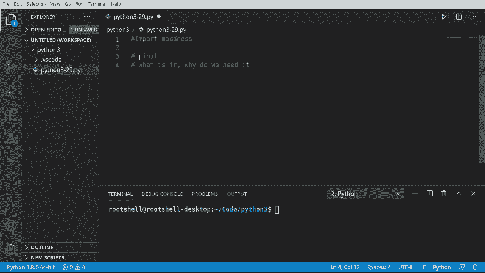
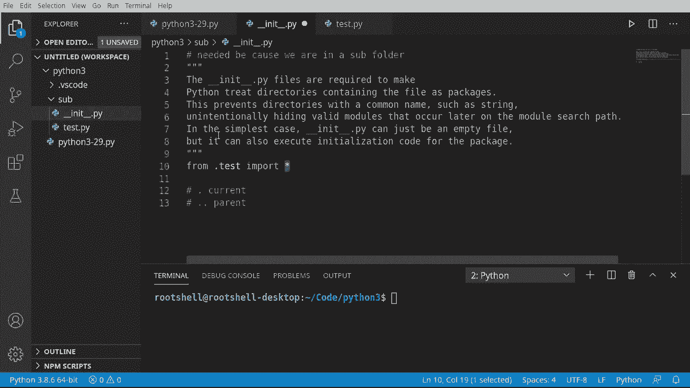
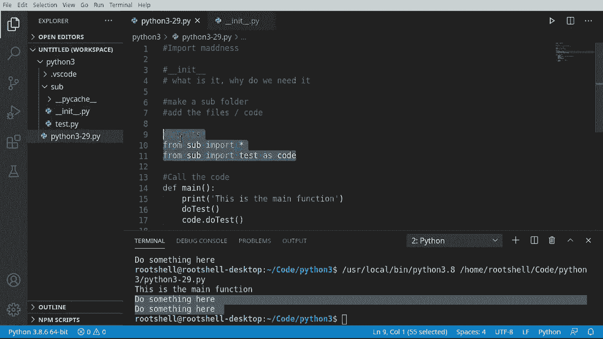

# Python 3全系列基础教程，P29：导入自建工具库 📦




在本节课中，我们将学习如何组织自己的代码，并将其作为工具库导入到其他Python程序中。核心内容包括理解`__init__.py`文件的作用，以及使用`import`语句的不同方式。


上一节我们介绍了模块的基本概念，本节中我们来看看如何创建和使用自己的模块包。

## 创建模块包结构

首先，我们需要创建一个子文件夹来存放我们的工具库代码。

以下是创建步骤：
1.  在项目目录下，新建一个名为 `sub` 的文件夹。
2.  确保你的IDE当前工作目录或路径设置正确。

接下来，我们需要在 `sub` 文件夹中添加两个文件。

第一个文件是功能模块，我们将其命名为 `test.py`。它包含一个简单的函数。

```python
# sub/test.py
def do_test():
    print("这里做点什么")
```

第二个文件必须命名为 `__init__.py`。双下划线是Python内部使用的特殊标识符。

关于 `__init__.py` 文件，在旧版Python中是否需要它存在一些争议，但在现代Python版本中，对于包结构来说，它通常是必需的。

## 理解 `__init__.py` 文件

`__init__.py` 文件的作用是让Python将一个文件夹识别为一个**包**（Package），而不仅仅是普通文件夹。

每当Python看到一个文件夹时，它需要理解如何处理这个文件夹结构。`__init__.py` 文件可以是一个空文件，但它也可以包含包的初始化代码。

例如，在处理网络服务器或数据库连接时，可以在这个文件中初始化一些配置。

```python
# sub/__init__.py 示例
port = 80
username = 'admin'
```

在我们的简单案例中，我们使用这个文件来告诉Python如何导入包内的其他模块。




我们可以修改 `__init__.py` 文件，让它自动导入包内的模块。

```python
# sub/__init__.py
from .test import *
```

这段代码的意思是：从**当前目录**（`.` 表示当前目录）下的 `test` 模块中，导入**所有内容**（`*` 表示全部）。

`from .` 中的点号很重要，它指明了相对路径。省略它可能会导致Python找不到模块。

## 在主程序中使用导入

现在，让我们切换回主程序文件，尝试几种不同的导入方式。

第一种方式是直接导入子模块。

```python
# 主程序 main.py
import sub.test as code
code.do_test()
```

这种方式运行良好，但它绕过了 `__init__.py` 文件的初始化过程。在旧版本Python中，这可能无法正常工作。

那么，如何正确地导入整个包呢？我们需要使用 `__init__.py` 文件提供的方法。

第二种方式是使用 `from ... import *` 语句导入整个包。

```python
# 主程序 main.py
from sub import *
```

`from sub import *` 表示从 `sub` 这个包（文件夹）中导入所有内容。这听起来可能有点吓人，如果包里有成千上万个文件怎么办？这就是 `__init__.py` 文件真正发挥作用的地方。

在 `__init__.py` 中，我们可以精确控制哪些模块被自动导入，哪些需要手动导入。我们可以设置变量、配置，甚至执行初始化函数。

对于初学者，我们也可以选择只导入特定的模块。

```python
# 主程序 main.py
from sub import test
```

这里，`test` 指的是 `test.py` 文件（不需要写 `.py` 后缀）。意思是从 `sub` 包中导入 `test` 模块。

## 实践与总结

为了看到实际效果，我们可以在主程序中编写一个 `main` 函数。

```python
# 主程序 main.py
def main():
    print("这是主函数")
    # 方法一：使用 import ... as ...
    import sub.test as code
    code.do_test()

    # 方法二：使用 from ... import ...
    from sub import test
    test.do_test()

if __name__ == "__main__":
    main()
```

`if __name__ == "__main__":` 这行代码的意思是：如果这个文件是直接运行的（而不是被导入的），那么就执行 `main()` 函数。这样可以防止在导入该文件时自动执行测试代码。

运行上述程序，两种导入方式都能成功调用 `do_test()` 函数。

那么，哪种方式是正确的？你应该使用哪一个？

个人倾向于使用 `from sub import test` 这种方式。因为它更清晰地将模块导入到指定的命名空间中。

如果你有多个文件（例如 `test2.py`）包含同名的函数，将它们分别导入到不同的变量或作用域中可以避免命名冲突。在概念上，每个文件在作用域上都是一个独立的“岛屿”。



本节课中我们一起学习了如何创建自己的Python包。核心要点是：**如果你有一个作为包使用的子文件夹，其中应该包含一个 `__init__.py` 文件**。省略它可能会导致旧版Python无法正常工作，并且你无法在包级别进行任何初始化设置。理解不同的 `import` 语句方式，能帮助你更灵活、清晰地组织和管理代码。