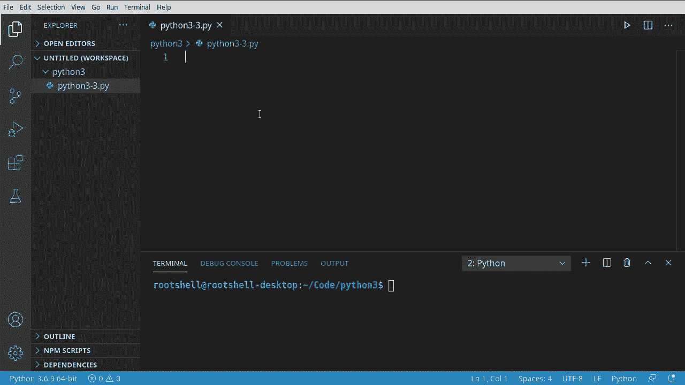
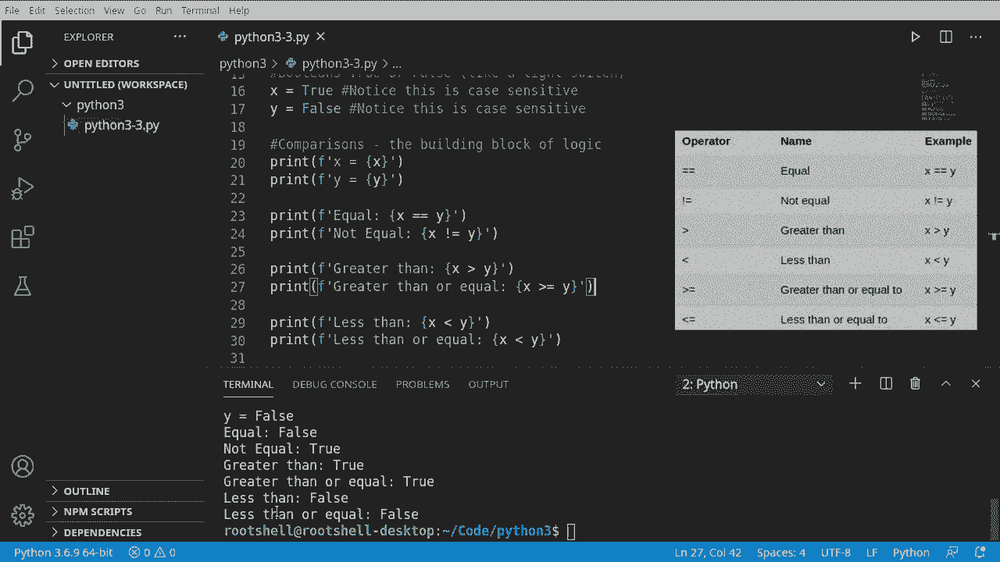

# Python 3全系列基础教程，P3：Python注释、布尔值与比较 🔍


在本节课中，我们将学习Python编程中的三个基础概念：如何为代码添加注释、理解布尔数据类型以及使用比较运算符。这些是构建程序逻辑的基石。




## 注释 📝

上一节我们介绍了Python的基本语法，本节中我们来看看如何为代码添加说明。注释是程序员在代码中留下的笔记，用于解释代码的功能或意图。Python解释器在执行时会完全忽略注释。

在Python中，使用井号 `#` 来创建单行注释。

```python
# 这是一个单行注释
print("Hello, World")  # 这行代码会打印“Hello, World”
```

以下是关于注释的几点说明：
*   `#` 符号之后，直到行尾的所有内容都会被视作注释。
*   注释可以独占一行，也可以写在代码行的后面。
*   注释对程序的运行没有任何影响。

有时，你可能需要编写多行注释。Python没有专门的多行注释语法，但开发者通常使用三个连续的单引号 `'''` 或双引号 `"""` 来包裹多行文本。需要注意的是，这实际上创建了一个多行字符串，但由于它没有被赋值给任何变量，所以不会执行任何操作。

```python
'''
这是一个多行注释的示例。
这里的所有内容都不会被Python执行。
通常用于函数或模块的文档说明。
'''
```

**注意**：虽然三引号常用于多行注释，但它本质上是字符串。在后续课程中学习函数时，我们会看到它的正式用途——文档字符串（Docstring）。

注释的主要用途有两个：
1.  **为自己或他人解释代码**，提高代码的可读性。
2.  **临时禁用代码**。在调试时，你可以通过注释掉某行代码来阻止它运行，而无需删除它。

## 布尔值 ⚡

现在，我们来认识第一个真正的数据类型——布尔（Boolean）。布尔值非常简单，它只有两个可能的值：`True`（真）或 `False`（假）。你可以把它想象成一个开关，只有“开”和“关”两种状态。

定义布尔变量时，必须注意大小写，`True` 和 `False` 的首字母必须大写。

```python
is_light_on = True   # 灯是开着的
is_door_locked = False # 门是未锁的
```

以下是定义布尔值时的关键点：
*   `True` 和 `False` 是Python中的关键字，不能用作变量名。
*   它们是大小写敏感的，写成 `true`、`false`、`TRUE` 或 `FALSE` 都会导致错误。

## 比较运算符 ⚖️

理解了真与假，我们就可以进行逻辑判断了。比较运算符用于比较两个值，并返回一个布尔值（`True` 或 `False`）。这是编程中实现条件判断的基础。

最常用的比较运算符是相等 `==` 和不等 `!=`。**请务必注意**，一个等号 `=` 是赋值运算符，用于给变量赋值；而两个等号 `==` 才是比较运算符，用于检查两个值是否相等。

```python
x = 10  # 赋值：将数字10存入变量x
y = 5   # 赋值：将数字5存入变量y

print(x == y)  # 比较：x等于y吗？ 输出：False
print(x != y)  # 比较：x不等于y吗？ 输出：True
```

除了相等性比较，我们还可以比较数值的大小。

以下是常用的比较运算符列表：
*   `>`：大于（例如：`10 > 5` 返回 `True`）
*   `<`：小于（例如：`10 < 5` 返回 `False`）
*   `>=`：大于或等于
*   `<=`：小于或等于

让我们看一个完整的例子：

```python
a = 7
b = 12

print(f"a的值是 {a}, b的值是 {b}")
print(f"a > b 的结果是：{a > b}")    # False
print(f"a < b 的结果是：{a < b}")    # True
print(f"a >= 7 的结果是：{a >= 7}")  # True
print(f"b <= 10 的结果是：{b <= 10}") # False
```

**代码解释**：我们使用 `f-string`（格式化字符串）来将变量和比较结果一起打印出来，这使得输出更清晰易读。`f"字符串 {变量或表达式}"` 中的花括号 `{}` 内的内容会被计算并替换为其结果值。

---



本节课中我们一起学习了Python的注释、布尔值和比较运算符。注释是代码的说明书，布尔值 `True/False` 代表了逻辑的真假，而比较运算符则是我们进行条件判断的工具。它们是编写任何具有决策能力程序的基础。在接下来的课程中，我们将学习如何利用这些布尔结果，通过 `if` 语句来控制程序的执行流程。