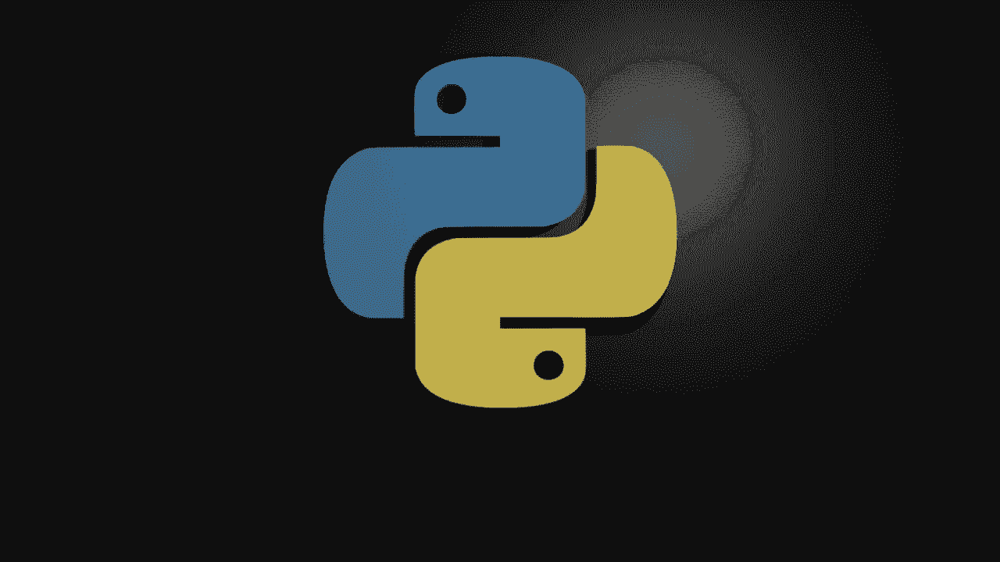
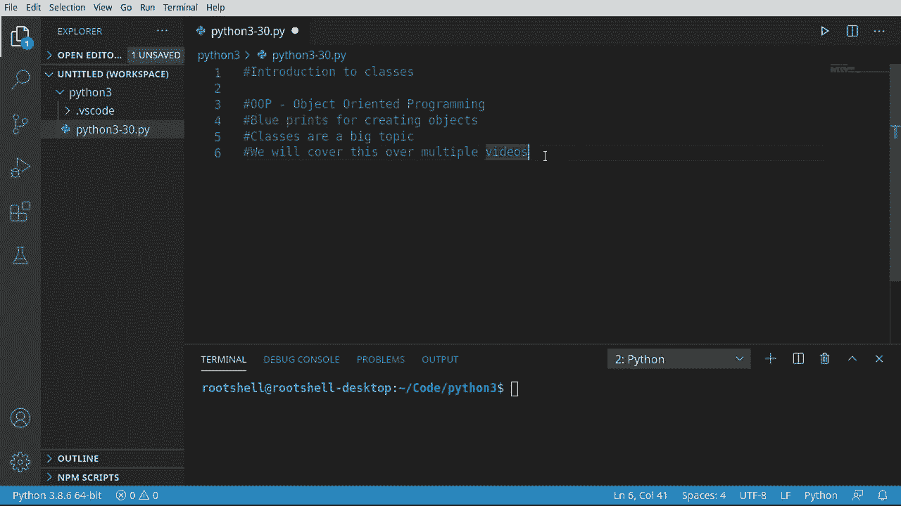
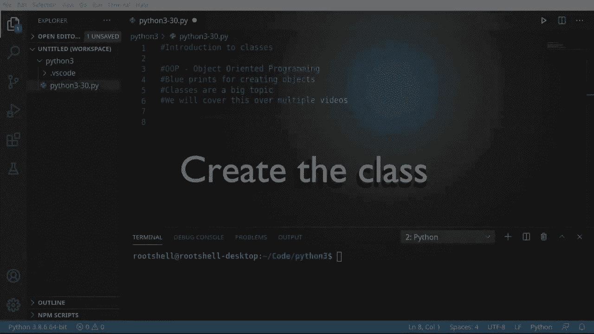
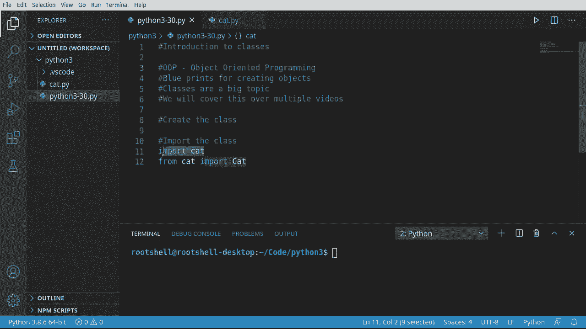
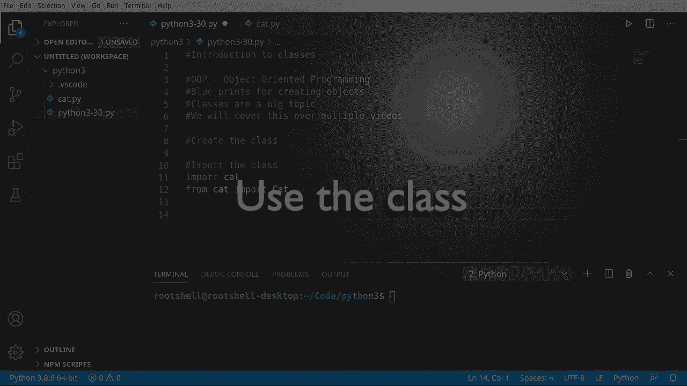
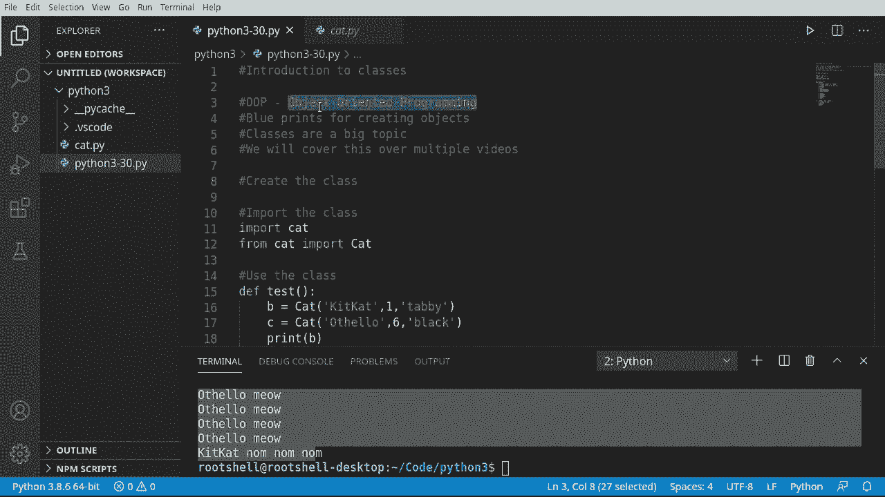
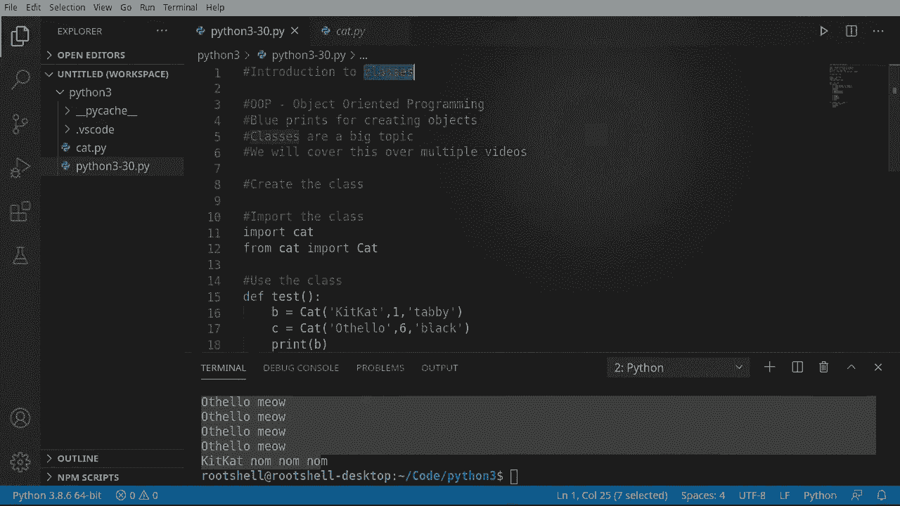

# Python 3全系列基础教程，P30：30）类介绍 🐱





在本节课中，我们将要学习Python中一个核心且强大的概念——**类**。类是面向对象编程的基石，它允许我们创建自定义的数据类型和对象。我们将从最基础的概念开始，理解什么是类，什么是对象，并动手创建一个简单的类。



## 概述

面向对象编程是一种编程范式，其核心思想是使用“对象”来设计软件。**类**是创建对象的蓝图或模板，它定义了对象将拥有哪些属性（数据）和方法（函数）。**对象**则是根据类这个蓝图创建出来的具体实例。

上一节我们介绍了函数，本节中我们来看看如何将数据和功能封装在一起，形成更复杂的结构。

## 什么是类与对象？

类是一个蓝图，用于描述对象应该如何被创建。当Python根据这个蓝图实际创建出一个具体的东西时，这个东西就称为该类的**对象**或**实例**。

你可以把类想象成建筑设计图，而对象就是根据这张图纸建造出来的实实在在的房子。图纸（类）只有一份，但可以根据它建造出很多栋房子（对象）。

## 创建一个简单的类

让我们通过创建一个`Cat`（猫）类来理解这个过程。我们将在一个名为`cat.py`的新文件中编写这个类。

以下是创建`Cat`类的基本步骤：

```python
# cat.py
class Cat:
    """
    这是一个Cat类，用于创建猫的实例。
    self是类中方法的第一个参数，它代表当前实例本身。
    """
    def __init__(self, name, age, color):
        """
        这是构造函数。当我们创建Cat类的实例时，会自动调用这个函数。
        self.name 是实例变量，name 是传入的参数。
        """
        self.name = name
        self.age = age
        self.color = color
        print(f"{self.name}的构造函数被调用。")

    def meow(self):
        """让猫叫的方法。"""
        print(f"{self.name}: 喵！")

    def sleep(self):
        """让猫睡觉的方法。"""
        print(f"{self.name} 睡着了。")

    def hungry(self, times=5):
        """猫饿了，会叫多次。"""
        for _ in range(times):
            self.meow()

    def eat(self):
        """猫吃东西的方法。"""
        print(f"{self.name} 正在吃东西。")

    def description(self):
        """获取猫的描述信息。"""
        print(f"{self.name} 是一只{self.color}的猫，今年{self.age}岁。")
```

**代码解析：**
*   `class Cat:`：这行代码定义了一个名为`Cat`的类。
*   `def __init__(self, ...):`：这是一个特殊方法，称为**构造函数**。当你创建`Cat`对象时，Python会自动调用它来初始化对象。`self`参数是必须的，它指向正在被创建的那个实例本身。
*   `self.name = name`：这行代码创建了一个**实例变量**。每个`Cat`对象都会有自己独立的`name`、`age`和`color`。
*   其他如`meow`、`sleep`等方法定义了猫的行为。注意，它们的第一个参数也必须是`self`，这样才能在方法内部访问和操作当前实例的属性。

## 使用类创建对象





仅仅定义类，程序并不会做任何事情。我们需要根据这个“蓝图”来创建具体的“房子”，也就是对象。

以下是如何导入并使用我们刚刚创建的`Cat`类：

```python
# main.py
from cat import Cat  # 从cat.py文件中导入Cat类

def test():
    """
    测试函数，用于创建和使用Cat类的实例。
    """
    # 创建第一个Cat对象：kitty
    kitty = Cat("Kitty", 1, "虎斑")
    # 创建第二个Cat对象：bella
    bella = Cat("Bella", 6, "黑色")

    # 调用对象的方法
    kitty.description()
    bella.description()

    bella.meow()
    kitty.sleep()
    bella.hungry(3)  # Bella饿了，叫3声
    kitty.eat()

# 判断是否直接运行此脚本
if __name__ == "__main__":
    test()
```

**运行结果分析：**
当你运行`main.py`时，会看到类似以下的输出：
```
Kitty的构造函数被调用。
Bella的构造函数被调用。
Kitty 是一只虎斑的猫，今年1岁。
Bella 是一只黑色的猫，今年6岁。
Bella: 喵！
Kitty 睡着了。
Bella: 喵！
Bella: 喵！
Bella: 喵！
Kitty 正在吃东西。
```

**关键点：**
1.  `kitty = Cat("Kitty", 1, "虎斑")`：这行代码就是根据`Cat`类创建了一个实例（对象）。我们不需要像某些语言那样使用`new`关键字。
2.  `kitty`和`bella`是两个**独立**的对象。修改`kitty`的属性不会影响`bella`。
3.  每个对象在内存中都有自己独立的位置（如`<cat.Cat object at 0x...>`所示），它们是不同的实体。

## 核心概念总结

*   **类 (Class)**：是创建对象的蓝图或模板。使用 `class` 关键字定义。
    *   公式：`class ClassName:`
*   **对象/实例 (Object/Instance)**：是根据类创建出来的具体实体。
    *   代码：`instance_name = ClassName(arguments)`
*   **构造函数 (`__init__`)**：是一个特殊方法，在创建对象时自动调用，用于初始化对象的属性。
    *   代码：`def __init__(self, ...):`
*   **`self` 参数**：在类的方法中，第一个参数必须是`self`，它代表当前调用该方法的对象实例本身。
*   **实例变量**：在类的方法内部，通过`self.变量名`定义的变量。每个对象都拥有自己的一份副本。

## 总结

本节课中我们一起学习了Python中**类**的基础知识。我们明白了类是对象的蓝图，而对象是类的具体实例。我们创建了一个`Cat`类，定义了它的属性（名字、年龄、颜色）和方法（叫、睡、吃等），并学会了如何创建多个独立的`Cat`对象来使用它们。





理解类和对象是掌握面向对象编程的第一步。在接下来的课程中，我们将深入探讨类的更多特性，如继承、封装和多态。