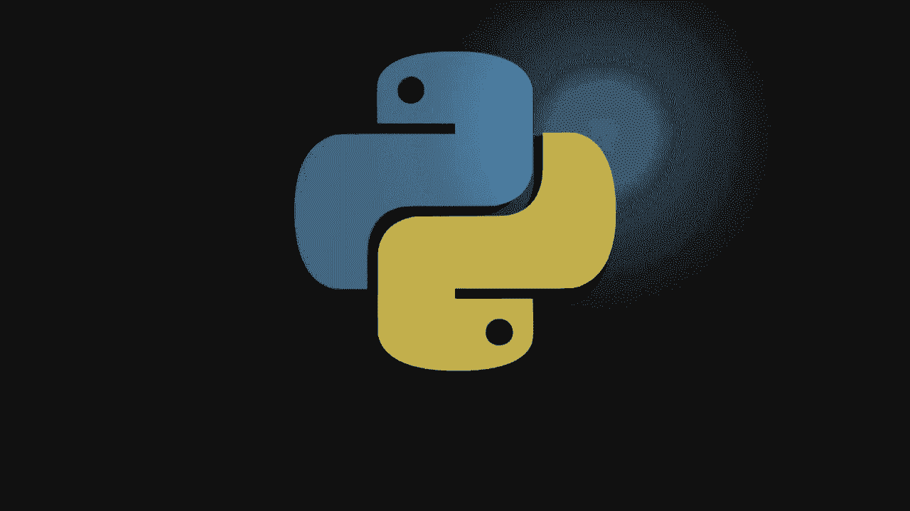
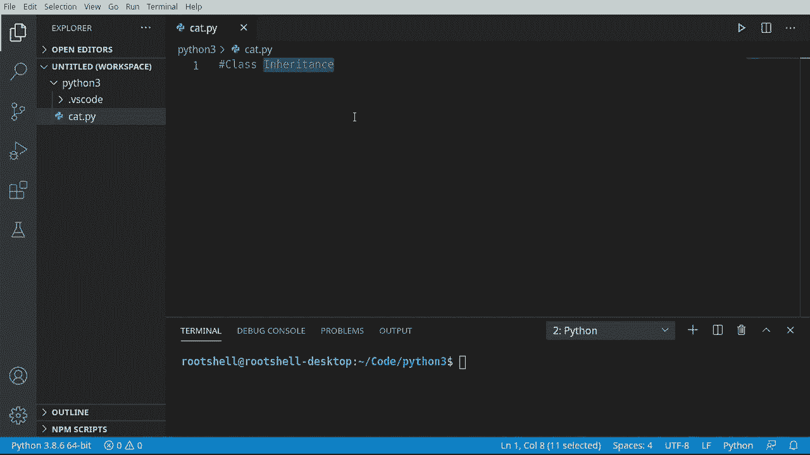
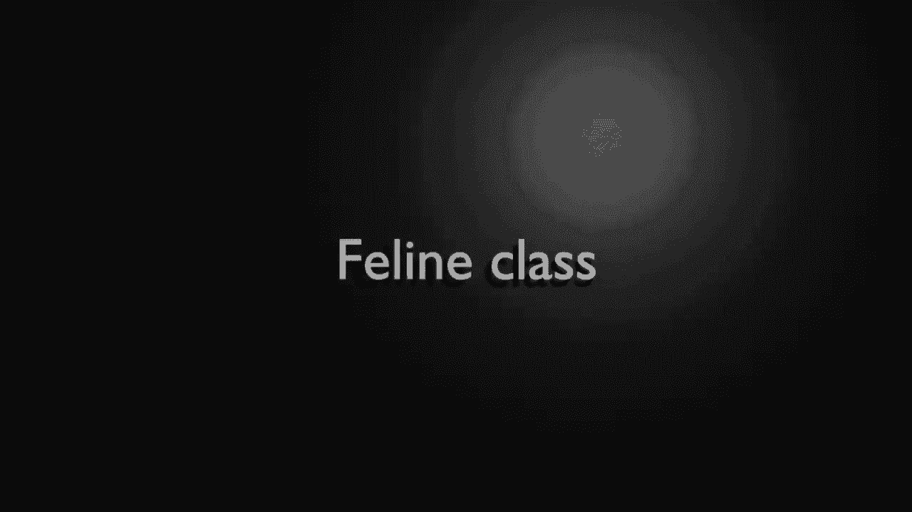
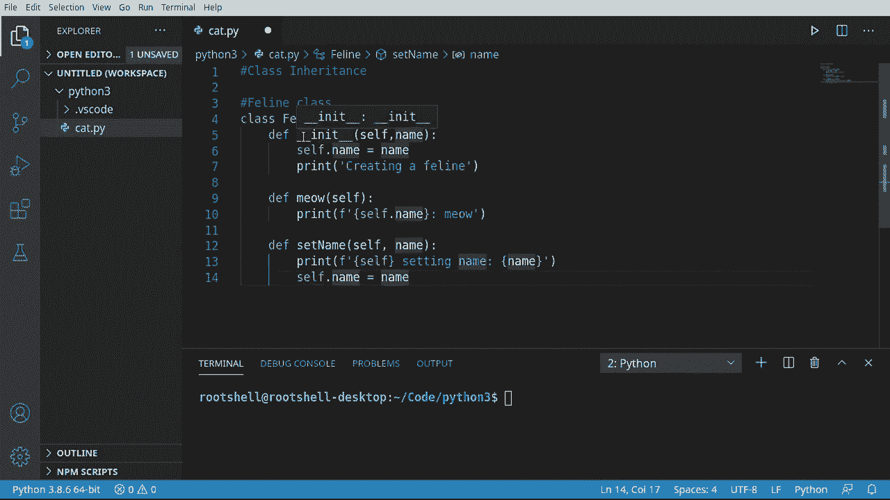
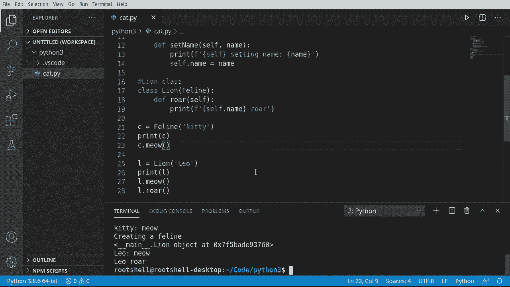
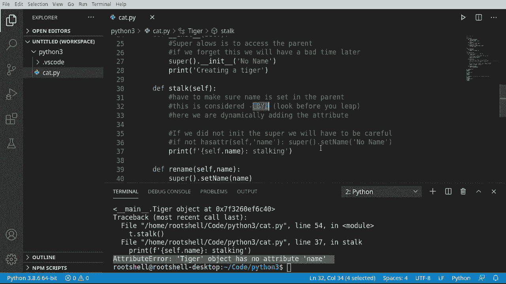

# Python 3全系列基础教程，P31：31）类继承 🐍➡️🐱



在本节课中，我们将要学习Python中一个非常强大的概念——**类继承**。继承允许我们创建一个新类（子类），它可以从一个现有类（父类）那里“继承”属性和方法。这就像孩子从父母那里遗传特征一样，在代码中，这能帮助我们重用代码并建立清晰的层次关系。





## 理解继承的概念

上一节我们介绍了类的基本概念，本节中我们来看看如何让类之间建立“父子”关系。

在编程中，继承意味着一个类（子类）可以获取另一个类（父类）的所有功能。子类可以拥有父类的一切，并且还能添加自己独有的新功能，或者修改从父类继承来的行为。

## 创建父类与子类




让我们通过一个具体的例子来理解。首先，我们创建一个名为 `Feline`（猫科动物）的父类。

```python
class Feline:
    def __init__(self, name):
        print("正在创建一个Feline")
        self.name = name

    def meow(self):
        print(f"{self.name} 在喵喵叫")

    def set_name(self, name):
        print(f"设置名字为 {name}")
        self.name = name
```

这个 `Feline` 类有一个构造函数 `__init__`，用于初始化名字，还有 `meow` 和 `set_name` 两个方法。

现在，我们创建一个继承自 `Feline` 的子类 `Lion`（狮子）。

```python
class Lion(Feline):
    def roar(self):
        print(f"{self.name} 在吼叫")
```

请注意，在定义 `Lion` 类时，我们在类名后的括号里写上了 `Feline`。这行代码 `class Lion(Feline):` 就表示 `Lion` 类继承了 `Feline` 类。

## 体验继承的力量

以下是使用我们创建的类的示例：

```python
# 创建一个Feline对象
c = Feline("Kitty")
c.meow()

# 创建一个Lion对象
l = Lion("Leo")
l.meow()  # Lion继承了Feline的meow方法
l.roar()  # Lion自己的方法
```




运行这段代码，你会看到：
1.  创建 `Feline` 对象时，会打印“正在创建一个Feline”。
2.  `Lion` 对象 `l` 可以调用从 `Feline` 继承来的 `meow` 方法。
3.  `Lion` 对象 `l` 也可以调用自己独有的 `roar` 方法。

这展示了继承的核心优势：**代码复用**。`Lion` 类无需重新编写 `meow` 方法，就直接拥有了该功能。

## 继承中的构造函数问题

上一节我们看到了继承顺利工作的情况，本节中我们来探讨一个常见的陷阱——**子类覆盖父类构造函数**。

让我们创建另一个子类 `Tiger`（老虎），但这次我们尝试在 `Tiger` 中定义自己的构造函数。

```python
class Tiger(Feline):
    def __init__(self):
        print("正在创建一只老虎")
        # 注意：这里没有调用父类Feline的构造函数
        # 也没有初始化 self.name

    def sneak(self):
        print(f"{self.name} 在潜行")  # 这里会出错！
```

如果我们尝试使用这个有缺陷的 `Tiger` 类：

```python
t = Tiger()
t.sneak()  # 这里会引发 AttributeError 错误！
```

程序会崩溃，并报告错误：`AttributeError: ‘Tiger’ object has no attribute ‘name’`。

**为什么会这样？**
因为当子类 (`Tiger`) 定义了自己的 `__init__` 方法时，它就**覆盖**了从父类 (`Feline`) 继承来的 `__init__` 方法。Python在创建 `Tiger` 对象时，只会执行 `Tiger` 自己的构造函数，而不会自动去执行父类的构造函数。因此，父类构造函数中初始化 `self.name` 的代码永远不会运行，导致 `self.name` 这个属性根本不存在。

## 解决方案：使用 `super()`

要解决上述问题，我们需要在子类的构造函数中**显式地调用父类的构造函数**。这可以通过 `super()` 函数来实现。

`super()` 返回一个代表父类的临时对象，允许你调用父类的方法。

以下是修复后的 `Tiger` 类：

```python
class Tiger(Feline):
    def __init__(self):
        print("正在创建一只老虎")
        # 使用super()调用父类Feline的构造函数
        super().__init__("无名")  # 为name提供一个默认值

    def sneak(self):
        print(f"{self.name} 在潜行")

    def rename(self, new_name):
        # 可以通过super()调用父类的方法
        super().set_name(new_name)
        # 也可以直接调用继承来的方法，效果相同
        # self.set_name(new_name)
```

现在，代码可以正常工作：

```python
t = Tiger()  # 输出：正在创建一只老虎 -> 正在创建一个Feline
t.sneak()    # 输出：无名 在潜行
t.rename("Tony")
t.meow()     # 输出：Tony 在喵喵叫
t.sneak()    # 输出：Tony 在潜行
```

**关键点**：
*   `super().__init__(“无名”)` 确保了父类 `Feline` 的初始化逻辑得以执行，`self.name` 属性被正确创建。
*   在子类中，你可以通过 `super().父类方法名()` 来明确调用父类的特定方法。

## 核心要点与最佳实践

以下是关于类继承需要记住的几个要点：

1.  **继承的目的**：继承主要用于**代码复用**和建立清晰的**类层次结构**（例如：动物 -> 哺乳动物 -> 猫科动物 -> 老虎）。
2.  **谨慎覆盖构造函数**：除非有充分理由，否则不要在子类中轻易覆盖 `__init__` 方法。如果必须覆盖，**务必使用 `super().__init__()` 来调用父类的构造函数**，以确保父类定义的属性被正确初始化。
3.  **`super()` 的作用**：`super()` 是调用父类方法的标准方式，尤其是在处理构造函数和多继承时，它能保证方法解析顺序的正确性。
4.  **“是一个”关系**：继承应该模拟“是一个”的关系。例如，`Lion` 是一个 `Feline`，这符合逻辑。如果两个类之间是“有一个”的关系（例如：汽车有一个发动机），则应使用组合（将发动机作为汽车的属性），而不是继承。

## 总结

本节课中我们一起学习了Python中**类继承**的核心概念。我们了解到继承如何让子类获取父类的属性和方法，从而实现代码复用。我们重点探讨了子类覆盖构造函数时可能引发的“属性未定义”问题，并学会了使用 `super()` 函数来正确调用父类构造函数的解决方案。



记住，继承是一把双刃剑，强大的同时需要谨慎使用。遵循“是一个”的原则来设计继承关系，并在子类构造函数中妥善处理父类初始化，将帮助你构建出更健壮、更易维护的面向对象程序。