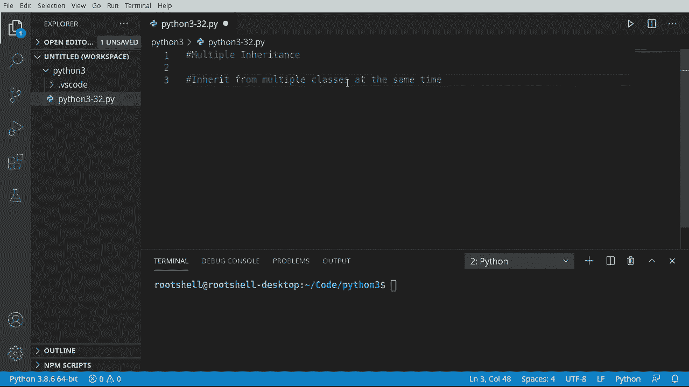
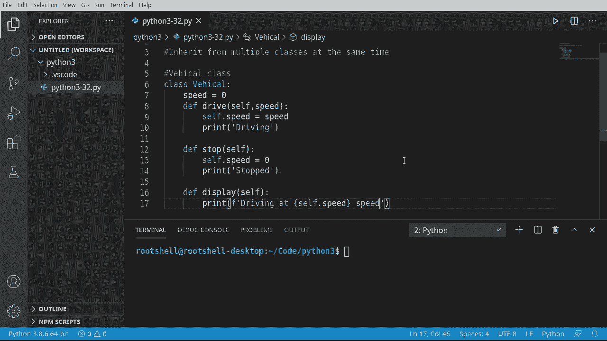
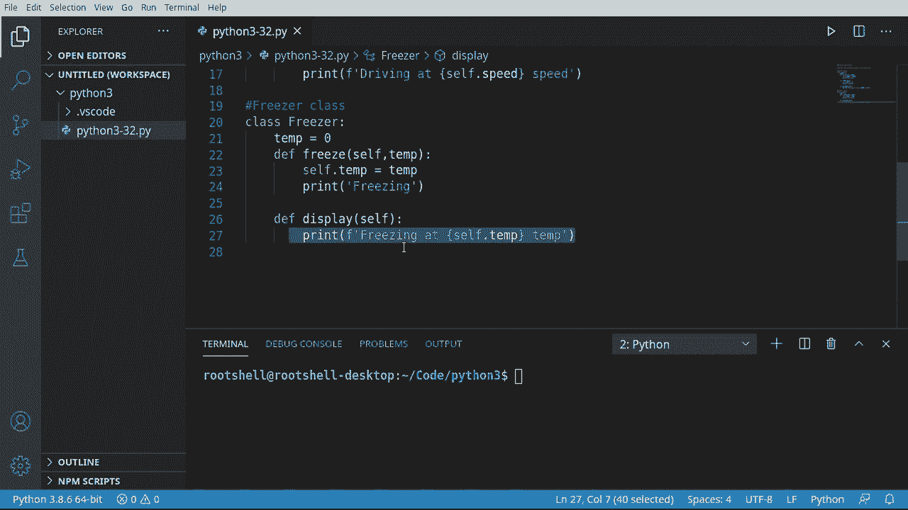
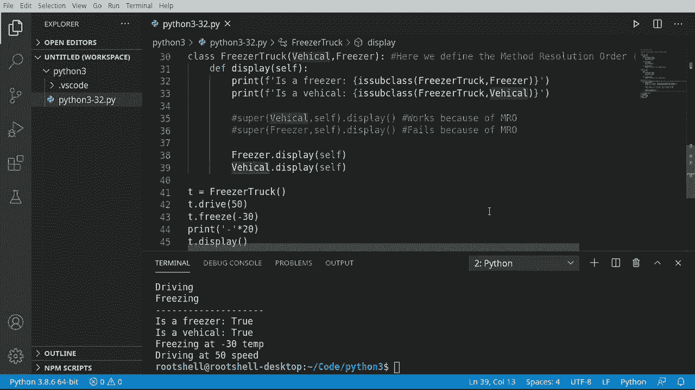

# Python 3全系列基础教程，P32：32）多重继承 🧬


在本节课中，我们将要学习Python中一个高级但强大的特性：多重继承。多重继承允许一个类同时从多个父类继承属性和方法，这为代码复用提供了极大的灵活性，但也带来了一些复杂性。




上一节我们介绍了单继承，本节中我们来看看当一个类需要继承自多个父类时会发生什么。

## 创建父类

首先，我们创建两个独立的父类，它们将拥有一个同名的方法，以便后续观察命名冲突。

### 车辆类



以下是`Vehicle`类的定义，它代表一个可以行驶和停止的交通工具。


```python
class Vehicle:
    def drive(self, speed):
        self.speed = speed

    def stop(self):
        self.speed = 0

    def display(self):
        print(f"Driving at {self.speed}")
```

### 冷冻机类

接下来是`Freezer`类，它代表一个可以冷冻食物的设备。

```python
class Freezer:
    def __init__(self):
        self.temp = 20

    def freeze(self, temperature):
        self.temp = temperature

    def display(self):
        print(f"Freezing at {self.temp}")
```

请注意，`Vehicle`和`Freezer`类都定义了一个名为`display`的方法，这为我们后续演示方法冲突做好了准备。



## 实现多重继承


现在，让我们创建一个同时继承自`Vehicle`和`Freezer`的新类`FreezerTruck`。

```python
class FreezerTruck(Freezer, Vehicle):
    pass
```

我们创建了这个类的实例并调用其方法。

```python
T = FreezerTruck()
T.drive(50)
T.freeze(-30)
T.display()
```

运行上述代码，你会发现只输出了`Freezing at -30`，而没有输出驾驶信息。这是因为Python遵循**方法解析顺序（Method Resolution Order, MRO）**。

## 理解方法解析顺序（MRO）

MRO决定了当调用一个方法时，Python在继承链中搜索该方法的顺序。在多重继承中，顺序通常是“深度优先，从左到右”。

在我们的例子中，`FreezerTruck`继承自`(Freezer, Vehicle)`。因此，当调用`display`方法时，Python首先在`Freezer`类中查找，找到了就直接使用，而不会再去`Vehicle`类中查找。

如果我们交换继承顺序：

```python
class FreezerTruck(Vehicle, Freezer):
    pass
```

再次运行，输出将变为`Driving at 50`。这验证了MRO“先来先服务”的规则。

## 解决命名冲突

当我们需要访问所有父类的同名方法时，不能简单地使用`super()`，因为它会遵循MRO。以下是解决此问题的一种直接方法。

在`FreezerTruck`类中定义我们自己的`display`方法，并显式调用每个父类的方法。

```python
class FreezerTruck(Freezer, Vehicle):
    def display(self):
        # 显式调用Freezer类的display方法
        Freezer.display(self)
        # 显式调用Vehicle类的display方法
        Vehicle.display(self)
```

现在，当我们调用`T.display()`时，会同时输出冷冻和驾驶信息。

```python
T = FreezerTruck()
T.drive(50)
T.freeze(-30)
T.display()
# 输出:
# Freezing at -30
# Driving at 50
```

## 核心要点总结

本节课中我们一起学习了Python的多重继承。

*   **多重继承**允许一个类继承多个父类，语法为`class ChildClass(Parent1, Parent2, ...):`。
*   **方法解析顺序（MRO）** 是解决继承中方法查找顺序的规则。当子类调用一个方法时，Python会按照MRO在父类中查找。
*   **命名冲突**是多重继承的主要挑战。当多个父类拥有同名方法时，只有排在MRO首位的方法会被子类实例直接调用。
*   **解决方案**：要调用特定父类的方法，可以使用`ParentClassName.method_name(self, ...)`的方式显式调用。



虽然多重继承功能强大，但在设计类结构时应谨慎使用，清晰的MRO和避免不必要的命名冲突是保持代码可维护性的关键。