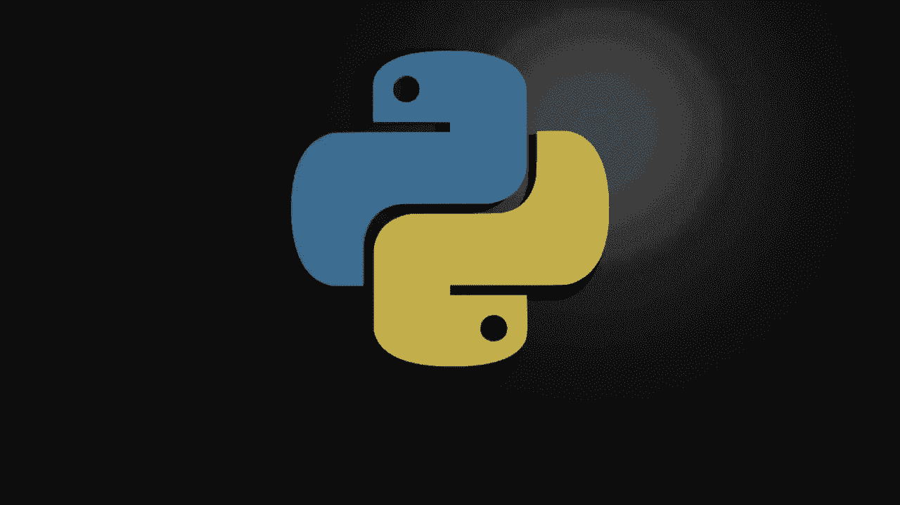
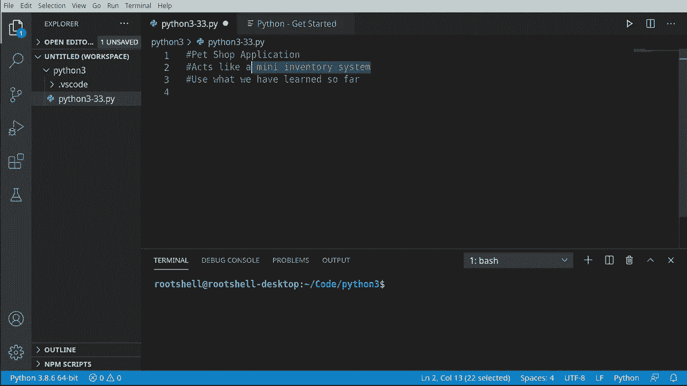
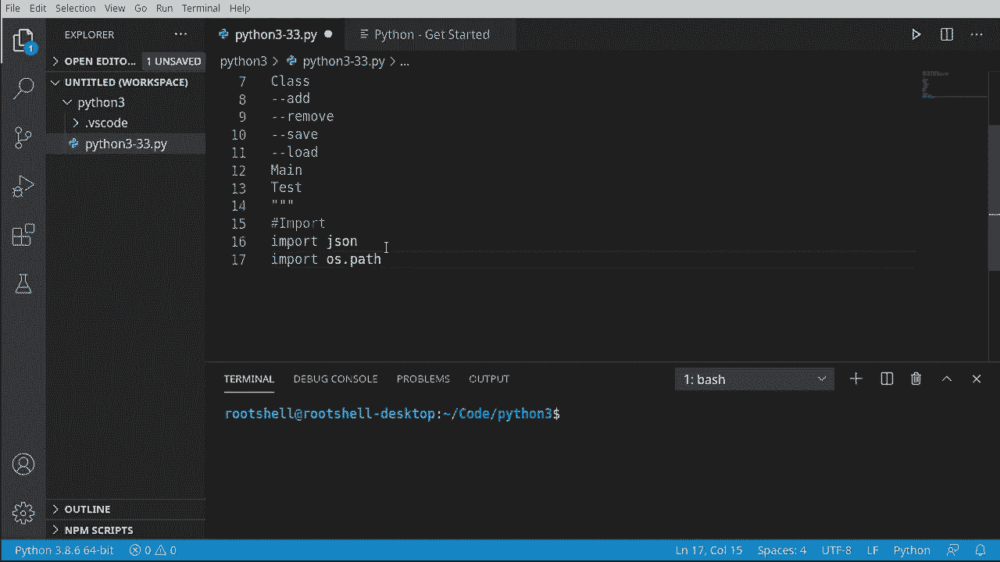
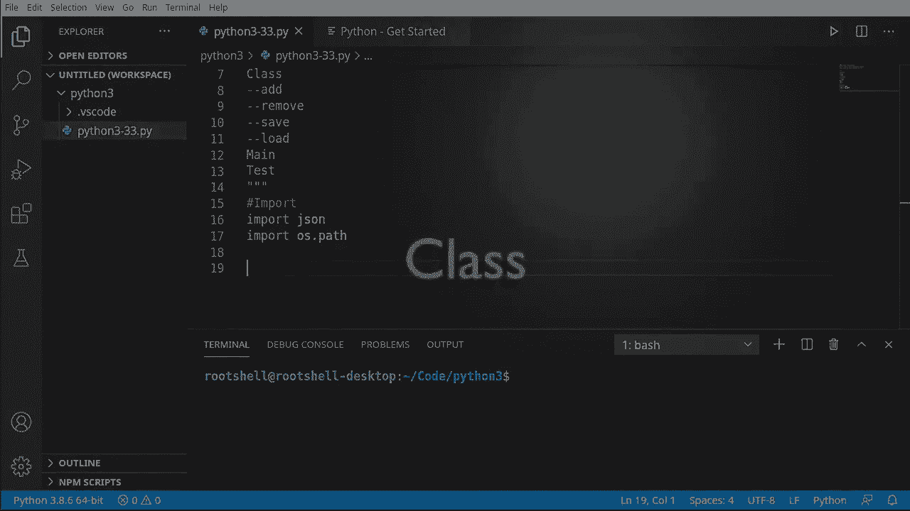
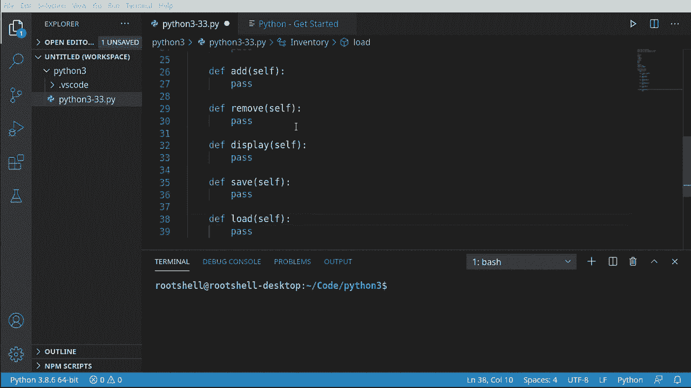
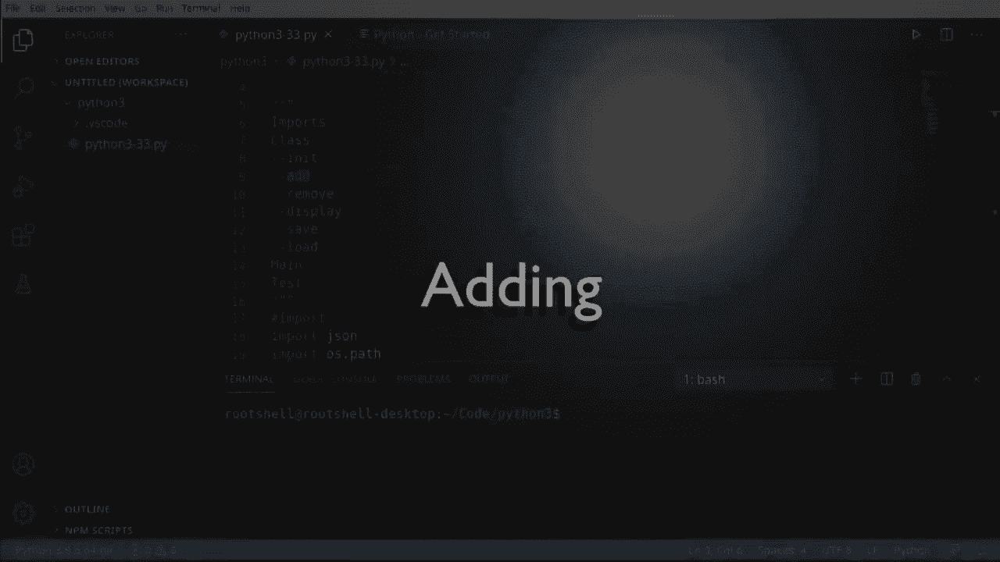
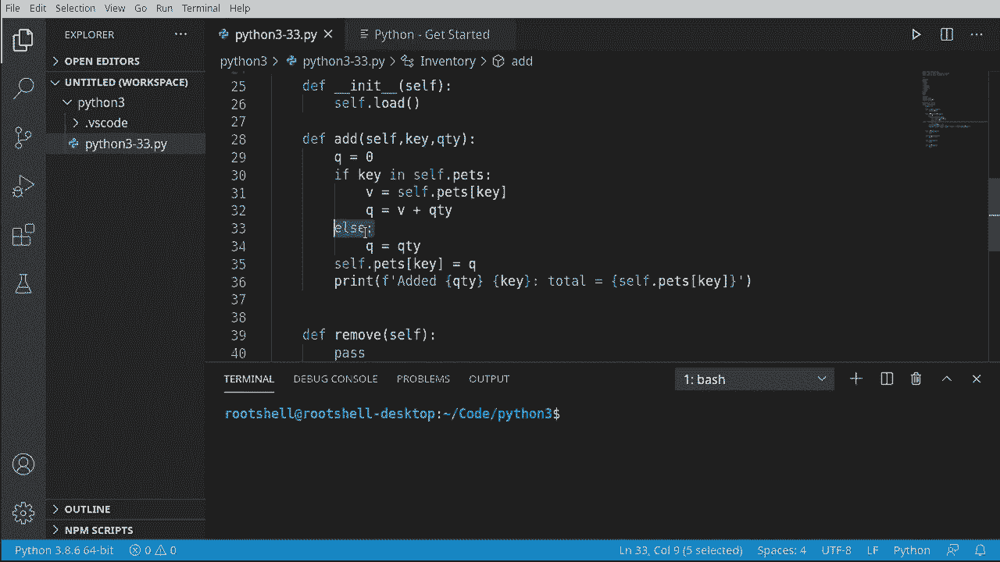
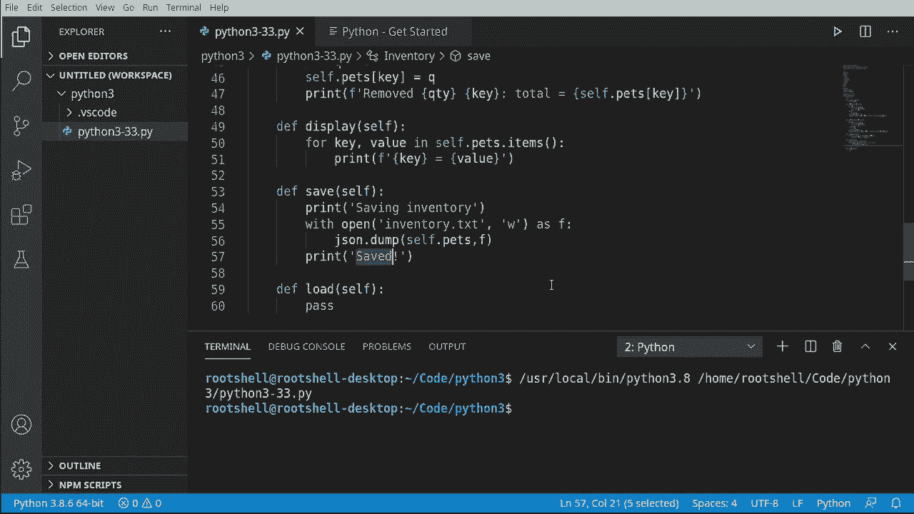
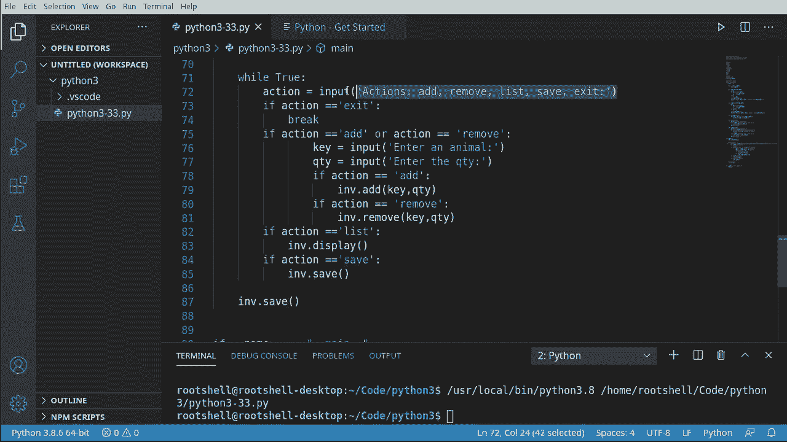
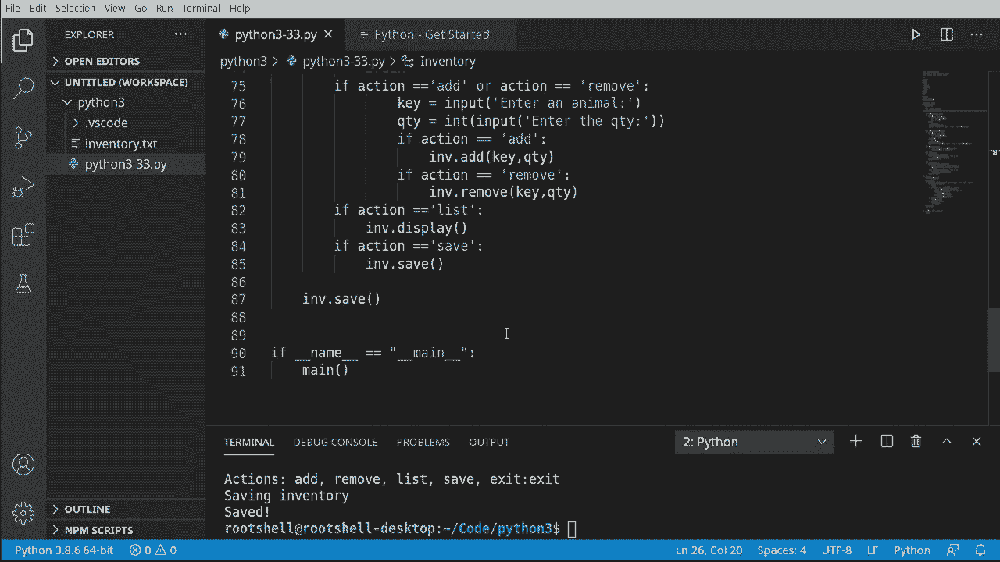

# Python 3全系列基础教程，P33：构建宠物店应用程序 🐾





在本节课中，我们将综合运用之前学过的所有知识，构建一个宠物店库存管理应用程序。这是一个迷你库存系统，我们将学习如何设计程序结构、处理用户输入、管理数据以及进行文件读写操作。


## 概述与设计 🎯





我们将创建一个命令行应用程序，其核心是一个循环，不断询问用户想要执行的操作。程序启动时会尝试加载已有的库存数据，退出时会自动保存。

程序的基本流程如下：
1.  Python启动脚本。
2.  加载现有的库存文件。
3.  进入主循环，提示用户选择操作。
4.  根据用户选择执行相应功能。
5.  退出循环时，自动保存库存数据。



## 导入模块 📦



首先，我们需要导入必要的模块。`json`模块用于将数据保存到文件和从文件加载数据。`os.path`模块用于检查文件是否存在。

```python
import json
import os.path
```

## 创建库存类 🏗️

为了封装库存管理功能，我们创建一个`Inventory`类。这样，如果需要管理多个库存，可以轻松创建多个实例。




以下是该类的框架，包含我们将要实现的方法：

```python
class Inventory:
    def __init__(self):
        pass

    def add(self, key, qty):
        pass

    def remove(self, key, qty):
        pass

    def display(self):
        pass

    def save(self):
        pass

    def load(self):
        pass
```

## 实现初始化与添加功能 ➕

上一节我们创建了类的框架，本节中我们来看看如何实现`__init__`和`add`方法。

在`__init__`方法中，我们希望初始化时自动加载已有的库存数据。`add`方法则负责向库存中添加指定数量的宠物。

```python
class Inventory:
    def __init__(self):
        self.pets = {}
        self.load()

    def add(self, key, qty=0):
        if key in self.pets:
            current_qty = self.pets[key]
            updated_qty = current_qty + qty
        else:
            updated_qty = qty

        self.pets[key] = updated_qty
        print(f"添加了 {qty} 只 {key}，当前总数为 {self.pets[key]}。")
```

**核心概念**：我们使用字典`self.pets`来存储库存，键是宠物名称，值是数量。在添加前，需要检查该宠物是否已存在于字典中。

## 实现移除与显示功能 ➖



现在，我们来实现`remove`和`display`方法。`remove`方法与`add`类似，但执行减法操作，并确保库存数量不会变为负数。`display`方法则用于列出所有库存。


```python
    def remove(self, key, qty=0):
        if key in self.pets:
            current_qty = self.pets[key]
            updated_qty = current_qty - qty
            if updated_qty < 0:
                updated_qty = 0
        else:
            updated_qty = 0

        self.pets[key] = updated_qty
        print(f"移除了 {qty} 只 {key}，总数现在是 {self.pets[key]}。")

    def display(self):
        for key, value in self.pets.items():
            print(f"{key} = {value}")
```

## 实现保存功能 💾

接下来，我们实现`save`方法。该方法将库存字典保存到名为`inventory.txt`的JSON文件中。我们使用`with`语句来确保文件被正确关闭，并在操作前后给用户提示。

```python
    def save(self):
        print("正在保存库存...")
        with open("inventory.txt", "w") as f:
            json.dump(self.pets, f)
        print("已保存。")
```

**核心概念**：`json.dump(obj, file)`函数将Python对象（这里是字典）序列化为JSON格式并写入文件。

## 实现加载功能 📂

最后，我们实现`load`方法。该方法从文件加载库存数据。在尝试加载前，我们使用`os.path.exists()`检查文件是否存在，以避免程序出错。

```python
    def load(self):
        print("正在加载库存...")
        filename = "inventory.txt"
        if not os.path.exists(filename):
            print("跳过，没有可加载的内容。")
            return

        with open(filename, "r") as f:
            self.pets = json.load(f)
        print("已加载。")
```

**核心概念**：`json.load(file)`函数从文件中读取JSON数据并将其反序列化为Python对象。

## 创建主程序与用户交互 🔄

我们已经完成了`Inventory`类的所有核心功能。现在，我们需要创建主程序来驱动整个应用，处理用户的输入。

以下是主程序的逻辑步骤：




1.  创建`Inventory`类的实例。
2.  进入一个无限循环，提示用户输入操作。
3.  根据用户输入调用相应的方法。
4.  当用户选择“退出”时，跳出循环并自动保存。

```python
def main():
    inv = Inventory()

    while True:
        action = input("操作（添加/移除/列表/保存/退出）: ").lower()

        if action == "退出":
            break
        elif action == "列表":
            inv.display()
        elif action == "保存":
            inv.save()
        elif action in ("添加", "移除"):
            key = input("输入一个动物: ")
            qty = int(input("输入数量: "))
            if action == "添加":
                inv.add(key, qty)
            else:
                inv.remove(key, qty)
        else:
            print("无效操作，请重试。")

    inv.save()
    print("退出。")


if __name__ == "__main__":
    main()
```

**重要提示**：注意`qty = int(input(...))`这行代码。它将用户输入的字符串转换为整数，这是进行数学运算所必需的。如果不转换，Python会将数字作为字符串处理，导致`"6" + "3" = "63"`这样的错误。

## 测试与运行 🧪

程序编写完成后，我们可以运行并进行测试。以下是测试流程示例：
*   启动程序，加载库存（首次运行会提示无文件可加载）。
*   选择“添加”，输入动物“猫”和数量“6”。
*   再次“添加”“猫”，数量“3”，此时总数应为9。
*   选择“列表”查看当前库存。
*   选择“移除”来减少某种动物的数量。
*   选择“保存”手动保存，或直接“退出”让程序自动保存。
*   重新启动程序，检查库存是否成功加载。

## 总结 📝

本节课中我们一起学习了如何构建一个完整的命令行应用程序。我们回顾并实践了以下核心概念：

*   **模块导入**：使用`import`引入`json`和`os.path`。
*   **类与对象**：创建`Inventory`类来封装数据和功能。
*   **字典操作**：使用字典`self.pets`作为核心数据结构，进行增删改查。
*   **控制流程**：使用`if/elif/else`进行条件判断，使用`while`循环处理持续交互。
*   **文件IO**：使用`with open() as f:`安全地读写文件。
*   **JSON序列化**：使用`json.dump()`和`json.load()`在字典和文件之间转换数据。
*   **类型转换**：使用`int()`将输入字符串转换为整数进行计算。
*   **错误预防**：使用`os.path.exists()`检查文件是否存在，避免程序崩溃。



通过这个项目，你将Python的基础知识串联起来，构建了一个具有实用功能的小程序。记住，良好的编程习惯包括：初始化变量、在构造函数中设置默认行为、检查数据类型、为用户提供操作反馈以及避免硬编码（如文件名）。