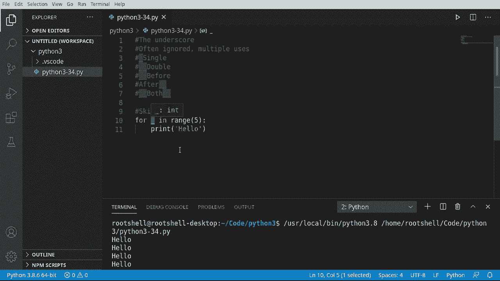
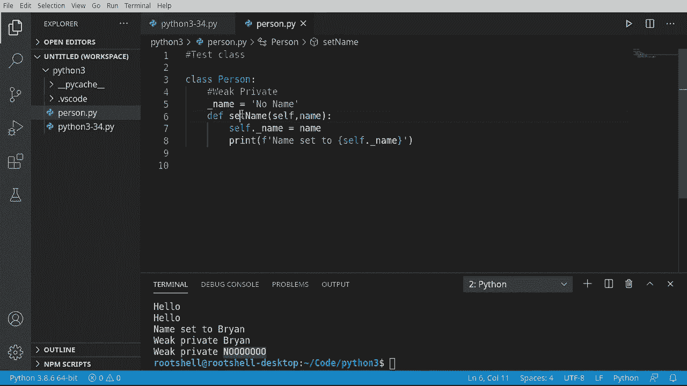
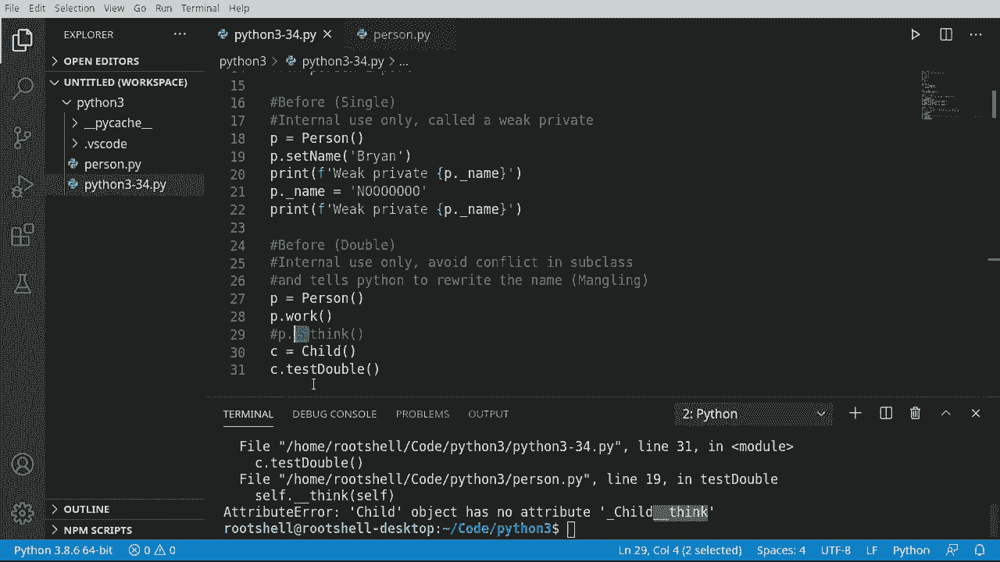
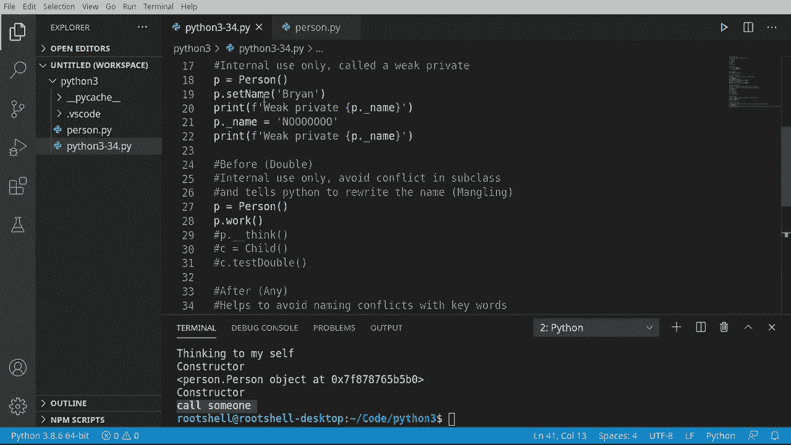

# Python 3全系列基础教程，P34：34）底层核心：下划线详解 🧩


在本节课中，我们将深入探讨Python中下划线的多种用法。下划线是一个看似简单但功能丰富的符号，它在变量命名、方法定义和类设计中扮演着重要角色。理解其不同用法是掌握Python语法和设计模式的关键一步。

## 概述

下划线在Python中有多种形态：单下划线、双下划线、前导下划线和后置下划线等。每种形态都有其特定的语义和用途，从忽略变量到实现私有属性。本节课将逐一解析这些用法，并通过实例演示其应用场景。

---



## 1. 单下划线：忽略变量


上一节我们介绍了下划线的概览，本节中我们来看看它的第一个常见用法：作为占位符，忽略不需要的变量。

在循环或解包赋值时，有时我们并不需要某个值。使用一个未使用的变量名可能会被代码检查工具警告。此时，可以使用单下划线 `_` 作为变量名，明确表示“这个值我不关心”。

以下是具体示例：

```python
for _ in range(5):
    print("Hello")
```

在上面的代码中，我们循环5次，每次打印“Hello”。循环变量 `_` 没有被使用，这明确告知Python和阅读代码的人，我们只需要循环次数，而不关心循环索引的具体值。

---

## 2. 单前导下划线：弱“私有”属性

理解了忽略变量的用法后，我们来看看下划线在类定义中的作用。单前导下划线（如 `_variable`）用于约定俗成的“私有”属性。

它被称为“弱私有”，因为这只是一种命名约定，Python解释器并不会阻止外部代码访问它。它向其他程序员表明：“这是一个内部属性，请勿在类外部直接访问或修改。”

以下是具体示例：

```python
class Person:
    def __init__(self, name):
        self._name = name  # 弱私有属性

    def get_name(self):
        return self._name

# 创建对象
p = Person("Bryan")
print(p.get_name())  # 正确方式：通过方法访问
print(p._name)       # 不推荐方式：可以直接访问，但这是约定所不鼓励的
```

**注意**：尽管可以直接访问 `p._name`，但根据约定，你应该通过类提供的公共方法（如 `get_name()`）来访问，以避免破坏类的内部逻辑。

---




## 3. 双前导下划线：名称修饰（强“私有”属性）

上一节我们介绍了弱私有属性，本节中我们来看看一种更强的“私有”机制：名称修饰。

双前导下划线（如 `__variable`）会触发Python的名称修饰机制。解释器会在属性名前加上 `_类名` 作为前缀，从而使其在子类中更难被意外重写或直接访问。这提供了一种更强的“私有”效果。

以下是具体示例：

```python
class Person:
    def __init__(self):
        self.__thought = "I'm thinking."  # 强私有属性

    def show_thought(self):
        print(self.__thought)  # 在类内部可以正常访问

class Child(Person):
    def try_access(self):
        # print(self.__thought)  # 这行会报错：AttributeError
        pass

p = Person()
p.show_thought()  # 输出: I'm thinking.
# print(p.__thought)  # 这行会报错：AttributeError
```

实际上，属性 `__thought` 在内部被重命名为 `_Person__thought`。虽然理论上可以通过这个“混淆后”的名字访问（`p._Person__thought`），但这**强烈不推荐**，因为它破坏了封装性。

---

## 4. 双前导和双后置下划线：特殊方法

除了用于私有属性，双下划线还用于Python的特殊方法（魔术方法）。这些方法由Python解释器在特定场景下自动调用。

以下是具体示例：

```python
class Person:
    def __init__(self, name):
        self.name = name

    def __str__(self):
        return f"Person named {self.name}"

    def __call__(self):
        print(f"{self.name} is being called!")




p = Person("Alice")
print(p)   # 自动调用 __str__ 方法
p()        # 自动调用 __call__ 方法
```

常见的特殊方法包括：
*   `__init__`: 对象初始化时调用。
*   `__str__`: 当对象被转换为字符串（如 `print()`）时调用。
*   `__call__`: 使实例可以像函数一样被调用。

---

## 5. 单后置下划线：避免与关键字冲突

有时，我们想用的变量名恰好是Python的关键字（如 `class`, `def`, `type`）。为了规避语法错误，可以在变量名后加一个下划线。

以下是具体示例：

```python
class_ = "MyClass"  # 避免与关键字‘class’冲突
type_ = "Person"
print(class_, type_)
```

这是一种清晰且被广泛接受的命名惯例。

---

## 总结

本节课中我们一起学习了Python中下划线的核心用法：

1.  **单下划线 `_`**：用作占位符，忽略不需要的变量。
2.  **单前导下划线 `_var`**：约定上的“弱私有”属性或方法，提示仅供内部使用。
3.  **双前导下划线 `__var`**：触发名称修饰，实现“强私有”属性，避免子类中的命名冲突。
4.  **双前后下划线 `__var__`**：用于Python的特殊方法（魔术方法）。
5.  **单后置下划线 `var_`**：用于避免与Python关键字发生命名冲突。



掌握这些约定和机制，能帮助你编写出更符合Python风格、更健壮且易于维护的代码。记住，下划线不仅是语法的一部分，更是与Python社区其他开发者沟通的一种方式。