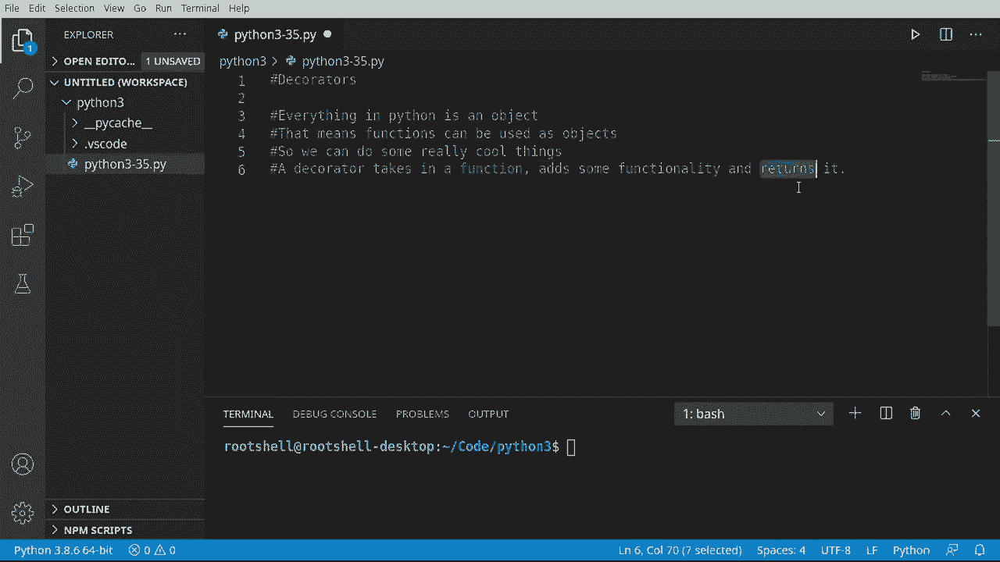
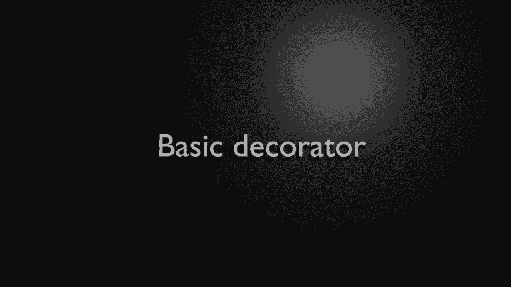
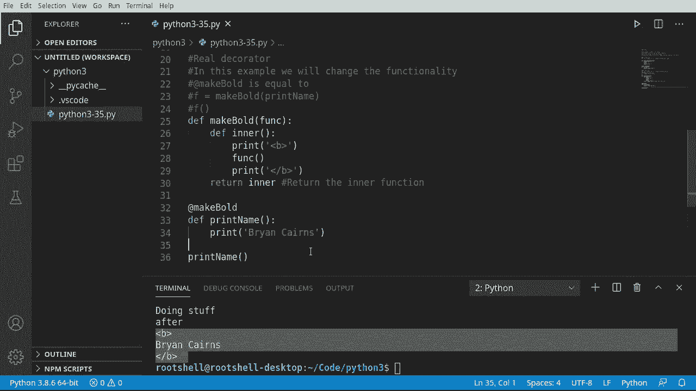
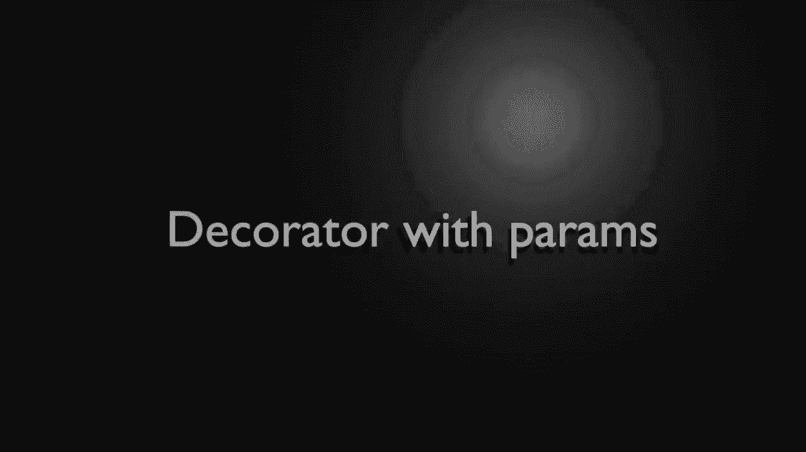
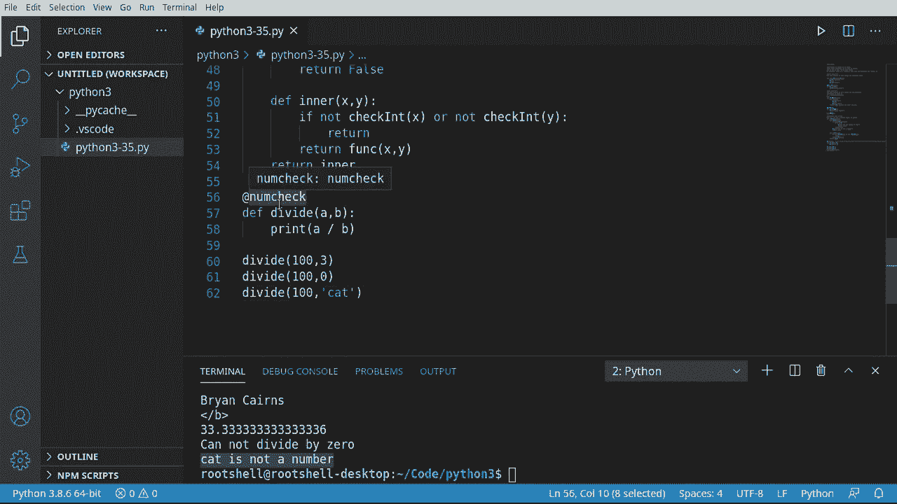
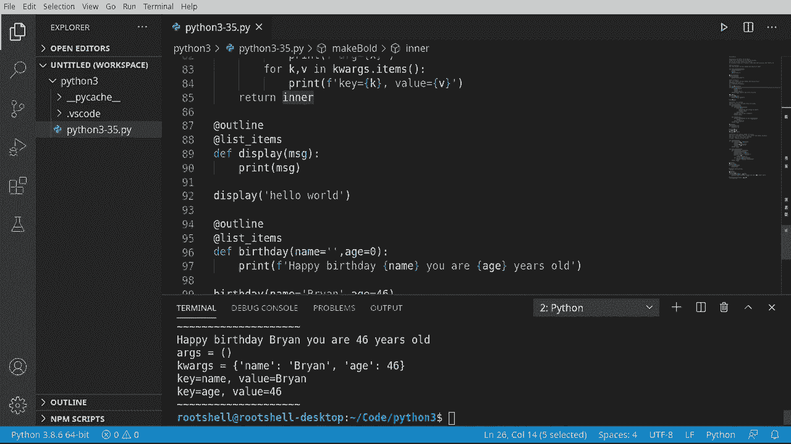

# Python 3全系列基础教程，P35：35）装饰器 🎭


在本节课中，我们将要学习Python中一个强大且优雅的概念——装饰器。装饰器允许我们修改或增强函数的行为，而无需改变函数本身的代码。理解装饰器是迈向编写更灵活、更可重用Python代码的重要一步。





## 概述

装饰器的核心思想是：**函数也是对象**。这意味着函数可以像变量一样被传递、赋值，并作为参数传递给其他函数。装饰器本质上是一个接受函数作为参数、添加一些功能，然后返回一个新函数的“包装器”。

其基本模式可以表示为：
```python
def decorator(func):
    # 添加一些功能
    return func
```

---

## 装饰器基础

上一节我们介绍了装饰器的核心概念。本节中我们来看看如何创建一个最简单的装饰器。

首先，我们创建一个名为 `decorator` 的函数，它接受另一个函数 `func` 作为参数。

```python
def decorator(func):
    print("做一些事情")
    return func
```

现在，我们定义一个普通函数 `do_something`。

```python
def do_something():
    print("执行任务")
```

装饰器的传统用法是手动将函数传递给装饰器，并接收返回的函数。

```python
f = decorator(do_something)
```

然而，Python提供了一种更优雅的语法：使用 `@` 符号。

```python
@decorator
def do_something():
    print("执行任务")
```

当Python看到 `@decorator` 时，它会自动执行 `do_something = decorator(do_something)`。这里有一个关键点：**如果装饰器函数内部直接执行了代码（例如打印语句），那么这些代码会在函数被装饰时立即执行，而不是在调用被装饰的函数时执行**。

---

## 创建真正的装饰器



上一节我们看到了一个会立即执行代码的“错误”示例。本节中我们来看看如何创建一个“真正的”装饰器，它应该返回一个新的函数（通常是一个内部函数），而不是直接执行操作。



以下是创建标准装饰器的模式：

```python
def make_bold(func):
    def inner():
        return "<b>" + func() + "</b>"
    return inner
```

这个 `make_bold` 装饰器定义了一个内部函数 `inner`。`inner` 函数调用了原始函数 `func`，并在其结果前后添加了HTML的加粗标签。**关键步骤是，装饰器返回的是 `inner` 这个函数对象本身，而不是调用它**。

现在，我们可以使用这个装饰器：

```python
@make_bold
def print_name():
    return "Bryan"
```

当我们调用 `print_name()` 时，实际执行的是 `inner()` 函数，它返回了 `"<b>Bryan</b>"`。

这个过程可以理解为：
```python
print_name = make_bold(print_name) # 返回 inner 函数
result = print_name() # 实际上调用的是 inner()
```

---

## 处理带参数的函数

上一节我们装饰的函数没有参数。本节中我们来看看如何创建一个能处理带参数函数的装饰器。

假设我们有一个除法函数 `divide(a, b)`，我们想创建一个装饰器来检查参数类型并防止除以零的错误。

首先，我们创建装饰器框架。由于被装饰的函数 `divide` 接受两个参数，我们的装饰器内部函数也需要能接受相应的参数。

```python
def num_check(func):
    def inner(x, y):
        # 在这里添加检查逻辑
        return func(x, y)
    return inner
```

接下来，我们在 `inner` 函数中添加参数检查逻辑。以下是检查参数是否为整数且除数不为零的示例：

```python
def check_int(value):
    if isinstance(value, int):
        if value == 0:
            print("不能除以0")
            return False
        return True
    else:
        print(f"‘{value}’ 不是一个数字")
        return False

def num_check(func):
    def inner(x, y):
        if check_int(x) and check_int(y):
            return func(x, y)
        # 如果检查失败，可以选择返回None或抛出异常
        return None
    return inner
```

现在，我们可以用这个装饰器来保护我们的除法函数：

```python
@num_check
def divide(a, b):
    return a / b

print(divide(10, 2))  # 输出: 5.0
print(divide(10, 0))  # 输出: 不能除以0 \n None
print(divide(10, “cat”)) # 输出: ‘cat’ 不是一个数字 \n None
```

这个装饰器现在可以复用于任何需要类似参数检查的函数。




---

## 通用装饰器与装饰器链

上一节我们处理了固定数量参数的函数。本节中我们来看看如何创建能处理任意数量参数的通用装饰器，以及如何将多个装饰器串联使用。

### 通用参数装饰器

使用 `*args` 和 `**kwargs` 可以让我们的装饰器适应任何函数签名。

```python
def outline(func):
    def inner(*args, **kwargs):
        print(“~” * 20)
        result = func(*args, **kwargs)
        print(“~” * 20)
        return result
    return inner
```

这个 `outline` 装饰器会在函数执行前后打印一行波浪线，适用于任何参数的函数。

### 装饰器链

我们可以将多个装饰器应用到一个函数上，它们会按照从下到上（或从内到外）的顺序执行。

以下是另一个装饰器，它将函数的输出格式化为列表项：

```python
def list_items(func):
    def inner(*args, **kwargs):
        result = func(*args, **kwargs)
        print(“参数args是:”, args)
        print(“关键字参数kwargs是:”, kwargs)
        # 假设result是字符串，将其作为列表项处理
        return f“- {result}”
    return inner
```

现在，我们可以将两个装饰器链在一起：

```python
@outline
@list_items
def display(msg):
    return msg

print(display(“Hello World”))
```
执行顺序是：先应用 `@list_items`，再应用 `@outline`。输出结果会被先格式化为列表项，然后被波浪线包围。

我们也可以将装饰器用于带不同参数的函数：

```python
@outline
@list_items
def birthday(name, age):
    return f“生日快乐 {name}! 你 {age} 岁了。”

print(birthday(name=“Bryan”, age=46))
```
通用装饰器 `*args, **kwargs` 使得 `outline` 和 `list_items` 能够完美地处理这个带关键字参数的函数。

---

## 总结

本节课中我们一起学习了Python装饰器的核心知识。

我们首先理解了装饰器的本质：**它是一个接受函数作为参数并返回一个（通常是新的）函数的可调用对象**。我们学习了使用 `@decorator_name` 的语法糖来应用装饰器。

关键要点包括：
1.  基础装饰器结构是外层函数接受 `func`，内层函数（`inner`）包装功能并返回 `func(*args, **kwargs)` 的结果，最后外层函数返回内层函数对象。
2.  为了让装饰器能处理带参数的函数，内层函数需要定义相应的参数，或使用 `*args` 和 `**kwargs` 来通用化。
3.  多个装饰器可以链式应用，执行顺序是从最靠近函数的装饰器开始，由内向外执行。
4.  装饰器的强大之处在于其**可重用性**和**非侵入性**。你可以为函数添加日志、验证、计时等功能，而无需修改函数本身的代码。



装饰器是Python高级编程和框架（如Flask、Django）中广泛使用的模式。虽然初学时会觉得有些抽象，但一旦掌握其“接受函数、返回函数”的核心模式，你就能利用它们写出更加简洁、优雅和强大的代码。