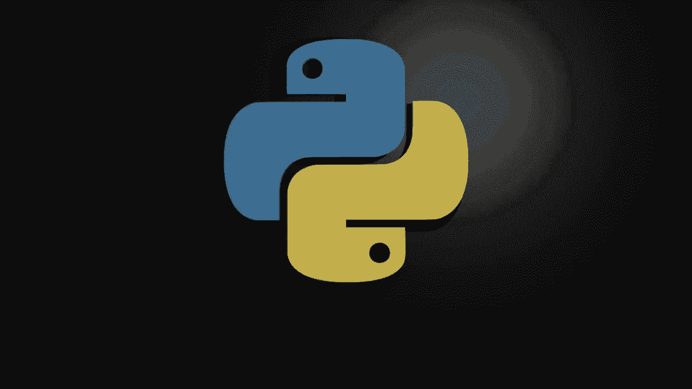
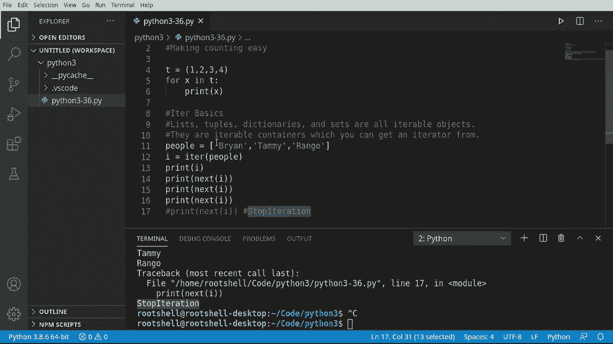
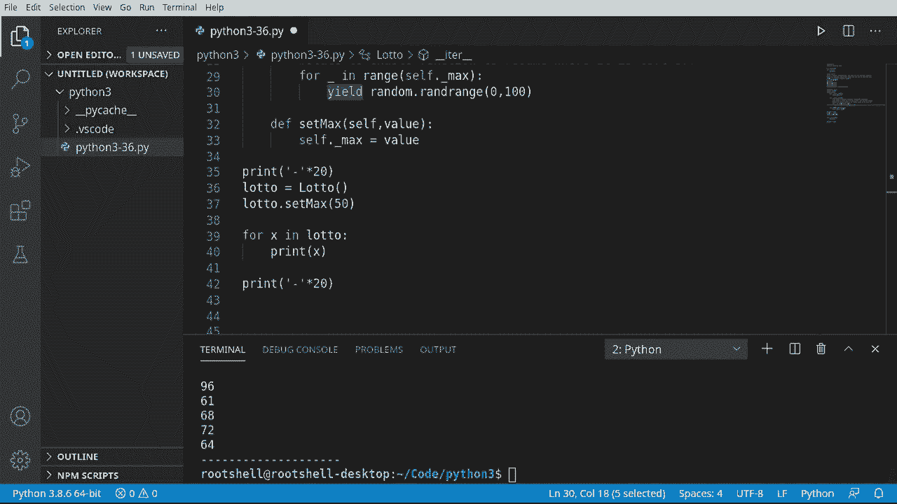

# Python 3全系列基础教程，P36：36）迭代器 🔄




在本节课中，我们将要学习Python中的迭代器。迭代器是Python中用于遍历数据集合的核心工具，它使得循环操作变得简单高效。我们将从基础概念讲起，了解其工作原理，并最终学习如何创建自定义的迭代器。

## 迭代器基础概念

上一节我们介绍了课程概述，本节中我们来看看迭代器的基础概念。在Python中，列表、元组、字典、集合和字符串等对象都是“可迭代的”。这意味着它们可以被遍历。Python通过一个称为“迭代器”的对象来实现遍历。

例如，一个简单的元组 `(1, 2, 3, 4)` 可以被 `for` 循环遍历。Python内部知道如何访问其中的每一个元素。为了理解其背后的机制，我们需要了解 `iter()` 和 `next()` 这两个内置函数。

## 使用 iter() 和 next()

我们使用 `iter()` 函数从一个可迭代对象（如列表）中获取一个迭代器对象。这个迭代器对象与原始列表是分开的，它负责记录遍历的位置。



以下是创建一个列表迭代器并手动遍历的步骤：


```python
people = ["布莱恩", "田明", "Rango"]
i = iter(people)  # 获取列表的迭代器
print(next(i))  # 输出：布莱恩
print(next(i))  # 输出：田明
print(next(i))  # 输出：Rango
```

每次调用 `next()` 函数，迭代器就会前进到下一个元素并返回它。当所有元素都被遍历后，再次调用 `next()` 会引发一个 `StopIteration` 异常。Python的 `for` 循环在内部就是利用这个异常来判断循环应该何时结束。

## 创建自定义迭代器

理解了内置迭代器的工作原理后，本节我们将学习如何创建自己的迭代器类。在Python 3中，创建迭代器最简洁的方式是使用 `__iter__` 方法和 `yield` 语句。

`yield` 语句会暂停函数的执行并返回一个值，但与 `return` 不同，函数会保留当前状态。当再次被调用时，函数会从上次暂停的地方继续执行。这极大地简化了迭代器的创建。

下面是一个模拟彩票号码生成器的自定义迭代器示例：

```python
import random

class Lottery:
    def __init__(self):
        self._max = 5  # 默认最大号码

    def __iter__(self):
        # 使用 yield 创建生成器迭代器
        for _ in range(self._max):
            yield random.randint(0, 99)  # 生成一个随机数

    def set_max(self, value):
        """允许用户设置生成号码的数量"""
        self._max = value

# 使用自定义迭代器
lotto = Lottery()
lotto.set_max(10)  # 设置生成10个号码

print("生成的彩票号码：")
for x in lotto:  # 像遍历列表一样遍历我们的类
    print(x)
```

在这个例子中，`__iter__` 方法是一个“生成器函数”，因为它包含 `yield` 语句。当我们使用 `for x in lotto` 时，Python会自动调用这个方法来获取一个迭代器，并每次从中 `yield` 出一个随机数，直到达到指定的数量。

## 总结

本节课中我们一起学习了Python迭代器的核心知识。我们首先了解了迭代器的基础，即通过 `iter()` 和 `next()` 函数手动控制遍历过程。然后，我们深入探讨了如何利用 `__iter__` 方法和强大的 `yield` 语句来创建自定义的迭代器类，这比旧式方法更加简洁和直观。



迭代器是Python循环和数据处理的基础，理解它们能帮助你更深入地掌握Python的工作机制，并编写出更高效、更优雅的代码。