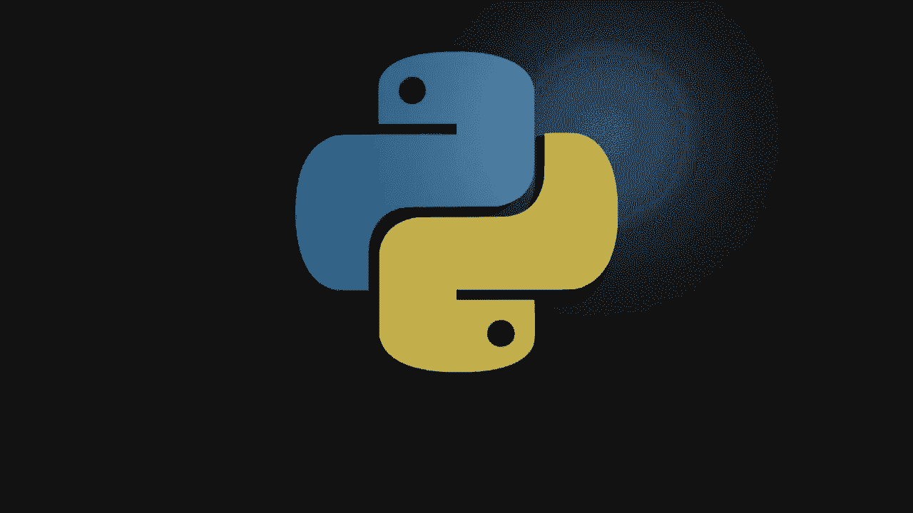
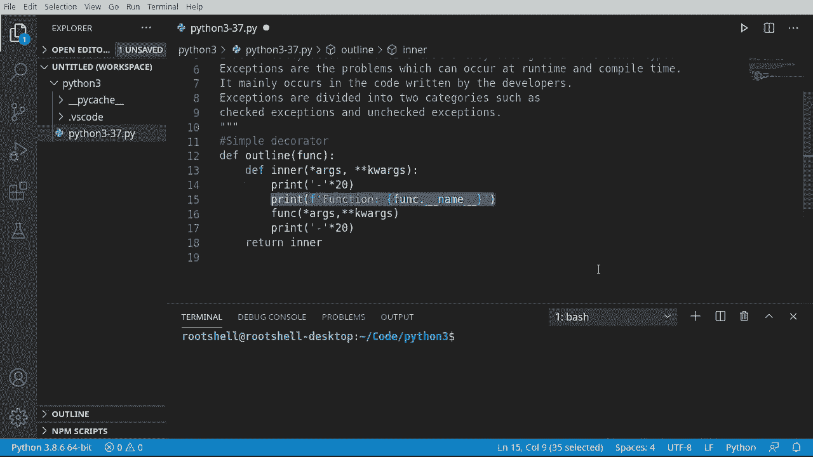
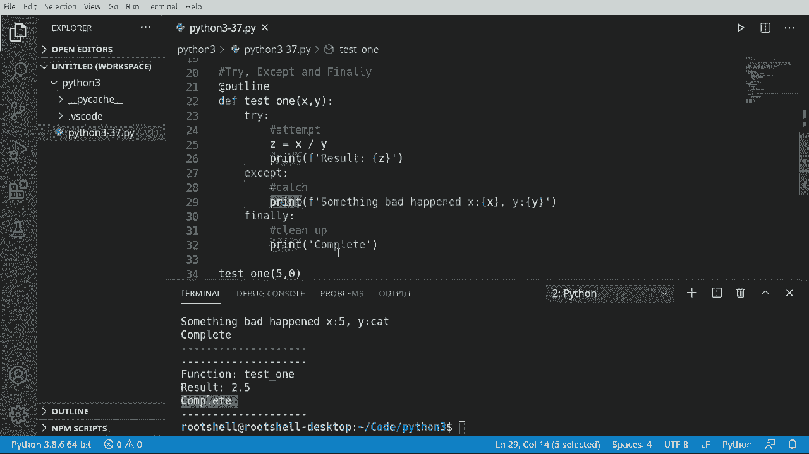
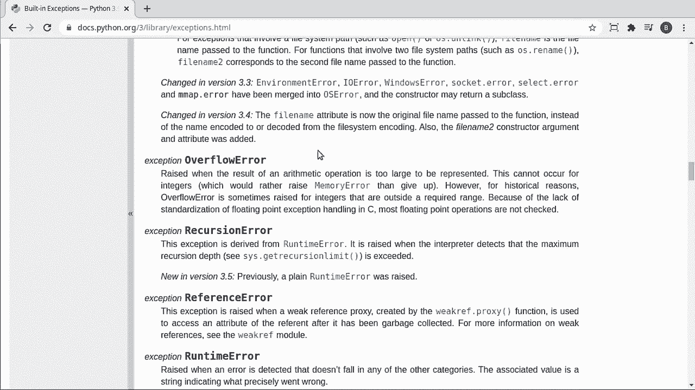
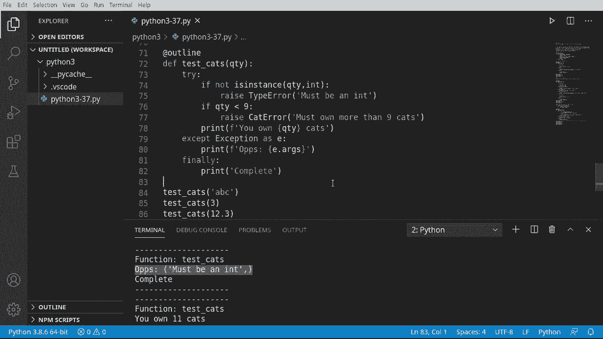

# Python 3全系列基础教程，P37：37）异常处理 🚨



在本节课中，我们将要学习Python中的异常处理。程序在运行时难免会遇到意外情况，例如用户输入了错误的数据、试图打开不存在的文件，或者进行不合法的计算（如除以零）。异常处理机制允许我们优雅地捕获并处理这些“异常”情况，防止程序直接崩溃，并给出有意义的反馈或执行必要的清理工作。

## 概述

异常处理是编写健壮程序的关键。我们将学习如何使用 `try`、`except`、`else` 和 `finally` 语句来构建异常处理结构，了解常见的异常类型，并探索如何创建和引发自定义异常。

---

## 错误与异常




在深入语法之前，我们需要区分“错误”和“异常”。

*   **错误**：通常指运行时发生的、不可预料的系统级问题，例如硬件故障或网络中断。这类问题通常无法在代码中完全防御。
*   **异常**：通常由代码逻辑引发，发生在运行时或编译时。例如，除以零、访问不存在的列表索引、类型不匹配等。异常是我们可以并且应该处理的。

简单来说，错误是“天灾”，异常是“人祸”。本节课我们主要处理“人祸”。

---

## 基础结构：try, except, finally

上一节我们介绍了异常的基本概念，本节中我们来看看处理异常的核心语法。最基本的异常处理结构由 `try`、`except` 和 `finally` 块组成。

*   `try`：包裹可能会引发异常的代码。
*   `except`：捕获并处理特定的异常。
*   `finally`：无论是否发生异常，都会执行的代码块，常用于资源清理（如关闭文件）。

其基本形式如下：

```python
try:
    # 尝试执行的代码
    risky_operation()
except:
    # 如果发生异常，执行这里的代码
    handle_error()
finally:
    # 无论是否发生异常，最终都会执行
    cleanup()
```

让我们通过一个函数来演示：

```python
def test_division(x, y):
    try:
        result = x / y  # 可能引发 ZeroDivisionError 或 TypeError
        print(f"结果是：{result}")
    except:
        print("发生了一些坏事。")
    finally:
        print("清理完成。")

# 测试
test_division(5, 2)   # 正常
test_division(5, 0)   # 除以零
test_division(5, 'cat') # 类型错误
```

运行上述代码，你会发现即使输入导致错误（如除以零或类型不匹配），程序也没有崩溃，而是执行了 `except` 块中的代码，并且 `finally` 块始终被执行。

`except` 就像在其他语言中的 `catch`，它“接住”了被抛出的异常，防止程序“摔碎”。

---

## 捕获特定异常

只使用一个通用的 `except` 块虽然能防止崩溃，但我们不知道具体出了什么问题。为了进行更有针对性的处理，我们可以捕获特定的异常类型。



Python 内置了许多异常类型，例如 `ZeroDivisionError`、`TypeError`、`ValueError`、`FileNotFoundError` 等。


以下是捕获特定异常的方法：

```python
def test_division_specific(x, y):
    try:
        result = x / y
        print(f"结果是：{result}")
    except ZeroDivisionError:
        print("错误：除数不能为零。")
    except TypeError:
        print("错误：操作数类型不支持。")
    finally:
        print("计算尝试结束。")

# 测试
test_division_specific(5, 0)    # 触发 ZeroDivisionError
test_division_specific(5, 'cat') # 触发 TypeError
```



通过指定异常类型，我们可以为不同的问题提供更精确的错误信息。

---

## 使用 else 子句

`try` 语句还可以包含一个 `else` 子句。当 `try` 块中的代码**没有引发任何异常**时，`else` 块中的代码将会执行。

这适用于那些**只有在前置操作成功后才应该执行**，并且**本身不应该被同一个 `try` 块捕获**的代码。

```python
def process_data(data):
    try:
        # 尝试解析或处理数据
        processed = int(data)
    except ValueError:
        print("输入的数据无法转换为整数。")
    else:
        # 仅当 try 块成功（未抛出异常）时执行
        print(f"数据处理成功，结果是：{processed}")
        # 这里可以安全地进行后续操作，例如写入文件
    finally:
        print("数据处理流程结束。")

process_data("123")
process_data("abc")
```

注意：`else` 块中的代码不应包含可能引发新异常的复杂逻辑，否则你需要嵌套另一个 `try-except`。

---

## 获取异常信息

有时我们不仅想知道异常类型，还想知道具体的错误信息。我们可以使用 `as` 关键字将捕获的异常赋值给一个变量。

```python
def test_division_info(x, y):
    try:
        result = x / y
    except Exception as e:  # 捕获所有异常，并赋值给变量 e
        print(f"发生异常：{type(e).__name__}")
        print(f"异常详情：{e}")
    else:
        print(f"结果是：{result}")

test_division_info(10, 0)
test_division_info(10, '2')
```

这里 `Exception` 是所有内置、非系统退出类异常的基类。使用 `as e` 可以让我们访问异常对象的详细信息。

---

## 主动引发异常：raise 和 assert

我们不仅可以被动处理异常，还可以主动“引发”异常。这通过 `raise` 语句实现。

### 使用 raise

当检测到程序不应继续执行的条件时（如无效参数），可以主动抛出异常。

```python
def set_age(age):
    if not isinstance(age, int):
        raise TypeError("年龄必须是整数。")
    if age < 0:
        raise ValueError("年龄不能为负数。")
    print(f"年龄设置为：{age}")

try:
    set_age(-5)
    set_age("二十五")
except (TypeError, ValueError) as e:
    print(f"参数错误：{e}")
```

### 使用 assert

`assert`（断言）用于在开发阶段检查程序内部状态。如果其后的条件为 `False`，则会引发 `AssertionError`。它通常用于调试，确保代码执行到某处时，某个条件必须为真。

```python
def calculate_discount(price, discount_rate):
    # 断言：折扣率必须在0到1之间
    assert 0 <= discount_rate <= 1, "折扣率必须在0和1之间（包含）"
    final_price = price * (1 - discount_rate)
    return final_price

# 正常情况
print(calculate_discount(100, 0.2))
# 触发断言错误
print(calculate_discount(100, 1.2))
```

注意：在正式发布的程序中，可以通过 `-O`（大写字母O）命令行选项来关闭断言，使其不生效。

---

## 创建自定义异常

当内置异常类型不足以清晰描述问题时，我们可以创建自定义异常类。自定义异常类通常继承自 `Exception` 类或其子类（如 `RuntimeError`）。

创建自定义异常能让错误信息更贴近你的业务逻辑。

```python
# 1. 定义自定义异常类
class InsufficientCatsError(RuntimeError):
    """猫的数量不足错误"""
    def __init__(self, message):
        super().__init__(message)

# 2. 在代码中引发自定义异常
def check_cat_quantity(qty):
    if not isinstance(qty, int):
        raise TypeError("猫的数量必须是整数。")
    if qty < 9:
        # 引发我们自定义的异常
        raise InsufficientCatsError(f"只有 {qty} 只猫？必须拥有超过9只猫才够理智！")
    print(f"你拥有 {qty} 只猫，这很合理。")

# 3. 捕获并处理自定义异常
try:
    check_cat_quantity(3)
    check_cat_quantity('abc')
    check_cat_quantity(11)
except TypeError as e:
    print(f"类型错误：{e}")
except InsufficientCatsError as e:
    print(f"猫量不足警告：{e}")
except Exception as e:
    print(f"发生未知错误：{e}")
finally:
    print("猫咪检查完毕。")
```

通过继承，自定义异常拥有了所有异常的共同行为。引发时，可以传递特定的错误信息。

---

## 总结

本节课中我们一起学习了Python异常处理的完整流程：

1.  **核心结构**：掌握了使用 `try`、`except`、`else` 和 `finally` 来构建健壮的代码块，确保程序在遇到问题时能优雅处理并完成清理。
2.  **精准捕获**：学习了如何捕获特定的异常类型（如 `ZeroDivisionError`, `TypeError`），并提供针对性的处理逻辑。
3.  **信息获取**：了解了如何通过 `except Exception as e` 获取异常对象的详细信息，便于调试和记录。
4.  **主动控制**：学会了使用 `raise` 语句在检测到非法状态时主动引发异常，以及使用 `assert` 语句在开发阶段进行内部检查。
5.  **自定义异常**：探索了通过继承 `Exception` 类来创建符合特定业务需求的自定义异常，使错误处理更加清晰和模块化。



异常处理的目标不是消灭所有异常，而是预见可能的问题，并以可控的方式管理它们，从而提升程序的稳定性和用户体验。记住，保持异常处理代码的简洁和针对性是关键。