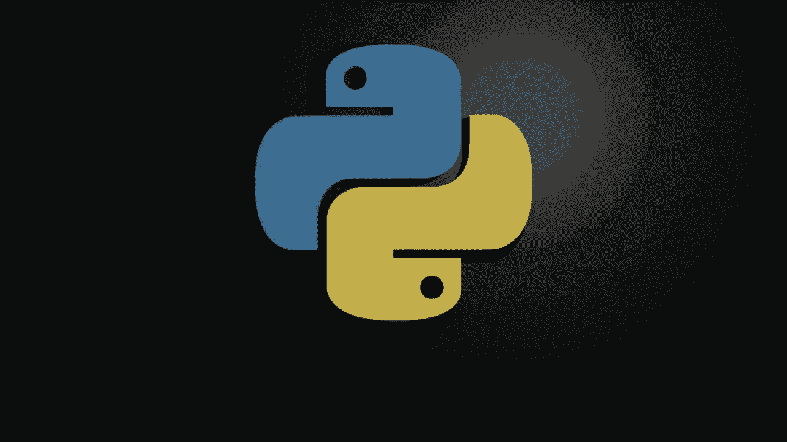
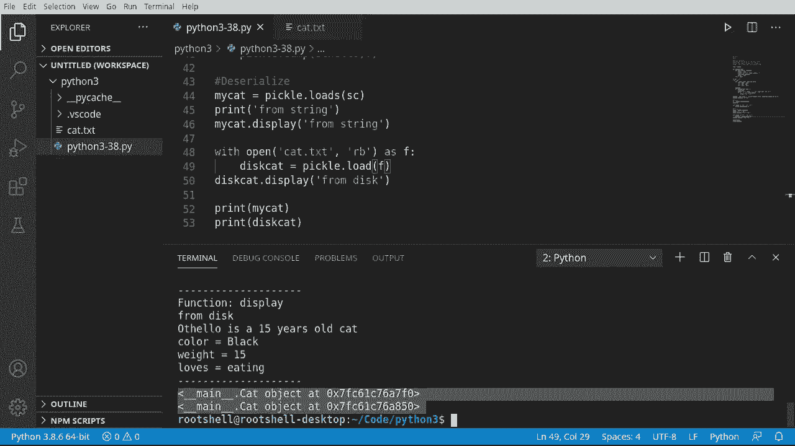

# Python 3全系列基础教程，P38：38）使用 Pickle 进行序列化 🥒




在本节课中，我们将要学习 Python 中一个名为 `pickle` 的模块，它用于对象的序列化与反序列化。序列化是指将对象转换为可以存储或传输的格式（如字节流），反序列化则是将这个格式重新转换回对象。通过 `pickle`，我们可以轻松地将程序中的对象保存到文件，或在程序重启后重新加载它们。

## 什么是 Pickle？🤔

`pickle` 是 Python 的一个标准库模块，它实现了数据的序列化和反序列化过程。这个过程类似于“腌制”食物以长期保存。在编程中，我们将对象的状态信息保存下来，以便后续可以完全恢复。虽然 `pickle` 非常方便，但它也有其局限性，例如对嵌套类结构的支持可能不完美，并且存在版本兼容性问题。还有其他序列化工具如 `dill` 可以克服 `pickle` 的一些缺点，但本节课我们专注于 `pickle` 的基础用法。

## 准备工作：导入模块与创建示例类

首先，我们需要导入 `pickle` 模块。为了清晰地展示函数调用过程，我们还将使用一个简单的装饰器。如果你对装饰器不熟悉，可以回顾相关教程。

```python
import pickle

# 一个简单的装饰器，用于打印函数名
def simple_decorator(func):
    def wrapper(*args, **kwargs):
        print(f"--- 调用函数: {func.__name__} ---")
        result = func(*args, **kwargs)
        print("-" * 30)
        return result
    return wrapper
```

接下来，我们创建一个简单的 `Cat` 类作为序列化的示例对象。这个类包含名字、年龄和一个信息字典。

```python
class Cat:
    def __init__(self, name, age, info):
        self._name = name
        self._age = age
        self._info = info

    @simple_decorator
    def display(self, message):
        print(message)
        print(f"猫的名字是 {self._name}，年龄 {self._age} 岁。")
        for key, value in self._info.items():
            print(f"  {key}: {value}")
```

现在，让我们创建一个 `Cat` 类的实例。

```python
# 创建一只猫的实例
othello_info = {'颜色': '黑色', '体重': '重', '爱好': '吃东西'}
othello = Cat("奥赛罗", 15, othello_info)

# 测试显示功能
othello.display("这是奥赛罗的信息：")
```

运行上述代码，装饰器会打印出函数调用的信息，然后显示猫的详细信息。

## 序列化：将对象转换为字节流 🥒

序列化是将对象状态转换为字节流的过程。`pickle` 模块提供了两种主要方法：`dumps()` 和 `dump()`。

`pickle.dumps(obj)` 将对象序列化为一个**字节字符串**。
`pickle.dump(obj, file)` 将对象序列化并直接写入一个**文件**。

以下是使用 `dumps()` 的示例：

```python
# 将对象序列化为字节字符串
serialized_cat = pickle.dumps(othello)
print("序列化后的字节字符串：")
print(serialized_cat)
```

执行后，你会看到一串以 `b‘` 开头的字节字符串，这就是 `othello` 对象的序列化形式。

接下来，我们看看如何将对象序列化到文件中。这需要以二进制写入模式（`‘wb‘`）打开文件。

```python
# 将对象序列化并保存到文件
with open('cat_data.pkl', 'wb') as file:
    pickle.dump(othello, file)
print("对象已序列化并保存到 ‘cat_data.pkl‘ 文件。")
```

现在，你的目录下会生成一个 `cat_data.pkl` 文件。由于它是二进制格式，用普通文本编辑器打开会显示乱码。

## 反序列化：从字节流恢复对象 🔄

反序列化是序列化的逆过程，它将字节流重新转换为可用的 Python 对象。`pickle` 模块同样提供了两种方法：`loads()` 和 `load()`。

`pickle.loads(data)` 从**字节字符串**反序列化出对象。
`pickle.load(file)` 从**文件**中读取并反序列化出对象。

首先，我们从之前创建的字节字符串中恢复对象：

```python
# 从字节字符串反序列化对象
cat_from_string = pickle.loads(serialized_cat)
print("\n从字符串反序列化的猫：")
cat_from_string.display("重新加载的奥赛罗：")
```

运行后，你会发现 `cat_from_string` 和原来的 `othello` 对象拥有相同的数据。

同样，我们可以从保存的文件中加载对象：

```python
# 从文件反序列化对象
with open('cat_data.pkl', 'rb') as file: # 注意是 ‘rb‘ 模式
    cat_from_disk = pickle.load(file)
print("\n从磁盘文件反序列化的猫：")
cat_from_disk.display("从文件加载的奥赛罗：")
```

## 重要注意事项 ⚠️

虽然 `pickle` 非常强大，但在使用时需要注意以下几点：

1.  **对象独立性**：每次反序列化都会创建一个**新的对象**。即使数据相同，它们在内存中也是不同的实例。
    ```python
    print(id(othello))          # 原始对象的内存地址
    print(id(cat_from_string))  # 反序列化对象的内存地址
    # 两者的输出值不同
    ```
2.  **安全性**：`pickle` 在反序列化时会执行字节码。**永远不要反序列化来自不受信任来源的数据**，这可能导致恶意代码执行。
3.  **兼容性**：`pickle` 格式是 Python 特有的，其他编程语言通常无法读取。此外，高版本 Python 序列化的数据可能无法用低版本 Python 反序列化。

## 总结 📚

本节课我们一起学习了 Python 中 `pickle` 模块的基础知识。我们了解了序列化与反序列化的概念，并实践了如何使用 `dumps`/`loads` 和 `dump`/`load` 这两组方法在内存字符串和文件之间保存与恢复对象。

记住，`pickle` 是快速保存 Python 对象状态的便捷工具，尤其适用于临时存储或进程间通信。但对于需要长期存储、跨语言或网络传输的数据，应考虑更标准化的格式，如 JSON 或 Protocol Buffers。



