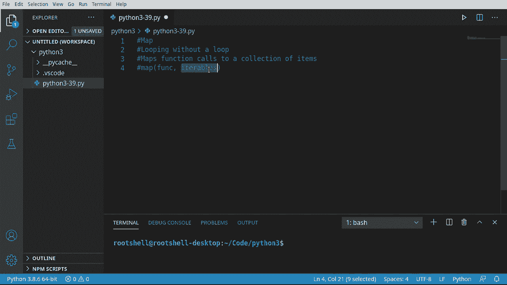
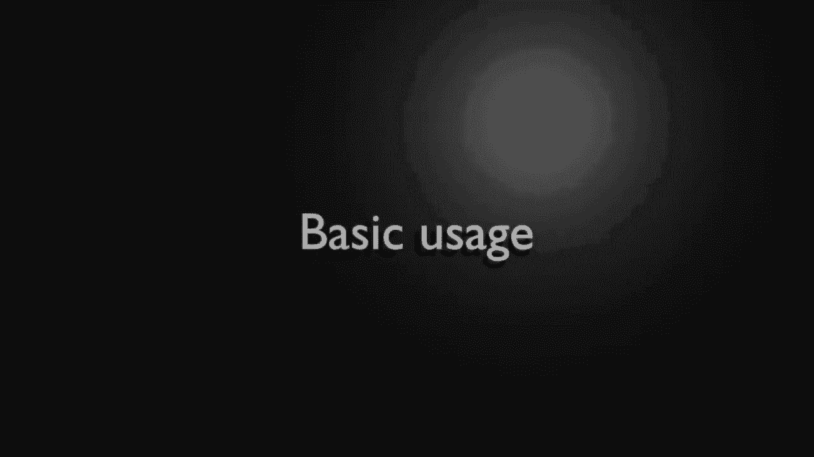
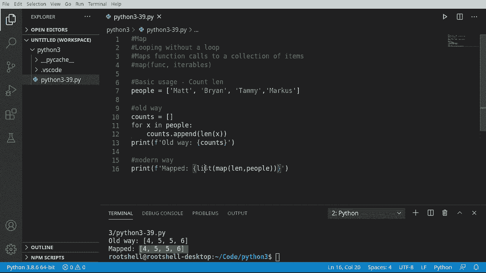
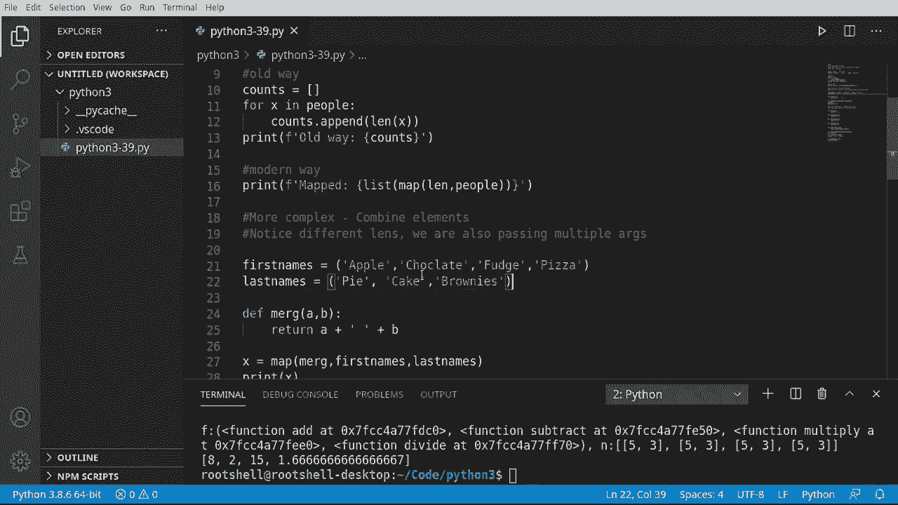

# Python 3全系列基础教程，P39：39）Map函数 🗺️


在本节课中，我们将要学习Python中一个非常强大的内置函数——`map()`函数。它允许我们在不显式编写循环的情况下，将一个函数应用于一个或多个序列（如列表、元组）中的每一个元素。这是一种函数式编程风格的技巧，能让代码更简洁。





## 概述

`map()`函数的核心思想是“映射”。它接收一个函数和一个或多个可迭代对象作为参数，然后将该函数依次应用于每个可迭代对象的对应元素上，并返回一个包含所有结果的迭代器。本节课我们将从基础用法开始，逐步深入到更复杂的应用场景。

## 基础用法：计算字符串长度

让我们从一个简单的例子开始。假设我们有一个包含人名的列表，我们希望得到每个名字的长度。

以下是传统的循环方法：

```python
people = ['Matt', 'Brian', 'Tammy', 'Marcus']
counts = []
for x in people:
    counts.append(len(x))
print(counts)  # 输出: [4, 5, 5, 6]
```

这种方法直观易懂，但代码略显冗长。

现在，我们来看看使用`map()`函数的现代方式：

```python
people = ['Matt', 'Brian', 'Tammy', 'Marcus']
result = list(map(len, people))
print(result)  # 输出: [4, 5, 5, 6]
```

这里发生了什么？`map(len, people)`创建了一个`map`对象，它将内置函数`len`应用于`people`列表中的每一个元素。然后，`list()`函数将这个`map`对象转换成了我们可以直接查看和使用的列表。一行代码就完成了之前四行代码的工作。




> **核心概念**：`map(function, iterable, ...)` 返回一个迭代器，该迭代器将函数应用于输入可迭代对象的每个项。

## 进阶应用：合并两个列表

上一节我们介绍了`map()`函数处理单个列表的基本用法，本节中我们来看看如何使用它处理多个列表。

假设我们有两个元组，分别包含名字和姓氏，我们希望将它们合并成全名。

首先，我们定义一个简单的合并函数：

```python
def merge(a, b):
    return a + ' ' + b
```

然后，我们使用`map()`函数来应用它：

```python
first_names = ('Apple', 'Chocolate', 'Fudge', 'Pizza')
last_names = ('Pie', 'Cake', 'Brownie')

x = map(merge, first_names, last_names)
print(list(x))  # 输出: ['Apple Pie', 'Chocolate Cake', 'Fudge Brownie']
```

请注意，输出结果中没有“Pizza”，因为`last_names`元组中没有与之配对的元素。`map()`函数会静默地忽略长度不匹配的多余项，而不会导致程序崩溃。

## 高阶技巧：映射多个函数

我们已经学会了如何将一个函数映射到数据上。现在，让我们挑战更复杂的场景：如何将多个不同的函数分别映射到对应的数据上？

首先，我们定义四个基础的数学运算函数：

```python
def add(a, b):
    return a + b

def subtract(a, b):
    return a - b

def multiply(a, b):
    return a * b

def divide(a, b):
    return a / b
```

接着，我们创建一个“执行器”函数，它接收一个函数和一个包含两个数字的列表，然后调用该函数：

```python
def do_all(func, num_list):
    return func(num_list[0], num_list[1])
```

现在，准备我们的函数列表和数据：

```python
# 函数列表
functions = (add, subtract, multiply, divide)

# 数据：一个嵌套列表，每个子列表包含一对数字
numbers = [[5, 3]] * len(functions)  # 生成 [[5,3], [5,3], [5,3], [5,3]]
```

最后，使用`map()`函数将`do_all`函数映射到`functions`和`numbers`上：

```python
m = map(do_all, functions, numbers)
print(list(m))  # 输出: [8, 2, 15, 1.6666666666666667]
```

这个例子中，`map(do_all, functions, numbers)`依次执行了：
1.  `do_all(add, [5,3])` -> `add(5,3)` -> `8`
2.  `do_all(subtract, [5,3])` -> `subtract(5,3)` -> `2`
3.  `do_all(multiply, [5,3])` -> `multiply(5,3)` -> `15`
4.  `do_all(divide, [5,3])` -> `divide(5,3)` -> `1.666...`

通过这种方式，我们在一次`map()`调用中高效地执行了多个不同的操作。

## 总结

本节课中我们一起学习了Python的`map()`函数。我们从最基础的将一个函数应用于单个列表开始，学习了如何用它替代传统的`for`循环来使代码更简洁。接着，我们探索了如何使用`map()`处理多个可迭代对象，将函数应用于它们的对应元素上。最后，我们挑战了一个高阶用例，演示了如何利用`map()`在一次调用中组合执行多个不同的函数。



记住`map()`函数的核心：**它接收一个函数和可迭代对象，并返回一个将该函数应用于每个输入元素的迭代器**。虽然初学时可能觉得其语法有些抽象，但一旦掌握，它将成为你编写高效、简洁Python代码的利器。