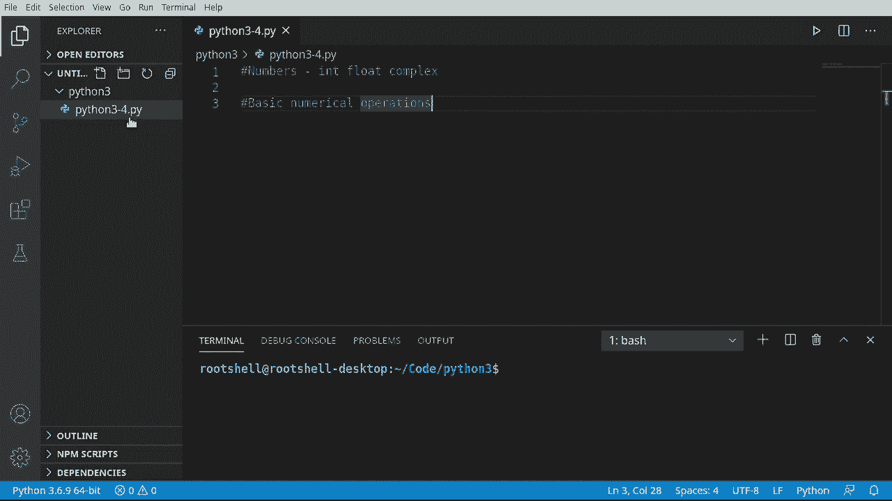
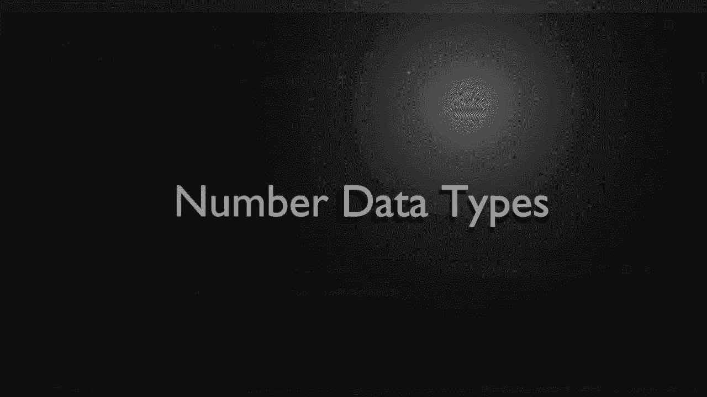
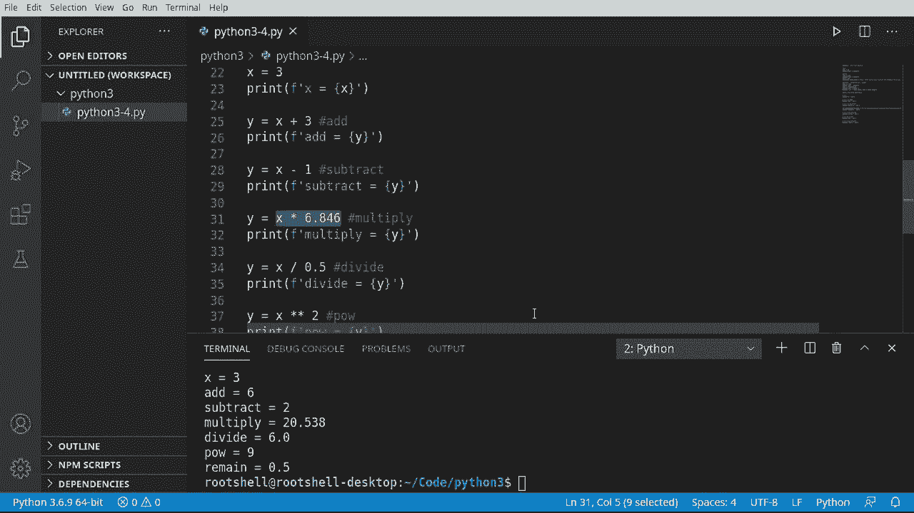

# Python 3全系列基础教程，P4：Python数字和基本数字运算 🔢


在本节课中，我们将要学习Python中的数字数据类型以及如何进行基本的数值运算。我们将介绍三种主要的数字类型：整数、浮点数和复数，并演示如何使用它们进行加、减、乘、除等基本计算。



---



## 数字数据类型

上一节我们介绍了Python的基本概念，本节中我们来看看Python如何处理数字。Python主要使用三种数字类型：整数、浮点数和复数。

### 整数（int）

整数是没有小数部分的数字。在Python中，创建和使用整数非常简单。

```python
ival = 34
print(ival)
```

运行上述代码，会输出 `34`。Python会自动将 `34` 识别为整数类型。

### 浮点数（float）

浮点数是带有小数点的数字。Python同样能轻松处理浮点数。

```python
fval = 3.14
print(fval)
```

运行代码会输出 `3.14`。整数和浮点数在底层处理上有区别，但Python为我们处理了所有细节，例如精度问题。我们可以使用 `sys.float_info` 来查看浮点数的系统信息。

```python
import sys
print(sys.float_info)
```

### 复数（complex）

复数由实部和虚部组成，在Python中用 `j` 表示虚部单位。

以下是创建复数的两种方法：

```python
# 方法一：直接使用 j 表示虚部
cval = 3 + 6j
print(cval)

# 方法二：使用 complex() 函数
cval2 = complex(5, 3)
print(cval2)
print(cval2.real)  # 获取实部
print(cval2.imag)  # 获取虚部
```

运行代码会分别输出复数的值及其组成部分。

---

## 基本数字运算

了解了数字类型后，我们来看看如何对它们进行基本的数学运算。Python支持所有常见的算术操作。

以下是基本的算术运算符示例：

```python
x = 3
print(x)

# 加法
y = x + 3
print(f"加法结果: {y}")

# 减法
y = x - 1
print(f"减法结果: {y}")

# 乘法
y = x * 6.846
print(f"乘法结果: {y}")

# 除法
y = x / 0.5
print(f"除法结果: {y}")

# 幂运算
y = x ** 2
print(f"幂运算结果: {y}")

# 取余（模运算）
y = x % 2.5
print(f"取余结果: {y}")
```

在这些运算中，Python会自动处理不同类型数字之间的计算，例如整数与浮点数相乘会得到浮点数，这个过程称为**类型转换**。

---

## 总结

本节课中我们一起学习了Python中的数字数据类型和基本运算。我们介绍了三种核心数字类型：**整数（int）**、**浮点数（float）** 和 **复数（complex）**。同时，我们实践了如何使用Python进行加法、减法、乘法、除法、幂运算和取余运算。



Python的强大之处在于它隐藏了底层计算的复杂性，让开发者可以更专注于逻辑本身。记住基本规则：没有小数点用整数，有小数点用浮点数，需要实部和虚部则用复数。掌握这些基础，是进行更复杂数学计算和科学编程的第一步。