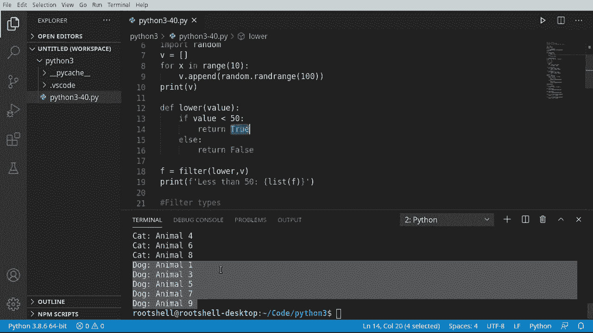

# Python 3全系列基础教程，P40：40）过滤函数 🔍


在本节课中，我们将要学习Python中的`filter()`函数。这个函数与上一节介绍的`map()`函数非常相似，它允许我们根据特定条件筛选出可迭代对象中的元素。

## 概述

`filter()`函数接收一个函数和一个可迭代容器作为参数。该函数对容器中的每个元素进行判断，如果函数返回`True`，则该元素会被保留在结果中；如果返回`False`，则会被过滤掉。这是一种非常强大的数据筛选方式。

## 基础用法：筛选数值范围

首先，我们来看一个简单的例子，使用`filter()`函数从一个随机数列表中筛选出小于50的数字。

以下是实现步骤：

1.  导入`random`模块生成随机数。
2.  创建一个包含10个随机数的列表。
3.  定义一个判断函数，检查数值是否小于50。
4.  使用`filter()`函数进行筛选。

```python
import random

# 生成一个包含10个随机数的列表
values = []
for x in range(10):
    values.append(random.randrange(100))

print("原始随机数列表:", values)

# 定义过滤函数
def less_than_50(value):
    if value < 50:
        return True
    else:
        return False

# 使用filter函数进行过滤
f = filter(less_than_50, values)
result = list(f)  # 将filter对象转换为列表
print("小于50的数字:", result)
```

运行上述代码，你会看到原始列表和筛选后只包含小于50的数字的新列表。`filter()`函数的核心逻辑就是判断每个元素是否满足条件（真或假）。

## 进阶应用：按类型过滤对象

上一节我们介绍了基础的数字过滤，本节中我们来看看如何将`filter()`函数应用于更复杂的场景，比如根据对象的类型进行筛选。

我们将创建`Animal`、`Cat`和`Dog`类，并将它们的实例混合在一个列表中，然后使用`filter()`分别筛选出所有的猫和所有的狗。

以下是实现步骤：

1.  定义基础的`Animal`类。
2.  创建继承自`Animal`的`Cat`和`Dog`类。
3.  生成一个混合了猫和狗实例的列表。
4.  编写过滤函数，使用`isinstance()`检查对象类型。
5.  应用`filter()`函数得到独立的猫列表和狗列表。

```python
# 定义动物基类
class Animal:
    def __init__(self, name):
        self.name = name

# 定义Cat类
class Cat(Animal):
    pass

# 定义Dog类
class Dog(Animal):
    pass

# 创建一个混合了猫和狗的列表
animals = []
for i in range(10):
    if i % 2 == 0:  # 偶数索引创建猫
        animals.append(Cat(f"动物{i}"))
    else:           # 奇数索引创建狗
        animals.append(Dog(f"动物{i}"))

print("混合动物列表:")
for a in animals:
    print(f"  - {a.name}: {type(a).__name__}")

# 定义过滤猫的函数
def cat_filter(value):
    return isinstance(value, Cat)

# 定义过滤狗的函数
def dog_filter(value):
    return isinstance(value, Dog)

# 使用filter函数进行过滤
cats = list(filter(cat_filter, animals))
dogs = list(filter(dog_filter, animals))

print("\n筛选出的猫:")
for c in cats:
    print(f"  - {c.name}")

print("\n筛选出的狗:")
for d in dogs:
    print(f"  - {d.name}")
```

通过这个例子，我们可以看到`filter()`函数如何灵活地应用于自定义对象，根据任何我们定义的条件（这里是类型）来整理和分割数据集合。

## 总结

本节课中我们一起学习了Python的`filter()`函数。我们了解到它的核心作用是**根据指定条件过滤可迭代对象的元素**。其基本形式为：

**`filter(function, iterable)`**

其中`function`是一个返回布尔值（`True`或`False`）的函数，`iterable`是待处理的数据集合。`filter()`函数返回一个迭代器，其中只包含使`function`返回`True`的元素。

我们通过从数字列表中筛选特定范围，以及从混合对象列表中按类型筛选这两个例子，掌握了`filter()`函数从基础到进阶的用法。它是进行数据清洗和筛选的利器，代码简洁而意图明确。



