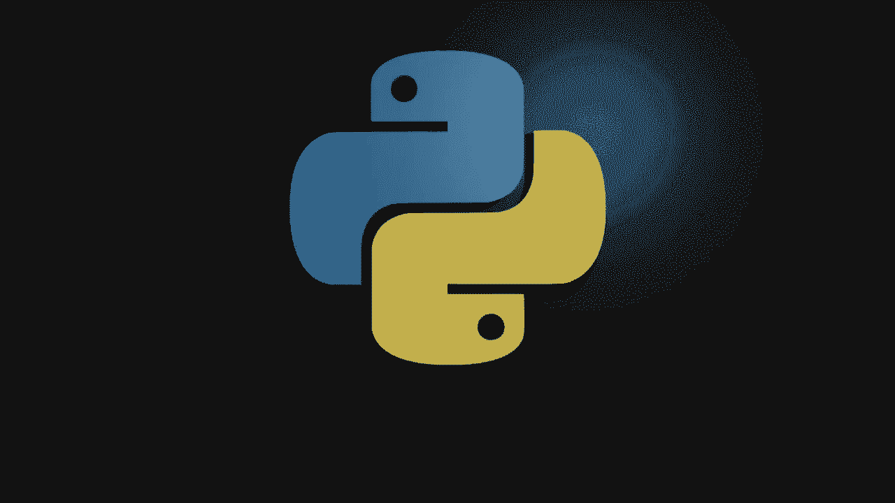
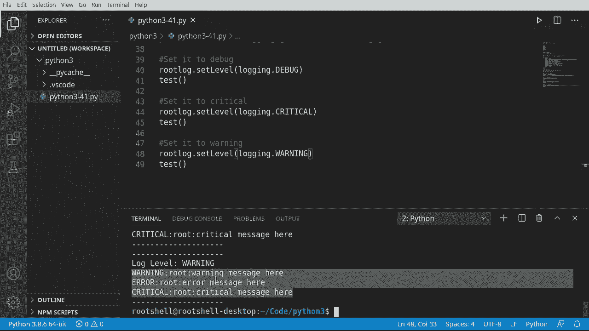
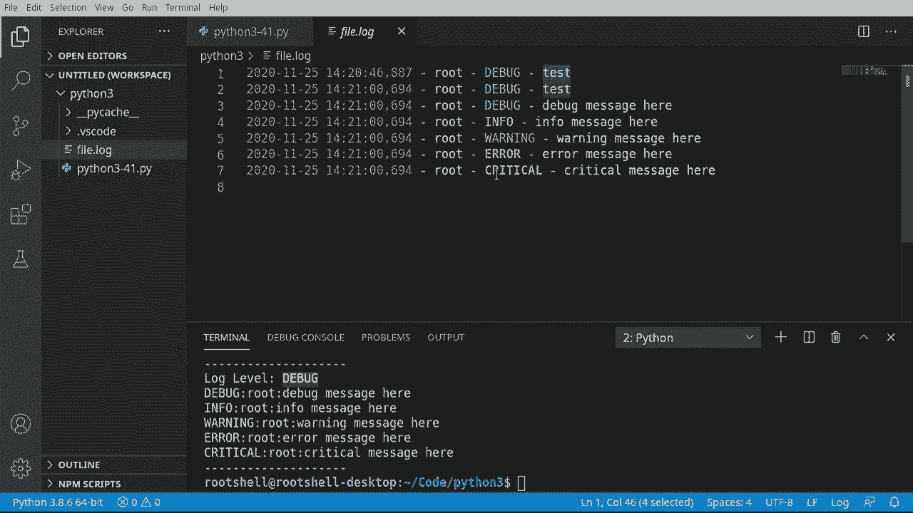

# Python 3全系列基础教程，P41：41）日志基础 📝




在本节课中，我们将要学习Python日志记录的基础知识。日志记录是程序开发中用于追踪事件、记录状态和调试问题的重要工具。与简单的`print`语句相比，日志记录提供了更强大、更灵活的功能。

## 什么是日志记录？

上一节我们介绍了课程概述，本节中我们来看看什么是日志记录。日志记录并非指砍伐树木，而是指在代码中系统地记录程序运行时的信息。到目前为止，我们可能一直在使用`print`函数输出信息，但日志记录比`print`更强大，它已成为软件开发中的事实标准。

## 为什么使用日志记录？🚀

那么，为什么日志记录比打印更酷呢？因为`print`只是将内容输出到屏幕，而日志记录允许你为信息定义不同的**级别**。这让你可以控制显示哪些信息，以及如何处理它们。

以下是日志记录的几个标准级别，从最不严重到最严重排列：

*   **调试 (DEBUG)**：为开发者准备的详细信息，用于了解程序内部运行情况。
*   **信息 (INFO)**：确认程序按预期运行的一般性事件。
*   **警告 (WARNING)**：表示发生了意外情况，或预示着未来可能出现问题，但程序仍在运行。
*   **错误 (ERROR)**：由于更严重的问题，程序的某些功能已无法正常工作。
*   **严重 (CRITICAL)**：非常严重的错误，表明程序本身可能即将或已经崩溃。

## 开始使用日志模块

理解了日志级别后，我们来看看如何开始使用它。首先需要导入Python内置的`logging`模块。

```python
import logging
```

Python日志系统有一个默认的**根日志记录器 (root logger)**。它是所有日志记录器的顶层，我们可以直接使用它，也可以创建自定义的记录器。本节我们将使用根日志记录器。

## 默认的日志行为

现在，让我们通过一个例子来观察日志的默认行为。我们将创建一个测试函数，用它来记录不同级别的信息。

```python
def test_logging():
    print("-" * 20)
    logging.debug("这是一条调试消息。")
    logging.info("这是一条信息性消息。")
    logging.warning("这是一条警告消息。")
    logging.error("这是一条错误消息。")
    logging.critical("这是一条严重错误消息。")

test_logging()
```

运行上述代码，你会发现只有**警告 (WARNING)**、**错误 (ERROR)** 和**严重 (CRITICAL)** 级别的消息被打印出来，而**调试 (DEBUG)** 和**信息 (INFO)** 级别的消息消失了。

这是因为根日志记录器的默认级别是**WARNING**。这意味着它只会处理级别等于或高于**WARNING**的消息（即WARNING, ERROR, CRITICAL），而忽略级别更低的消息（DEBUG, INFO）。

我们可以通过以下代码查看当前的日志级别：

```python
import logging
root_logger = logging.getLogger() # 获取根日志记录器
current_level = root_logger.getEffectiveLevel()
print(f"当前日志级别是: {logging.getLevelName(current_level)}")
```

## 设置和更改日志级别

上一节我们看到了默认的日志级别，本节中我们来看看如何操纵它。设置日志级别可以实现信息过滤，这在复杂的应用程序中非常有用，因为你可能只想看到特定严重程度的信息。

以下是获取和设置根日志记录器级别的方法：

```python
import logging

# 获取根日志记录器
root_logger = logging.getLogger()

# 1. 获取当前级别
print(f"初始级别: {logging.getLevelName(root_logger.getEffectiveLevel())}")

# 2. 将级别设置为 DEBUG（最低级别，会显示所有消息）
root_logger.setLevel(logging.DEBUG)
print(f"设置后级别: {logging.getLevelName(root_logger.getEffectiveLevel())}")
test_logging() # 此时会显示所有级别的消息

# 3. 将级别设置为 CRITICAL（最高级别，只显示最严重的消息）
root_logger.setLevel(logging.CRITICAL)
print(f"\n设置后级别: {logging.getLevelName(root_logger.getEffectiveLevel())}")
test_logging() # 此时只显示 CRITICAL 消息
```

**核心概念**：设置级别并不会让低级别的消息“消失”，它只是指示日志系统不要处理（记录或输出）它们。



## 将日志记录到文件 📁


将日志输出到控制台很有用，但更常见的需求是将日志保存到文件中，以便后续分析。虽然网上常见的方法是使用`basicConfig`，但如果你已经配置过日志记录器（例如获取了根记录器），`basicConfig`可能会失效。

以下是更可靠地设置文件日志记录的方法：

```python
import logging

# 获取根日志记录器
root_logger = logging.getLogger()

# 1. 创建文件处理器 (FileHandler)，指定日志文件名
file_handler = logging.FileHandler('my_app.log', mode='w') # ‘w’模式会覆盖旧文件，'a'模式是追加

# 2. 创建格式化器 (Formatter)，定义日志条目的格式
# 格式字符串中可用变量：%(asctime)s(时间), %(name)s(记录器名), %(levelname)s(级别), %(message)s(消息)
formatter = logging.Formatter('%(asctime)s - %(name)s - %(levelname)s - %(message)s')

# 3. 将格式化器设置给处理器
file_handler.setFormatter(formatter)

# 4. 将处理器添加到根日志记录器
root_logger.addHandler(file_handler)

# 5. 设置日志级别（例如DEBUG，以捕获所有消息）
root_logger.setLevel(logging.DEBUG)

# 测试日志记录
logging.debug("这条调试信息会被写入文件。")
test_logging()
```

运行后，打开生成的`my_app.log`文件，你会看到格式清晰、包含时间戳和级别的日志记录。



## 总结


本节课中我们一起学习了Python日志记录的基础知识。我们了解了日志记录相较于`print`的优势，认识了不同的**日志级别（DEBUG, INFO, WARNING, ERROR, CRITICAL）**，学会了如何**获取和设置日志级别**来过滤信息，并掌握了如何**配置文件处理器**将日志持久化保存到文件中。日志记录是构建健壮、可维护应用程序的关键技能。