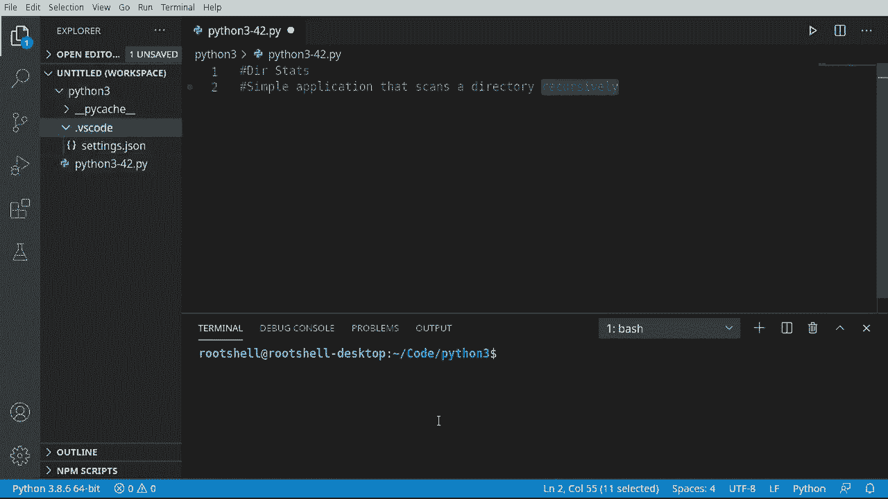
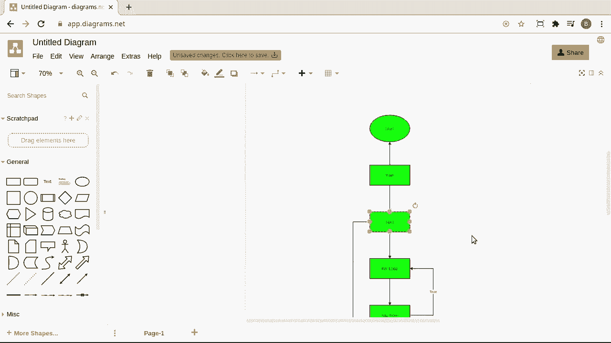
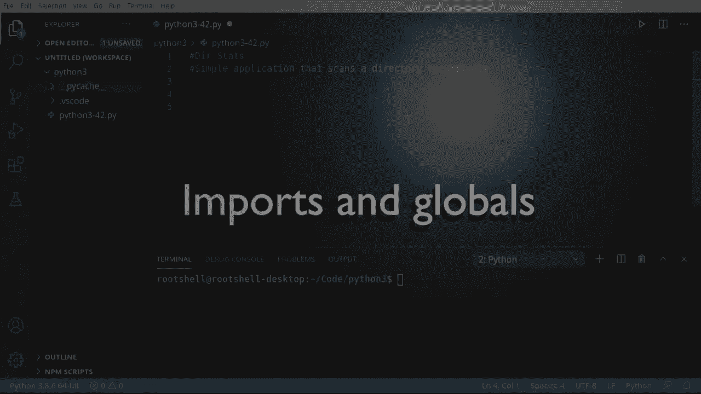
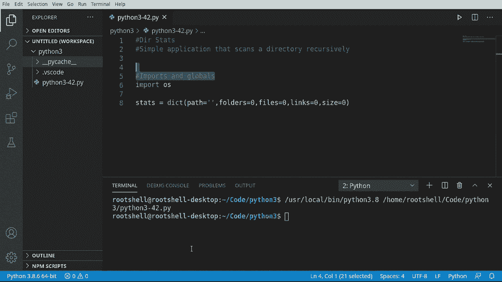
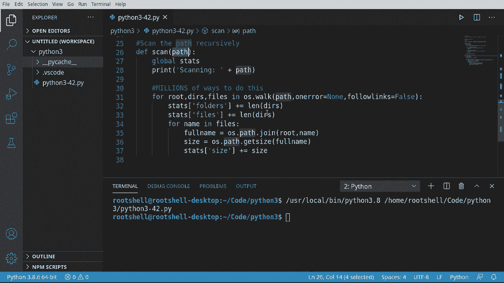
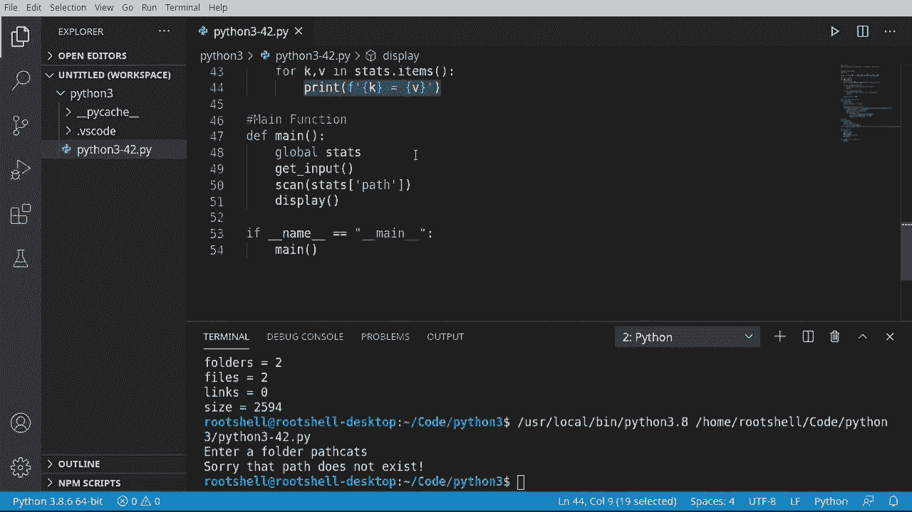

# Python 3全系列基础教程，P42：构建简单的应用程序：目录统计 📊




在本节课中，我们将学习如何构建一个名为“D Stats”的简单应用程序。该程序能够递归地扫描一个目录及其所有子目录，并统计其中的文件夹数量、文件数量以及所有文件的总大小。我们将使用Python的`os`模块来实现文件系统操作，并学习如何处理用户输入和程序逻辑。

---

## 概述





我们的目标是创建一个命令行工具，用户输入一个目录路径后，程序会遍历该目录下的所有文件和子文件夹，并汇总信息。我们将遵循一个清晰的线性逻辑流程：获取输入、验证路径、递归扫描、显示结果。

上一节我们介绍了程序的基本目标，本节中我们来看看具体的实现步骤。

---




## 导入模块与全局变量

首先，我们需要导入必要的模块并创建一个全局字典来存储统计信息。

```python
import os

stats = {
    'path': '',
    'folders': 0,
    'files': 0,
    'size': 0
}
```

我们导入了`os`模块，它提供了与操作系统交互的功能，例如访问文件系统。`stats`字典用于存储要扫描的根目录路径以及三个关键指标：文件夹数量、文件数量和总文件大小（以字节为单位）。

---

## 获取并验证用户输入

程序的第一步是获取用户想要扫描的目录路径，并验证其有效性。

```python
def get_input():
    global stats
    raw = input("请输入一个文件夹路径: ")
    path = os.path.abspath(raw)

    if not os.path.exists(path):
        print("抱歉，该路径不存在。")
        exit(1)

    if not os.path.isdir(path):
        print("抱歉，该路径不是一个目录。")
        exit(2)

    stats['path'] = path
```

`get_input`函数负责与用户交互。它使用`os.path.abspath`将用户输入转换为绝对路径。然后，它使用`os.path.exists`和`os.path.isdir`来验证路径是否存在且确实是一个目录。如果验证失败，程序会打印错误信息并以非零状态码退出，这向操作系统表明程序未按预期运行。验证通过后，根目录路径被存入全局的`stats`字典。

---

## 递归扫描目录

获取到有效路径后，我们需要递归地遍历该目录下的所有内容。我们将使用`os.walk`函数，它简化了遍历过程。

以下是递归扫描的核心逻辑：

```python
def scan(path):
    global stats
    print(f"正在扫描: {path}")

    try:
        for root, dirs, files in os.walk(path, onerror=None, followlinks=False):
            stats['folders'] += len(dirs)
            stats['files'] += len(files)

            for name in files:
                full_name = os.path.join(root, name)
                size = os.path.getsize(full_name)
                stats['size'] += size
    except Exception as e:
        print(f"扫描过程中出现错误: {e}")
```

`scan`函数是程序的核心。它使用`os.walk`生成目录树中的文件名。参数`onerror=None`确保在遇到无法访问的文件夹（如权限错误）时程序不会崩溃，而是静默跳过。`followlinks=False`防止程序跟随符号链接，避免扫描到预期之外的位置。

在循环中，我们更新`stats`字典：`dirs`列表的长度加到文件夹计数上，`files`列表的长度加到文件计数上。接着，遍历每个文件，使用`os.path.join`构建完整路径，并用`os.path.getsize`获取其大小，累加到总大小中。

---

## 显示结果

扫描完成后，我们需要将结果清晰地展示给用户。

```python
def display():
    global stats
    print("\n扫描结果:")
    for key, value in stats.items():
        print(f"{key} = {value}")
```

`display`函数简单地遍历`stats`字典中的所有键值对，并将它们格式化打印出来。这使得输出整洁且易于阅读。

---

## 整合主函数



现在，我们将上述所有步骤整合到一个主函数中，并定义程序的入口点。


```python
def main():
    global stats
    get_input()
    scan(stats['path'])
    display()

if __name__ == '__main__':
    main()
```

`main`函数按顺序调用之前定义的三个函数。`if __name__ == '__main__':`这个条件判断是一个常见的Python习惯用法。它确保当这个脚本被直接运行时（此时`__name__`变量的值为`'__main__'`），`main()`函数才会被调用。如果这个脚本被作为模块导入到其他程序中，这部分代码不会执行，从而允许其他程序自由调用`scan`或`display`等函数。

---

## 运行示例

运行程序，输入一个点`.`代表当前目录：

```
请输入一个文件夹路径: .
正在扫描: /Users/yourname/Python3

扫描结果:
path = /Users/yourname/Python3
folders = 2
files = 2
size = 2594
```

程序成功扫描了当前目录，并输出了统计信息。

---

## 总结

本节课中我们一起学习了如何构建一个简单的目录统计应用程序。我们掌握了以下关键点：

1.  **使用`os`模块**：进行路径操作和文件系统遍历。
2.  **验证用户输入**：使用`os.path.exists`和`os.path.isdir`来确保程序接收到的路径是有效且可用的，这是编写健壮程序的重要一步。
3.  **递归遍历目录**：利用`os.walk`函数高效地扫描目录树，并统计文件夹、文件的数量和总大小。
4.  **程序结构设计**：将功能分解为独立的函数（获取输入、扫描、显示），并通过一个主函数来组织它们，使代码清晰且易于维护。
5.  **Python脚本入口**：理解了`if __name__ == '__main__':`的作用，它控制了脚本作为主程序运行时的行为。



这个程序虽然简单，但涵盖了文件I/O、用户交互、错误处理和基本程序架构等多个基础概念，是初学者巩固知识的优秀实践。