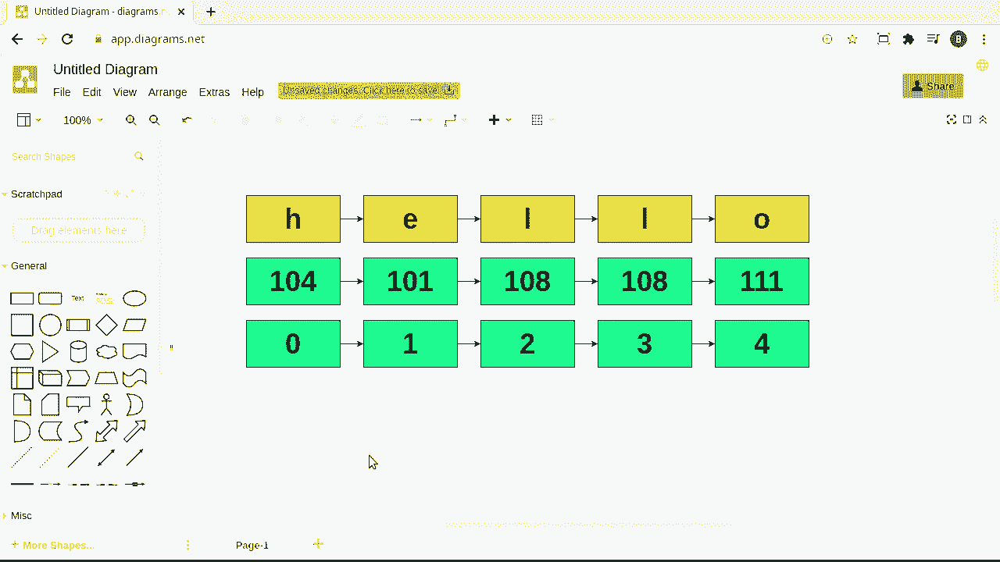
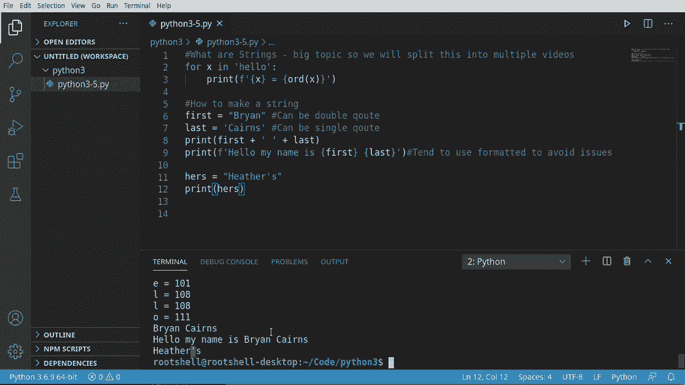
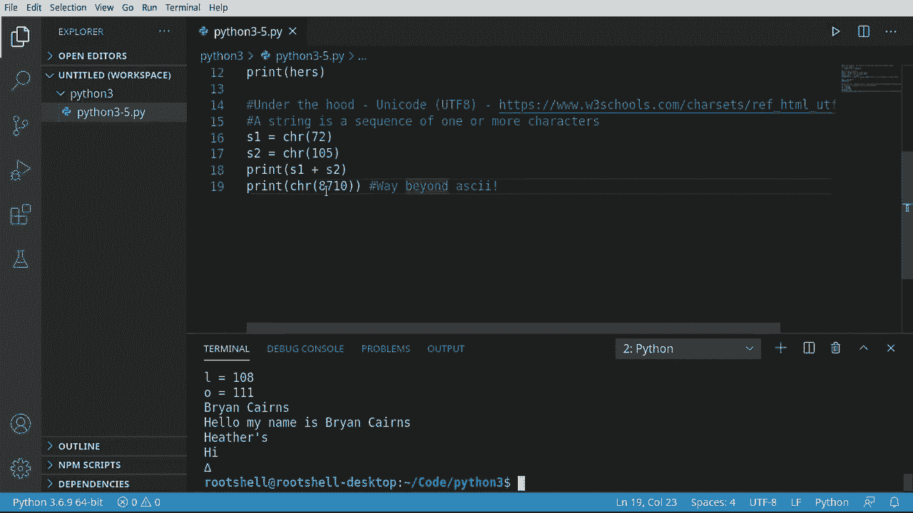
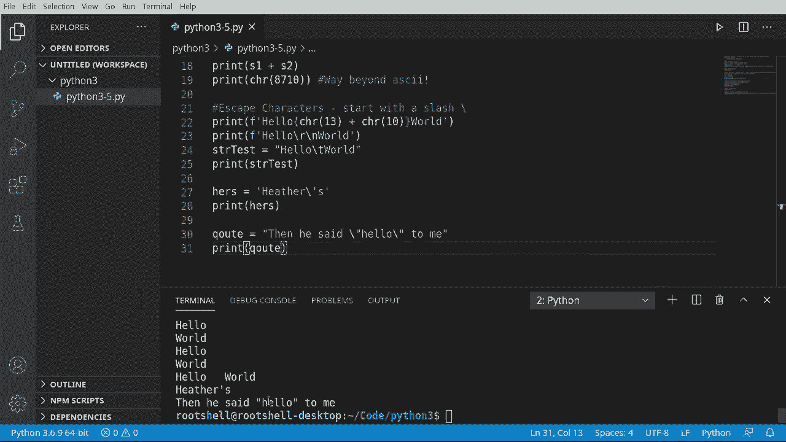
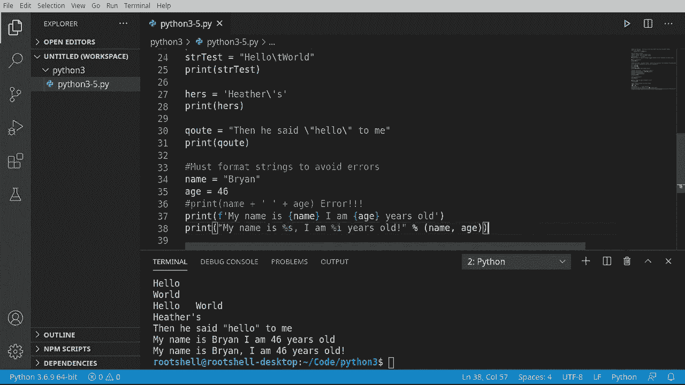

# Python 3全系列基础教程，P5：Python字符串 🧵


在本节课中，我们将要学习Python中一个非常基础且重要的数据类型——字符串。我们将了解字符串的本质、如何创建和操作它们，以及一些实用的技巧来避免常见错误。

## 概述

字符串是编程中用于表示文本的数据类型。在Python中，字符串不仅仅是简单的单词或句子，它们在计算机内部有特定的表示方式。本节我们将从底层原理开始，逐步学习字符串的创建、连接、格式化以及特殊字符的处理。



---

## 字符串的本质：字符与数字

上一节我们介绍了变量的基本概念，本节中我们来看看字符串到底是什么。

字符串在计算机内部是一个列表。具体来说，字符串中的每一个字符都对应一个特定的数值。这个数值基于Unicode标准（通常是UTF-8编码）。这意味着，无论你输入的是英文字母、中文汉字还是数学符号，计算机都会将其转换为一个数字进行处理。

例如，小写字母 `h` 对应的Unicode数值是 **104**，而大写字母 `H` 对应的是 **72**。计算机处理这些数字，但我们只需要关心字符本身和它的位置。

字符串中的每个字符都有一个位置索引，这个索引从 **0** 开始。例如，字符串 `"hello"` 的索引如下所示：

| 字符 | h | e | l | l | o |
|------|---|---|---|---|---|
| 索引 | 0 | 1 | 2 | 3 | 4 |

所以，要获取第三个字母（`l`），你需要使用索引 `2`。

下面的代码演示了如何查看字符串中每个字符及其对应的数值：

```python
for letter in "hello":
    print(f"字母: {letter}, 数值: {ord(letter)}")
```
运行结果会输出：
```
字母: h, 数值: 104
字母: e, 数值: 101
字母: l, 数值: 108
字母: l, 数值: 108
字母: o, 数值: 111
```

---

## 创建与连接字符串

理解了字符串的本质后，我们来看看如何创建和组合它们。

在Python中，创建字符串非常简单，只需使用引号将文本括起来。你可以使用单引号（`'`）或双引号（`"`）。

```python
first = "Brian"
last = 'Culkins'
```

这两种方式在Python中都是有效的。这种灵活性是为了方便你在字符串内容中包含引号时，可以灵活选择外部的引号类型。




要将两个字符串合并成一个，可以使用加号（`+`）进行连接操作。

```python
print(first + " " + last)
# 输出: Brian Culkins
```

---

## 字符串格式化

直接使用加号连接字符串有时会不方便，特别是当需要混合多种数据类型时。这时，字符串格式化就显得非常有用。

以下是两种常见的格式化方法：

**1. f-string 格式化（推荐）**
在字符串前加上字母 `f`，然后在字符串内部用花括号 `{}` 直接包裹变量名。




```python
name = "Brian"
age = 46
print(f"我的名字是 {name}，我 {age} 岁了。")
```

**2. 百分号（`%`）格式化**
这是一种较旧的格式化方式，但在某些情况下仍然使用。

```python
print("我的名字是 %s，我 %d 岁了。" % (name, age))
```
其中 `%s` 表示字符串，`%d` 表示整数。

使用 `f-string` 通常更简洁、更易读，且不易出错。

---

## 处理特殊字符：转义字符

有时我们需要在字符串中包含一些特殊字符，比如换行、制表符，或者字符串本身包含引号。这时就需要用到转义字符。

转义字符以反斜杠（`\`）开头，它告诉Python接下来的字符具有特殊含义。

以下是常用的转义字符：

*   `\n`：换行符
*   `\t`：制表符
*   `\'`：单引号
*   `\"`：双引号
*   `\\`：反斜杠本身

例如：
```python
print("你好，\n世界！") # 输出两行：你好， 和 世界！
print("这是一个\t制表符。")
print("他说：\"你好！\"")
```

当你的字符串本身包含引号时，使用转义字符就非常方便，可以避免语法错误。




```python
# 错误示例：引号冲突
# sentence = 'I'm learning Python.' # 会报错

# 正确示例：使用转义字符
sentence = 'I\'m learning Python.'
print(sentence)
```

---

## 从数字到字符

我们知道了字符可以转换为数字（使用 `ord()` 函数），反过来，我们也可以将数字转换回对应的字符（使用 `chr()` 函数）。

```python
print(chr(72)) # 输出: H
print(chr(105)) # 输出: i
print(chr(8710)) # 输出: ∆ (一个数学符号)
```
这进一步证明了字符串在底层是由数字序列构成的。

---

## 总结

本节课中我们一起学习了Python字符串的核心知识：

1.  **字符串的本质**：字符串是Unicode字符（对应特定数字）的序列，通过从0开始的索引访问。
2.  **创建与连接**：使用单引号或双引号创建字符串，使用加号（`+`）连接它们。
3.  **字符串格式化**：使用 `f-string`（如 `f"Hello {name}"`）可以轻松、安全地将变量值嵌入字符串，这是最推荐的方式。
4.  **转义字符**：使用反斜杠（`\`）来在字符串中表示换行（`\n`）、引号（`\'` `\"`）等特殊字符。
5.  **字符与编码**：`ord()` 函数获取字符的编码值，`chr()` 函数将编码值转换回字符。



掌握字符串的操作是Python编程的基础，希望你通过本课的学习，能够自信地开始在代码中使用和操作文本数据。