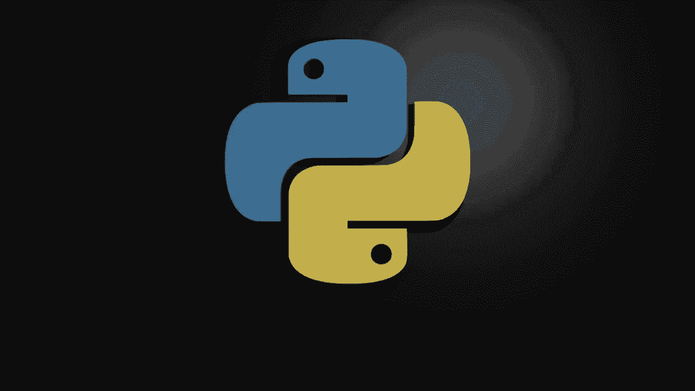
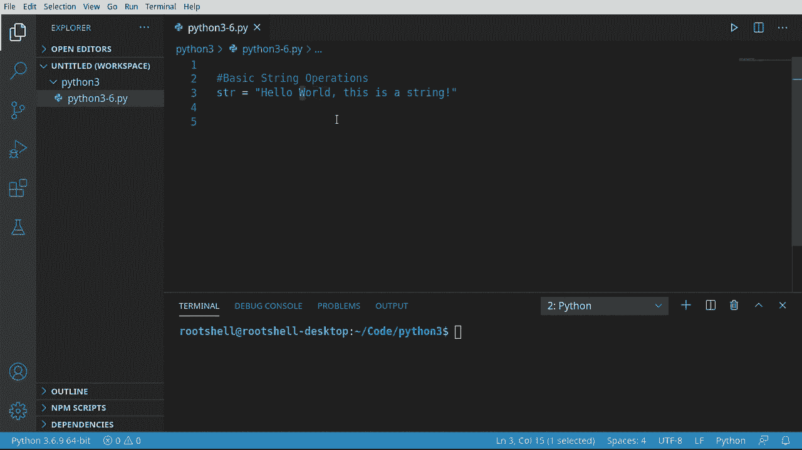
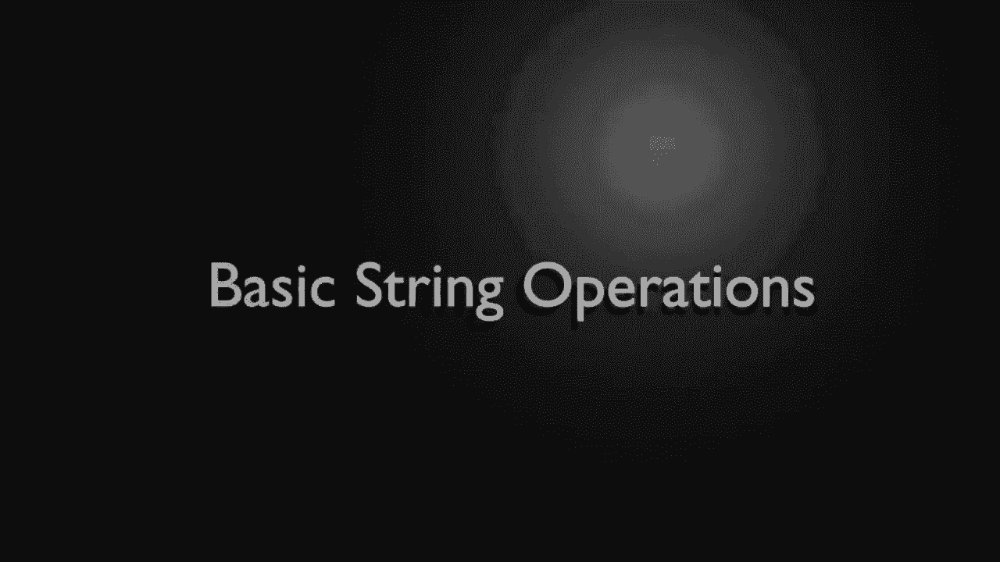
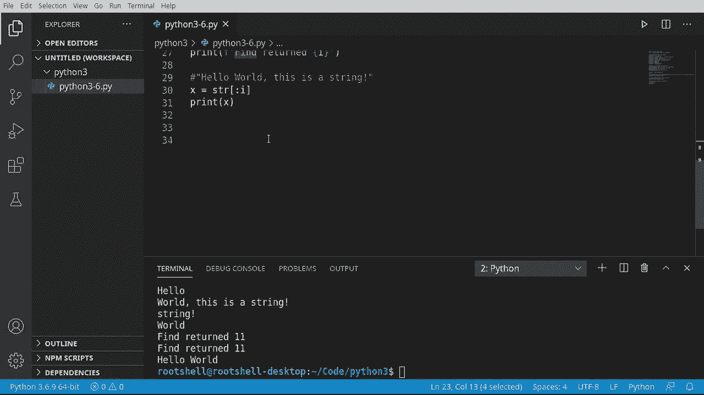

# Python 3全系列基础教程，P6：Python字符串操作 🧵




在本节课中，我们将要学习Python中字符串的基本操作。字符串是编程中非常常用且功能丰富的数据类型。我们将从最基础的操作开始，包括获取长度、重复、替换、分割、大小写转换以及切片和查找等。掌握这些基础是后续学习更高级字符串处理的前提。



## 字符串基础与长度获取



首先，我们创建一个简单的字符串变量。

```python
str_var = "Hello world, this is a string of characters."
```

字符串是字符的序列。我们首先学习如何获取这个序列的长度。

以下是获取字符串长度的方法：
*   使用内置的 `len()` 函数。该函数返回字符串中字符的数量。

```python
print(len(str_var))  # 输出字符串的长度
```

运行代码，我们可以看到这个字符串包含30个字符。请注意，`len()` 返回的是总字符数，与基于零的索引位置是不同的概念。

## 字符串的重复与替换

上一节我们介绍了如何获取字符串长度，本节中我们来看看如何操作字符串内容本身。

字符串支持一种特殊的“乘法”运算，用于重复字符串。此外，字符串对象内置了替换内容的方法。

以下是字符串重复与替换的操作：
*   **重复**：使用 `*` 运算符可以将字符串重复指定次数。
*   **替换**：使用 `.replace(old, new)` 方法可以将字符串中的指定部分替换为新的内容。

```python
# 字符串重复
repeated_str = str_var * 3
print(repeated_str)  # 输出：Hello world... Hello world... Hello world...

# 字符串替换
replaced_str = str_var.replace("Hello", "Hola")
print(replaced_str)  # 输出：Hola world, this is a string of characters.
```

## 字符串的分割与首尾判断

除了修改内容，我们经常需要将字符串拆分开，或者检查它的开头和结尾。

以下是字符串分割与首尾判断的方法：
*   **分割**：使用 `.split(separator)` 方法，根据指定的分隔符将字符串分割成多个部分，并返回一个列表。
*   **判断开头**：使用 `.startswith(prefix)` 方法检查字符串是否以指定字符开头。
*   **判断结尾**：使用 `.endswith(suffix)` 方法检查字符串是否以指定字符结尾。

```python
# 字符串分割
split_list = str_var.split(",")  # 以逗号为分隔符
print(split_list)  # 输出：['Hello world', ' this is a string of characters.']

# 判断开头
print(str_var.startswith("Hello"))  # 输出：True
print(str_var.startswith("Jello"))  # 输出：False

# 判断结尾
print(str_var.endswith("."))  # 输出：True
```

## 字符串的大小写转换

在处理文本时，统一大小写是常见需求。Python提供了简便的方法来实现。

以下是字符串大小写转换的方法：
*   **全部大写**：使用 `.upper()` 方法。
*   **全部小写**：使用 `.lower()` 方法。
*   **首字母大写**：使用 `.capitalize()` 方法。

```python
print(str_var.upper())    # 输出全大写字符串
print(str_var.lower())    # 输出全小写字符串
print(str_var.capitalize()) # 输出首字母大写的字符串
```
**注意**：调用这些方法时务必加上括号 `()`，否则将返回方法对象本身而非转换后的结果。

## 字符串的切片操作

切片是获取字符串中某一部分（子串）的强大工具。你可以把它想象成从整个字符串中“切”出一小段。

切片的基本语法是 `string[start:end]`，其中 `start` 是起始索引（包含），`end` 是结束索引（不包含）。索引从0开始。

以下是字符串切片的几种用法：
*   `str_var[0:5]` 获取从索引0到4的字符（即前5个字符）。
*   `str_var[6:]` 获取从索引6开始到字符串末尾的所有字符。
*   `str_var[-7:]` 获取字符串末尾的7个字符（负数索引表示从末尾开始倒数）。
*   `str_var[6:11]` 获取从索引6到10的字符。

```python
print(str_var[0:5])   # 输出：Hello
print(str_var[6:])    # 输出：world, this is a string of characters.
print(str_var[-7:])   # 输出：acters.
print(str_var[6:11])  # 输出：world
```

## 字符串的查找与索引

为了动态地进行切片，我们需要知道特定字符或子串在字符串中的位置。Python提供了两种主要方法。

以下是查找子串位置的方法：
*   **`.find(sub)`**：查找子串 `sub` 第一次出现的位置。如果找到，返回其起始索引；如果未找到，返回 `-1`。
*   **`.index(sub)`**：功能与 `.find()` 类似，但如果子串不存在，会引发一个 `ValueError` 错误，而不是返回 `-1`。

```python
# 使用 find 方法
comma_position = str_var.find(",")
print(comma_position)  # 输出：11

not_found = str_var.find("z")
print(not_found)       # 输出：-1

# 使用 index 方法
# print(str_var.index("z"))  # 这行代码会引发 ValueError 错误
```

通常，使用 `.find()` 方法更为安全，因为它避免了在找不到子串时程序意外崩溃。

## 综合应用：创建子字符串

结合查找和切片，我们可以动态地创建新的子字符串。例如，我们想提取原字符串中第一个逗号之前的所有内容。

```python
# 找到逗号的位置
comma_index = str_var.find(",")
# 切片从开头到逗号位置（不包含逗号）
substring = str_var[:comma_index]
print(substring)  # 输出：Hello world
```

## 课程总结

本节课中我们一起学习了Python字符串的核心基础操作。

我们首先学习了如何获取字符串长度。接着，探索了重复和替换字符串内容的方法。然后，了解了如何分割字符串以及检查其开头和结尾。我们还掌握了统一字符串大小写的技巧。之后，深入学习了强大的切片操作，用于提取字符串的任意部分。最后，我们学会了使用 `.find()` 和 `.index()` 来定位子串，并综合运用查找和切片来动态创建新的子字符串。

记住，字符串在Python中是“一等对象”，拥有丰富的内置方法，使得文本处理变得非常高效和直观。掌握这些基础知识，将为你的编程之旅打下坚实的根基。



